# CDM 模型组织：先理解骨架，再选择定义

基线：FINOS Common Domain Model 7.0.0，固定提交见 [目录入口](README.md)。本文件区分官方结构与本地采用建议；内部物理映射尚未建立。

## 1. 模型按职责组织，业务页面可以按品种组织

CDM 将公共组件、产品、事件、协议等分开，允许不同产品引用同一组件，也允许局部采用。它的模块结构不是一棵“期权—互换—期货”的产品分类树。

| 模块 | 官方职责的中文概括 | 我们应参考的内容 |
|---|---|---|
| Base | 日期、数量与单位、标识、参与方和公共静态资料 | 标识所属体系、单位、参与方与角色的区分 |
| Observable | 被观察的对象、价格及相关市场资料 | 标的是什么，与某时点观察值分别表达 |
| Product | 产品经济条款、支付结构、结算安排等 | 公共组件组合成产品，保留品种差异 |
| Event | 交易、交易状态、生命周期变化及相关指令 | 条款、实际发生的事件、结果状态分开 |
| Legal documentation | 法律协议及其条款 | 与交易经济条款、执行记录分别定位 |

这张表只列本轮重点，不是全部命名空间。官方说明页使用 Legal Agreement 等业务标题，7.0.0 源文件实际使用 `cdm.legaldocumentation.*`；命名应以固定版本源码为准。[官方模块说明](https://cdm.finos.org/docs/namespace/)，[本地原文](upstream/cdm-7.0.0/docs/namespace.md)。

**迁移建议：** 页面保留“期权／互换／期货”等业务入口；公共定义独立维护。一个定义可以被多个专题引用。不要把阅读路径误当作概念的唯一归属。

## 2. 一条能读懂的官方模型主线

下面画的是 7.0.0 中选定类型及属性关系，不是数据加工顺序，也没有列出全部字段与约束。

```mermaid
flowchart TD
    TS["TradeState · 交易状态"] -->|trade| T["Trade · 交易"]
    T -->|继承| TP["TradableProduct · 可交易产品"]
    TP -->|product| P["NonTransferableProduct · 双边约定的产品"]
    P -->|economicTerms| E["EconomicTerms · 经济条款"]
    E -->|payout| PAY["Payout · 支付结构的选择类型"]
    PAY -->|可选类型| OP["OptionPayout · 期权支付结构"]
    PAY -->|可选类型| PP["PerformancePayout · 表现收益结构"]
    PAY -->|可选类型| IP["InterestRatePayout · 利率支付结构"]
    TP -->|tradeLot| LOT["TradeLot · 成交批次价格与数量"]
    TP -->|counterparty| CP["Counterparty · 交易中的当事方角色"]
    CP -->|partyReference| PARTY["Party · 参与方"]
```

读法：先看参与方之间的一笔交易，再看它约定了什么产品、条款如何组合、数量和价格如何表达、交易当前处于什么状态。

**版本细节：** 本地 7.0.0 源码中 `Trade extends TradableProduct`，不是凭名字假设存在 `Trade.tradableProduct` 属性；后续引用标准字段路径时应沿真实定义展开。参见 [事件类型](upstream/cdm-7.0.0/rosetta-source/src/main/rosetta/event-common-type.rosetta) 第 295 行及 [产品类型](upstream/cdm-7.0.0/rosetta-source/src/main/rosetta/product-template-type.rosetta) 第 321 行。

## 3. 优先研究的定义及定位

中文名用于阅读，不替代标准标识。下表是研究起点，不是已确认的内部实体清单。

| 官方定义 | 所属命名空间 | 源文件与行 | 值得学习的边界 |
|---|---|---|---|
| `Party` | `cdm.base.staticdata.party` | `base-staticdata-party-type.rosetta:137` | 参与方身份本身，与它在某笔交易中的角色分开 |
| `Counterparty` | 同上 | 同文件第 7 行 | 将交易中的角色绑定到参与方；不直接等同客户主表 |
| `PartyRole` | 同上 | 同文件第 169 行 | 同一参与方可承担不同职责 |
| `Account` | 同上 | 同文件第 65 行 | 账户号码、名称、类型及相关参与方；内部资金账户是否对应需核实 |
| `UnitType` / `Quantity` | `cdm.base.math` | `base-math-type.rosetta:7,42` | 数值与单位一起理解，不把股数、金额、份数混同 |
| `Asset` / `ListedDerivative` | `cdm.base.staticdata.asset.common` | `base-staticdata-asset-common-type.rosetta:10,168` | 可持有或转让的对象；上市衍生品结构存在，不等于全套期货流程都覆盖 |
| `Observable` / `PriceQuantity` | `cdm.observable.asset` | `observable-asset-type.rosetta:209,97` | 观察对象与交易价格数量的分工 |
| `EconomicTerms` | `cdm.product.template` | `product-template-type.rosetta:30` | 经济条款独立表达，可引用多个支付组件 |
| `OptionPayout` | 同上 | 同文件第 126 行 | 行权约定、标的、执行价等期权特有内容 |
| `PerformancePayout` | 同上 | 同文件第 214 行 | 表现收益的结构，不等同一切名为“收益互换”的内部字段 |
| `InterestRatePayout` | `cdm.product.asset` | `product-asset-type.rosetta` | 利率支付组件可被不同产品引用 |
| `Trade` / `TradeState` | `cdm.event.common` | `event-common-type.rosetta:295,198` | 交易与其生命周期状态分开 |
| `BusinessEvent` / `PrimitiveInstruction` | 同上 | 同文件第 60、45 行 | 事件由基本变化组合，不能等同任何加工任务或每日快照 |
| `Position` | `cdm.event.position` | `event-position-type.rosetta:42` | 持有多少产品，与单笔交易及快照数据分开核对 |
| `LegalAgreement` | `cdm.legaldocumentation.common` | `legaldocumentation-common-type.rosetta:66` | 法律协议，与交易经济条款分别定位 |

所有源文件位于 [官方定义选集](upstream/cdm-7.0.0/rosetta-source/src/main/rosetta/)。源码定义说明是主要依据，不按中文名称直接认定内部对应。

## 4. 产品差异怎样表达

采用共同组件，不等于消除差异。例如：

- 期权可以引用共同的标识、数量、日期和参与方定义，同时使用 `OptionPayout` 表达行权与标的安排。
- 股权收益类产品可以参考 `PerformancePayout`，并按真实经济条款判断是否还需要利率支付组件。
- 期货等上市衍生品可从 `ListedDerivative` 检查标识与工具表达；成交、持仓、保证金、结算的具体覆盖程度应分别核对。

官方产品模型示例明确采用支付组件组合，并允许产品成为另一产品的标的。这里学习的是构造方式，不主张按内部产品名一对一套类。[官方产品模型](https://cdm.finos.org/docs/product-model/)。

`Product Qualification` 是用具体经济条款判定产品类型的函数。数据地图把一张表归入某个主题是另一项工作，不能仅凭 SQL 出现某字段就执行同等判断。两者以后可以相互提供证据，但不能混成一条自动打标规则。

## 5. 区分四种同名但不同的内容

以“行权”为例，这是一组阅读对照，不是内部映射结论：

| 内容 | 应解释的问题 | 参考位置 |
|---|---|---|
| 行权条款 | 约定何时、以什么条件可以行权 | `OptionPayout.exerciseTerms` 等 |
| 行权指令/事件 | 哪次实际变化因何发生 | Event 模块的指令与事件 |
| 行权后的状态 | 交易经过事件后处于什么情况 | `TradeState` 等 |
| 数据加工记录 | 哪个任务在何时写入了哪些内容 | 现有 SQL / Machine Facts / data-graph |

前三项是业务表达，最后一项是实现证据。即使它们最终落在同一张物理表，也应保留含义差异。[官方事件模型](https://cdm.finos.org/docs/event-model/)。

## 6. 关系、基数与约束怎么采用

CDM 通过类型属性、对象引用、选择类型、继承与条件表达结构，不要求所有关系都画成独立的图边。

例如 7.0.0 的 `Counterparty.partyReference` 引用 `Party`；`TradableProduct.counterparty` 声明 `(2..2)`。这些是该标准类型的约束，不能因为内部表看起来相近，就声称内部数据已经满足它们。

选择采用某个标准类型后，再核实内部实现能否满足其定义和约束；不满足时记录差异或选择适当的局部模型。不要只抄类名，而省掉使其含义成立的条件。

## 7. CDM 与 Legend 各参考什么

CDM 提供领域模型内容及其组织方法。Legend 提供业务类、属性、关联、物理映射、模型间映射及维护工具。这两个角度可以互补；本目录尚未将 CDM 转换成 Legend 模型，也没有验证两者当前版本的直接导入兼容性。

可先阅读 [Legend 业务模型与映射功能](https://legend.finos.org/docs/overview/legend-features) 和 [关系数据映射教程](https://legend.finos.org/docs/tutorials/studio-relational-mapping)，无需为理解模型先部署平台。
