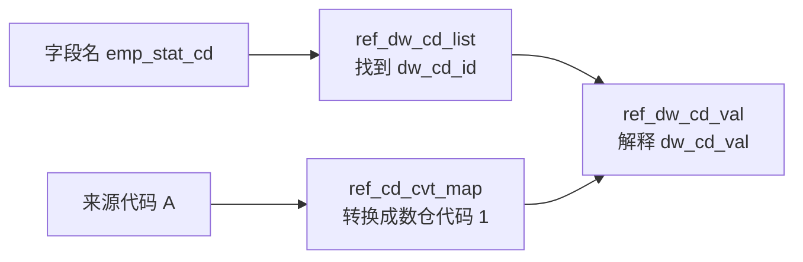

# 常用码值表：目录、字典和代码转换

这三张表的名字都带有 `cd` 或 `code`，但职责不同。先不要把它们理解成三张同义的“码值表”，可以先记成：

```text
ref_dw_cd_list = 目录：找到字段对应的码组
ref_dw_cd_val  = 字典：解释码组里的具体代码值
ref_cd_cvt_map = 翻译表：把来源系统代码转换成数仓代码
```

## 1. 三张表分别回答什么问题

| 表 | 作用 | 回答的问题 |
|---|---|---|
| `pdata_n.ref_dw_cd_list` | 仓库代码清单、码组目录 | 这个字段属于哪个码组？ |
| `pdata_n.ref_dw_cd_val` | 仓库代码取值、码值字典 | 这个码组里的某个代码值是什么意思？ |
| `pdata_n.ref_cd_cvt_map` | 代码转换对照 | 来源系统的代码，转换成目标仓库代码是什么？ |

最短的判断口诀是：

> `list` 找码组，`val` 解释代码，`cvt_map` 做跨系统转换。

## 2. 已经是数仓标准代码：先查 `list`，再查 `val`

例如某张表有字段：

```text
emp_stat_cd = '1'
```

这里的 `'1'` 已经是数仓使用的标准代码，不需要做跨系统转换。查询分两步：

```text
字段名 emp_stat_cd
  → ref_dw_cd_list
  → 得到 dw_cd_id，例如 CD022

dw_cd_id = CD022，代码值 = 1
  → ref_dw_cd_val
  → 得到代码含义，例如“在职”
```

典型 SQL 结构如下：

```sql
-- 第一步：通过字段名找到码组 ID
select dw_cd_id, dw_cd_eng_name, dw_cd_chn_name
from pdata_n.ref_dw_cd_list
where upper(dw_cd_eng_name) = upper('EMP_STAT_CD');

-- 第二步：在码组内解释具体代码值
select dw_cd_val, dw_cd_val_desc
from pdata_n.ref_dw_cd_val
where dw_cd_id = 'CD022'
  and dw_cd_val = '1';
```

实际消费 SQL 中也常见把两步合并：

```sql
select b.dw_cd_val, b.dw_cd_val_desc
from pdata_n.ref_dw_cd_list a
join pdata_n.ref_dw_cd_val b
  on a.dw_cd_id = b.dw_cd_id
where upper(a.dw_cd_eng_name) = upper('EMP_STAT_CD');
```

这时两张表的关系是：

```text
ref_dw_cd_list.dw_cd_id = ref_dw_cd_val.dw_cd_id
```

`ref_dw_cd_list` 通常是一行代表一个码组；`ref_dw_cd_val` 则是一组对应多个代码值，例如“在职”“离职”“内退”等。

## 3. 来源系统代码不统一：需要 `ref_cd_cvt_map`

假设来源系统的字段不是用数仓代码，而是：

```text
来源系统字段 EXT_CUST_STATUS = 'A'
```

但数仓统一规定这个状态用 `'1'` 表示“在职”。此时要先查转换表：

```text
来源系统 + 来源表 + 来源字段 + 来源值 A
  → ref_cd_cvt_map
  → 目标仓库代码 dw_cd_val = 1
  → ref_dw_cd_val
  → 代码含义 = 在职
```

`ref_cd_cvt_map` 不是只按 `'A'` 做全局替换。通常还要限定代码出现的上下文，例如：

```text
src_sys_name  来源系统
src_tab_name  来源表
src_fld_name  来源字段
src_cd_val    来源代码值
tgt_tab_name  目标表
tgt_tab_fld   目标字段
dw_cd_val     目标仓库代码值
```

典型使用逻辑可以概括为：

```sql
select src_cd_val, dw_cd_val
from pdata_n.ref_cd_cvt_map
where src_sys_name = 'ECF'
  and src_tab_name = 'T00_CUST_ACCT_REF'
  and src_fld_name = 'EXT_CUST_STATUS'
  and src_cd_val = 'A'
  and tgt_tab_name = 'T97_ECF_CUST_ACCT_INFO'
  and tgt_tab_fld = 'CUST_STAT_CD';
```

转换表解决的是：

```text
来源代码 A  ≠  数仓代码 1
```

如果来源系统本来就直接提供数仓标准代码，通常不需要经过 `ref_cd_cvt_map`。

## 4. 三张表放在一起看



有两条常见路径：

### 路径 A：代码已经标准化

```text
字段名 → ref_dw_cd_list → dw_cd_id → ref_dw_cd_val → 中文释义
```

### 路径 B：代码还需要转换

```text
来源表/字段/来源值 → ref_cd_cvt_map → dw_cd_val
                                      → ref_dw_cd_val → 中文释义
```

因此，`ref_cd_cvt_map` 不是 `ref_dw_cd_val` 的替代品。它负责把代码变成数仓认可的代码；代码最终是什么意思，仍然通常要看 `ref_dw_cd_val`。

## 5. 最容易混淆的地方

### 5.1 `dw_cd_id` 和 `dw_cd_val` 不是一回事

```text
dw_cd_id  = 哪一组代码，例如“员工状态代码”这一组
dw_cd_val = 这一组里的具体值，例如“1”
```

不能只拿 `dw_cd_val = '1'` 去全表查含义，因为不同码组都可能有值 `'1'`。

### 5.2 `ref_dw_cd_list` 不是代码值明细

它主要告诉你字段和码组的关系。要查“1 是在职还是离职”，要继续查 `ref_dw_cd_val`。

### 5.3 `ref_cd_cvt_map` 不是通用的全局翻译

同一个来源代码在不同来源系统、来源表或字段中，可能含义不同。因此转换时必须保留来源和目标上下文，不能只按 `src_cd_val` 单字段匹配。

### 5.4 `ref_dw_cd_val` 的来源范围不能忽略

码值表中可能有 `src_tbl`、`src`、`remark` 等范围字段。同一个 `dw_cd_id + dw_cd_val` 在不同来源范围下可能对应不同说明或不同有效范围，消费 SQL 是否限定这些字段需要逐处核对。

## 6. 看到字段时怎么选表

| 当前问题 | 先看哪张表 | 下一步 |
|---|---|---|
| 只知道字段名，不知道码组 | `ref_dw_cd_list` | 找 `dw_cd_id` |
| 已知 `dw_cd_id` 和代码值 | `ref_dw_cd_val` | 找中文名/取值描述 |
| 来源代码与数仓代码不一致 | `ref_cd_cvt_map` | 找 `dw_cd_val`，再按需查描述 |
| 只按代码值全表搜索 | 不建议 | 先补齐 `dw_cd_id` 或来源上下文 |

## 7. 证据边界

本地 2026-08-31 的 Hive 元数据快照中，`pdata_n.ref_dw_cd_list`、`pdata_n.ref_dw_cd_val`、`pdata_n.ref_cd_cvt_map` 均有对象记录并标记为 `ACTIVE`。本页用于解释三张表的结构角色和常见消费方式，不等同于当前生产数据、最新代码值或某一条转换关系已经生效。
