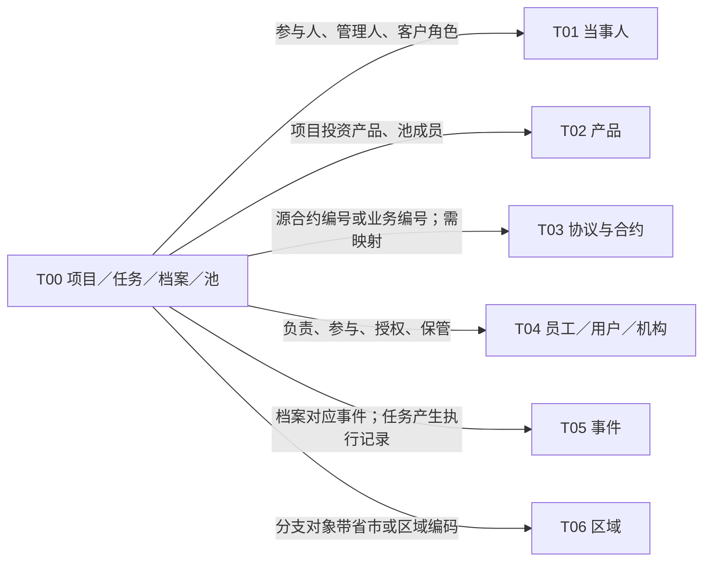

# T00 全貌：先分清对象，再看它跨到哪里

[返回入口](README.md)

## 1. 为什么有“跨主题”

本地主题地图列出 `T00 / CSA / Cross Subject Area / 跨主题`；本次读取的 Wiki《基础模型》也明确列出“t00.跨主题CSA”。但该 Wiki 在这一节只有标题，没有完整的对象说明。因此下面的对象地图是根据实际目录、字段及 SQL 重建的阅读结构，不冒充 Wiki 的正式子主题划分。[Wiki 正文](证据/Wiki-214137197.json)

T00 的共同点是：对象经常服务于多种业务，而不只属于某一位客户、某一只产品或某一份合约。它既有通用对象，也有来源专属扩展。“跨主题”不能理解成任意拼表形成的宽表；`T00_PROJ_BASE_INFO` 的项目与 `T00_PRD_POOL_INFO` 的池，都有自己的对象身份。

| 对象主线      | 核心模型入口                                                                         | 为什么独立存在                     | 当前目录名称数 |
| --------- | ------------------------------------------------------------------------------ | --------------------------- | ------: |
| 项目与业务安排   | `t00_proj_base_info`、`t00_proj_*`、种子基金/激励计划附加表                                 | 一项安排可以同时连接客户、产品、人员和组织       |      48 |
| 需求、任务与整改  | `t00_req_base_info_s`、`t00_task_base_info`、流程模板、风险整改                           | “希望做什么”“按什么规则做”“交给什么任务”分别表达 |      46 |
| 档案、附件与印章  | `t00_doc_info`、`t00_doc_attach_info`、`t00_doc_evt_rela_h`、`t00_seal_info`      | 文档载体、业务归属、归档状态与保管责任不同       |      22 |
| 试卷、知识与内容  | `t00_papr_info`、`t00_qstn_info`、`t00_knwlg_*`、`t00_cont_set`                   | 定义、组合、答案和内容组织需要各自的粒度        |      30 |
| 系统、应用与组件  | `t00_busi_sys_info`、`t00_sys_info`、API、技能和工具                                   | 系统职责、接口版本、授权及调用配置分开管理       |      22 |
| 数据资产与报表   | `t00_db_info`、`t00_tbl_info`、`t00_fld_info`、数据标准、报表                            | 数据表和报表本身也需要被登记、描述和使用        |      30 |
| 产品池、策略与名单 | `t00_prd_pool_info`、`t00_prd_pool_compnt_info`、`t00_strg_info`、`t00_list_info` | 集合、成员、投资安排与业务作用范围不能退化成产品属性  |      13 |

表名默认指 Hive `pdata_n`，`spdata_n` 对象在各章明确注明。211 是两套核心目录的名称并集，不是211类互斥业务实体；主表、附加表和关系表都占一个名称。

## 2. 怎样与 T01–T06 连接

这是业务阅读图，不是已验证的物理外键图。具体连接有三种证据等级：SQL 中已经出现的 Join；生产 SQL 拼出的对应身份；只有字段名和注释支持的候选关系。各章分别说明，不将第三种画成确定数据流。

## 3. 核心范围怎样确定

元数据快照共有311条T00前缀物理记录。`pdata_n` 有180条，其中168条可解析，另12条是带 `group*_mid/temp` 的中间对象及解析缺口；`spdata_n` 有31条可解析记录。先以这199条作为字段证据，再与平台目录的172/32条资产名称对照，新增12个名称，形成211个核心模型名称。

平台目录独有对象中包括 AI 技能、智能体调度任务、API、系统信息和档案管理。它们都找到对应SQL候选及本次保存的DDL入口，不能因为旧字段库没有就删除这一分支。[补充目录](资料/目录独有对象与DDL.md)

反向有7个名称只在元数据中出现，包括应用系统基本信息和6个测试管理对象。没有找到新目录记录，不足以证明它们已下线。`gf_rcp`、`pdata_ams`、关系数据库中的同前缀参数表，以及 `temp` 对象，另列[物理附录](资料/其他物理来源与中间对象.md)，不套用核心CSA口径。

平台的“跨主题”标签只命中75个T00资产；一张表又可能同时有技术管理、项目管理、模型表和分级标签。因此不能以标签数量代替T00范围，也不能把这些标签相加。[统计口径](资料/平台分类与范围统计.md)

## 4. 本专题采用的标准

参照T01的对象身份、来源变体与具体案例，T03的对象层级及整域分支覆盖，T04的来源职责矩阵，以及T06按对象规模深入的写法。每一主线都回答：一行是什么、身份怎样形成、为何拆表、哪些时间条件需要保留、源数据怎样转换、下游怎样用。

完整性落实在对象清单和字段附录；深度落实在代表性源码。211个名称全部归位，不表示211张表的每个来源都已经精读或运行验收。对应范围与缺口见[证据台账](证据/覆盖与待核问题.md)。
