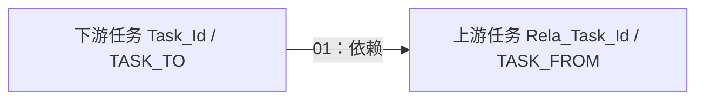

# 需求、任务与整改：定义、办理和运行是不同层次

[返回入口](../README.md) · [本组字段](../资料/字段/02-需求任务与整改.md)

## 1. 先认清四类对象

| 模型 | 对象含义 | 不能直接推出什么 |
|---|---|---|
| `t00_req_base_info_s`、`t00_req_rela` | 需求单及需求间关系；来自Jira、BPM、OA、IPM等来源 | 有需求记录不代表开发完成或已经形成项目 |
| `t00_req_proc_tplt_info`、`t00_req_proc_tplt_def_cond` | 哪类动作使用哪种流程，以及筛选条件 | 模板启用不代表某笔业务执行了该流程 |
| `t00_task_base_info`及任务专属附加表 | 调度、质检、短信、潜客查询、企微群发等任务对象 | “任务”不是Horae专用词；任务属性不等于每次运行结果 |
| `t00_our_risk_qstn_info`、`t00_our_risk_qstn_corr_info` | 风险问题及对问题采取的整改事项、办理结果 | 一个问题不保证只对应一条整改或一个办理结果 |

测试需求、测试计划、测试用例和计划用例明细，以及客户工单跟进、资金支持申请、长期券源需求，也在本组。它们是业务办理与管理对象；并未因当前文档位于代码仓库就把所有任务理解成程序任务。

## 2. Jira：每日需求快照可以多写同一目标

Jira分支按来源与业务日期写 `t00_req_base_info_s`，模型需求号为 `JIR-id`。需求类型、优先级和状态分别转码，未命中分别回退为999、99、999；创建、更新、解决等源时间各自保留。[62871.sql，55–108行](../证据/SQL/62871.sql)

后续还构造Jira用户与员工的对应中间结果，并再次写目标分区，因此不能只阅读第一次INSERT就认为整份任务的最终身份处理已解释完。本章仅确认需求投影及该后续步骤存在；完整员工映射和多写最终投影未逐项验收。每日需求数必须先限定业务日期，不能把历史快照行数称为新增需求量。

## 3. Horae：任务属性里的依赖列表与关系表

Horae分支从 `L_LB_TASK` 生成任务编号、名称、周期、步长、生效时间、负责人和状态。它把依赖表的上游 `TASK_FROM` 汇集到下游 `TASK_TO`，形成 `Dependence_Schd_Task_Id` 字符串。[113573.sql，39–87行](../证据/SQL/113573.sql)

`t00_task_rela_h` 则将同一依赖拆成关系记录：`Task_Id=TASK_TO`、`Rela_Task_Id=TASK_FROM`、关系01为上游依赖。方向应读成“本任务依赖关联任务”。[113575.sql，26–38行](../证据/SQL/113575.sql)

两份代码的过滤并不完全相同：任务基本表汇总依赖要求链接 `STATUS='Y'`；关系生产要求链接和两端任务 `STATUS<>'N'`。只有实际状态集合满足相应条件，两者才可能等价；不能预先宣称依赖列表与关系表必然一致。

这张图表达调度先后约束。任务节点之间没有表、字段、读写观察或分区范围证据，不能当成本仓库的确定数据因果边。

## 4. TIT期权流程：规则配置进入T00

模板从 `F_TRD_OPTION_PROCESS_DEF` 构造 `TIT324-ID`，保存流程定义编号、动作类型 `EVENT_TYPE`、默认标志和启用状态；默认标志Y/N转1/0，启用状态转码未命中时保留源值。条件表从 `F_TRD_OPTION_PROCESS_CONDITION` 构造同前缀 `TIT324-KEY_DEF_ID`，保留条件名称、运算符和值。[207935.sql](../证据/SQL/207935.sql)、[207936.sql](../证据/SQL/207936.sql)

两表可按该模板身份对照，一份模板可配置多条条件。SQL只搬运条件，没有证明多条件之间的AND/OR组合、优先级或流程引擎执行语义；这些不能从字段列表猜出。实际合约、订单和存续动作应继续到T03/T05。

## 5. 风险整改：一对多要落到办理记录

DRC分支以整改事项 `A.ID → Corr_Item_Id`，以 `A.PROBLEM_ID → Qstn_Id`。状态与结果来自当天、`enable='t'` 的办理表 `D_DCAR_RECTIFY_HANDLE`，按事项ID左连。[209830.sql，45–82行](../证据/SQL/209830.sql)

查询“多少个整改事项”应与“多少条办理状态记录”分开。如果同事项有多条有效办理记录，这段SQL没有显示选最新或聚合，可能产生多行；实际是否发生需查数据。该分支的完成整改时间、当前环节、责任人等若干字段明确留空，也不能拿空值直接判定业务未完成。

## 6. 智能体调度任务也已在目录中

平台目录有 `t00_agnt_schd_task_adtnl_info`，旧字段库未覆盖，但247683的SQL声明及投影已保存：`WAS003-ID`、Agent编号、任务内容、执行时间、最近/下次运行时间、Cron表达式、通知方式与删除时间，按来源+业务日期保存。[247683.sql](../证据/SQL/247683.sql)

这是一份调度配置/状态资料的模型记录；`LAST_RUN_AT` 只能说明源字段记录了一个时间，不能单独证明输出已生成或通知已送达。与之配对的WAS基本任务候选位于测试主题，本次没有据此宣称生产主表关联已经闭合。
