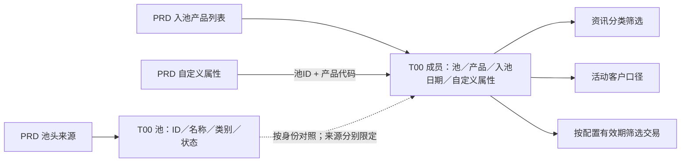

# 产品池从来源到下游：同一只产品，为什么会被计入不同范围

[返回池对象章节](../业务/07-产品池策略与名单.md)

## 1. 先构造池，再选择成员

PRD池头156848把源ID和名称写入通用池模型，池类别固定为 `PRD_SCR_POOL`，池状态经过转码；生成类型和生成方式直接保留源字段。成员156849从另一张源表写 `PRODWHS_ID/PROD_CODE`，再按同池同产品取最新入池记录。两张表的来源分区不同。[池头](../证据/SQL/156848.sql)、[成员](../证据/SQL/156849.sql)

实线表示本文已读代码中的生产或读取步骤，虚线是模型对照关系。图不表示全下游闭包。

## 2. 为什么RN=1不等于证明没有重复

成员SQL先左连自定义字段表，随后用 `ROW_NUMBER() OVER(PARTITION BY PRODWHS_ID,PROD_CODE ORDER BY WAREHOUSING_DATE DESC)` 并筛RN=1。因此结果在这两个分组键上只选一行，但若源有同时间不同内容，代码没有确定哪份属性优先；这是“选择一行”与“数据天然唯一”的区别。

PRD的 `Pool_Compnt_Type_Cd` 留空，存量比对则包含池、池类别、成分类型和成员。上述选择只解释PRD这份实现。XIR来源保留COMPONENTTYPE和SYSORDID，不能照搬为所有池的联合键。[PRD比对116–121行](../证据/SQL/156849.sql)、[XIR投影](../证据/SQL/110348.sql)

## 3. 消费一：把池成员转成资讯分类

66074在其一个分支中读取指定池 `1000328` 的PRD成员，要求 `del_flag='0'`，按Compnt_Id分组后，连接T02的PRD证券基础信息 `scr_cd=compnt_id`。[66074.sql，177–187行](../证据/SQL/66074.sql)

这里的产品代码对应只在该来源和分支里成立。池ID是业务配置，不应被本专题概括成所有基金的固定分类标准；未读取池内容，也未把名称或用途补猜出来。

## 4. 消费二：池影响活动的新客范围，而不是直接提供销量

159558从活动指标配置读取 `covt_newcust_pdef_pool_id`，连接PRD未删除成员，以产品代码关联组合值中的产品片段，参与活动客户口径。该局部取 `distinct Compnt_Id,Pool_Id`，减少同一池成员重复的影响。[159558.sql，208–224行](../证据/SQL/159558.sql)

主销量来源和计算在其他段：读取销售明细等数据，根据指标选择金额或数量，并乘相关分摊与折算系数。不能把“加入了某池”解释为这只产品产生了销售，也不能把T00字段当销售金额字段。本次确认的是池参与客户范围的局部用途，没有复算完整业绩口径。

## 5. 消费三：真正使用的日期藏在自定义属性里

98035对指定PRD池 `1000444` 读取 `Pdef_Attr_Info` 的两个键 `1000450/1000451`，分别作为开始日期和结束日期；产品代码相等后，还要求交易日 `>=` 开始日期的日期部分，且 `<` 结束日期。[98035.sql，407–413行](../证据/SQL/98035.sql)

所以这份消费的有效性不是简单读取通用In_Pool_Date和Out_Pool_Date。两个JSON键只在该池配置和SQL证据下解释；不能把它们提升为全平台固定代码域。结束日期为空是否需要兜底，在该局部条件中没有看到处理，不能擅自认为空值表示永久有效。

## 6. TIT与XIR保留的是另外两种业务差别

TIT用同一个券源对象生成池头和经营配置，保存还券/约券优先级及交易方式；XIR保存成分类型、来源、操作者和源交易序号。前者不等于实时可借余额，后者也不只是证券列表。[TIT配置](../证据/SQL/208592.sql)、[XIR成员](../证据/SQL/110348.sql)

这条案例已经从源投影讲到实际消费局部。池成员行数据、实时状态、完整历史、全部下游以及销售金额正确性仍没有在本次验收。
