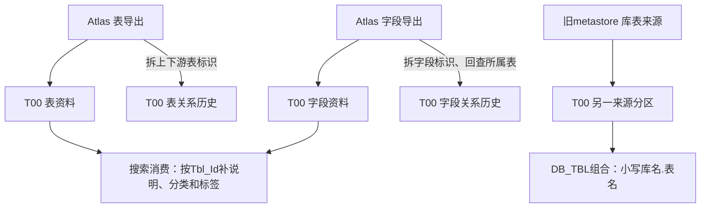

# 数据资产从 Atlas 到查询消费：一条表名背后的几种身份

[返回数据资产章节](../业务/06-数据资产与报表.md)

## 1. 表和字段先分别登记

Atlas表导出把GUID作为T00表ID，DB作为数据库ID；字段导出把GUID作为字段ID，源TABLE作为所属表引用。各自筛 `STATUS='ACTIVE'`。字段附带的代码集、标准、分类分级和业务负责人是元数据属性，不能据此证明字段业务值正确。[113440.sql](../证据/SQL/113440.sql)、[113442.sql](../证据/SQL/113442.sql)

## 2. 上下游声明怎样成为关系记录

表级200740分别展开DOWNSTREAMS与UPSTREAMS，写关系01/02。字段级227291展开相同方向的字段标识，再在Hive、RDBMS、Kafka字段导出中回查关联端所属表，保存本端表/字段和关联端表/字段。[200740.sql，27–54行](../证据/SQL/200740.sql)、[227291.sql，29–78行](../证据/SQL/227291.sql)

这条链的业务含义是“把数据地图已经声明的关系整理入模型”。它没有在T00生产阶段重新解析SQL表达式，也没有验证分区和写入批次。关联端未匹配、空列表、重复标识和声明过期等问题需要单独核验，不能因为关系写成历史表就视为精确因果。



图里的路径均限定于已见生产/消费证据，不表示该库已经包含全平台血缘。

## 3. 搜索消费为什么需要多个模型

137827对Hive分支先取通用表名、表ID、表类型，再按Tbl_Id关联Hive附加表，补业务唯一命名、说明、范围、认证和负责人。它对来源分区做明确限制；系统关系、分类、分级和标签先聚合到表粒度，再加入搜索对象。[137827.sql，147–198行](../证据/SQL/137827.sql)

RDBMS分支另用关系库附加模型，不能借Hive同名表注释补齐。字段信息也在该消费的后续部分参与检索资料；本次重点核对表对象组装，未逐项审计搜索输出全部列及各联接唯一性。

这说明“表名+字段列表”还不足以完整解释目录搜索：公共资料、来源专属描述、分类标签和使用关系是分开的模型。它们的业务粒度应先聚合对齐，否则标签或关系一对多会把表结果扩成多行。

## 4. DB_TBL组合不是Atlas GUID

本地组合类型DB_TBL定义明确读取：

```sql
-- 原定义的关键片段；完整记录见下方证据。
SELECT lower(concat(dbs.db_name, '.', tbl.tbl_name)) AS grp_val
FROM pdata_n.t00_tbl_info tbl
JOIN pdata_n.t00_db_info dbs ON tbl.db_id = dbs.db_id
WHERE tbl.src_tbl = 'ODATA_N_BDP.M_TBLS'
  AND dbs.src_tbl = 'ODATA_N_BDP.M_DBS'
```

原定义另外排除若干库，并设固定开始/结束日期。因此它不是全部Atlas表集合；组合值采用库表名，也没有携带多个物理数据源的完整身份。属性表登记为T00_TBL_INFO、属性主键登记为TBL_NAME，不能据此推断同名跨库能安全连接。[原始定义](../证据/组合定义消费.json)

该离线记录的data_time为2023-02-07，modify_time却为2029-02-07；本次保留异常，不用后者宣称定义更新到未来或当前有效。组合类型快照状态UNVERIFIED，也没有实际查询组合实例验证是否使用这份定义。

## 5. 与本项目图谱的边界

T00可以成为理解平台元数据及声明关系的来源；本项目的SQL/Facts记录则用于解释静态读写和加工证据。两者可以交叉核对，但不互相冒充。图数据库只是可能的消费方式，本次未查询实时图库，也没有由SQL候选计算并宣称“完整图谱覆盖率”。

同时，表元数据快照缺少113440中出现的Tbl_Cmnt、Upd_time等列；附件元数据也缺少173964声明的File_Cont_Md5等列。这些对象分别核对，未静默改写元数据或把SQL模板宣称为线上DDL。
