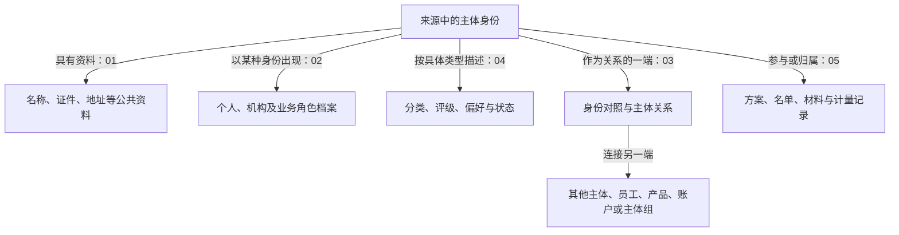

# T01 学习入口：主体、关系与业务记录

更新日期：2026-09-12。T01 的阅读资料集中在此目录。首页组织阅读路线，深度分析保留完整论证，业务章节与专题视角提供按问题查阅的入口。

## 1. 从哪里开始

你重点关注交易对手及 TIT/OIS，建议先按这条顺序读：

**[01 主体公共资料](00-20260911-认知实验/t01专题-当事人/01-主体公共资料：先知道在描述谁.md) → [02 类型与角色](00-20260911-认知实验/t01专题-当事人/02-主体类型与业务参与角色：明确它以什么身份出现。.md) → [交易对手视角](00-20260911-认知实验/t01专题-当事人/视角/交易对手.md) → [TIT与OIS](00-20260911-认知实验/t01专题-当事人/视角/TIT与OIS.md)**。

遇到编号怎么对应，回到03；遇到分类、评级、偏好、状态码，回到04及字典；遇到履保方案、名单、参数，回到05；真正取数时读06。经纪商可单独从 [经纪商视角](00-20260911-认知实验/t01专题-当事人/视角/经纪商.md) 开始。

## 完整分析：理解为什么这样建模

这里保留逐步推导、完整例子、关系图和SQL论证。01–06是按问题组织的章节，不能代替这些连续分析。

| 深读文章 | 适合解决的问题 |
|---|---|
| [对象层次与关系推导](00-20260911-认知实验/t01专题-当事人/深度分析/对象层次与关系推导.md) | 为什么分主体、资料、角色、关系和事项？层次与真实连接怎样区分？ |
| [主体建模与完整案例](00-20260911-认知实验/t01专题-当事人/深度分析/主体建模与完整案例.md) | 全景怎样展开？主体身份、时间、香港拆表和下游Join如何逐步理解？ |
| [来源差异与系统核验](00-20260911-认知实验/t01专题-当事人/深度分析/来源差异与系统核验.md) | 哪些结论有更大范围的任务证据？不同来源的键、时间和消费怎样不同？ |
| [加工机制与分区详解](00-20260911-认知实验/t01专题-当事人/深度分析/加工机制与分区详解.md) | TMC/XPB等例子怎样从源表、比对、分区写入走到下游？旧结论修正见文首。 |

建议先读前两篇建立整体理解，再用03–06和字典解释具体字段；TIT/OIS专题串起你重点关注的来源。

## 2. 整个专题的对象地图

T01 围绕主体组织三类内容：描述主体的资料、连接主体的关系、主体参与的业务记录。主体编号是关联坐标；一行还可能代表一种评价、一条关系、一份方案或一段期间。

这张图是业务阅读地图，未声明主外键或连接基数。多个模型表可以分别读取同一源表；目录先后不代表任务执行先后。

| 维度 | 回答什么 | 应保留的区别 |
|---|---|---|
| 主体资料、角色、关系、事项 | 记录描述什么对象？ | 与来源系统是不同维度 |
| 交易对手、经纪商 | 从哪种业务角色观察？ | 主体可能承担多个角色 |
| TIT、OIS | 谁维护来源，如何加工和消费？ | 系统内编号与跨系统身份对应分开 |
| 平台分类 | 平台给资产贴了什么标签？ | 资产标签与字段字典分开 |
| schema、分区、时间 | 哪份物理数据、哪个业务时点？ | 库名和后缀不能证明唯一性与有效性 |

## 3. 主阅读顺序

| 章节 | 读完应能回答 |
|---|---|
| [00 平台分类与业务阅读对照](00-20260911-认知实验/t01专题-当事人/00-平台分类与业务阅读对照.md) | 资产目录标签与业务层次是什么关系？ |
| [01 主体公共资料](00-20260911-认知实验/t01专题-当事人/01-主体公共资料：先知道在描述谁.md) | 正在描述谁，名称、证件、地址与公共状态如何保存？ |
| [02 主体类型与业务参与角色](00-20260911-认知实验/t01专题-当事人/02-主体类型与业务参与角色：明确它以什么身份出现。.md) | 主体性质、业务身份和角色资料如何区分？ |
| [03 身份对应与关系](00-20260911-认知实验/t01专题-当事人/03-身份对应与关系：确认连接谁.md) | 两个编号是否对应，另一端是什么对象，关系类型怎么解释？ |
| [04 分类评价与状态](00-20260911-认知实验/t01专题-当事人/04-分类评价与状态：解释判断结果.md) | 分类、评级、偏好、状态怎样结合类型字典与结果字典阅读？ |
| [05 业务记录与配置](00-20260911-认知实验/t01专题-当事人/05-业务记录与配置：回到事项粒度.md) | 方案、材料、名单、认领等各自以什么事项为粒度？ |
| [06 来源、时间与消费](00-20260911-认知实验/t01专题-当事人/06-来源时间与消费.md) | 同表不同来源如何编号、维护时间、处理删除与拼接下游？ |

## 4. 三个重点视角

| 视角 | 核心内容 |
|---|---|
| [交易对手](00-20260911-认知实验/t01专题-当事人/视角/交易对手.md) | 业务身份、对象类型、内外部、法律主体与产品、关系、评价、授信资格 |
| [经纪商](00-20260911-认知实验/t01专题-当事人/视角/经纪商.md) | 经纪商与经纪客户的区别，机构分类、会员编号、PB配置、账户与委托连接候选 |
| [TIT与OIS](00-20260911-认知实验/t01专题-当事人/视角/TIT与OIS.md) | TIT场外衍生品投资管理系统、OIS OTC综合业务平台的来源分工；编号映射、履保方案及合约消费案例 |

这些是对主线的横向阅读，不另建一套相互竞争的模型层级。TIT/OIS 专篇基于本地数据源定义与SQL，未将日常系统称呼当成已确认的正式应用边界。

## 5. 需要查明细时再打开

| 目的 | 入口 |
|---|---|
| 当事人类别码是什么意思？ | [CD002：131个本地码值](00-20260911-认知实验/t01专题-当事人/字典/CD002当事人类别代码.md) |
| 分类、评级、偏好、状态、关系和名单有哪些定义？ | [15个代码域索引](00-20260911-认知实验/t01专题-当事人/字典/分类评价关系与名单字典.md)、[932条原始记录](attachments/分类评价关系与名单字典/IMG-分类评价关系与名单字典-20260914111022596.json) |
| 某张物理表有什么字段和分区？ | [物理对象目录](00-20260911-认知实验/t01专题-当事人/资料/物理对象目录.md) |
| 按业务内容查表 | [163个通用模型对象的业务归类](00-20260911-认知实验/t01专题-当事人/资料/对象业务归类.md)，保留A1–C4索引供检索 |
| 看平台原始分类路径 | [平台分类明细](00-20260911-认知实验/t01专题-当事人/资料/平台分类明细.md)、[平台分类JSON](attachments/整理记录/IMG-整理记录-20260914111025006.json) |
| 查公共主体的实际来源及中文系统名称 | [88张来源表映射](00-20260911-认知实验/t01专题-当事人/资料/主体来源表映射.md)、[原明细CSV](attachments/整理记录/IMG-整理记录-20260914111024516.csv)；88张是原CSV范围，不是T01全部来源 |
| 找生产／读取任务候选 | [表与任务对照](00-20260911-认知实验/t01专题-当事人/证据/表与任务对照.md)、[本地覆盖口径](00-20260911-认知实验/t01专题-当事人/证据/任务覆盖口径.md) |
| 看具体SQL差异与业务案例 | [差异案例证据](00-20260911-认知实验/t01专题-当事人/证据/差异案例证据.md)、[案例详解与SQL索引](00-20260911-认知实验/t01专题-当事人/证据/案例详解与SQL索引.md) |
| 找原始规范或继续查SQLite | [本地规范索引](00-20260911-认知实验/t01专题-当事人/证据/本地规范索引.md)、[SQLite查询导航](../../local-sqlite-guide.md) |

## 6. 范围与证据边界

| 数量 | 实际含义 |
|---|---|
| 352个GUID | 平台目录快照中的T01前缀资产；整体采集状态PARTIAL |
| 100个 | 上述快照中显式挂“模型主题/当事人”标签的对象，不是T01总表数 |
| 718个 | 另一套表元数据目录中的T01前缀物理对象，含跨库、临时及未解析对象 |
| 163个 | 元数据目录中Hive pdata_n可解析对象的研究子集 |
| 1,250个核心主题任务 | 2026-09-11研究时EDW_PTY/SEDW_PTY目录任务数，主题范围不等于T01生产任务范围 |

不同快照和身份口径不能相加。本地字典为UNVERIFIED；SQL采集时间不等于业务日期或运行成功时间。字段、字典、静态加工、当前实际业务结果分别核对。需要准确数量时先确定统计对象、快照和去重身份。

## 7. 文件怎样维护

- 主体概念和规则更新到01–06；完整分析保留推导、反例和证据，不因与摘要提及相同对象就删除。
- 连续建模推导进入“深度分析”；角色与来源系统问题进入“视角”；字段字典进入“字典”；大清单进入“资料”；SQL与覆盖证据进入“证据”。
- 案例详解保留历史证据编号便于追溯，不能把历史覆盖声明当成当前全部核验状态。
- 旧文件去向见 [整理记录](00-20260911-认知实验/t01专题-当事人/证据/整理记录.md)，该记录仅供查找迁移位置。
