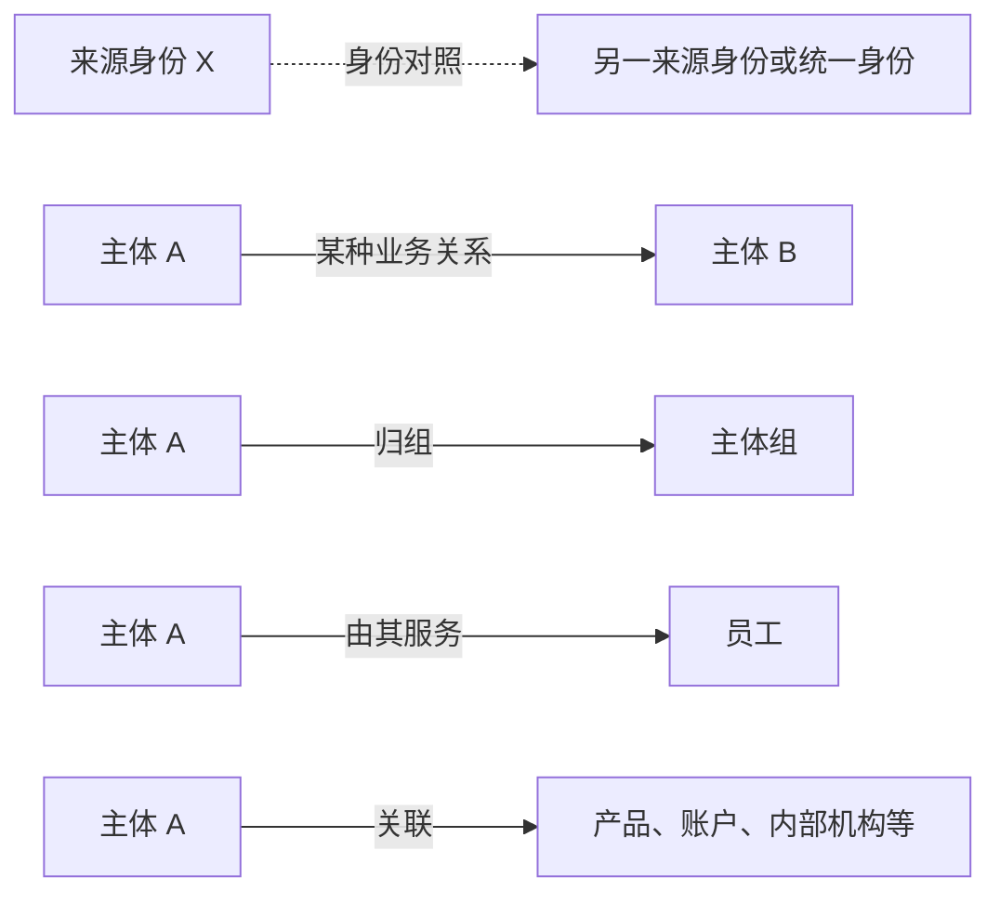
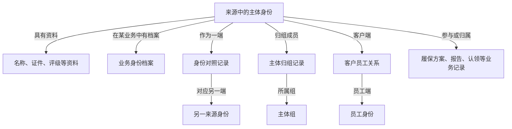

# 对象层次与关系推导

[返回学习入口](00-20260911-认知实验/t01专题-当事人/README.md)

> 2026-09-12恢复：以下完整保留整理前《04-t01-层级总纲-3.0》的正文、图示、案例和证据，仅调整标题及文件链接。
> 重点保留：主体、身份、资料、评价的逐层区别，关系的不同语义，事项粒度，以及目录树与真实关系图的区别。原文关于未统计任务覆盖和死亡材料待定的状态，已由后续系统核验补充；请同时参看《来源差异与系统核验》。

---

> 当前专题按平台分类、业务章节和实现证据统一从 [T01 专题入口](00-20260911-认知实验/t01专题-当事人/README.md) 阅读。本文件保留原有研究内容及版本范围，分类解释以新入口和各章对照为准。

> 后续核验见 [建模专题 3.1](00-20260911-认知实验/t01专题-当事人/深度分析/来源差异与系统核验.md)：已扩展到本地全部可用 hive-task SQL 的候选检索及核心调度覆盖。本页保留原层级框架；文末关于任务覆盖未统计、死亡材料缺少解释的描述，按 3.1 的覆盖统计与证据冲突说明更新理解。

整理日期：2026-09-11。本版为整个 T01 专题建立一套阅读层级，以本地 Wiki、原始元数据与已有 SQL 证据为依据。**业务目录是本文归纳的解释框架；物理表间关系、来源与时间规则仍以具体证据为准。**

本版配套 [163 张表的层级映射](<E:/02_area/股衍数据-数据cookbook/sql-static-lineage/docs/00-20260911-认知实验/t01专题/资料/对象业务归类.md>)；跨库及未解析对象查 [718 个前缀对象目录](<E:/02_area/股衍数据-数据cookbook/sql-static-lineage/docs/00-20260911-认知实验/t01专题/资料/物理对象目录.md>)。原有 [SQL 案例详解](<E:/02_area/股衍数据-数据cookbook/sql-static-lineage/docs/00-20260911-认知实验/t01专题/深度分析/主体建模与完整案例.md>) 作为证据补充。

## 1. 一张主目录：T01 在描述三类东西

**第一类描述主体及其资料，第二类连接主体和其他对象，第三类记录围绕主体开展的业务。**

这是目录的第一层。下一层再按对象内容细分，最后才落到物理表。比如：

```text
T01 专题
│
├─ A 主体、主体组与描述资料                 “谁，以及它是什么样的”
│  ├─ A1 主体与主体组登记                   主体、主体组本身
│  ├─ A2 主体类型与业务身份档案             个人、机构、资管客户、交易对手等
│  ├─ A3 基础资料、联系人与经历             名称、证件、地址、联系人、经历
│  └─ A4 分类、评价与状态                   分类、评级、评分、状态、标签等
│
├─ B 连接关系                             “这个对象与谁、以什么方式相连”
│  ├─ B1 身份对应                         来源编号、统一身份、客户端身份对照
│  ├─ B2 主体之间关系与组成员               主体关系、代理关系、主体归组
│  └─ B3 与员工、机构、产品、账户等的关系   服务人员、内部机构、产品、账户、席位
│
└─ C 围绕主体的业务记录                   “针对它制定、办理或记录了什么”
   ├─ C1 方案、参数与服务配置               履保方案、额度、费率、通知与订阅
   ├─ C2 名单、准入与服务开通               黑白名单、准入资格、服务申请
   ├─ C3 业务办理、报告与材料               尽调、附件、涉税、认领、报告
   └─ C4 归属分配、计量与考核记录           分成、提成、创收目标、价值切分
```

这是一棵**内容归属目录**。父子连线表示“这类内容包含哪些子类”，不表示上面的表生成下面的表，也不表示同一个现实主体只有一条数据库记录。

### 哪些内容不应该挂成主目录的同级分支

| 内容 | 正确位置 | 例子 |
| --- | --- | --- |
| OTC、投研、资管、经纪 | 业务范围标签，可横跨 A/B/C | OTC 同时有客户档案、身份映射、履保方案和服务配置 |
| 香港、资管专用模型 | 实现范围，需要独立核对结构 | `pdata_hk` 与 `pdata_ams` 并列存在，不能认定为通用模型的上下层 |
| `pdata_n`、`spdata_n`、`temp` | 物理位置或加工对象线索 | 库名不能直接证明某张表是“核心层”或“汇总层” |
| `src_tbl`、来源系统 | 某张表的数据来源范围 | 同一张表可以由多个来源分支写入 |
| 当前状态、日快照、历史区间 | 每张表的时间保存方式 | 名称、关系、档案各自选择保存方式 |
| TEMP、MID、I/U/D/S | 某个任务的实现步骤 | 不是主体类型或业务子域 |

因此，**“OTC”不能与“名称”“关系”当成同一种层级；“历史”也不能与“个人”“机构”并列分类。** 它们在回答不同的问题。

## 2. A 类：区分主体本身、主体身份和主体资料

### A1 登记“有这样一个对象”

`T01_PTY` 是公共主体登记入口，保存主体编号、名称、类别、状态等。某来源的一条主体登记，表达的是该来源中的模型身份；不能直接上升成“全公司唯一自然人或法人”。

`T01_PTY_GRP` 则登记“一个主体组”，字段是 `Pty_Grp_Id`、组名称、组类型、用途等。它描述组本身，**不等于组里已经列出了哪些主体**。

组成员在 B2 的 `T01_PTY_GRP_H` 中表达：其字段包含 `Pty_Id`、`Pty_Grp_Id` 及日期。这两张表形成“组定义—主体归组”的对象分工，当前依据是字段结构，尚未核验成员生产 SQL 及唯一性。[M]

### A2 说明“它属于什么类型、在业务中以什么身份出现”

这一级有两种需要分开理解的内容：

| 子内容 | 代表表 | 回答的问题 |
| --- | --- | --- |
| 主体类型的专属档案 | `T01_INDV`、`T01_CORP_CUST` | 个人或机构有哪些专属字段？ |
| 业务身份档案 | `T01_AMS_CUST`、`T01_PTY_CUTP`、`T01_OTC_DERI_CUST`、`T01_CSTD_INFO`、`T01_SPLR_INFO` 等 | 作为资管客户、交易对手、托管人、供应商，需要哪些资料？ |

“一家机构是交易对手，也是客户”在概念上并不矛盾。类型和业务身份不是一套互斥分类。现有表名也没有把这两个概念完全分开，因此本目录将它们放在同一大类内的两个解释位置，而不虚构一套已落地的统一继承体系。

`T01_OTC_DERI_CUST` 虽然有协议和权限字段，所选 OIS017 SQL 却按主体编号比对记录，所以它在这里作为业务档案入口。相反，`T01_CUTP_PERF_MARG_PLAN_INFO` 有独立方案编号，放在 C1 方案记录。**决定放在哪里的依据，是记录主要描述的对象，而不是是否都带 OTC 或客户字段。** [E1][E2]

### A3 说明“它有哪些资料”

名称、证件、地址、联系人、重要日期、个人经历等，都属于描述主体的资料。但它们不是同一种行结构：

- 通用名称表在已核对分支中，一行内有中英文全称、简称四列，按来源与日期保存。
- 鉴别信息通用结构允许多个证件类型和内容；一名主体可对应多条资料。
- 联系人表直接保存联系人姓名、联系方式等；存在联系人资料，不代表该联系人已经拥有独立主体编号。
- 个人教育、职业、项目经历描述一段经历或相关资料，不应被压成一客一行。[M][E3]

它们与 A1 的关系应读作“这个主体具有这些资料”。是否通过 `Pty_Id` 单列就能正确 Join，还需要来源、时间、类型及数据唯一性证据。

### A4 说明“从某个角度怎样评价它”

分类、评级、评分、状态、行业、标签、偏好等属于主体刻画。这里至少还要分清：

| 内容 | 结构上还需要关注什么 |
| --- | --- |
| 分类 | 分类视角 `Pty_Clas_Type_Cd` 与分类结果 `Pty_Clas_Cd` |
| 评级 | 评级类型、结果，必要时还有机构及日期 |
| 状态 | 具体状态来源及码值，不把审核、删除、销户混为一谈 |
| 统计或标签 | 指标/标签类型与内容，不能将不同类型的数值相加 |

例如所选 PPM005 分支把供应商级别写进评级表。这仍属于 A4，但业务范围标签是供应商管理，不能把这部分评级解释成客户适当性评级。[E4]

## 3. B 类：连线的含义，比“有两个编号”更重要

把所有带两个 ID 的表叫作“关系表”还不够。至少区分三种连线：



图只说明连线语义，没有声明全部基数、外键约束或物理 Join。

### B1 身份对应：两个编号如何对得上

`T01_PTY_ECIF_MAP`、`T01_PTY_SRC_SYS_COMPR_INFO`、`T01_SAME_PTY_RELA_ADTNL_INFO` 分别提供统一身份、来源系统、业务维护的身份对照入口。客户端身份信息也可放在这个导航位置，但其映射含义需单独核对。

这里应问：映射的两端是什么编号空间，方向是什么，是否允许多对多，是否有来源和有效条件。它不同于“甲公司与乙公司有业务关系”。

已有 ECIF 样例的最终关联只有主体编号等值，没有同时匹配系统。因此只能说存在身份对照实现，不能说全专题已经完成无歧义的统一身份。[E5]

### B2 主体之间的关系与组成员

`T01_PTY_RELA_H` 的两端是主体与关联主体；关系类型决定这条边的业务含义。`T01_PTY_GRP_H` 则连接主体与主体组。组成员关系也不等于两个主体是同一人。

XPB001 的关系比对包含“主体 + 关系类型 + 主体类别 + 关联主体”。所以同一主体可以有多条不同关系；不能只按主体编号去重。[E6]

### B3 与其他对象的关系

员工、用户、内部机构、产品、账户、席位都可能出现在另一端。另一端不应无条件到 `T01_PTY` 找资料。

例如 RMS140 客户经理关系会拆开多经理列表，并借助 T04 用户员工映射确定员工身份。这里应当理解为“客户—员工”的关系，而不是把员工也当成客户档案的一列。身份映射中还有兜底，实际 `Emp_Id` 是否均为标准员工号仍待验证。[E7]

另一个容易误分的例子是投研客户席位表：字段中有 `Cust_Id`、`Seat_No`、`Seat_Use_Cust_Id`，所以导航上放在客户与席位的关系，而不是因为含有月份就放进“月度业绩”。[M]

## 4. C 类：主体参与了一项有自身身份的业务记录

这一类的共同特点是：主体只是记录中的参与者或归属对象。还需要方案、流程、报告、名单、产品、员工、期间等信息才能理解一行。

| 子类 | 代表对象 | 记录主要描述什么 | 不应该简化成什么 |
| --- | --- | --- | --- |
| C1 方案、参数与配置 | 履保方案、额度、费率、通知和订阅配置 | 某方案、某类参数或某项服务配置 | 主体的一条永久属性；实际收付款 |
| C2 名单、准入与开通 | 黑白名单、监控名单、持牌业务、账户开通申请 | 某项资格、名单成员或开通记录 | 只要有主体就自动成立的身份 |
| C3 办理、报告与材料 | 尽调、报告、附件、涉税、产品销售认领 | 一次办理、一份报告、一个附件或认领记录 | 一名主体唯一的一份完整资料 |
| C4 归属、计量与考核 | 分成、佣金提成、价值切分、创收目标等 | 某种分配规则/记录、期间目标或计量记录 | 全部都是已实现收入或可直接相加金额 |

C 类子目录是业务管理记录的阅读分组，不保证其中所有表使用同一粒度。例如“分成规则”和“已计算分成金额”都能进入 C4 目录，但使用时必须继续分清规则与结果。

### 用三个原始结构把这一级坐实

1. **履保方案**：`Perf_Marg_Plan_Id` 标识方案，`Pty_Id` 指向交易对手，另有管理人主体与协议等字段。主体和方案不是一个对象。[E2]
2. **尽调报告及附件**：尽调表出现 `Dd_Rpt_Id`；报告表还有档案、提交、审批等字段；附件表有 `Proc_Id`、`File_Id`。这说明业务记录围绕主体展开，但报告、流程、附件具有不同身份，不能直接合并成一客一行。[M]
3. **财务报表明细**：`Fin_Rpt_Id`、`Fin_Rpt_Item_Id`、报告期、币种和版本共同提示报告明细语境。`Pty_Id` 只是说明报表属于谁。[M]

因此，完整理解 T01 不能只讲“主体主表及其附表”。一部分表是在描述主体，另一部分已经在描述主体参与的其他业务对象。

## 5. 真实关系图与目录树，要分别阅读

前面的树用于找内容。把具体对象连接起来时，至少给边命名，避免只画没有含义的箭头。



这张图是依据对象结构形成的概念关系图，未声明关系一对一或所有实体都有完整记录。比如一个人是否能在所有来源中连到同一个身份，仍然是 B1 映射要解决的问题。

这里也能看出两种容易混淆的“上下层”：

- 目录里“名称表属于主体资料”，表达内容归属。
- SQL 里“来源表写入名称表”，表达加工关系。

公共主体表和名称表可以分别读取同一源表，目录父子关系并不要求“先写主体表，再从主体表生成名称表”。已核对的 OIS017 就是这种情况。[E1][E3]

## 6. 业务线与物理实现，放在主目录旁边

### 6.1 一条业务线是对主目录的横向切片

| 业务范围 | A 主体与资料 | B 关系连接 | C 业务记录 |
| --- | --- | --- | --- |
| OTC | 交易对手与 OTC 客户档案 | 同一当事人映射、引入及银行账户等关系入口 | 履保方案、报告发送配置等 |
| 投研 | 投研个人/机构、海外客户档案 | 客户经理、席位、产品等关系 | 订阅、试用、佣金与分配相关记录 |
| 资管与托管 | 资管客户、托管人、管理人、TA | 客户与来源客户号、账号等对应入口 | 客户相关配置及专属业务记录，须按具体实现定位 |
| 经纪及其他主体业务 | 个人/机构、联系人、类别与评级等 | 员工机构关系、产品关联等 | 准入名单、产品认领、协作分成等 |

本表说明目录的使用方法，结合本地 Wiki 范围和已存在对象归纳，不表示四条业务线的每个格子都已完成全量 SQL 核验。[W][M]

### 6.2 各物理模型是并列核对的实现，不是统一的高低层

```text
业务目录：A 主体及资料 / B 连接 / C 业务记录
                    ↓ 到具体实现中查找对应对象
       ┌────────────┼────────────┬─────────────┐
   通用 pdata_n   专题 spdata_n   香港 pdata_hk   资管 pdata_ams
```

图中的向下表示查找实现，不表示生产或复制。名称相同也要分别核对物理身份。

例如通用 `T01_PTY_NAME` 已核对分支用四个名称列保存日快照；香港 `T01_PTY_NAME_H` 则具有名称类型、名称、起止日期。两者都可以在 A3 名称资料下找到，但字段组织和时间方式不同。[M][E3]

资管 `T01_TA_CUSTOMERINFO` 还有客户号、代理主键、基金账号等不同结构。它不是简单给通用主表换一个 schema。[E8]

### 6.3 加工路径另画，只画有证据的部分

```text
业务源记录
   ├─ 字段投影、转码等 → 某张 T01 表
   ├─ 与旧记录比对   → 某张 T01 表的状态/快照/区间
   └─ 多来源关联     → 某张 T01 映射或业务记录表

若干 T01 表及其他主题
   → 按具体人群、来源、时间与关联规则组合
   → T98 或其他应用结果
```

这是已见加工模式的概括，不是所有表必经的标准流水线。TEMP/MID 属于某段任务实现，不能拿它们作为业务目录中的层级。

## 7. 一条使用路径：先找对象，再决定怎么拼

假设要回答：“某业务范围中，哪些机构具备某项资格，由谁服务，关联了哪些履保方案？”这是教学需求，不是真实数据结果。

1. 在 A2 确定业务范围和机构档案，落实来源身份。
2. 资格可能来自 A4 评价、C2 准入或 A2 业务档案，先确认具体口径，不能仅凭字段名选表。
3. 若跨来源，在 B1 确认编号如何对应。
4. 到 B3 取得服务关系，另一端继续按员工身份处理。
5. 到 C1 查方案，保留方案编号；不要把多个方案去重成一个主体。
6. 为每个输入分别落实来源和时间，再按目标结果粒度组织 Join。

若最终要求“一机构一行”，多名员工、多项资格、多份方案需要分别决定筛选或汇聚方式。若要求“一机构一方案一行”，就应保留方案维度。这由消费者的问题决定，不是 `T01` 前缀替消费者做出的决定。

## 8. 层级落到表：范围和证据深度

配套映射逐条覆盖本地 Hive `pdata_n` 中已解析的 163 个对象，每个对象只设一个主要阅读位置，边界对象保留说明。这是**完整的导航分配，不是完整的主键、粒度或生产逻辑认证**。

- 分类使用表注释、实际字段以及已有 SQL 样例；重要边界重新查看原始元数据，不只依据表名。
- 主体组定义与主体归组分开；持牌业务放入准入；投研席位和月券结产品放入对象关系；客户端客户信息放入身份对应入口。
- `T01_PTY_DECES_MATRL_INFO` 的表注释及已查看字段注释缺失，保持待定，不用名称猜业务。
- 通用 schema 的未解析对象、香港/资管/专题实现、其他平台和名称相关候选继续保留在完整目录中，不强行套入通用物理表的语义。

**生产与消费任务的全量覆盖率仍未计算。** 既有 22 份 SQL 是样例集合，不是全专题验收样本量；本版没有因为形成了层级映射，就把任务覆盖缺口改成“已完成”。若用于进一步业务分析，应从本目录选定子类，再把对应生产、消费任务与实现差异核验齐全。

## 9. 原始依据与继续阅读

| 标识 | 原始依据 | 本版用途 |
| --- | --- | --- |
| W | [主题划分，本地页面缓存](<E:/03_resource/wiki-cache/pages/255499828/page.md>)；[基础模型，本地页面缓存](<E:/03_resource/wiki-cache/pages/214137197/page.md>) | 主题范围与相邻主题分工；未刷新远端，可能存在历史口径 |
| M | [原始表元数据 SQLite](<E:/02_area/股衍数据-数据cookbook/sql-static-lineage-cache/schedule-evidence/tasks-sqlite/table-metadata-catalog/table-metadata-4877b15fb9a9accd-e5c48df0-e117-4469-8eb4-e62d3568950b.sqlite>) | 全部导航对象及字段；字段存在不证明唯一性或有值 |
| E1 | [OIS017 OTC 客户 SQL](<E:/02_area/股衍数据-数据cookbook/sql-static-lineage-cache/schedule-evidence/tasks/144562/hive-task.sql:575>) | 主体级比对；与方案对象区分 |
| E2 | [TIT187 履保方案 SQL](<E:/02_area/股衍数据-数据cookbook/sql-static-lineage-cache/schedule-evidence/tasks/200060/hive-task.sql:57>) | 方案及其参与主体 |
| E3 | [OIS017 名称 SQL](<E:/02_area/股衍数据-数据cookbook/sql-static-lineage-cache/schedule-evidence/tasks/144561/hive-task.sql:26>) | 名称资料与来源直接投影 |
| E4 | [PPM005 评级 SQL](<E:/02_area/股衍数据-数据cookbook/sql-static-lineage-cache/schedule-evidence/tasks/204548/hive-task.sql:30>) | 评价类型与业务范围的区别 |
| E5 | [ECIF 对照 SQL](<E:/02_area/股衍数据-数据cookbook/sql-static-lineage-cache/schedule-evidence/tasks/63187/hive-task.sql:68>) | 身份对应而非一般业务关系 |
| E6 | [XPB001 主体关系 SQL](<E:/02_area/股衍数据-数据cookbook/sql-static-lineage-cache/schedule-evidence/tasks/102409/hive-task.sql:90>) | 关系类型、两端与比对方式 |
| E7 | [RMS140 员工关系 SQL](<E:/02_area/股衍数据-数据cookbook/sql-static-lineage-cache/schedule-evidence/tasks/213009/hive-task.sql:27>) | 员工是另一类对象，关系可一对多 |
| E8 | [资管客户模型 SQL](<E:/02_area/股衍数据-数据cookbook/sql-static-lineage-cache/schedule-evidence/tasks/111500/hive-task.sql:34>) | 并列物理模型的不同身份结构 |
