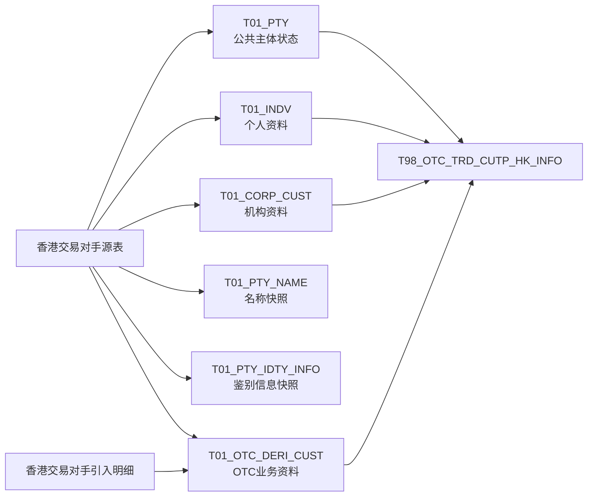

# T01 案例详解与 SQL 索引

本文件集中保存来源加工、身份、时间和香港消费的详细案例；主阅读顺序见 [专题入口](00-20260911-认知实验/t01专题-当事人/README.md)。案例主体来自 2026-09-11 的本地研究，不代表已经重新核验全部来源或当前运行状态。保留原案例节号与 S01–S22 证据编号，供章节精确引用。

## 2. 业务分支案例

### 2.3 整个专题的业务内容，分成十一块阅读

下面每一块都回答一个独立业务问题，并指出它与其他部分的联系。表名省略 Hive `pdata_n`，跨库时会写全名；完整对象清单在配套目录。本节的业务提问是推荐阅读路线，不代表已核验所有下游都如此使用。

**一、主体公共资料：先知道在描述谁。**

`T01_PTY`、名称、鉴别信息、地址、重要日期、企业注册与上市信息构成基础资料入口。它们共享主体编号语境，但记录粒度和时间保存方式不同。名称不一定是主表名称的权威替代；证件也不能仅靠主体编号保证一条。先确认来源，再决定选哪份资料。

**二、主体类型与业务参与角色：明确它以什么身份出现。**

个人、机构、资管客户、交易对手、潜客、银行、经纪商、托管人、管理人、销售商、供应商、TA、外部专家等都在目录中出现。这些角色并非必然互斥，也不是所有角色都能套用“个人表或机构表二选一”。

例如 `T01_AMS_CUST_AMS032` 按产品代码是否为空、基金账号前缀等条件构造 `STA001-`、`TA5001-`、`AMS032-` 的主体编号，同时保存资管客户号、定向产品号、恒生 TP 客户号。这说明它在连接多套客户/账号语境，而不只是给主表增加几个资管字段。[S21]

**三、个人经历与联系人：区分“主体自己”与“和主体有关的人”。**

个人教育、职业、家庭成员、技能、项目经历、论文、任职、奖励等描述个人经历；重要联系人、公司核心人员等描述与主体有关的人。一个机构的联系人记录不证明该联系人已经作为独立 `Pty_Id` 纳入主体主表。

CRM341 联系人分支按客户号、联系人姓名和联系方式形成记录，并用 `NOT EXISTS` 排除 RCC 当天已经有“相同客户号 + 关系人姓名”的记录。这是一条跨来源去重/补充规则，不是简单把所有联系人 `UNION ALL` 在一起。[S16] 因此汇总联系人之前，必须先理解来源优先和去重条件。

**四、分类、评级、状态与风险刻画：明确正在评价什么。**

类别、分类、评级、评分、偏好、行业、标签、分组、状态、信用风险、额度、利率及统计信息一起构成主体刻画。关键不是取一个“最新值”，而是先选分类视角、评级类型、结果口径和生效时间。

一个直接反例：PPM005 把供应商级别写入 `T01_PTY_RAT`，`Rat_Type_Cd='SPLR_LVL'`，评级日期、评级机构和生效/到期日期都写空。[S15] 因而“评级表”并不专指客户适当性评级，也不能对所有评级统一使用日期字段过滤。

**五、身份对照：解决同人异号和不同体系编号。**

ECIF、源系统对照、同一当事人映射是这块的核心。它与一般“主体之间业务关系”不同：后者可能表达 A 服务 B、A 关联 B；前者试图说明两个编号的身份对应。第 3 节展开三种真实实现及其边界。

**六、主体与主体、员工、机构、产品的关系：把另一端对象带进来。**

关系表中另一端可能是主体、员工、用户、员工组、内部机构、产品、银行账户或代理人。不能把所有另一端都当 `Pty_Id`，也不能只按主体起点去重。

RMS140 的客户经理关系会先把逗号分隔的经理列表拆成多行，再通过组织对象、用户表与 `T04_USER_EMP_RELA_H` 转换员工编号；最终按“主体 + 关系类型 + 员工”比对历史。这里的一对多来自真实拆分，不能为了得到一客一行随意删掉。员工编号转换又有 `COALESCE(员工号, 用户名, 原经理编号)` 兜底，所以 `Emp_Id` 是否都是标准员工号还需要核验。[S17]

**七、尽调、涉税、受益所有人与合规材料：资料、流程、证据是不同粒度。**

企业尽调、报告、报告完备状态、背景调查、尽调附件、受益所有人、个人/机构/控制人涉税信息等集中回答“需要了解和留存什么”。例如尽调附件表同时包含记录、流程、附件和当事人编号；财务报表明细包含报表、项目、报告期、币种和版本。它们都不是一客一行的资料卡。[M]

把多份附件和多项报表直接 Join 到主体，会形成组合扩行。若消费者只问“有没有完成尽调”，应先确定完成规则，不能把“有一份附件”当成完成证明。

**八、准入名单、业务配置与服务触达：回答能否进入某个场景、怎样服务。**

黑白名单、重点监控、资料缺失、司法/合规检查、潜客保护、渠道引流、自动对账、估值报告配置、通知、订阅、行情试用、独立交易单元申请等构成这部分。进名单、出名单、有效标志和配置生效日需要分别核对。名单记录既可能作为正向准入，也可能是排除集合，方向只能从消费条件确认。

**九、OTC、履保与交易权限：业务扩展中也有多种粒度。**

OTC 客户、履保信息、履保方案、银行账户附加、交易对手引入等不能揉成一张“OTC客户资料表”。TIT187 履保方案分支把源 `ID` 写成 `Perf_Marg_Plan_Id`，把 `KEY_CTPTY_ID` 转成主体编号，还保存管理人主体编号、履保协议和大合约编号。[S18] 它组织的是方案及其关联主体，一名主体可能关联多个方案；方案参数也不等于当日已经实际发生的保证金收付。

`spdata_n.t01_pty_cutp` 的 RSK028 分支又把风控维护对象映射为 `RSK028-` 前缀主体和 `Cutp_Cate='RSK_MATN'`。[S22] “交易对手”这一角色在不同应用范围仍有不同编号和属性表达，不能都归结成香港 OIS017 分支。

**十、营销认领、协作分成和创收考核：记录“这份业务算给谁”。**

产品销售关系认领、客户佣金提成、收入协作、异地开户分成、员工机构组合分成、客户创收目标、指标价值切分、证金激励与扣罚等，是围绕主体组织的业务记录。认领表包含客户、产品、销售员工、来源记录、成交日期、认领状态、金额以及关联流水等；这明显比主体粒度细。[M]

分析时必须分清“分成规则”“认领记录”“目标值”“实际金额”。不能只因为都有客户编号和比例，就相互替代或直接求和。第 6 节用真实提成分支说明为何还必须检查字段有没有实际填充。

**十一、业务线与区域专属模型：沿用共同问题，不强求相同结构。**

投研的机构/个人客户、海外客户、席位与月佣金；期货期权的投资者、保证金率和手续费率；托管合作、基金销售；私人银行、战略客户、融资与专项融券等，都在通用目录中有专属对象。香港与资管 schema 又有成组独立模型。

这些对象应放在全专题地图上，但不能凭注释断言它们都由公共主表派生、已经与全域身份合并或拥有完整历史。能共用的是“主体语境、粒度、时间、关系”的阅读方法，不是未经核验的 Join 键与统一加工模板。

## 3. 先分清三种身份，再谈 Join

### 3.1 表的身份、记录的身份、现实主体的身份

| 层次 | 如何定位 | 它不能替代什么 |
| --- | --- | --- |
| 物理对象 | `platform + data_source + qualified_name` | 同名 Hive/TiDB 对象不能自动共享字段解释 |
| 某份模型数据中的记录 | 先限定来源和时间，再看该表实际识别字段 | `Pty_Id` 不是每张表的完整记录键 |
| 跨系统现实主体 | 依靠有依据的身份映射及其规则 | 不能靠名称相同、编号相同或类别相同直接认定 |

本次目录中，`pdata_n.t01_*` 共 219 个对象记录，其中 Hive 218 个、TiDB 1 个。因此后文模型解释限定 Hive 范围；没有把不同平台的数据源混在一起。[M]

### 3.2 `Pty_Id` 的构造并不统一

从已核对 SQL 可以看到三种做法：

| 来源分支 | 实际编号表达式 | 读者需要记住什么 |
| --- | --- | --- |
| OIS017 公共主体 | `CLIENT_ID` | 直接沿用来源编号 [S01] |
| TMC003 公共主体 | `concat('TMC003-', ID)` | 增加分支前缀 [S08] |
| RCC002 名称 | `TRIM(A.CLIENT_ID)` | 此分支只是去空格；不能假定所有 RCC 分支都统一补零 [S13] |

XPB 关系分支又会把关联的 RCC 客户号做 `LPAD(...,12,'0')`。[S09] 这说明即使编号来自同一业务体系，使用前仍要核对格式处理，不能按字段同名直接拼接。

### 3.3 T01 已经存在身份整合机制，但不能把它等同于全量整合完成

**第一类：接入 ECIF 与统一客户号。**

`T01_PTY_ECIF_MAP_ECF001` 的一份实现读取 ECIF 来源中的账户对照、统一号关系和客户基本信息，再与 `T01_PTY` 关联，输出：

```text
Pty_Id → Ecif_Id、Unif_Cust_Id
并保留 Src_Sys_Cd、Pty_Cate_Cd、来源分区和业务日期
```

它不是单纯的源表字段改名：中间步骤按“外部客户号 + 外部系统”以及 `PARTY_ID` 分别用更新时间排序取一条记录；输出前限定了主体类别及外部系统范围。[S10]

需要同时看到实现边界：最终是 `LEFT JOIN`，条件只有 `PTY.Pty_Id = ECF.EXT_CUST_NO`，没有同时按系统匹配。中间按“客户号 + 系统”取一条，不等于客户号跨系统唯一。静态 SQL 能证明它尝试建立映射，不能证明映射都命中、唯一或无歧义。

**第二类：保存来源系统的明确对照。**

`T01_PTY_SRC_SYS_COMPR_INFO_ECR081` 将 `TARGET_OBJ_ID` 写为 `Pty_Id`，`SOURCE_OBJ_ID` 写为 `Compr_Pty_Id`，并保存对照类型、来源、内容和来源不活跃标志。这比简单的“两个编号相等”多了一层对照语义。[S11]

**第三类：接入业务维护的同一当事人映射。**

`T01_SAME_PTY_RELA_ADTNL_INFO_TIT163` 读取交易对手映射表：

```text
TIT060- + KEY_CTPTY_ID → Pty_Id
OUTSIDE_CTPTY_CODE    → Same_Pty_Id
OUTSIDE_SOURCE       → Pty_Rela_Src
```

这里保存的是源系统已有的映射，不是当前 SQL 通过证件或名称计算出来的同人识别结果。该分支把 `Cert_No`、`Idty_Rsn`、`Vld_Flag` 等字段写为空串；不能因为表里有这些字段，就声称每条映射都带证件依据、识别原因或有效标志。[S12]

所以准确的全貌是：**多来源主体记录与身份对照机制并存。要判断某两个编号是否已经贯通，必须进入具体映射分支，而不是笼统断言“已统一”或“没有统一”。**

## 4. 时间：当前状态、每日快照、历史区间要分开理解

先问表怎样保存记录，再看字段叫什么。下列四种情况在本次证据里都存在。

| 形态 | 真实例子 | 记录如何变化 | 可以回答什么 |
| --- | --- | --- | --- |
| 按来源维护累计状态 | `T01_PTY` 的 TMC003 分支 | 对比当前目标与当天来源，改写来源分区；删除记录以标志保留 | 该分支所维护的主体状态；不能直接按日期分区取旧版本 [S08] |
| 每日直接快照 | `T01_PTY_NAME` 的 OIS017、RCC002 分支 | 当天来源直接生成当天分区，没有区间开闭链 | 某个已保存业务日的名称资料 [S04][S13] |
| 比对后生成每日快照 | `T01_OTC_DERI_CUST` 的 OIS017 分支 | 与上一交易日分区比对，I/U/D/S 各类记录均写入本日分区 | 某日记录状态；其中可能包含逻辑删除记录 [S06] |
| 按区间保存变更 | `T01_PTY_RELA_H` 的 XPB001 分支 | 保留旧区间，变化时闭链并开新链；只有来源分区 | 按该任务维护规则，指定日期有哪些有效关系 [S09] |

### 4.1 名称表的“拉链”注释与实现不一致

元数据描述 `T01_PTY_NAME` 为“每日一份快照……名称变动历史，拉链数据存储”。但同一元数据记录的字段没有 `Strt_Date/End_Date`，OIS017 与 RCC002 两份 SQL 也都是直接写当日分区，没有名称变更比对或区间维护。[M][S04][S13]

因此本次应按**每日名称快照**解释这两个分支。旧日分区可能让人比较名称变化，但这不等于在一行中记录了名称的生效和失效区间。

也不能把四个名称列解释成“四行名称历史”：OIS017 在同一行中写中文全称、中文简称、英文全称、英文简称，且英文全称固定为空。

### 4.2 真正的区间维护是什么样

XPB001 关系任务用以下条件取业务日 `d` 的开链记录：

```sql
Strt_Date <= d AND End_Date > d
```

因此这份实现使用左闭右开区间 `[Strt_Date, End_Date)`。例如以下是根据该规则构造的教学记录：

| 主体 | 关联主体 | 开始日 | 结束日 | 9 月 10 日是否有效 |
| --- | --- | --- | --- | --- |
| A | B | 2026-09-01 | 2026-09-10 | 否 |
| A | C | 2026-09-10 | 2099-12-31 | 是 |

任务的比对字段包含 `Pty_Id + Pty_Rela_Type_Cd + Pty_Cate_Cd + Rela_Pty_Id`。因此关联主体从 B 换成 C，在此规则下通常表现为旧关系 D、新关系 I，而不是同一键上的 U。U 还可以用于同一关系键下关联主体类别等属性的变化。[S09]

新开链的开始日写的是加工参数 `${data_day_str}`。这证明的是“任务按处理业务日记录变化”，**不证明它取到了现实业务关系真正发生变化的日期**。如果今天补录上月关系，所选 SQL 没有展示按原始生效日回溯修订全部区间的逻辑。

### 4.3 有起止日期字段，也不一定是历史拉链

TIT163 同一当事人映射有 `Strt_Date/End_Date`，但该分支直接覆盖来源分区：开始日取源创建时间，结束日固定为 `2099-12-31`，没有与旧表比对、保留旧记录或闭链的步骤。[S12]

所以，“有日期字段”“有历史表注释”“表名带 H”都只能作为检索线索。能否查询历史，要看实际保存和更新逻辑。

### 4.4 删除、销户、审核状态各自回答什么

- 在 TMC003 公共主体分支中，`Del_Flag='1'` 来自“旧表有、当天源集合没有”的比对结果；它不天然等于客户销户。[S08]
- 同一分支的 `Clos_Date` 来自 `LOGOFF_TIME`，`Pty_Stat_Cd` 来自 `LOGOFF` 的码值转换。[S08]
- OIS017 公共主体的 `Pty_Stat_Cd` 却来自 `AUDIT_STATUS` 的转换，而 `Clos_Date` 被写为空。[S01]

换言之，即便目标字段名相同，理解业务含义也要返回来源和转码规则。“未删除”不能被直接翻译为“已审核、可交易、未销户”。

## 5. 完整案例：香港交易对手如何拆成模型，再组装成结果

这一节沿已核对的 OIS017 与香港下游 SQL 展开。它说明一种真实实现，不代表所有来源都采用相同规则；前面的 ECIF、TIT、XPB、TMC 和 RCC 分支用于补足其他建模形态。

### 5.1 源表并不是先进入主表，再逐层拆出所有附表

多个生产任务分别读取同一个源对象 `ODATA_N_OIS.G_HK_COUNTERPARTY`，形成不同的 T01 表。下面的箭头来自所选 SQL；它们表示静态读写关系，不表示任务运行先后或同批数据已经到达。



**本案例的 T98 并不读取名称表和鉴别信息表。** 不能因为它们与主体有关，就把它们画成该结果的直接上游。[S01–S07]

### 5.2 为什么会出现“同一内容分布在多张表”

| 源字段或来源 | 目标字段 | 实际含义 |
| --- | --- | --- |
| `CLIENT_NAME` | `T01_PTY.Pty_Name` | 主表使用的显示名称 [S01] |
| `FULL_NAME` | `T01_PTY_NAME.Full_Name_Ch`、`T01_CORP_CUST.Org_Full_Name_Ch` | 两张表中都保留中文全称 [S03][S04] |
| `ABBREVIATION` | 名称表中文简称、机构表中文简称 | 同一属性在不同模型中重复保存 [S03][S04] |
| `UNIFIEDSOCIAL_CODE` | `T01_CORP_CUST.USCC`、`T01_PTY_IDTY_INFO.Idty_Info_Cont` | 既出现在机构专属资料中，也作为通用鉴别信息保存 [S03][S05] |
| OOM 引入明细 | OTC 表引入经办人等字段 | 业务扩展不只来自主体源表，还补充另一来源 [S06] |

这表明现有实现允许属性重复保存，不能用“名称只能存名称表、证件只能存证件表”解释它。真正需要核对的是：消费者使用哪份表达、时间是否一致、空值和取值规则是否相同。

在引入明细这一步，SQL 先按 `CLIENT_ID` 分组，对部门、经办人、引入人分别去重、排序并拼成字符串，再 Join 到交易对手。这样把明细压成每个客户一组字段，避免按每条引入明细直接扩行；代价是这些列成为集合字符串，不能把不同列中相同位置的元素当成一一对应的原始明细。[S06]

### 5.3 当前生产任务采用的粒度是什么

| 目标 | 所选 SQL 采用的识别方式 | 这能证明什么、不能证明什么 |
| --- | --- | --- |
| `T01_PTY` | 限定来源后，旧表与当天集合按 `Pty_Id` 比对 | 任务以来源内主体编号识别记录；没有证明源编号唯一 [S01] |
| `T01_CORP_CUST` / `T01_INDV` | 限定来源、上一交易日后，按 `Pty_Id` 与当天集合比对 | 每个分支按主体状态维护日快照；逻辑删除记录可能保留 [S02][S03] |
| `T01_PTY_NAME` | 对当天源集合直接投影 | 倾向于来源主体级日快照；未见去重，输入或 Join 重复可传递 [S04][S13] |
| `T01_PTY_IDTY_INFO` | OIS017 每条源记录输出一条鉴别记录 | 该分支不展开多证件；通用表的多证件能力不能套成这个分支的实际行为 [S05] |
| `T01_OTC_DERI_CUST` | 限定来源、上一交易日后，按 `Pty_Id` 比对 | 以主体为识别单位维护业务资料；不能因为表内有协议字段就理解为“一协议一行” [S06] |

主键约束、任务比对键和数据实际唯一性是三件事。本次明确核验的是第二件，没有通过业务数据验证第三件。

### 5.4 下游到底留下谁、取什么、丢什么

真实下游 `T98_OTC_TRD_CUTP_HK_INFO` 可以简化成：

```text
A = 指定香港来源中 Del_Flag='0' 的 T01_PTY
B = 指定香港来源、指定日期的 CORP_CUST
    UNION ALL 同来源、同日期的 INDV
C = 指定香港来源、指定日期、Src_Dept_No='HK' 的 OTC_DERI_CUST

结果 = A LEFT JOIN B ON Pty_Id
         INNER JOIN C ON Pty_Id
```

实际输出只有客户编号、公司名称、客户简称、公司注册码、部门、代签产品名称和生成时间。[S07]

几个决定结果的细节：

1. **A 决定主体起点，但 C 还决定准入。** 缺少 B 时仍可保留记录，只是补充字段为空；缺少 C 时主体被过滤。
2. **名称选自主表。** 结果的公司名称取 `A.Pty_Name`，并没有到名称表取 `Full_Name_Ch`。
3. **个人也可以进入输出。** B 使用机构与个人的 `UNION ALL`；个人分支用姓名作为简称、注册码写空。因此“公司名称”这个结果字段注释，不足以证明输出只有机构。
4. **B、C 没有过滤 `Del_Flag`。** 生产 SQL 又可能保留逻辑删除记录，所以“主表未删除”不保证所有拼接的扩展资料也未删除。
5. **没有去重保证。** 对 A 的某一行，若 B 有 `n` 个匹配、C 有 `m` 个匹配，输出为 `max(n,1) × m` 行。`m=0` 时为零行。只有验证这些集合的唯一性后，才能称结果“一主体一行”。

这是拆表后重新组合的关键：每张表各自合理，并不自动保证 Join 后的粒度正确。

### 5.5 “代签产品名称”实际有没有来源

下游读取了 `C.Sign_Prd_Name`，但 OIS017 上游的新记录构造是：

```sql
'' AS Sign_Prd_Name
```

因此这个分支没有从源表提供代签产品名称。新记录会写为空串；与旧记录比对后发生更新的匹配记录也使用新值。但删除分支保留旧记录，不能据此断言整张表或当前下游所有行必为空。[S06][S07]

与此类似，字段注释“统一社会信用代码”、结果注释“公司注册码”、来源字段 `UNIFIEDSOCIAL_CODE` 三者提供了线索，但本次没有抽样验证香港机构实际填写的证件内容。不要把字段名当成已经核准的业务口径。

### 5.6 日期不是一个统一的“今天”

下游 B、C 的日期条件使用：

```sql
default.pretradedate(date_sub('{busi_date}', -1), 1)
```

这里保留原表达式。本次没有核验该自定义函数实现和交易日历，不把它直接翻译成固定的自然日或交易日。

A 来自没有 `BUSI_DATE` 分区的公共主体表，B、C 来自按上述表达式选择的日期快照。因此当前程序组合的是“主表所维护的状态 + 指定日期扩展资料”，并未仅靠 SQL 自动保证所有部分处于同一历史时点。拿这条 SQL 回跑历史日期时，尤其不能直接当成完整历史还原。

## 6. 从来源到模型：标准化到底做到了哪几层

结合各分支，标准化至少要拆成四层看，不能用一个“统一”概括。

| 层次 | 已见到的做法 | 仍然存在的边界 |
| --- | --- | --- |
| 字段结构 | 多源映射到 `Pty_Id`、名称、类别等共用列 | 某些列固定空串、固定码值；表结构覆盖不等于业务内容覆盖 |
| 代码与格式 | 码表转换、补前缀、补零、去空格、日期处理 | 未命中映射时可能保留源码；不同来源处理方式不同 |
| 身份对应 | ECIF、统一客户号、系统对照、交易对手映射 | 覆盖、命中、唯一性及映射冲突仍需单独验证 |
| 时间与记录维护 | 日快照、累计状态、区间变更、逻辑删除 | 各表不一致，不能自动获得跨表同步或完整历史 |

例如 TMC003 用 `nvl(B.DW_CD_VAL, LOGOFF)`：码表命中就用仓库码，未命中继续保留源码。这保证了表达式有兜底，却不保证结果列中的每个值都已完成转码。[S08]

在这个分支里，TEMP 保存当天来源转换结果，MID 保存与已有目标的比对，最终按 I/U/D/S 写回。它解释的是一种实现模板，不是所有 T01 表必经的层次：名称和鉴别信息可以直接写快照，身份映射可以读取其他 T01 表，TIT 映射则可直接覆盖来源分区。[S04][S05][S10][S12]

另一个能检验理解的反例是 `T01_CUST_CMS_DECT_DET_CRM026`：表中虽然存在 `Dect_Id` 和提成金额字段，该分支却把提成编号、多个金额及比例字段写为空串，主要投影客户编号、类型、状态、月份、备注和业务类型。不能把“客户佣金提成明细”直接当成可以据此统计提成金额的事实表，也不能拿空的 `Dect_Id` 当记录键。[S14]

## 8. 本次结论的适用范围与尚未解决的问题

### 8.1 原始目录告诉了我们什么

本次按 `lower(qualified_name) GLOB 'pdata_n.t01_*'` 检索原始目录，并先按平台区分。Hive 范围 218 个对象中，163 个为 `PARSED`、55 个为 `UNSUPPORTED`。这只是目录快照中的对象与解析状态，不是生产有效表数量、模型完成度或当前运行情况。[M]

Hive 已解析对象的分区结构，按字段名小写后排序归组如下：

| 分区结构 | 对象数 |
| --- | ---: |
| `src_tbl` | 92 |
| `busi_date + src_tbl` | 65 |
| `busi_date` | 3 |
| `src_tbl + year` | 1 |
| `mth + src_tbl` | 1 |
| 未识别到分区 | 1 |

这说明 T01 连时间分区也不只有“来源 + 业务日”一种形态。`UNSUPPORTED` 只说明此份元数据未成功解析，不能据此认定是无用对象、临时表或运行失败。

### 8.2 证据不是同一批运行的完整记录

本次使用本地元数据快照及任务 SQL 快照。SQL 中既有保留参数的 `LOCAL_CODE`，也有 `SQL_MCP` 返回的日期已展开文本。例如公共主体 OIS017 文本包含 `2026-05-19`，RCC002 名称文本包含 `2026-05-18`，而它们的采集时间在 9 月。[S01][S13]

因此正文案例用于解释各任务的结构和条件，不把这些文件拼成“同一天已成功运行的完整链路”。采集时间、SQL 中的业务日期、调度执行时间和数据实际到达日期不能互相替代。脚本中的 `CREATE TABLE IF NOT EXISTS` 也不能单独当成当前物理 DDL 的实时证明。

### 8.3 全专题覆盖与核验深度

“完整专题”在本文中意味着对象地图和相互分工不遗漏主要板块，不意味着每张物理表的每个来源都已经验收。为了让这两件事可核查，目录层与 SQL 层分开交付：

| 板块 | 本次实证深度 |
| --- | --- |
| 全部本地前缀对象 | 718 个对象逐条进入配套目录；含通用、香港、资管、专题、辅助与其他平台范围 |
| 公共主体、名称、鉴别资料 | 核对 OIS、TMC、RCC 分支；区分字段语义、日快照和累计状态 |
| 角色与资管客户 | 核对 AMS032、独立资管客户模型及 RSK 交易对手分支 |
| 联系人与评价 | 核对 CRM341 联系人补充规则、PPM005 供应商评级 |
| 身份映射 | 核对 ECIF、ECR 系统对照、TIT 同一当事人映射 |
| 业务关系与跨主题引用 | 核对 XPB 主体关系、RMS 员工关系、AMS 区域引用 |
| OTC 与履保 | 核对香港客户扩展、TIT 履保方案及一个完整下游组合 |
| 认领、分成、指标 | 对象及字段地图完整纳入；核对一个提成分支，不对全域金额口径下结论 |
| 尽调、涉税、名单配置、个人经历等 | 依据目录和字段结构解释分工；尚未逐项核对生产与消费 SQL |
| 香港名称历史 | 结构已核对；所选 SQL 有文本完整性问题，保留加工核验缺口 |

### 8.4 已经有把握的结论，以及进一步使用时要补的证据

| 已有结论 | 仍需补充的具体证据 |
| --- | --- |
| T01 包含公共资料、多值对象、业务关系、身份对照与业务扩展 | 本文没有逐表确定全主题所有生产分支的粒度和来源覆盖 |
| 已核对名称分支是直接日快照，存在与拉链注释的冲突 | 注释为何滞后、其他分支有无例外，需继续核对 |
| 已存在主体跨系统映射实现 | 映射覆盖率、最终系统匹配规则、唯一性及冲突处理，尚无数据验收 |
| 香港下游的筛选、连接、字段来源已明确 | 本批数据是否齐备，扩行或逻辑删除残留是否实际发生，尚未验证 |
| XPB 关系分支按处理业务日维护半开区间 | 迟到数据、历史回补与重跑的完整行为，不能由这份 SQL 推断为已正确支持 |

本文可以作为理解当前模型和进一步消费数据的入口，不能直接充当全主题主键规范、全平台业务口径或生产数据质量验收结果。

## 9. 可复核证据

引用标识与原始文件一一对应。元数据用于对象地图和字段结构；SQL 用于实际来源、表达式、过滤、Join 和更新行为。本文未依靠原笔记的分类或统计结果形成结论。

Wiki 全部来自本地已有文件，可能不完整或过时；正文中关于实现的判断另用元数据及 SQL 核对。

| 标识 | 核对内容 | 原始证据 |
| --- | --- | --- |
| W1 | 主题边界、其他主题的分工 | [模型层主题划分，本地缓存](<E:/03_resource/wiki-cache/pages/255499828/page.md>) |
| W2 | 当事人范围、实体与历史来源覆盖矩阵 | [基础模型，本地缓存](<E:/03_resource/wiki-cache/pages/214137197/page.md>) |
| W3 | T01 命名、主题前缀、起止日期含义 | [基础模型命名规范，本地镜像](<E:/03_resource/wiki-down/大数据研发组/大数据研发组/2.数据治理/制度/大数据研发规范/2.大数据平台库表管理规范/2.基础模型命名规范-172993522.md>) |
| W4 | 主题组织、按源分区与依赖设计 | [基本的设计思想，本地缓存](<E:/03_resource/wiki-cache/pages/255522174/page.md>) |
| M | Hive 对象目录、字段与分区；按平台区分物理对象 | [table-metadata SQLite](<E:/02_area/股衍数据-数据cookbook/sql-static-lineage-cache/schedule-evidence/tasks-sqlite/table-metadata-catalog/table-metadata-4877b15fb9a9accd-e5c48df0-e117-4469-8eb4-e62d3568950b.sqlite>) |
| S01 | OIS017 公共主体：身份、名称、状态与比对 | [144556 SQL](<E:/02_area/股衍数据-数据cookbook/sql-static-lineage-cache/schedule-evidence/tasks/144556/hive-task.sql:28>) |
| S02 | OIS017 个人分支筛选与日快照 | [144557 SQL](<E:/02_area/股衍数据-数据cookbook/sql-static-lineage-cache/schedule-evidence/tasks/144557/hive-task.sql:42>) |
| S03 | OIS017 机构分支筛选、字段和码值 | [144558 SQL](<E:/02_area/股衍数据-数据cookbook/sql-static-lineage-cache/schedule-evidence/tasks/144558/hive-task.sql:44>) |
| S04 | OIS017 名称直接日快照 | [144561 SQL](<E:/02_area/股衍数据-数据cookbook/sql-static-lineage-cache/schedule-evidence/tasks/144561/hive-task.sql:26>) |
| S05 | OIS017 鉴别信息直接投影 | [144559 SQL](<E:/02_area/股衍数据-数据cookbook/sql-static-lineage-cache/schedule-evidence/tasks/144559/hive-task.sql:11>) |
| S06 | OIS017 OTC 业务资料、引入信息汇聚、日快照与空值 | [144562 SQL](<E:/02_area/股衍数据-数据cookbook/sql-static-lineage-cache/schedule-evidence/tasks/144562/hive-task.sql:150>) |
| S07 | 香港下游筛选与实际 Join | [123779 SQL](<E:/02_area/股衍数据-数据cookbook/sql-static-lineage-cache/schedule-evidence/tasks/123779/hive-task.sql:25>) |
| S08 | TMC003 公共主体编号、转码和 I/U/D/S | [99942 SQL](<E:/02_area/股衍数据-数据cookbook/sql-static-lineage-cache/schedule-evidence/tasks/99942/hive-task.sql:29>) |
| S09 | XPB001 关系构造、比对键、开闭链 | [102409 SQL](<E:/02_area/股衍数据-数据cookbook/sql-static-lineage-cache/schedule-evidence/tasks/102409/hive-task.sql:26>) |
| S10 | ECIF 对照、统一客户号和最终关联条件 | [63187 SQL](<E:/02_area/股衍数据-数据cookbook/sql-static-lineage-cache/schedule-evidence/tasks/63187/hive-task.sql:23>) |
| S11 | ECR081 源系统对照 | [148891 SQL](<E:/02_area/股衍数据-数据cookbook/sql-static-lineage-cache/schedule-evidence/tasks/148891/hive-task.sql:52>) |
| S12 | TIT163 同一当事人映射；直接覆盖而非开闭链 | [150759 SQL](<E:/02_area/股衍数据-数据cookbook/sql-static-lineage-cache/schedule-evidence/tasks/150759/hive-task.sql:35>) |
| S13 | RCC002 名称快照，跨来源验证名称表形态 | [63653 SQL](<E:/02_area/股衍数据-数据cookbook/sql-static-lineage-cache/schedule-evidence/tasks/63653/hive-task.sql:26>) |
| S14 | CRM026 提成明细分支中的固定空字段 | [63116 SQL](<E:/02_area/股衍数据-数据cookbook/sql-static-lineage-cache/schedule-evidence/tasks/63116/hive-task.sql:11>) |
| S15 | PPM005 供应商评级，评价类型及空日期 | [204548 SQL](<E:/02_area/股衍数据-数据cookbook/sql-static-lineage-cache/schedule-evidence/tasks/204548/hive-task.sql:30>) |
| S16 | CRM341 联系人及跨来源排除条件 | [239501 SQL](<E:/02_area/股衍数据-数据cookbook/sql-static-lineage-cache/schedule-evidence/tasks/239501/hive-task.sql:46>) |
| S17 | RMS140 多经理展开、T04 员工转换及关系比对 | [213009 SQL](<E:/02_area/股衍数据-数据cookbook/sql-static-lineage-cache/schedule-evidence/tasks/213009/hive-task.sql:27>) |
| S18 | TIT187 履保方案及关联主体 | [200060 SQL](<E:/02_area/股衍数据-数据cookbook/sql-static-lineage-cache/schedule-evidence/tasks/200060/hive-task.sql:57>) |
| S19 | HCC080 香港名称结构；文本完整性有缺口 | [180813 SQL](<E:/02_area/股衍数据-数据cookbook/sql-static-lineage-cache/schedule-evidence/tasks/180813/hive-task.sql:9>) |
| S20 | 资管客户独立结构及客户号生成输入 | [111500 SQL](<E:/02_area/股衍数据-数据cookbook/sql-static-lineage-cache/schedule-evidence/tasks/111500/hive-task.sql:34>) |
| S21 | AMS032 多编号语境及 T06 区域依赖 | [63155 SQL](<E:/02_area/股衍数据-数据cookbook/sql-static-lineage-cache/schedule-evidence/tasks/63155/hive-task.sql:43>) |
| S22 | SPDATA 的 RSK028 风控交易对手分支 | [202199 SQL](<E:/02_area/股衍数据-数据cookbook/sql-static-lineage-cache/schedule-evidence/tasks/202199/hive-task.sql:65>) |

## 10. 主体与关系加工补充：TMC 与 XPB

### 4.1 普通主体表：TMC003

代表性任务：`PDATA_N.T01_PTY_TMC003`。

```text
ODATA_N_TMC.G_T_AMAC_ACCOUNT_0001
  → T01_PTY_TEMP_TMC003
  → T01_PTY_MID_TMC003
  → T01_PTY 的 TMC 源表分区
```

当天源表会被转换为 T01 标准字段：

```sql
concat('TMC003-', ID)      → Pty_Id
NAME                       → Pty_Name
'211003'                   → Pty_Cate_Cd
LOGOFF                     → Pty_Stat_Cd
BUILD_DATE                 → Oact_Date
LOGOFF_TIME                → Clos_Date
```

状态码还会通过 `PDATA_N.REF_CD_CVT_MAP` 做码值映射。

随后任务把当天结果和目标表中该来源已有记录按 `Pty_Id` 比对，并标记：

```text
I = 新增
U = 变更
D = 删除
S = 无变化
```

最终通过 `INSERT OVERWRITE` 重写该来源分区：

- `S`：保留原记录；
- `I`：插入新记录；
- `U`：写入变更后的值；
- `D`：保留记录但设置 `Del_Flag='1'`、`Del_Date`。

所以 T01 中的删除可能是逻辑删除，而不是物理删除。

### 4.2 历史关系表：XPB001

代表性任务：`PDATA_N.T01_PTY_RELA_H_XPB001`。

它不是简单地覆盖当天数据，而是从多个源表组合出关系：

```text
ODATA_N_XPB.T_ACCOUNT_ACCOUNT
  + ODATA_N_RCC.A_FUNDACCOUNT
  + ODATA_N_RCC.A_CLIENT
  + ODATA_N_RCC.A_CLIENTINFO
  → T01_PTY_RELA_H
```

任务会使用主体、关系类型、关联主体等字段判断是否为同一条关系：

```text
Pty_Id
Pty_Rela_Type_Cd
Pty_Cate_Cd
Rela_Pty_Id
```

关系变化时：

```text
旧记录：End_Date = 业务日
新记录：Strt_Date = 业务日，End_Date = 2099-12-31
```

这是 XPB001 案例中的历史维护方式；不能由表名推广为所有 T01 来源都采用相同算法。

### 补充案例 SQL 入口


- [T01_PTY_TMC003](<E:/02_area/股衍数据-数据cookbook/sql-static-lineage-cache/schedule-evidence/tasks/99942/hive-task.sql>)
- [T01_PTY_RELA_H_XPB001](<E:/02_area/股衍数据-数据cookbook/sql-static-lineage-cache/schedule-evidence/tasks/102409/hive-task.sql>)
- [T01_OTC_DERI_CUST_OIS017](<E:/02_area/股衍数据-数据cookbook/sql-static-lineage-cache/schedule-evidence/tasks/144562/hive-task.sql>)
- [T98_OTC_TRD_CUTP_HK_INFO](<E:/02_area/股衍数据-数据cookbook/sql-static-lineage-cache/schedule-evidence/tasks/123779/hive-task.sql>)


| 缩写      | 当前能确认的含义             | 在 T01 中主要提供                   |
| ------- | -------------------- | ----------------------------- |
| **RCC** | 零售柜台 / 零售经纪柜台        | 零售客户、客户名称、账户、状态、地址等           |
| **OIS** | 股衍运管来源，`ODATA_N_OIS` | 股衍 OTC 交易对手、香港交易对手、协议、保证金、参数等 |
| **OOM** | 固收运管来源，`ODATA_N_OOM` | 固收 OTC 交易对手信息                 |
| **TA5** | 资产管理 TA5 系统          | 资管客户、投资者、账户、客户关系等             |
| **ECR** | ECRM / 客户关系管理来源      | CRM 客户、账户、联系人、客户识别信息等         |
| **RMS** | 投研平台 / 研究管理系统        | 投研客户、研究服务、客户关系等               |
| **HPB** | PB / 主经纪商类系统来源       | 机构、券商、PB 客户、账户及关系信息           |
| **GPB** | 另一套 PB / 券商机构业务来源    | 券商清单、资金账号、机构客户等               |
| **TMC** | 全市场协会 / AMAC 机构信息来源  | 协会机构、机构名称、机构状态等               |
| **TIT** | TITANS 交易平台来源        | OTC 交易对手、合约、保证金计划、交易相关参数      |
