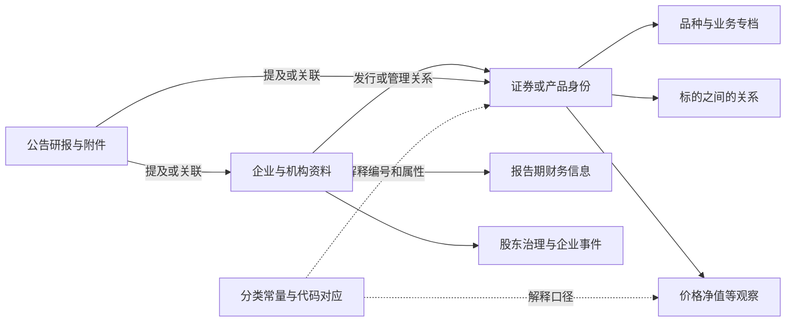

# 全貌：T02 管理哪些东西，为什么放在一起

[返回入口](README.md)

## 1. 从业务需要理解范围

一笔业务需要知道客户是谁、通过哪个账户或约定办理，还需要知道交易的东西是什么、当时价格多少、发行人经营如何。T02 主要提供后一组资料。

例如客户持有一只基金，销售关心是否上架和风险属性；交易关心份额代码与市场；托管关心登记、清盘和服务安排；研究关心净值、管理人、组合与报告。它们围绕相近的现实对象，却各自形成不同记录。

本次读取的 Wiki《新模型框架》（pageId 203509209）同时列出通用主题中的 T02／Product／产品，以及 `PDATA_NEWS_N` 中的 T02／资讯。现有本地物理目录也显示大量 T02 对象位于资讯库。两者应一起解释：**主题代码是组织约定，具体业务范围要由实际对象与实现补足。**

## 2. 先把业务范围展开

| 大范围 | 里面有哪些不同对象 | 为什么需要分开 |
|---|---|---|
| 证券与投资产品 | 证券公共身份、股票、基金份额、债券、期货期权、销售产品、托管产品 | 工具条款、销售属性和托管安排会独立变化 |
| 企业与组织资讯 | 企业档案、发行企业、股东、管理人、企业关系、治理与风险事项 | 一个企业可以发行多只证券，也可以成为另一企业的股东或基金管理人 |
| 市场与价值观察 | 日行情、净值、估值、收益率、波动率、利率汇率 | 每个值都有观察时间、单位、来源和计算口径 |
| 财务与研究资讯 | 企业财报、财务指标、预测、公告、研报及附件 | 报告期不等于公布日，文档不等于其中描述的事件 |
| 集合与参考体系 | 指数及其成分、分类标准、常量、代码对照、交易日历、宏观指标定义 | 它们组织或解释别的对象，不能都当成一只可交易证券 |

实际范围还包括历史系统遗留的表达。例如 `T02_MARG_BASE_INFO` 已读分支保存两融合约及其标的，`T02_TIT_PRD_INFO` 保存内部产品资料。阅读要承认这种落地事实，不能为了让主题定义整齐而删去这些对象。

也要区分模型体系：港股库使用产品主档与名称有效期，资管库另造债券市场编码，通用模型的股票因子分支又会引用资讯库身份。它们同属 T02 范围，却没有天然共享一套主键与时间规则。见 [跨库模型差异](业务专题/10-跨库产品模型与编码差异.md)。

## 3. 用模型表达把不同范围连起来

这是对象关系图。箭头没有声明实际任务顺序，也没有声明所有关系已有可用的物理 Join；具体来源的连接见业务页。

## 4. 四个维度不要混成一棵树

- **业务对象**：证券、基金份额、企业、公告究竟是什么。
- **模型表达**：身份、属性、双端关系、时点观察、期间事实、文档版本怎样保存。
- **来源职责**：谁提供资料，谁做编号与转码，谁决定本报表的产品集合。
- **消费问题**：今天能否卖、某日如何估值、当时能知道哪些财务信息。

“基金”是对象分类，“WD”是来源标签，“单位净值”是观察口径，“代销赎回”是消费问题。四者可以交叉，不能作为四个平级业务对象。

## 5. 与相邻主题怎样分工

| 问题 | 主要阅读方向 | T02 的贡献 |
|---|---|---|
| 谁参与业务 | T01 当事人 | 提供发行企业、管理机构等资讯坐标；接到 T01 仍需身份对照 |
| 建立了什么账户或交易约定 | T03 协议 | 提供被交易工具与内部产品资料；工具代码不能代替客户合约号 |
| 哪个部门管理 | T04 内部机构 | 产品可能保留发行部门或销售部门编号，机构含义回 T04 |
| 发生了什么办理或资金动作 | T05 事件 | 提供涉及的产品和市场背景；产品表里的金额不自动等于已发生流水 |
| 企业披露了什么经营结果 | T02 企业财务 | 企业外部财报与内部核算主题分开理解，不能仅凭“财务”二字归到 T09 |
| 指标和报表看什么范围 | 组合、指标、T98及集市 | 下游选择对象、时间、来源和聚合粒度，形成具体口径 |

## 6. 怎样算读懂一个分支

先用普通话说清对象为什么分开，再定位代表表与身份；解释其源对象、转换、连接和时间；最后回到一个真实取数问题，说明选什么、漏什么、何时会多行。

本版提供整域阅读结构和主要分支的代表实现。逐表目录保存跨库、临时、扩展和缺注释对象的检索位置；它们不自动成为新的业务实体，也不表示全部完成了加工审计。范围口径见 [证据与覆盖](证据/覆盖与证据.md)。
