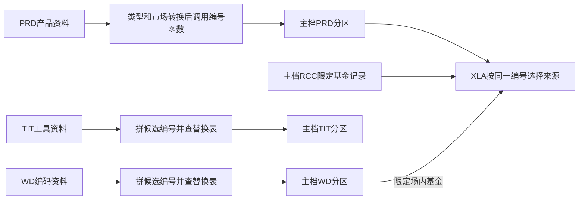

# 证券身份怎样形成，XLA 怎样汇集多源

[返回入口](../README.md) · [对象身份](../建模基础/01-对象身份与层次.md)

## 1. 先区分三次决策

源记录进入主档时，要确定候选编号；映射规则可能替换候选编号；一个消费集合还可能在同号多来源中选择某一行。这三步不能合并成“平台已经统一证券”。

图中 XLA 不含 TIT 分支。其后组合又有自己的来源范围。

## 2. PRD：先定类别和市场，再调用编号函数

61577 读取当日 `odata_n_prd.p_basicproduct`，排除空代码及代码 8088；根据 `SECUTYPE` 转换类别，用 `SECUCODE` 和从 `PRODTA_NO` 派生的市场调用 `DEFAULT.GET_RCC_SECUID`。

| 来源条件 | 本主档写法 |
|---|---|
| `SECUTYPE < 6000` 或等于 6010 | 类别 AM |
| 6000与7000之间的其他值 | OC |
| 7000与8000之间 | PF |
| 9001、9002、9999 | FD |
| `PRODTA_NO=1/2` | SSE/SZSE，其他写99 |
| 源产品代码 | `src_sys_prdno='PRD-'+SECUCODE` |

这说明市场和类别参与编号。这里只确认调用参数，未审计函数内部算法，不能从函数名推导全域唯一性。

该任务保留已有 PRD 记录的落地时间，覆盖 PRD 分区；企业编号等若干字段写空。它不会凭产品中心发行人名称自动生成企业关系。[61577，54—121行](../证据/SQL/61577-hive-task.sql)

## 3. WD 与 TIT：候选编号之后还有替换

WD 59493 整理兼容编码资料及补充记录，转换品种、币种、国别，按源企业号关联 WD 企业主档。候选 `secu_id` 由类别、序号、代码、市场拼接；序号来自分组后的 `row_number + 100000000`。

之后按 `scr_cd + scr_type + mkt_cd + src_id` 连接 `T02_SCR_CD_RPLC_INFO`，优先采用替换表的 `secu_id`，未命中则保留候选。最终还按多列分组排序取一条。[59493，276—407行](../证据/SQL/59493-hive-task.sql)

TIT 103232 从 `d_ref_instrument` 转类别和市场，保留工具内码，生成 `TIT-内码` 源编号及候选 `secu_id`，也经过替换表后写入主档。候选生成与最终身份应分开理解。[103232，93—284行](../证据/SQL/103232.sql)

本版没有核验替换表的全量生产和真实覆盖。排序加替换的静态规则，不足以证明编号永远稳定、所有来源都已映射为同一自然实体。

## 4. XLA：选择同号来源，不负责识别所有同物异号

61529 的有效取数范围与优先级为：

1. PRD 全部主档候选，优先级1。
2. RCC 中 `scr_type='FD'`，且 `src_tbl` 为指定两张柜台产品/证券源表，优先级2。
3. WD 中 `scr_type='FD'` 且市场 SSE/SZSE，优先级3。

按 `secu_id` 分组取优先级最前的一行，覆盖 XLA 分区。输出其他属性取自被选中的那一整行。[61529，56—97行](../证据/SQL/61529-hive-task.sql)

教学假设：PRD 和 WD 都给证券 S 一行，XLA 取 PRD；WD 另给编号 W 一行，即使名称也指向同一基金，排序仍把 W 作为另一个分组。这个例子揭示了“同号选优”与“跨号识别”的区别。

同优先级多行时，SQL 没有完整的额外决胜条件。本次不据此宣称输入或输出实际唯一性已经验收。

## 5. XLA 分类是在身份集合上再形成业务解释

65938 先整理产品中心类型、资产类别、募集属性，并按产品号连接 OIS 收益凭证信息。收益凭证分支包含编码模式、是否保本及产品中心收益类别等优先判断；它不是只翻译一张常量表。

第一段覆盖 XLA 分类，写 PRD01：

| 目标列 | 实际来源 | 本分支含义 |
|---|---|---|
| `secu_id` | XLA 主档 | 先限定主档集合 |
| `type_cd` | `prd_busi_type` | 从产品中心类型派生的业务类别 |
| `type_name_zh` | `prd_inv_type` | 投资类型代码；列名不能当中文值承诺 |
| `remark` | `prd_collection_type` | 募集分类代码 |

身份通过 `主档.scr_cd = 分类输入.prod_code` 内连接。另一段向同一分区追加 PRD02，来源是产品中心人工标签关系。因此 PRD01 与 PRD02 应按标准分别读取。[65938，46—161行](../证据/SQL/65938-hive-task.sql)

## 6. 组合再选一次成员与名称

`NEWS_SECU` 定义只选 WD、RCC、ICC、XLA、PO3T，排除空 `secu_id`，按该编号优先选择较长简称、再较长全称。`grp_val` 明确来自 `secu_id`，不能再写成“可能来自源产品编号”。定义中的固定起止日期也不是逐产品业务有效期。[组合定义](../资料/组合类型.json)

到这里才可以继续分析赎回报表怎样使用该组合。主档来源优先级、分类派生、组合名称选择和销售过滤是四层不同规则。
