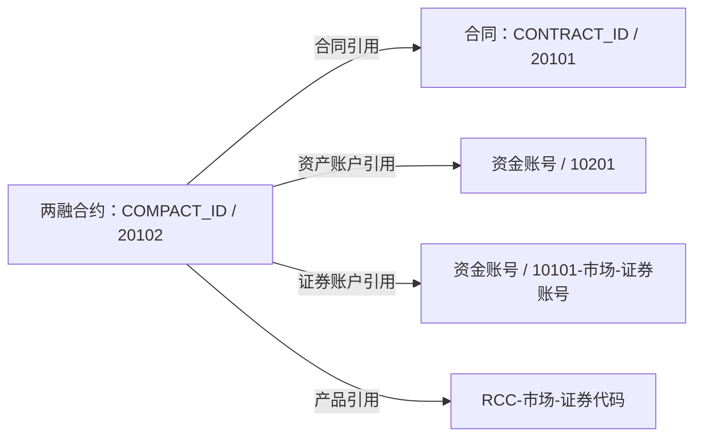
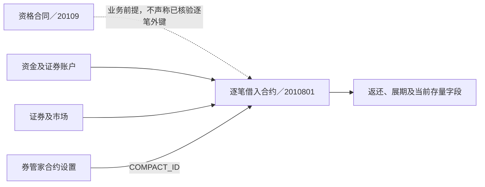

# 信用交易与回购：从业务约定到逐笔负债：模型与加工证据

业务背景与模型定位见[[00-20260911-认知实验/t03专题-协议/业务专题/信用交易与回购|信用交易与回购：从业务约定到逐笔负债]]。本篇按需核对源字段、身份构造、连接、转码及时间维护，不作为必须顺序阅读的课程。

## 两融：一份合约同时引用合同、账户和证券

### 先理解：这里的“合约”在记录什么业务

两融包括融资和融券。融资是借入资金买证券，后续需要归还资金并承担相应利息费用；融券是借入证券卖出，后续需要归还证券并承担相应费用。借入的对象不同，所以模型既需要记录金额，也需要记录证券数量。

客户办理这项业务，先有合同层面的约定，具体交易又需要记录各自的借入、成交、归还和到期情况。本节的“合同”与“合约”对应这两个层次：**合同说明业务依据，具体合约跟踪某笔业务及其存续情况。** 一份合约成交后还要继续管理，不会随着成交完成就失去记录价值。

账户在这里提供办理与核算的定位：资金侧用哪个账户，证券侧用哪个市场的证券账户，买卖的又是哪只证券。于是，一份合约需要同时引用合同、资金账户、证券账户和产品。

### 再看：这些对象怎样写进模型

`T03_MARG_COMP_INFO` 从 RCC `H_HIS_COMPACT` 取得合约信息。任务35612保留了下面五种身份：

| 对象 | 源编号与修饰符的构造 | 在合约中的作用 |
|---|---|---|
| 本笔两融合约 | `COMPACT_ID / 20102` | 定位本笔合约 |
| 所属合同 | `CONTRACT_ID / 20101` | 引用合同层安排 |
| 资产账户 | `FUND_ACCOUNT / 10201` | 定位资金侧账户 |
| 证券账户 | `FUND_ACCOUNT / 10101-市场-证券账号` | 定位证券登记侧账户；证券账号为空时修饰符留空 |
| 产品 | `RCC-市场-STOCK_CODE` | 定位涉及的证券；证券代码为空时产品编号留空 |

图中是该任务构造的引用字段。模型把“依据哪份合同、通过哪些账户、涉及什么证券”保留在同一份合约记录中；进一步连接账户专表时，使用这些账户引用字段，对应账户表的编号与修饰符。

### 一笔融资业务，为什么同时有委托、成交和存续金额

先用一个简化例子理解业务。以下数字是教学构造，只讨论融资本金，忽略利息、费用、价格变化及其他核算因素，不是表内样例，也不代表某个源字段的取值。

**第一步：下单。** 客户想融资买入1,000股，每股100元，委托对应10万元。这时表达的是“想买多少”；尚未成交的申报还可能占用资金或额度，所以系统会单独记录在途占用。

**第二步：成交。** 假设只成交800股，价格仍是100元，另200股撤单。实际买成8万元，与最初委托的10万元不同。假设这8万元全部由融资资金支付，那么此时形成8万元融资本金负债。成交信息记录这次交易的结果，负债信息开始跟踪之后还需归还多少。

**第三步：持有并归还。** 假设后来归还3万元本金，剩余本金是5万元。原来买成的8万元仍是历史成交事实；“现在还欠多少”已经变了。之后还会涉及计息、到期、展期或结清，这段尚在履行的期间就是这里说的“存续期”。

因此读一份合约时，首先分清三个问题：**申请了多少、实际成交多少、到当前还剩多少义务。** 这也是模型同时保存多组数值的业务原因。

### “期初”和“日间实时”又是什么

它们进一步区分观察时点。例如在某个核算期间开始时还欠8万元，期间归还3万元，更新后还欠5万元。系统可能同时保留起点数值和期间更新后的数值，用来观察变化。它们也不是两笔独立负债，不能加成13万元。

回到这份SQL，能确认的是下列字段标签和取源；其中“合约金额”这一列的具体结算时点，尚不能从名字确认。

| 读者的问题 | 本表对应的信息 | 已确认到什么程度 |
|---|---|---|
| 申报了多少，还有多少在途占用？ | 委托数量 `Entr_Vol`、融资买入在途金额 `Entr_Buy_Onway_Amt`、融券卖出在途数量 `Entr_Sale_Onway_Vol` | 分别接收源委托与占用字段；融资占用用金额、融券占用用数量 |
| 这笔交易成交了多少？ | 成交数量 `Mtch_Vol`、成交金额 `Mtch_Amt` | 接收 `BUSINESS_AMOUNT / BUSINESS_BALANCE` |
| 期初记录是多少？ | `Begn_Comp_Vol / Begn_Comp_Amt` | 接收 `BEGIN_COMPACT_*`，具体期初重置规则还需源口径 |
| 日间更新后的记录是多少？ | `Real_Comp_Vol / Real_Comp_Amt` | 接收 `REAL_COMPACT_*`；“实时”是源字段含义，不证明本表实时刷新 |
| 另外那组“合约数量、金额”是什么？ | `Comp_Vol / Comp_Amt` | 接收 `COMPACT_*`；本段SQL未说明它与日间值的时点差异 |
| 归还了多少？ | 实时归还本金 `Real_Retu_Prin`、归还成本金额 `Retu_Prin` | 接收两组源归还字段；发生额或累计值的口径仍需确认 |

**业务例子说明为什么要分开记录；它不能直接替表里的字段定口径。** 当前还不能把例子中的“剩余5万元”指定给 `Comp_Amt`，也不能编出“期初＋成交－归还”的字段计算公式。这段加工搬运的是源系统结果，未展示这些金额在源端如何计算。

这张表还保留年利率、罚息利率、计息开始日、展期状态与次数、归还截止日、延期归还日和归还日期。把它们连起来看，才能看见一笔负债从交易形成、持续计息到归还的过程。
证据：[[00-20260911-认知实验/t03专题-协议/证据/SQL/35612.json|35612]]，94–145行。合同与逐笔合约的业务层次继续看[[00-20260911-认知实验/t03专题-协议/实现详解/服务与经营合同|合同与现金流]]。

## 股票质押与债券协议回购：初始、回购、存量分开

两融的 COMPACT_ID/20102、资金和证券侧身份已在本篇两融部分解释。股票质押式回购 35751 使用 CONTRACT_ID/20104，并保留 JOIN_CONTRACT_ID 作为关联合约，连接资金账户、市场证券账户和标的。源当前表 `A_SRPCONTRACT` 与历史表 `H_HIS_SRPCONTRACT` 均参与当日来源集合。

它同时保存委托金额、约定购回、实际购回、已还金额、违约金、待还违约金、红股与累计部分解押份额。这些列描绘同一合约的不同阶段和组成，并不能统称为“本金”。有实际购回日期，也不能不看合约状态和数量就判断整份合约已经结束。

37086 的债券质押协议回购则用 POSITION_STR/20105 标识，而非直接套 CONTRACT_ID；关联合约修饰符在该分支填空。源当前与历史债券合约 UNION ALL，后续以模型快照比较形成新增、变化、未变、删除分支。UNION ALL 本身不证明两个源集合无重叠，源日期、身份及历史比较条件都影响输出。[[00-20260911-认知实验/t03专题-协议/证据/全域分支补充/SQL/35751.json|35751]]、[[00-20260911-认知实验/t03专题-协议/证据/全域分支补充/SQL/37086.json|37086]]。

因此查回购余额要先选合约总体，再确定当前未偿或购回口径；不能在连接质押标的、分成附加、违约信息后，重复汇总合约主表金额。其他附加表扩大信息维度，不自动改变原合约的唯一计量范围。

## 转融通：先有资格合同，再有具体合约

44974 来源注释明确称 `R_REFCONTRACT` 为转融通资格合同，修饰符为 20109。模型保存账户、资格状态、书面合同、出借标志、费率类别及特定板块出借有效信息。它回答是否存在某项签约安排，不是逐笔借入或出借数量。

此任务合并零售柜台 RCC 和机构柜台 ICC 的当前、历史来源，机构部分还通过 NOT EXISTS 排除 CONTRACT_ID 与 FUND_ACCOUNT 均与零售来源相符的候选。因此不能从目标 Data_Src_Cd 为 RCC 就推断每一行只来自零售源；Real_Src_Tbl 的保留有实际意义。该规则需按源码中的比较条件理解，不是所有机构客户天然归到零售。

45187 的具体借入合约则以 COMPACT_ID/2010801 表达，保留证金合约号、原证金合约号、对方证金合约号、券商、账户、证券、期限、约定号、返还及展期数量金额。它从当前/历史借入记录合并，并连接 SMS（券管家）的 `Q_DC_REF_COMPACT_SETTING` 补充合约设置。

资格合同号、逐笔合约号、证金合约号和约定号各有用途，不能为了连通两张表就任取同名编号。具体借入任务以来源和前一交易日快照做历史比较；完整的借入/出借其他分支仍需分别核验。[[00-20260911-认知实验/t03专题-协议/证据/全域分支补充/SQL/44974.json|44974]]、[[00-20260911-认知实验/t03专题-协议/证据/全域分支补充/SQL/45187.json|45187]]。
