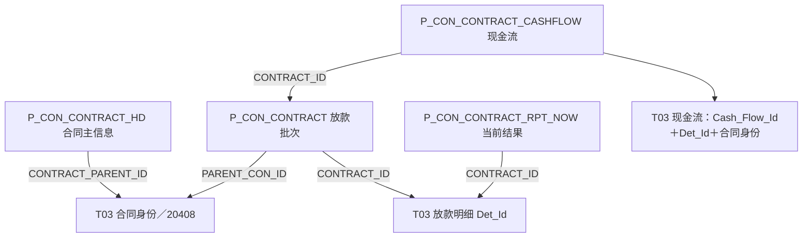

# 服务与经营合同：约定、履行明细与现金流：模型与加工证据

业务背景与模型定位见[[00-20260911-认知实验/t03专题-协议/业务专题/服务与经营合同|服务与经营合同：约定、履行明细与现金流]]。本篇按需核对源字段、身份构造、连接、转码及时间维护，不作为必须顺序阅读的课程。

## 投顾服务：签约、计费、扣费和收入消费是一条分层链

49074 从 CRM（金管家综合服务系统）`C_TTZGW_QYXY` 生成投顾签约协议，身份为 ID/CRM029-20405。它区分签约、生效、解约日期，保存签约和解约资产、收费模式，并分别连接人员表将投顾、客户经理转换为人员编号，未匹配则保留源值。

93014 从固定服务费计算记录 `C_TTZGW_GDFWFJSJL` 进入费用计算周期表，使用 QYXY_ID/CRM029-20405 连接签约协议，保留首次、下次计算日期，以及收费金额和买入金额。主协议说明服务约定，计算记录说明某次计费区间；两者不能合并为一行“客户收入”。

消费 153477 展示了复杂性真正进入业务结果的一步：选择 Buy_Amt>0 的计算记录，连接 T05 投顾收费事件中指定收费状态/类型的记录，再与交易日期集合展开，按首次计算日到下次计算日前的区间及月度条件筛选。其后按协议、客户、机构和业务日聚合，再连接签约协议补充投顾等属性。

这不是“签约金额直接变成收入”。日期展开会产生多日结果，收费事件提供另一类事实，签约表提供服务身份。不能把计算金额和实际扣费同时相加，也不能拿协议行数代表收费次数。具体日度金额表达式仍应按该消费任务核对，不从这些连接推导统一摊销公式。[[00-20260911-认知实验/t03专题-协议/证据/全域分支补充/SQL/49074.json|49074]]、[[00-20260911-认知实验/t03专题-协议/证据/全域分支补充/SQL/93014.json|93014]]、[[00-20260911-认知实验/t03专题-协议/证据/全域分支补充/SQL/153477.json|153477]]。

## 托管合同：主信息可能因相对方连接增加粒度

139056 从 GCM（广发合同管理系统）`H_V_TG_SUB_CONTRACT` 生成托管合同信息，ID/2041201 为模型身份，母合同编号和子合同编号另存。它保留管理人、产品及托管产品编码，签订标志和日期、归档状态，同时将标准状态和源状态并列保存。

任务还以 `A.ID=T.SUB_CONTRACT_ID` 连接 `H_V_TG_SUB_CONTRACT_OPPOSITE`，补相对方名称、性质、证件及代表产品。这里“相对方代表产品”与合同中托管产品是不同字段角色，不能按名称相近自动合并。

一份子合同若对应多个相对方，JOIN 可以输出多行同一协议身份。当前缺少实际唯一性证据，不能宣称必然重复；但查询合同数量时应先确认目标究竟按合同还是合同—相对方统计。签订与归档也是两种状态，不由一个“有效”码值包办。该 SQL 日期绑定 2026-05-19。[[00-20260911-认知实验/t03专题-协议/证据/全域分支补充/SQL/139056.json|139056]]。

## 融资租赁：合同、批次、现金流三个粒度已明确连接

GLM（广发租赁业务管理系统）有一套不同于交易系统的合同结构。以下模型名由已存 SQL 的 CREATE/INSERT 核对；一行含义是业务解释，不声明已验证唯一键。

| 中文对象与模型表 | 一行描述什么 | 源对象与连接 |
|---|---|---|
| 租赁合同附加 T03_FIN_LEAS_COMP_ADTNL_INFO | 父合同身份及其业务日属性 | P_CON_CONTRACT_HD，CONTRACT_PARENT_ID/20408 |
| 租赁放款明细 T03_FIN_LEAS_COMP_LOAN_DET | 合同下一个放款批次及当前结果 | P_CON_CONTRACT；按CONTRACT_ID接P_CON_CONTRACT_RPT_NOW，PARENT_CON_ID回父合同 |
| 放款现金流 T03_FIN_LEAS_COMP_LOAN_DET_CASH_FLOW | 批次下一个现金流明细及日期金额 | P_CON_CONTRACT_CASHFLOW；CONTRACT_ID接放款批次，再取得父合同 |

这些任务默认库为 pdata_n；父合同号、批次号、现金流号逐层增加维度，不能用一份合同身份替代全部明细身份。

163681 的合同主信息采用 CONTRACT_PARENT_ID/20408，而 CONTRACT_HD_ID 另存合同管理编号；不能因为主表名带 HD 就直接用 HD_ID 代替协议编号。它还连接 GLM 用户与 IOA（企业门户2.0）的在职/历史员工资料确定负责人，并分别转换合同状态、文本审核和面签流程状态。

163682 的放款明细用 CONTRACT_ID 作为 Det_Id，用 PARENT_CON_ID 关联主合同。源合同提供融资额、租金总额、利率、期数和费用，`P_CON_CONTRACT_RPT_NOW` 提供本金余额、保证金余额、已收、逾期等结果。**“合同条款”和“当前表现”已经在这张明细表里合并，但来源职责仍然不同。** 多个标志对未识别值默认 0，应避免把默认值当作来源明确否定。

164368 的现金流用 GLM025 加 CASHFLOW_ID 为身份，经 CONTRACT_ID 连接放款记录取得父合同；每条还保留现金流类型/子类型、方向、期数、支付日期、应收、税额、已收、剩余、核销和开票等字段。应收与已收，含税与不含税，核销与开票各回答不同问题，不能只保留一个金额。

时间上，合同主信息和现金流有来源＋业务日分区，放款明细分支则按来源覆盖。要把历史合同、当日现金流与放款当前结果拼在一起，必须明确选取的日期，而不能只靠父合同号连通。

下游 170431 以放款明细为依据，限定 GLM 来源及 NORMAL 数据分类，按项目汇总融资额与本金余额，并取租赁开始最早日和到期最晚日；金额分别换算成亿和万。它是**项目视角**的再次聚合，不能把两个不同单位的输出直接比较。这也解释为何不能先将放款记录展开到每期现金流，再重复累加融资额。[[00-20260911-认知实验/t03专题-协议/证据/全域分支补充/SQL/163681.json|163681]]、[[00-20260911-认知实验/t03专题-协议/证据/全域分支补充/SQL/163682.json|163682]]、[[00-20260911-认知实验/t03专题-协议/证据/全域分支补充/SQL/164368.json|164368]]、[[00-20260911-认知实验/t03专题-协议/证据/全域分支补充/SQL/170431.json|170431]]。

## 借款、采购、劳工：不能用“其他合同”一笔带过

**融资借款提款 T03_FIN_LOAN_COMP_WTHDR_DET** 从 GLM 的 P_TRE_LOAN_CONTRACT_WITHDRAW 取一条提款明细，使用 WITHDRAW_ID 为明细号、LOAN_CONTRACT_ID/20416 为合同身份，保留提款金额、日期、利率、本金与利息余额，审批状态通过独立配置转码。一个合同可以对应不同提款明细；合同约定与实际提款应分层解释。本分支按来源覆盖，SQL 日期绑定 2026-05-19。[[00-20260911-认知实验/t03专题-协议/证据/全域分支补充/SQL/164895.json|164895]]。

**采购付款 T03_PURCH_CONTR_PYMT_DET** 从 FSC 的 L_CONTRACT_PAYMENT_DATA_V 取合同履约付款明细。这是一个很明确的局部入模案例：Agt_Id、修饰符、类别和类型全部填空，只保留源合同代码、履约计划号、单据号、付款时间和金额。因此模型虽然有协议字段，这个来源仍不能沿通用协议身份查询；应先沿源合同、计划和单据追溯。FSC 的中文系统全称未在本地 CD100 命中，此处仅称采购付款来源，不编造全称。[[00-20260911-认知实验/t03专题-协议/证据/全域分支补充/SQL/100669.json|100669]]。

**劳工合同 T03_LABOR_CONTR_INFO** 的已读分支描述一份人员合同及处理状态，从 PAS 的合同管理信息 `J_HSSEMP_CONTRACT` 取 ID/20401，保留合同开始结束日期、签订行为、变更类型和处理状态；使用的是 `REF_CD_CVT_MAP_TEMP`，不能与正式转换表混称。合同状态 Comp_Stat_Cd 在这一分支为空，源 STATUS 则转入处理状态 Hand_Stat_Cd，且源 STATUS=9 被排除。因此不能用处理状态直接代替合同是否存续。人员合同与具体员工的完整连接还需关系证据，本条投影并未给出。PAS 的中文系统全称本地也未命中。[[00-20260911-认知实验/t03专题-协议/证据/全域分支补充/SQL/222592.json|222592]]。

以上借款和采购 SQL 的默认库未确认，表名来自 CREATE/INSERT，不据此宣称唯一物理 schema 已绑定；劳工分支默认库为 pdata_n。任务号及原行证据保留在各段链接。

## 公司存款：协议约定与每日明细不能互换

`T03_FND_SAV_AGT` 描述资金存款协议，字段含合同号、源业务类型、币种、合同金额、起止日期、计息和付息条件。本次取得 92089 的静态文本，但临时 SQL 片段存在多条语句压在同一行、夹杂行注释的情况，未据此确认全部加工语义；保留为待复核案例，不能假装已读通。

186395 的每日存款明细更清楚：ALM（自有资金管理系统）来源 `G_DEPOSIT_INFO_HIS` 将 ACCOUNT 与 `2041701-NO` 组成存款协议身份，DEPOSIT_ID 为明细号，分别保留存款余额、年化利率、固收部本金、报价回购本金及收益调整金额。目标仅按来源分区，业务日取 START_DATE 的日期部分，读取当日来源且 START_DATE 不晚于处理日。

所以这张“每日明细”不等于默认只写加载日一行；要先看来源历史内容和目标业务日期。它与前述资金存款协议的身份类别也不同，没有证据时不能直接按账号合并。ALM 中文名称及快照状态见[[00-20260911-认知实验/t03专题-协议/证据/全域分支补充/来源系统名称.json|来源名称附录]]。[[00-20260911-认知实验/t03专题-协议/证据/全域分支补充/SQL/186395.json|186395]]。

## 统一模型表达了什么，又保留了什么差异

统一的是协议身份、参与者/账户/产品关系和状态日期等表达入口；保留的是各业务的对象层级、编号体系、多个状态、不同金额与历史方式。采购分支甚至展示出身份尚未填齐，不能用通用设计反过来宣称实现已经完整。

本篇给出了这些主要分支的对象—来源—加工—使用推导，仍没有覆盖每种合约附加表的全部字段。哪些已读、哪些仅元数据、哪些文本有缺口，集中列在 [[00-20260911-认知实验/t03专题-协议/证据/全域分支补充/覆盖与证据|覆盖与证据]]，避免将代表案例冒充全域验收。
