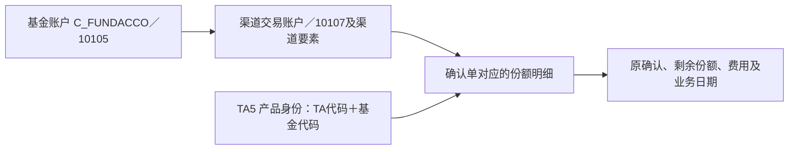

# 基金登记、渠道与份额：买了什么，通过哪里办理，登记在哪：模型与加工证据

业务背景与模型定位见[[00-20260911-认知实验/t03专题-协议/业务专题/账户/基金登记渠道与份额|基金登记、渠道与份额：买了什么，通过哪里办理，登记在哪]]。本篇按需核对源字段、身份构造、连接、转码及时间维护，不作为必须顺序阅读的课程。

## 资管基金账户与基金交易账户：渠道是身份的一部分

40421 从 STA（资产管理分TA系统）的 `S_TACCOINFO` 进入 `T03_AMS_FND_ACCT`：基金账号 C_FUNDACCO 为 Agt_Id，修饰符 10105；持有人由 STA001 加 C_CUSTNO 构造。它还保存销售商、操作网点、冻结原因和状态，状态通过专属配置转码，未命中回退源值。

40125 从同系统 `S_TACCONET` 进入基金交易账户，实际身份为：

```text
Agt_Id = C_FUNDACCO
Agt_Modifr = 10107-销售商-网点-NVL(交易账号,备用交易账号)
关联基金账户 = C_FUNDACCO / 10105
```

因此同一基金账号在多个渠道办理业务，可以对应不同交易账户身份。表里单独的 Trd_Acct 却直接取 C_TRADEACCO，没有同样的备用值回退；出现“修饰符含有账号，交易账号列为空”时，要检查备用账号路径，不能立即认为身份拼错。

两条分支的持有人表达还存在不对称：基金账户取 C_CUSTNO，交易账户使用 STA001 加 C_FUNDACCO。不能因为都叫 Agt_Holder，就假定两列必然相等或已完成统一客户识别。若要归到客户，应再核对 T01 的该来源身份规则，而不是替 SQL 自动改写。

这两条任务均与前一交易日模型快照比较，并把未变、变更、新增、删除分支组织成业务日快照。它与起止日期拉链不是同一种时间模型；查询账户当前有效性需要检查删除标志和所选日期。[[00-20260911-认知实验/t03专题-协议/证据/全域分支补充/SQL/40421.json|40421]]、[[00-20260911-认知实验/t03专题-协议/证据/全域分支补充/SQL/40125.json|40125]]。

## 份额明细：基金账户下还有“哪一笔份额”

41163 从 TA5（资产管理TA5）的 `D_TA_TSHAREDETAIL` 进入 `T03_AMS_TA_SHR_DET`。它保留确认单 C_CSERIALNO、基金账号、交易渠道身份、产品、原确认日期及本笔剩余份额。不是简单的“每客户每产品一行余额”。



这条 TA5 交易账户修饰符还包含 C_TACODE，不能照搬上一节 STA 的拼接格式。源代码 A/B/AB/C 分别映射前收费、后收费、前后收费、C 类持仓；这些是份额收费类别，不是基金的股票/债券投资分类。其他源码未被 CASE 覆盖时，不能自动当作 A 类。

原确认金额、原确认份额、本笔剩余份额、新增收益和费用各有列。累计申购量与当期存量之间还发生赎回、转换等变化，所以不能用原确认份额代替剩余持有份额。

本任务读取 D 日来源，目标 Busi_Date 使用 `default.pretradedate(D,-1)`；代码注释明确要求将本次实例数据放入下一交易日分区。确认日期、源快照日和目标业务日是三个概念。只按日期字符串等值连接其他模型，可能错过实际对应快照。[[00-20260911-认知实验/t03专题-协议/证据/全域分支补充/SQL/41163.json|41163]]，97–187 行。

下游 236447 的托管 TA 明细查询，读取本表后连接 TA 产品清单，再取 T01 客户和证件资料，形成特定托管产品范围内的展示。它不是整个 TA 份额集合的原样输出。所读文本绑定 2026-06-04；不能称为当前查询结果，也不能将其客户连接规则当作所有 TA 来源的统一规则。[[00-20260911-认知实验/t03专题-协议/证据/全域分支补充/SQL/236447.json|236447]]。
