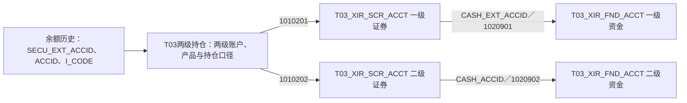

# 自营与托管账户：外部登记、内部管理与持仓怎样对应：模型与加工证据

业务背景与模型定位见[[00-20260911-认知实验/t03专题-协议/业务专题/账户/自营与托管账户|自营与托管账户：外部登记、内部管理与持仓怎样对应]]。本篇按需核对源字段、身份构造、连接、转码及时间维护，不作为必须顺序阅读的课程。

## 自营与托管：从独立结构返回源头加工

本节按现有逐表候选定向补读，区分已读通的源加工、仍只有字段结构的部分和未确认物理库。不是全域重扫，也不将同一模型的所有来源当作相同实现。元数据见[[00-20260911-认知实验/t03专题-协议/资料/物理对象与字段.json|物理对象与字段]]，范围见[[00-20260911-认知实验/t03专题-协议/证据/全域分支补充/独立结构补读索引.json|独立结构补读索引]]。

### 自营账户：一级/二级与资金/证券是两个维度

XIR（衡泰交易管理系统）的四类源对象分别进入两张模型。下表是实际源字段与修饰符，ACCID不可脱离类型使用：

| 源业务对象 | 核心模型及身份 | 资金—证券连接与分工 |
|---|---|---|
| 一级资金 T_TTRD_ACC_CASH_EXT | T03_XIR_FND_ACCT：ACCID/1020901 | 交易所账号EXHACC、托管银行、资金类型和多市场范围 |
| 二级资金 T_TTRD_ACC_CASH | T03_XIR_FND_ACCT：ACCID/1020902 | 所属部门PC1、内部控制PC3；交易所账号/市场等在本分支为空 |
| 一级证券 T_TTRD_ACC_SECU_EXT | T03_XIR_SCR_ACCT：ACCID/1010201 | CASH_EXT_ACCID/1020901指向一级资金；保存交易所账号、席位、执行模式及托管场所 |
| 二级证券 T_TTRD_ACC_SECU | T03_XIR_SCR_ACCT：ACCID/1010202 | CASH_ACCID/1020902指向二级资金；保存交易目的、锁定、财务科目及所属群组 |

一级证券连一级资金、二级证券连二级资金，有直接源字段和类型证据；但四条生产投影**没有单独完成一级证券与二级证券之间的成员关系**，不能把两级ACCID相等当作父子关系。

一级资金的MARKETS是逗号列表：先split/explode，trim后逐码连接REF_CD_CVT_MAP，未命中保留源码，再按ACCID用collect_set去重、concat_ws合回字符串。这是市场集合，不是单市场标量，输出次序也不代表业务优先级。账户STATUS另走专属转换；其他账户也按目标表/字段和各自来源条件转状态，一级证券还转换市场。

四条任务均读取处理日源快照、写来源＋业务日分区。一级/二级字段有分工，不能把二级外部账号为空直接视为漏采。另有两处原SQL疑点：二级资金PC3同时写跨头寸审批与清算标志；二级证券Agt_Cate_Cd写102，一级证券写101。这里只记录实际值，不用业务直觉纠正，也不推广成正式代码规则。[[00-20260911-认知实验/t03专题-协议/证据/全域分支补充/SQL/64182.json|一级资金64182]]、[[00-20260911-认知实验/t03专题-协议/证据/全域分支补充/SQL/64181.json|二级资金64181]]、[[00-20260911-认知实验/t03专题-协议/证据/全域分支补充/SQL/64361.json|一级证券64361]]、[[00-20260911-认知实验/t03专题-协议/证据/全域分支补充/SQL/64035.json|二级证券64035]]。

### 两级持仓：记录携带层级，模型并未再次汇总

T03_XIR_LVL2_SCR_HOLD_ADTNL从T_TTRD_ACC_BALANCE_SECU_HIS（二级证券账户余额历史）读取。SECU_EXT_ACCID/1010201为一级证券身份，ACCID/1010202为二级证券身份；I_CODE为产品，A_TYPE为持仓类型，VIRTUAL_ACCID为虚拟ID，LS的L/S转LONG/SHOR。市场M_TYPE走配置转码、未命中回退。无需再Join账户表才能把两级身份写入。

图表示字段可对照的身份路径，不声明唯一性或同日数据已经验证。PS_L_AMOUNT/PS_S_AMOUNT分别写多头/空头余额，应收、应付、可卖、冻结、保证金占用、逐日/非逐日成本与实际损益各自直取。投影没有重新计算净持仓，也没有统一换算金额与数量；不能相加求总资产，或再与同粒度业务余额相加。[[00-20260911-认知实验/t03专题-协议/证据/全域分支补充/SQL/64277.json|64277]]，72–138行。

时间尤其不同：任务按**源BUSI_DATE近一个月**读取，却以BEG_DATE写目标Busi_Date，并保留END_DATE；SQL只有下界，没有处理日上界。加载日、源快照日、余额起始日不能混用。动态覆盖涉及哪些目标分区要看BEG_DATE集合，不能称为只覆盖D日。PS_L_COST_T1_REAL写入目标“逐日期初空头成本”也是源名与目标注释不一致的疑点，不能只按中文列名解释。

T03_XIR_LVL2_SCR_HOLD_BUSI读取T_TTRD_ACC_BALANCE_SECU_BIZ_HIS，除两级账户和产品，还把H_I_CODE/H_A_TYPE/H_M_TYPE写成父产品、父持仓类型、父市场。它保留业务归属维度，并非上一张表换个名字。市场和父市场两次Join复用附加表的转换配置：目标T03_XIR_LVL2_SCR_HOLD_ADTNL、来源TTRD_ACC_BALANCE_SECU_HIS、源字段M_TYPE。查映射必须跟随真实条件，不能按BUSI表名猜另一套配置。

业务余额任务按**BEG_DATE近一个月**筛选，目标也取BEG_DATE；与前一任务按源BUSI_DATE筛选不同。案例日期固定2026-05-21，默认库为空，只确认SQL逻辑表名，未确认唯一物理schema。[[00-20260911-认知实验/t03专题-协议/证据/全域分支补充/SQL/88790.json|88790]]。

### 下游把四个账户组成消费身份

消费者146124将T03_AGT_RELA_H的B21关系两端用作内部/外部证券账户，再连接两张账户模型取得内部/外部资金账户，形成四项map：secu_accid、secu_ext_accid、cash_accid、cash_ext_accid。按四项组合分组，排除real_account_info中已存在组合，再生成UUID追加；任一原始ACCID都不是最终四账户组合身份。

它说明层级如何被消费，但目标在**dm_fii_test测试schema**，账户日期固定2024-07-26，B21关系子查询未限定有效期。不能当作当前生产消费或关系唯一有效的证明。四个键使用普通等值比较，空值是否导致防重失效需另验；B21关系生产本轮未继续追溯。[[00-20260911-认知实验/t03专题-协议/证据/全域分支补充/SQL/146124.json|146124]]。

另一候选119831里的PDATA_N业务余额引用实际在注释内，活动读取是SPDATA_N同类持仓。没有把它登记成上述PDATA_N模型已确认下游，也没有跨物理库补边。[[00-20260911-认知实验/t03专题-协议/证据/全域分支补充/SQL/119831.json|排除证据]]。

### 托管股东层级与周期划款是两种结构

**T03_CVS_MKTHOLD_ACCT**从CVS（托管系统5.0）的A_T_FL_SEC_ACC读取：FID为协议ID，修饰符是10112加源FMARKET_CODE；股东卡FCODE另存，父节点FPARENT_ID与层级FLEVEL保留，FPRODUCT_ID直写产品。市场列转标准码，修饰符却保留源码，不能拿转码后的市场重拼身份。

任务没有递归查父节点、补父账户修饰符或Join统一产品身份，不能宣称已经形成完整账户树。FLEAF、账户类别、启停日期、审核、FDELETED逻辑删除和FSECSTATUS销户分别保留；销户值经转换，不等同逻辑删除。源和目标日期均绑定2026-05-21，目标按来源＋日期分区。默认库为空，物理库仍待确认。[[00-20260911-认知实验/t03专题-协议/证据/全域分支补充/SQL/73056.json|73056]]。

**T03_CSTD_PRD_ACCT_PDC_TRAN_DET**从CIS（托管指令系统）的P_TINS_DQHKSZ定期划款设置出发，以C_BFZH=C_ZH连接P_TINS_ZHXX账户信息，取L_ZHID/10221作为托管银行账户身份；付款方账号仍单列。再以C_CPID=PRD_CODE连接CAP（托管辅助平台）的S_BIZ_PRO_PRD_BASE_INFO，只取当日DELETED=0产品，内部产品码最终却拼为MOT-前缀。旧MOT表Join已注释，前缀不代表当前物理来源。

频率C_ZFPL转码；划款起止月日、自动流水、自动出金、扣费和复核字段直取，L_ID保留源设置身份。账户和产品都是LEFT JOIN，未匹配不会自动排除设置，实际空值需样例核验。来源取当日，目标仅按来源覆盖，表达当前设置集合，**不是每次支付日期下的一笔转账事实**。同一银行账户可以有多条设置，不能只按账户去重。[[00-20260911-认知实验/t03专题-协议/证据/全域分支补充/SQL/105820.json|105820]]。

托管对账T03_SCR_ACCT_CSTD_CHK_INFO仍是另一对象：一码通、证券账户、交易单元和清算编号用于对照托管信息。现有索引仅给出未限定库候选64053，源文本指向CSS的E_SRC_DBF_HSTGDZ，但关键临时SQL多语句与行注释挤在同一行，本轮未恢复确认可执行语义。故对账生产/历史维护仍缺，不能用账户或划款案例替代。[[00-20260911-认知实验/t03专题-协议/证据/全域分支补充/SQL/64053.json|64053]]。

### 股票期权与黄金延期：分别说明最小计量案例

**T03_SB_SO_HOLD_ADTNL**已读深圳分支取自ZSO的H_T_CSDC_RAW_SQ_HYCC_HISTORY历史衍生品合约持仓。证券账号ZQZH/10109-2定位账户，HYBM既写产品又写合约编码；CCFX=L/S分别生成LONG/SHOR与OPT_HOLD/OPT_OBLI，其他值写空；市场固定SZSE。备兑BDBZ、合约账户ZHBS、结算账号、交易单元另存，不能只按证券账户—产品确定一行。

CCSL同时写Curr_Vol和Opt_Comp_Hold_Vol；BYSL同时写备用数量和参与组合的合约持仓数量。这是同一源值的多处投影，不是四份可相加的持仓；WCBZJ为维持保证金。任务无其他业务表Join，读取并覆盖处理日来源分区。简短SQL仍包含身份、方向/持仓性质和计量语义，不是无业务规则的复制。[[00-20260911-认知实验/t03专题-协议/证据/全域分支补充/SQL/64360.json|64360]]。

**T03_SB_GOLD_DELAY_COMP_HOLD_INFO**从GTS的G_HIS_M_DEFER_POSI_DETAIL历史会员清算延期持仓明细取ACCT_NO/10236和GTS005-ACCT_NO主体身份；保留MATCH_NO成交号、ORDER_NO报单号、PROD_CODE合约及STOR_DATE/TIME开仓时间。LONG_SHORT经独立配置转多空，未命中保留源值。

STOR_AMT仓位、COV_AMT平仓、DELI_AMT交收、LAST_REMAIN/REMAIN上日/当日剩余、两类冻结量分别直取；VARIATION_MARGIN保证金变动、MARK_SURPLUS盯市盈余、交易所与会员保证金各自保存。SQL未给出这些量可复算的统一平衡公式，不能据名字补算。源同时要求BUSI_DATE=处理日、EXCH_DATE=处理日整数格式，Hold_Date取EXCH_DATE；比XIR滚动历史的日期范围更窄。[[00-20260911-认知实验/t03专题-协议/证据/全域分支补充/SQL/221388.json|221388]]。

ZSO/GTS正式中文系统全称本地CD100未命中，此处保留代码与SQL中文源表说明，不猜系统名。两例只解释对应来源，不代替全部市场/渠道。

### 此轮闭合到了哪里

自营四类账户、两级持仓、托管股东层级与周期划款、深圳股票期权及黄金延期，已从元数据推进到源投影、连接、计量和时间；测试schema账户消费者另作示例。仍缺可靠的对账生产文本、B21关系生产、父产品业务定义、实际源键唯一性及当前生产消费，未用图或同名表猜测补齐。T03_SB_STKHOLD_ACCT_INFO的指定席位、使用基金、信用与普通/专户等独立登记属性仍由元数据说明，未冒充完成其全部来源。剩余状态见[[00-20260911-认知实验/t03专题-协议/证据/全域分支补充/覆盖与证据|覆盖台账]]。
