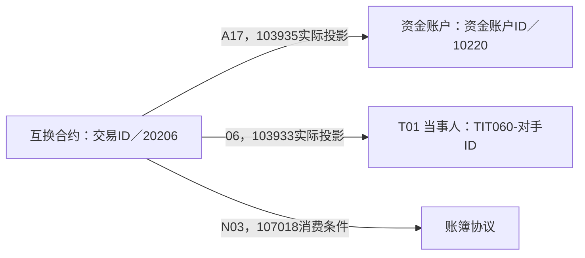

# 关系模型：把身份、角色、方向与有效期一起读

本篇是按需查阅的建模基础：当你已经知道业务对象，想确认关系角色、两端编号及方向时使用。它帮助把业务关系落到模型中，不承担全部业务背景的讲解。场外主线从[[00-20260911-认知实验/t03专题-协议/衍生品重点/README|衍生品业务]]进入。

## 1. 从一个合约出发，有四类不同的“关联”

合约关联交易对手，是协议与当事人的参与关系；合约关联资金账户或账簿，是协议之间的关系；合约关联标的，是与产品的关联；合约关联客户经理、归属部门或分成人，是人员组织与业务归属关系。这几种关系都可以回答“和谁有关”，却不能互换。

T01 的核心对象是当事人。T03 通过关系说明该当事人在这份协议中承担何种角色。因此同一当事人在一个协议中是交易对手、在另一个协议中是销售商，不必拆成两个真实主体；但源系统主体编号是否已经统一，仍要检查 T01 的映射规则。

| 关系载体 | 两端是什么 | 必须保留的限定 |
|---|---|---|
| T03_AGT_PTY_RELA_H | 协议 → 当事人 | 协议修饰符、主体关系类型、有效期、来源 |
| T03_AGT_RELA_H | 协议 → 关联协议 | 两端编号及修饰符、协议关系类型、有效期 |
| T03_AGT_PRD_RELA_H | 协议 → 产品 | 产品身份、关系类型与时间；本稿未逐来源确认 |
| 协议员工／机构／用户关系 | 协议 → 员工、组织或账号 | 角色类型、编号体系、时间 |
| 协议组与层级关系 | 协议与组、组与组 | 组身份、层级和关系类型，不能默认是客户分组 |

通用关系表的价值是把多种参与方式变成可筛选的关系事实。其代价是：查询不能只拿两列编号；省略类型，就等于将不同含义的边叠在一起。

## 2. 交易对手关系：角色代码比字段名更关键

任务 103933 将 TIT `D_REF_TRS` 的交易标识作为协议编号，修饰符设为 `20206`，关系类型设为 `06`，当事人编号由 `TIT060-` 与 `KEY_CTPTY_ID` 拼接。代码域 CD050 对 `06` 的解释为“协议交易对手”。因此本分支可以解释为“该互换合约的交易对手”，而不只是模糊的“相关客户”。

CD050 还区分协议持有人、本方销售商、对手方销售商、持有人对应客户编号、出借方、承租人、贷款机构和保证人。举例来说，协议持有人和保证人可能是不同主体；把全部主体关系都算成合约客户，会重复计数或将担保方当成交易对手。

专用互换表也直接保存 `Cutp_Pty_Id`。103941 的该字段同样按 TIT060 前缀构造。但 112119 的交易确认书分支直接使用 `COUNTERPARTY_ID`，没有复用同样的拼接语句。两条来源分支中的前缀规则不同，不能一律给所有记录追加 `TIT060-`；已带标准身份的值可能被二次改写。是否已经统一成同一主体，必须再核对来源和 T01 实际映射。

证据：[[00-20260911-认知实验/t03专题-协议/证据/SQL/103933.json|103933]]、[[00-20260911-认知实验/t03专题-协议/证据/SQL/103941.json|103941]] 154–163 行、[[00-20260911-认知实验/t03专题-协议/证据/SQL/112119.json|112119]] 154–162 行；[[00-20260911-认知实验/t03专题-协议/字典/核心代码域与码值.json|CD050]]。

## 3. 字典中文不是关系箭头

CD051 的 A17 叫“资产账户与场外互换合约”。如果照这个中文顺序画图，很容易误以为 `Agt_Id` 必定是资产账户，`Rela_Agt_Id` 必定是互换合约。任务 103935 的实际投影恰好是：

```sql
KEY_OTC_TRADE_ID AS Agt_Id1,
'20206' AS Agt_Modifr1,
'A17' AS Agt_Rela_Type_Cd1,
KEY_CAPITAL_ACCT_ID AS Rela_Agt_Id1,
'10220' AS Rela_Agt_Modifr1
```

所以该分支左端是互换合约，右端是资金账户。关系名称描述两类对象，方向由两端字段的实际赋值确定。这是使用字典时必须保留 SQL 的原因。



三条边的证据来源不同：前两条有生产 SQL 投影，第三条是下游明确选择的协议关系，不在本稿中冒充已经核验其生产任务。103935 文件后部还有 N01 文本，但处于注释分支，因此不纳入有效生产边。见 [[00-20260911-认知实验/t03专题-协议/证据/SQL/103935.json|103935]]、[[00-20260911-认知实验/t03专题-协议/证据/SQL/107018.json|107018]]。

### 同一任务还能生成另一类关系，关系类型必须进入比较键

103935 的活动 SQL 不只有 A17。后面的 Group81 将 `ARBITRAGE_CONTRACT_ID` 作为关联协议编号，两端修饰符都为 20206，关系类型为 N08；CD051 的本地词义是“场外互换合约与场外互换合约”（记录日期2023-08-23）。从源字段可以看到套利关联合约的指向，但字典没有进一步描述套利两端的完整业务职责，因此不能擅自改名为主从合约或镜像合约。

这让一份合约可以同时有“资金账户关系”和“另一份互换关系”。历史对比段实际使用 `Agt_Id + Agt_Modifr + Agt_Rela_Type_Cd` 连接旧值与新值，而将关联端编号及修饰符作为变更比较字段。它表达的是：对这一来源、这一合约、这一关系类型，关联对象改变时形成新版本。不能把右端编号永远当作历史比较键，也不能漏掉关系类型，把账户编号和另一份合约编号互相比较。

若同一来源的同一协议同一类型实际允许多个并存关联对象，这段比较是否足够仍需源行唯一性证据。当前静态 SQL 只能展示其假设，不能证明该假设在全部数据上成立。[[00-20260911-认知实验/t03专题-协议/证据/SQL/103935.json|103935]] 63–104 行。

## 4. 直接字段与通用关系并存，怎么选择

互换专用表的账户字段、交易对手字段便于合约查询；通用关系表可以保存关系变化历史。它们分别满足便利消费与统一关系表达。是否在某一天完全一致，需要按同一身份和同一时间进行对照，不能只凭来源相同就确认一致。

如果问题是“按当前合约记录查看资金账户”，可以从专用表的对应字段出发，并说明快照日；如果问题是“截至某日这份合约关联哪个账户”，应优先核验是否有历史关系及其有效期。不能把今天的账户关系无声地回填到所有历史持仓日期上。

若两种路径结果不一致，需要先排查来源范围、空值处理、刷新时点、拉链日期以及身份修饰符，而不是任选一个字段当作权威。此处是核对方法，不意味着本地已经发现这两张业务表存在实际不一致。

## 5. 关系会改变输出行数，即使不输出关系字段

107018 构造互换合约标的信息时，先从当日互换合约出发，内连接有效统计信息类型 09、有效分类类型 05、有效协议关系 N03，再连接账簿名称和账簿附加信息。随后连接结构化收益腿和持仓。

这里名称、分类和关系并非“有则补充、无则留空”。INNER JOIN 意味着缺少任一符合条件的行，主合约记录就无法进入这条分支。右表同一身份有多行时，也可能放大后续持仓行数。

因此“这张表只是补中文名称，不影响业务量”是不成立的。影响取决于连接方式与唯一性，而不是字段听起来是否像辅助属性。在排查合约缺失时，应依次验证本分支的必需连接条件，不能只看合约主表是否存在。

## 6. 主体、产品和协议三套身份不能省略中间层

在 107018 中，交易对手名称通过 `RT.Cutp_Pty_Id=CFN.Pty_Id` 连接 T01；产品信息通过持仓的 `Prd_Id` 连接产品侧 `src_sys_prdno`，并限定产品侧 `src_id='TIT'`、`grp_id='01'`。连接表处于 `pdata_news_n`，并不是把所有 T02 标准表一概用 `Prd_Id` 连接。

这意味着：协议编号回答哪份业务约定，主体编号回答哪个参与者，产品编号回答什么交易或持有对象。一个产品可以被多份合约使用，一份合约也可以通过腿或子交易涉及多个产品。省略产品维度后算合约数量，和保留产品维度算标的数量，是两个问题。

若需要画“一位交易对手的全部业务”，应以角色限定后的主体关系找到合约，再保留来源和修饰符进入账户、账簿及结构层，最后按目的汇总。图上跳过这些层虽然更简洁，却会让用户误以为主体与持仓存在直接的一对一关系。

## 7. 协议组不是统一的业务组合答案

本地目录包含 `T03_AGT_GRP`、`T03_AGT_AGT_GRP_RELA_H`、`T03_AGT_GRP_RELA_H`、`T03_AGT_ORG_HRCH_RELA`，以及场外协议组关系附加信息、合约组合附加信息和追保信息。互换表的 `Comb_Agt_Grp_Id` 来自 `BUNDLE_ID`，已经能说明一份合约与组合管理存在连接。

但没有证据证明这些组都代表同一个层级，也不能把“协议组”“投资组合”“客户”“保证金组合”互当同义词。一个更稳妥的展开方式是先识别组的类型和用途，再确认成员关系、是否跨币种或跨合约，以及成员生效期。已在[[00-20260911-认知实验/t03专题-协议/衍生品重点/03-TIT履保账簿映射与结算|TIT组合与履保]]和[[00-20260911-认知实验/t03专题-协议/衍生品重点/00-模型层与贴源层如何对应|模型—源头对应]]补读141596组合成员、141600组合到保证金账户等实际分支。其余协议组类型、组与组层级、组织层级及成员唯一性仍未全域核验，不能从TIT分支推广成统一组合体系。

上述关系设计最终服务于一个要求：读者能沿每条边说明它连接什么、凭什么连接、何时有效、可能有几条，而不只是看到一张线很多的图。
