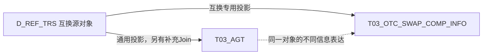

# 从 T03_AGT 理解协议身份

## 1. 为什么账户和合约都叫 AGT

T03是协议主题，T03_AGT是其中保存协议共性信息的一张表。这里的“协议”是广义业务约定，账户、服务签约、交易合约都可以采用这套表达。

可以把T03_AGT理解成==“业务对象身份登记册”==：不同对象共用身份、类型、状态等字段，业务含义仍然不同。

下面编号123仅为示意，构造规则来自已读TIT SQL：

| 对象 | Agt_Id 编号来自哪里 | Agt_Modifr 修饰符 | Agt_Cate_Cd 类别 | Agt_Type_Cd 类型 |
|---|---|---|---|---|
| TIT资金账户 | KEY_CAPITAL_ACCT_ID → 123 | 10220 | 102 | 10220 |
| 普通互换 | KEY_OTC_TRADE_ID → 123 | 20206 | 202 | 20206 |

**123/10220是账户，123/20206是互换。** 同表登记不表示两者有关联；要判断互换使用哪个账户，需看实际账户字段或关系记录。[[00-20260911-认知实验/t03专题-协议/证据/SQL/103929.json|资金账户SQL]]、[[00-20260911-认知实验/t03专题-协议/证据/SQL/103930.json|互换SQL]]。

## 2. 身份与分类分开理解

- **Agt_Id＋Agt_Modifr识别“哪一个对象”**。编号通常沿用源ID；修饰符还可能包含市场、渠道或来源标识，如20206-KST，不能始终等同于类型码。
- **Agt_Cate_Cd／Agt_Type_Cd描述“哪一类对象”**。前者较粗，后者较细。本例完整类型能推知类别；若映射唯一，存两列确有冗余。但现有SQL存在分类不一致，不能普遍用截取前缀代替核对。

连接时还需限定来源，以及日期、腿号等明细范围；不能默认编号和修饰符在所有表中都是唯一键。具体变体见[[00-20260911-认知实验/t03专题-协议/实现详解/账户/柜台与PB账户|身份与账户]]，完整分类见[[00-20260911-认知实验/t03专题-协议/字典/协议类别与类型完整树|字典树与来源说明]]。

## 3. 共同身份之外，为什么还需要其他表

一份互换需要保存不同层次的信息：

| 信息层 | 作用 | 模型入口 |
|---|---|---|
| 通用信息 | 身份、类型、持有人、通用状态及来源 | T03_AGT |
| 专用属性 | 互换本金、业务条件等 | T03_OTC_SWAP_COMP_INFO |
| 内部结构 | 各条腿的方向与参数 | 互换腿模型 |
| 参与关系 | 关联主体、账户、组合与账簿 | 相应字段及关系模型 |
| 存续事实 | 某日的数量、价值等 | 持仓等模型 |

**共同身份把信息联系起来，各层保留自己的粒度。** 一份合约可以有多条腿、多天持仓，所以连接后出现多行不一定是重复数据；账户等其他协议也不需要套用互换的全部结构。

实际字段仍以DDL和投影为准：已读T03_AGT没有名称列；TIT分支的生效日期取源创建日期，不能直接当作经济起息日。通用字段名不保证每个来源都提供相同业务口径。

## 4. 逻辑上的共性，不等于加工上的上游

已读普通互换的通用表与专表分别从源互换对象生产：

实线表示来源加工，虚线表示逻辑对应，**不是AGT生产专表的血缘**。[[00-20260911-认知实验/t03专题-协议/证据/SQL/103930.json|通用任务]]、[[00-20260911-认知实验/t03专题-协议/证据/SQL/103941.json|专表任务]]。

因此T03_AGT是理解共性的入口，不是所有T03表必须经过的物理起点，也不保证所有专表身份已经完整对齐。查具体业务时可以直接进入专表，再核对来源、关系和时间。

继续阅读：[[00-20260911-认知实验/t03专题-协议/00-全貌与证据边界|T03全貌]] · [[00-20260911-认知实验/t03专题-协议/衍生品重点/00-模型层与贴源层如何对应|TIT/OIS模型与源头]] · [[00-20260911-认知实验/t03专题-协议/建模基础/历史时间与消费口径|日期与消费]]

加工补充：TIT资金账户任务103929的历史对比先限定 `SRC_TBL='ODATA_N_TIT.D_CAPITAL_ACCOUNT'`，再按 `A.Agt_Id=B.Agt_Id` 做 FULL OUTER JOIN；这是固定修饰符的来源分支内比较，不能推广为整个T03的单字段连接键。[[00-20260911-认知实验/t03专题-协议/证据/SQL/103929.json|103929]]。
