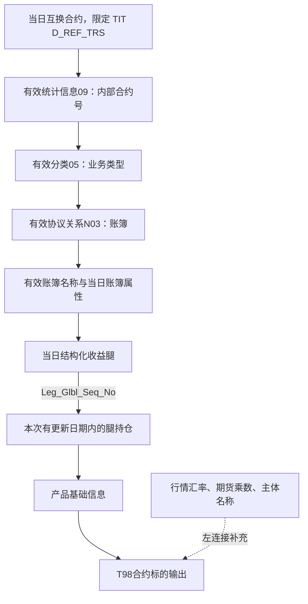

# 时间、持有与消费：避免把历史关系和当日金额混在一起

本篇是按需查阅的时间与消费方法：先区分业务发生日期、源快照日期、模型有效期与加载日期，再看具体加工。这里的期权状态、份额、余额和互换消费是方法案例，不是T03的另一组业务分支。

## 1. 同一个“日期”背后有四类问题

业务发生日期记录何时成交、支付或定价；快照日期记录观察的是哪天的数据；仓库历史有效期记录某个版本在哪段日期有效；加载和更新时间记录数据加工过程。它们可能同日，也可能不同日。

T03 的后缀不能直接判定这些问题。`_H` 经常用于历史，但 `T03_AGT_HOLD_SHR_H` 的 103614 分支按 `BUSI_DATE,SRC_TBL` 写入每日份额；它不是按 Strt_Date/End_Date 维护的关系拉链。反过来，`T03_AGT` 的元数据中文注释含“历史拉链”，103929 实现却需要按其增删改与删除标记逻辑判断，不能照注释硬套有效期查询。

表与字段说明能提示应找什么证据，真正决定查询方式的是字段定义、写入方式和消费者用法。

## 2. 以期权状态历史还原一次完整变更

103937 的流程先提取当日期权状态，再读取目标中 `Strt_Date<=D AND End_Date>D` 的有效行，限定来源为 TIT 期权交易合同要素表，进行 FULL OUTER JOIN。比较结果标成 I（新增）、D（源侧消失）、U（属性变更）、S（不变）。

后续写入包括保留已闭链历史、对 I/U 开新版本、对 D/U 关闭旧版本、对 S 保留原版本。新版本从 D 开始，结束日期为 2099-12-31；旧版本在 D 结束。任务还有先清理当日新增、恢复当日闭链的重跑准备段，不能只摘最后一次 INSERT 来解释完整维护过程。

下面为构造示例，状态 A/B 只是示意，不是实际码值：

| 合约身份 | 状态 | 开始日 | 结束日 | D=9月10日是否有效 |
|---|---|---|---|---|
| C001 / 20207 | A | 9月1日 | 9月10日 | 否 |
| C001 / 20207 | B | 9月10日 | 2099年12月31日 | 是 |

由于采用左闭右开区间，9月10日只有 B 有效。如果改用 `D BETWEEN Strt_Date AND End_Date`，会把边界日的旧行和新行都纳入，制造重复。

不过，这个有效期是仓库根据源快照差异维护的历史，不自动等于源系统事件发生的精确时间。若某次日快照遗漏，SQL 的 D 规则会闭链；是否属于真实业务删除，仍需要源采集完整性和运行证据。不能把“这段代码会闭链”直接写成“客户于当天终止协议”。[[00-20260911-认知实验/t03专题-协议/证据/SQL/103937.json|103937]] 53–114、129–195 行。

### 通用 AGT 的维护为什么不能照抄这个区间模型

103929 的资金账户分支在发生 U 变更时取新的属性值，保留原加载日期、更新修改日期；发生 D 时将 `Del_Flag` 设为1，并优先保留已有删除日期。它没有像103937那样，为每次U变化同时输出一条闭链旧版本和一条带区间的新版本。

所以，即使元数据说明写着“历史拉链”，这一实现仍更接近保留最新属性及逻辑删除状态的记录维护。不能仅靠当前 `T03_AGT` 的生效日、到期日、加载日就恢复任意历史时点的全部属性。业务生效到期也不是仓库版本起止；若要历史状态，应寻找明确保留区间的状态历史等对象。

这里不是要重命名原表或修改任务，而是解释同一模型主题内存在两种维护机制。把它们统一说成“都是拉链”会直接导致历史查询用错表。[[00-20260911-认知实验/t03专题-协议/证据/SQL/103929.json|103929]] 136–235 行。

## 3. 持有份额为什么需要比账户更多的键

103614 从 RCC（零售柜台新一代清算系统）`A_DERIVSHARE` 写入 `T03_AGT_HOLD_SHR_H`。账户身份为资金账号与 10201；产品身份由 `RCC-PRODTA_NO-PROD_CODE` 构造；还保存购买日、申请编号、持有人、持有类型、源交易类别和业务日期，以及期初、当前、冻结等份额。

这些字段提示一行不仅描述“账户持有产品”。同账户、同产品还可能按申请、购买批次或持有分类保留明细。本次没有行数据来判定最小唯一键，因此使用账户和产品做聚合前，应先确认业务希望保留还是合并这些轴。

### 参考市值的实际分支

任务中的计算为：

```sql
IF(B.PROD_CODE IS NOT NULL,
   B.NET_VALUE * A.CURRENT_AMOUNT,
   C.PAR_VALUE * A.CURRENT_AMOUNT) AS REF_MVAL
```

它先看是否匹配到 B 产品价格记录；匹配到则使用净值，否则使用 C 面值。判断条件不是 `B.NET_VALUE IS NOT NULL`。所以如果 B 记录存在但净值为空，不会继续回退面值，乘法结果可能为空。把这段解释成“净值缺失就用面值”是不准确的。

还有一个值得核验的粒度差异：产品编号构造包含 TA 与产品代码，而价格和产品关联段主要按产品代码连接。若不同 TA 下产品代码复用，潜在基数是否放大，需要源数据验证。这里只能提出具体检查点，不能宣称已发现重复。

这个例子也说明“参考市值”不是直接可认定的估值口径。它可能基于净值，也可能基于面值；在跨产品汇总前，必须解释两种分支及其覆盖，否则表面同名字段其实混合不同计算基础。[[00-20260911-认知实验/t03专题-协议/证据/SQL/103614.json|103614]]。

## 4. 分币种余额表也可能没有币种和当前余额

107280 的目标是 `T03_AST_CRRC_ACCT_BAL`，来源为 TIT `D_MARGIN_ACCT_DAILY_BALANCE`。协议编号为 `KEY_MARGIN_ACCT_ID`，修饰符与类型为 10219；CD039 把它解释为交易对手保证金账户。目标 `Begn_Bal` 取 `BALANCE`，`Curr_Bal` 与 `Crrc_Cd` 都填空。

这个事实直接限制了消费解释：本分支能说明源保证金余额被写入目标期初余额字段，不能说它已经提供按币种分解的当前、冻结、可用余额全集，更不能将空的币种推定为人民币。

时间条件也不是“只读取 D 日”：源过滤是 `SUBSTR(SRC_BUSI_DATE,1,10) >= DATE_SUB(D,15)`，目标业务日取源业务日期。所读条件未设上界，故不能精确称为“仅过去 15 天”，也不能忽略晚于 D 的源记录如果存在时的可能性。任务一次可以触及多个业务日期分区。

任务还左连接保证金账户表，所读连接段没有业务日期限制。右侧唯一性若不成立，即使不直接取右表金额也可能放大结果；这只是静态风险条件，并未通过业务行确认。[[00-20260911-认知实验/t03专题-协议/证据/SQL/107280.json|107280]] 50–91 行。

## 5. 一条真实消费链怎样把各层组合起来

107018 生成 `T98_OTC_SWAP_COMP_TRD_UNDRL_INFO`。第一分支可以分成以下过程：



图中主链均来自该分支实际 INNER JOIN。关系和名称即使看起来只是“补信息”，也影响进入输出的资格；左连接补充不要求右行存在，但仍要防止多匹配。主链上缺任一层都可能导致主合约不出现。

三个不同时间口径同时存在：合约、腿和账簿附加表按 D 日快照；统计信息、分类、协议关系和名称按 D 日有效区间；持仓则选择临时更新日期集合内的数据，输出 Busi_Date 来自持仓。也就是说，更新历史持仓日期时，这一分支可能使用 D 日合约和关系上下文。不能无条件把结果解读为“还原持仓业务日当时的所有属性”。是否符合业务回补需求需要额外确认。

这种发现不靠表清单，也不靠单一图边得出，而是将每一段 WHERE、JOIN 和输出日期连起来理解。[[00-20260911-认知实验/t03专题-协议/证据/SQL/107018.json|107018]] 104–155 行。

## 6. 同一任务里的 UNION ALL 分支可能改变业务视角

107018 后一分支将账簿编号取为映射中的 `KEY_BOOK_ID_TO`，并将腿的多空分类 LONG 改成 SHORT、SHOR 改成 LONG。它不是原分支的逐字段重复复制，而是切换了账簿及方向表达。

因此统计输出行数时，不能把每一行都理解成一份独立客户合约。需要区分是否存在映射到另一账簿的表达、两分支如何筛选，以及查询希望看客户侧、管理侧还是全部视角。若后续直接按合约编号去重，又可能删掉这种有意保留的视角信息。

本次重点核验的是分支投影差异，没有将整段账簿映射规则扩展成所有业务的统一“双边记账”结论。需要细看账簿消费时，可继续阅读原有[[data-graph-derived-2.0/analysis/book-consumption-pilot/账簿表业务使用说明|账簿完整分析]]，同时保留其采样及版本边界。

## 7. 图谱能确认什么，不能确认什么

本次查询已发布图谱 `titans-otc`，版本为 `8651e582cd851a22a3e8d58ce71683f7ac285f539a54364575a7d9391b1f8c46`。

账簿表向下、表层、深度 1、边上限 200 的查询返回 161 个节点、200 条边，`truncated=true`、`stoppedBy=EDGE_LIMIT`。这说明账簿的可见消费面较广，不能说明全部下游只有这些节点。图中任务携带的调度引用另有语义，也不能作为数据依赖累加。

互换主表向上、深度 1、边上限 30，返回 9 个节点、8 条边，未因边数截断，但停于 DEPTH_LIMIT。定位到 8 个生产任务，其中本稿比较了 103941、105072 和 112119 的关键段。图未截断只表示这次查询范围内结果完整，不代表整条上游闭包已经审完。

字段图对任务 134215 的 `Div_Rati` 给出 `T1.ALLOCATION_PROPORTION AS Div_Rati`，并绑定具体写入标识。这与本地 SQL 投影相符。它能支持“这个输出值从哪里来”，不能单独证明分成比例合计为 100%、某天已执行，或左右两库中的全部内容版本一致。[[00-20260911-认知实验/t03专题-协议/证据/核验范围与案例台账|图证据说明]]。

## 8. 面向实际需求，怎样选择输出粒度

| 问题 | 合理起点 | 最容易误用的地方 |
|---|---|---|
| 某日有多少份互换合约 | 来源与日期限定的合约身份集合 | 连腿和持仓后按行计数 |
| 某账户持有哪些产品 | 份额或持仓，保留产品和批次维度后按需求汇总 | 将账户档案当持有事实 |
| 某日账户能用多少钱 | 指定余额来源、币种与可用余额字段 | 用期初余额替代当前可用，空币种默认CNY |
| 某合约当时属于哪个账簿 | 指定日期有效的关系和名称 | 将当前账簿覆盖历史 |
| 谁获得业务分成 | 合约开发关系与人员映射 | 将比例当已结算金额、将登录号当ERP编号 |
| 为什么一份合约在报表里消失 | 检查消费者所有必需连接、状态和来源过滤 | 只证明合约主表里有记录 |

这些选择不需要先重建整个模型，但要求每次查询都明确对象、来源、日期、度量及连接基数。T03 的复杂度恰恰来自这些维度并存，整理时保留它们，读者才有能力面对下一张未读过的表。
