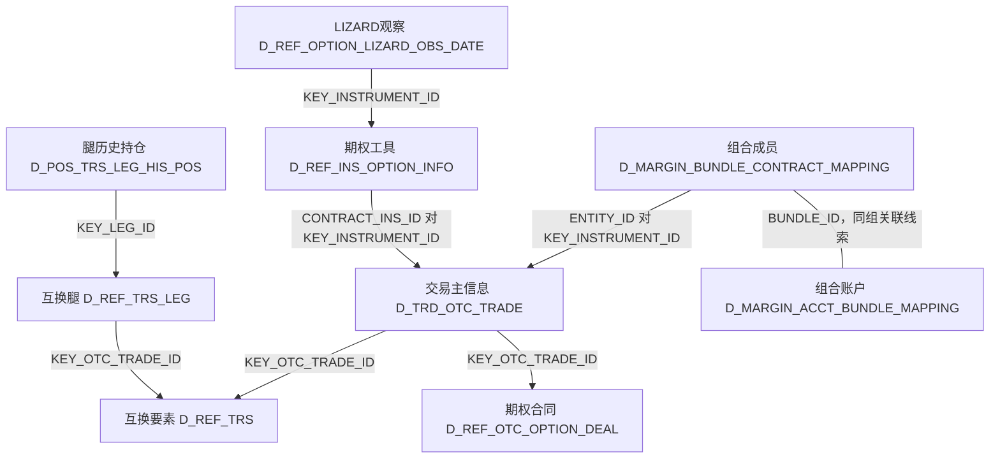
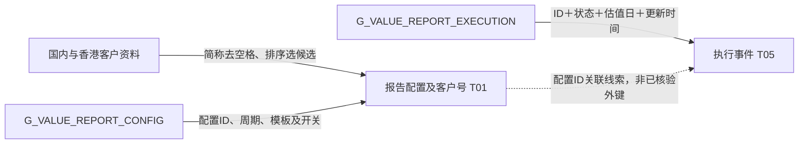
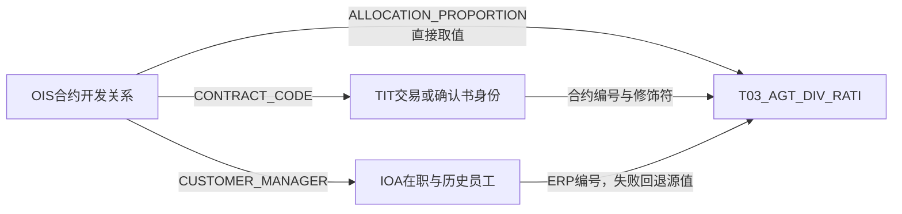

# TIT/OIS：模型层、贴源层与加工层怎样对应

本篇用于核对模型、贴源对象、字段加工与下游消费的对应。第一次理解业务时，从[[00-20260911-认知实验/t03专题-协议/衍生品重点/01-一笔衍生品交易如何贯穿模型|一笔互换贯穿模型]]进入；已有具体来源或加工问题时，可以直接查本篇相应小节。T03 是整个协议主题，以下只展开 TIT（场外衍生品投资管理系统）与 OIS（OTC综合业务平台）相关的重点。系统名称不能代替业务分工，表名相似也不能代替真实连接。

## 1. 从模型入口看：不是一张主表下面挂所有附表

| 模型层次 | 描述的对象 | 关键入口 | 关系及使用方式 |
|---|---|---|---|
| 共性身份 | 哪一个账户、合约或管理对象 | T03_AGT，名称、状态、分类等通用表 | 共用身份表达；不保证专表都由 AGT 物理派生 |
| 专用主信息 | 哪一份互换、期权或外汇远期 | T03_OTC_SWAP_COMP_INFO、T03_OTC_OPT_COMP_INFO 等 | 保存该类交易的特性；同表不同来源仍需区分 |
| 经济组成 | 交易内部怎样产生经济结果 | 互换腿、期权子交易、观察日及属性表 | 加入腿、子交易、序号或观察日期维度，不是主表的一对一扩展 |
| 存续事实 | 某时点持有什么、规模及价值怎样 | 互换持仓、结算信息 | 数量、价格、市值、收益和结算分别解释，保留业务日 |
| 管理范围与条件 | 哪些交易合并管理，采用什么参数 | 组合关系、账户关系、账簿规则、履保参数 | 关系界定范围；参数表达条件；规则记录适用方式 |
| 监控与处理结果 | 系统得出什么要求，后续如何处理 | 履保结果、追保记录、T05 收付款及通知关系 | 结果与处理动作分开，不能从配置推断执行成功 |
| 周边主体与运营 | 谁参与，适用哪些客户条件，如何出报告 | OIS 相关 T01 主体/阈值/配置、T02 产品、T05 报告事件 | 与协议业务关联，但不能为了专题方便全放入 T03 |
| 消费模型 | 某个管理或报表问题需要怎样组合 | T98 互换标的、管理归属及 T99 系数 | 重新定义输出粒度、过滤与时间；不是主表简单加列 |

一个重要判断是：**共性与特性是模型关系，谁读取谁是加工关系。** TIT 普通互换的通用协议和专用主信息可以各自读取源互换表，不能因此画成 AGT 生产专表。相反，组合成员的身份确实要经过工具→交易桥接，这属于实际加工链。

## 2. TIT 贴源层：交易是中心，但工具、结构和管理范围各有身份

下面的箭头标注本次 SQL 实际使用的匹配字段，不声明数据库外键或全局一对一。

这张图至少有四种身份：交易 ID、工具 ID、腿/子交易 ID、组合 ID。它们不是同一个号码的四个别名。

**交易主信息**提供交易 ID 与内部业务合约号等桥梁；**互换和期权要素**说明交易所属类型及具体条件；**工具和腿**表达经济组成；**持仓与观察记录**增加时间和事实维度；**组合及账户映射**决定风险管理范围。不同路径对应不同业务问题，不能按表名前缀 D_REF/D_TRD/D_POS 机械代替这层逻辑。

还存在独立来源分支：极速互换 `D_REF_FAST_TRS`、KST 确认书 `D_KS_TRADE_COMFIRM_INFO` 也进入互换模型，但编号和字段填充不完全相同。因此上述普通交易结构不能被当成所有来源都必须经过的一条流水线。详见 [[00-20260911-认知实验/t03专题-协议/衍生品重点/02-TIT交易结构与存续期|TIT 交易结构篇]]。

## 3. 一个完整例子：组合成员怎样变成模型里的一行

模型入口是 `T03_OTC_DERI_AGT_AGT_GRP_RELA_ADTNL_INFO`。需要回答的业务问题是：这个组合包含哪份交易，同时关联哪个资金账户、哪种源工具？

141596 从 `D_MARGIN_BUNDLE_CONTRACT_MAPPING` 出发。源记录并没有直接提供标准模型合约 ID，而是给出 ENTITY_ID；任务先将其与交易主信息的 KEY_INSTRUMENT_ID 匹配，取出交易 ID。再用交易 ID 分别连接互换和期权来源，识别协议修饰符。各列的角色如下：

| 目标字段 | 来源与表达式 | 这一步在做什么 |
|---|---|---|
| Agt_Grp_Id | 映射源 BUNDLE_ID | 保留组合身份 |
| Otc_Comp_Agt_Id | `NVL(交易表.KEY_OTC_TRADE_ID,'')` | 工具桥接为交易身份 |
| Otc_Comp_Agt_Modifr | 互换命中→20206；期权命中→20207；否则空 | 根据实际类别来源识别对象类型 |
| Ast_Acct_Agt_Id | 映射源 KEY_CAPITAL_ACCT_ID | 保留资金账户关联，属于另一种对象身份 |
| 关系类型与组类别 | 常量 13、TIT_OTC_COMP_GRP | 明确本分支的关系语义 |

所以这一行是**组合中的成员关系及附加信息**，不能说是一份合约主档，也不能说是一条账户余额。将它与组合结果连接后，每个成员可能都看到同一份组合金额；如果随后按成员求和，就可能重复计算组合结果。

本次 Input Pack 的原始 SQL 文件哈希与 Facts 记录一致；以上四个核心目标字段均有 RESOLVED 的输出绑定，绑定到 `write-observation:141596:0`。这为“该表达式写向该字段”提供了机器证据，实际连接条件仍保留在 [[00-20260911-认知实验/t03专题-协议/证据/衍生品补充/SQL/141596.json|SQL 141596]] 中。它没有证明源工具键唯一或数据运行正确。

完整的组合管理链还要继续读取 141600 的组合→保证金账户关系，147138 的组合内动态参数，以及 147139 的组合结果。关系、输入、结果的层级已经在 [[00-20260911-认知实验/t03专题-协议/衍生品重点/03-TIT履保账簿映射与结算|TIT 履保篇]] 中对应展开。

## 4. OIS 贴源层：围绕客户和协议业务组织，不是 TIT 主表的镜像

OIS 已读来源可归纳为四组对象。这个分组来自加工证据，而不是预设平台职责：

| 贴源对象层次 | 具体来源 | 与其他对象的联系 | 入模方向 |
|---|---|---|---|
| 客户及身份资料 | 国内/香港交易对手、同一客户、客户银行账户 | 客户号及同一当事人分组；不能把所有客户号视为统一主键 | T01 主体与关系、银行资料 |
| 客户条件及报告安排 | 香港阈值、报告配置、复审缓冲及白名单 | 阈值围绕客户；配置通过简称候选关联客户；缓冲排除白名单 | T01 条件/配置、T98 客户综合结果 |
| 协议开发关系与参数 | 合约开发关系、客户开发关系、临时/正式价差系数 | 合约代码连接 TIT；人员连接员工；正式系数参与排除 | T03 分成、T98 管理归属、T99 参数投影 |
| 产品与运营记录 | 收益凭证、源字典、报告执行 | 产品身份/代码解释；配置号与状态、日期共同表达执行 | T02 产品、T05 事件 |

其中客户型产品与作为交易标的的产品必须分开；客户条件与逐笔合约条款必须分开；报告配置与执行事件必须分开。否则读者会把不同层级的“产品、协议、状态”混在一起。

### 客户、报告配置、执行记录如何分层

147452 的 Pty_Id 并不是从配置表直接取值，而来自国内/香港客户候选；Facts 中这两个客户号来源与目标字段有绑定。排序与简称连接决定选谁，属于影响行选择的规则，不能只看值血缘就忽略它。147451 则保留多种状态与更新时间，同日可能有多条执行事件，不能强压成一个配置一行最终状态。

### 合约开发关系怎样对齐交易与人员

这是多表共同构造一行模型记录，但不是多个系统共同计算比例。134215 的 Facts 明确显示 Div_Rati 只有 OIS ALLOCATION_PROPORTION 这个物理值来源；Agt_Id 则有 TIT 交易、确认书、OIS 源合约号三种候选值来源；Div_Obj_Id 有员工号与源客户经理的回退。这三个字段的加工复杂度并不相同。

详细的身份优先级、空值和基数问题见 [[00-20260911-认知实验/t03专题-协议/衍生品重点/05-OIS产品归属系数与字典|OIS 产品归属篇]]。本地原有 [[00-20260911-认知实验/t03专题-协议/证据/图谱-分成字段.json|分成字段图]] 与这次 Facts 的直接比例表达式相符；没有把图中的连接数量当成参与计算的系统数量。

## 5. Evidence、Input Pack、Facts 和图各证明什么

| 证据层 | 这次怎样使用 | 不能替代的部分 |
|---|---|---|
| 原始 Evidence | SQLite 中的任务 SQL、原行号、获取时间 | 不能证明实际到数或源键唯一 |
| Input Pack | 对照任务 SQL 文件与目标 DDL 的定位及哈希 | target 配置不是全部真实写入的唯一依据；Pack 与 Evidence 可有不同快照 |
| Machine Facts | 检查表达式的物理来源、目标字段绑定和明确缺口 | SUCCESS 不等于业务正确；没有产出的跨任务连接不能补造 |
| 图谱 | 复用已发布的互换上游、账簿下游、分成字段图辅助定位 | 深度/边数限制必须保留；调度邻居不是数据血缘 |

本次又定向核对 141596、134215、147452、246739、107018 的 Pack/Facts，5 个对应 Pack SQL 文件哈希均与其 Facts 记录一致。**这仅是 Pack 与其派生结果的一致，不是保证与所有历史 Evidence 同版本。** 原始任务内容、解析用 SQL 和完整 Evidence payload 的哈希属于不同文本层，不应互相冒充。

特别保留三个实质缺口：147452 的窗口框架语义在 Facts 中仍标 UNKNOWN，但原 SQL 的 ROW_NUMBER 分组排序可以人工解读；107018 的两个临时对象缺 schema 绑定；246739 的 SELECT 为 29 列、目标结构为 26 列，未形成可证明的输出绑定。因此系数任务目前可以解释 SQL 投影和筛选意图，不能升级为完整字段绑定已确认。

2026-09-12 本轮实时图查询返回服务不可用，未重建或发布图；使用的是原先留存的图证据和本地 Facts。所有这些状态及关键字段均在 [[00-20260911-认知实验/t03专题-协议/证据/衍生品补充/InputPack与Facts交叉核对.json|交叉核对 JSON]] 中保留。

## 6. 下游怎样重新组合模型：互换标的视角

107018 的 T98 互换标的消费把主合约、结构化腿、持仓、产品、主体和账簿关系组合起来。业务问题已经从“是哪份互换”变成“某个业务日，在某种账簿视角下，互换涉及哪些标的和数量”。

这会带来三个变化：第一，输出进入合约—标的—账簿等组合粒度，不能按输出行数数合同；第二，内连接及腿类型条件决定哪些对象进入结果；第三，主档、有效关系、更新持仓集合使用不同日期规则，不能理解成全部取同日的简单宽表。

另一个账簿映射分支会改变账簿及多空方向，而不意味着又发生了一笔真实交易。若同时汇总原始与映射视角，要先说明管理目的，避免把两种观察重复当成经济头寸。

Facts 中主合约 ID 的目标绑定可确认，但临时更新日期表和 mapping 的 schema 缺口仍在。正文关于这些临时对象的解释依据所读 SQL，不能称为已经完成整条机器血缘闭合。完整推导继续看 [[00-20260911-认知实验/t03专题-协议/建模基础/历史时间与消费口径|时间、持仓与消费篇]]，无须重新把所有 SQL 拼起来阅读。

本篇把模型表、源业务对象与具体加工放在一起核对；查清当前问题即可停止。其他专项说明从[[00-20260911-认知实验/t03专题-协议/衍生品重点/README|按问题入口]]选择，不需要接着通读全部文章。

[[00-20260911-认知实验/t03专题-协议/衍生品重点/01-一笔衍生品交易如何贯穿模型|业务全程示例]] · [[00-20260911-认知实验/t03专题-协议/衍生品重点/README|返回重点入口]]
