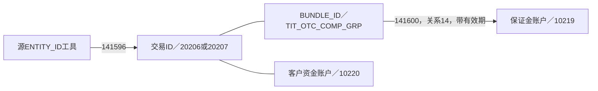

# TIT 深入之二：资金、履保、账簿映射和结算

这一篇回答交易成立之后的管理问题：客户的资金放在哪里、哪些交易合并看风险、何时提示追保、如何归到账簿，以及结算如何形成收付款。它们都与合约有关，但不应全压进合约主表。

## 1. 资金账户、保证金账户、银行账户、账簿是四种对象

TIT `D_CAPITAL_ACCOUNT` 对应10220类型的客户资金账户，`D_MARGIN_ACCOUNT` 对应10219类型的交易对手保证金账户。前者与客户交易资金管理有关，后者承载履保管理的账户身份。银行账户则是外部收付资料；OIS任务199856将其放在T01当事人银行账户历史中。交易账簿以20411协议身份表达管理归属。

应先问“这笔资金以哪个对象为管理范围”，再谈余额：客户资金账户余额、保证金账户余额、组合履保中的保证金余额和银行收付款金额可能涉及同一业务，但不是同一个字段的不同名字。它们的计算范围、时间和可用条件不同。

103929、103928等任务提供账户身份；107280的保证金余额分支把源BALANCE写入期初余额，当前余额和币种填空。只有表名和字段清单不足以支撑“按各币种统计当前可用资金”的需求。[[00-20260911-认知实验/t03专题-协议/实现详解/账户/柜台与PB账户|原有账户分析]]、[[00-20260911-认知实验/t03专题-协议/建模基础/历史时间与消费口径|余额推导]]。

## 2. 为什么需要组合履保

本地历史Wiki提出期权与互换组合履保：同一组合编号下合并考虑交易风险，计算相应追保、提取要求；并讨论按标的市值或名义本金作为基础的不同模式。这解释了组合对象的业务动因：管理关注的是一组约定范围内的整体履约保障，不总是逐份合约孤立看。

该需求给出的特定模式表达为“现金、浮动盈亏和费用形成分子，互换与期权市值或名义本金形成分母”，还单列保证金总额、占用、可用和可开仓市值。它提醒我们，履保比例、保证金余额、可用保证金不是同一量。

**这份Wiki是历史需求，不是当前全部履保规则的现行规范。** 本次所读仓库任务主要传递参数和源计算结果，没有重新实现这份需求中的全部公式。因此本文用它说明为什么有这些对象，不把其具体阈值或公式当作所有存量合约的当前适用规则。[本地需求107–121行](<E:/03_resource/wiki-cache/pages/162675982/page.md>)。

## 3. 两张映射表把合约、组合和账户接起来

### 合约如何加入组合

141596以 `D_MARGIN_BUNDLE_CONTRACT_MAPPING` 为来源，输出到 `T03_OTC_DERI_AGT_AGT_GRP_RELA_ADTNL_INFO`。BUNDLE_ID成为协议组，类型常量为13，组类别为TIT_OTC_COMP_GRP。

源ENTITY_ID先连接TIT交易主表KEY_INSTRUMENT_ID，取得交易ID；再查互换、期权主记录，将修饰符分别识别为20206、20207。源KEY_CAPITAL_ACCT_ID同时进入资金账户字段，修饰符10220。保证金账户字段在这个分支中填空。

所以它不是直接给出“合约→保证金账户”的完整映射，而是提供“组合成员、交易身份、资金账户、工具及源合约类型”的关系。无法识别主交易时，协议编号可能空，但源工具编号和源内部合约号仍保留。[[00-20260911-认知实验/t03专题-协议/证据/衍生品补充/SQL/141596.json|141596]]。

### 组合如何连接保证金账户

141600以 `D_MARGIN_ACCT_BUNDLE_MAPPING` 为来源，将BUNDLE_ID、KEY_MRG_ACCT_ID、10219写到 `T03_AGT_AGT_GRP_RELA_H`，关系类型14、组类别TIT_OTC_COMP_GRP。历史比较键包含组ID、关系类型、账户ID及修饰符，说明同组和不同账户的成员关系被分别维护。

这张图中的13/14由SQL常量证实。当前CD631本地码值只命中10、11、12，并没有13、14；组类别域也存在码值缺口。不能把SQL中明确存在的关系删掉，也不能冒充已从字典查到官方名称。本文将13解释为“该SQL的组合与合约分支”、14为“该SQL的组合与保证金账户分支”，并保留证据来源。[[00-20260911-认知实验/t03专题-协议/证据/衍生品补充/SQL/141600.json|141600]]、[[00-20260911-认知实验/t03专题-协议/证据/衍生品补充/履保与运营代码域.json|履保字典]]。

## 4. 同一履保参数表，装了静态条款和动态输入

105397和147138都写 `T03_OTC_COMP_PERF_MARG_REF`，来源及参数类型不同：

| 层次 | 静态参数：105397 | 动态参数：147138 |
|---|---|---|
| 来源 | D_REF_OTC_CONTR_MARGIN_PARAM | D_BUNDLE_DAILY_CONTR_PARAM |
| 类型 | STC_REF | DYNA_REF |
| 主要问题 | 合约约定怎么监控 | 当日组合内交易按什么输入参与计算 |
| 典型字段 | 是否启用、初始保障金额、担保品价值、最低比例、各履保线、抵扣模式、履保模式 | 基础保证金率、当前市值、动态名义本金、未实现结构收益、累计利息、公式文本、组合ID |
| 身份 | 合约为主要关联；账户字段填空 | 合约、产品和组合信息并存；账户字段仍填空 |

静态不意味着永久不变，而是参数类型的一种标识；动态也不意味着这张表就是履保监控结果。147138还保留RATE_FORMULA到履保比例公式字段，但SQL没有执行该公式。要复算源系统，需要公式实值、公式语言、参数单位、版本和完整输入，不是看到一个字符串字段就能推出结果。

CD730的STC_REF/DYNA_REF与这两段SQL对应。更重要的是，两个来源有大量互补的空字段。查询若把一行静态参数与一行动参简单合并，必须说明匹配的是哪份合约、哪个组合、哪个日期，以及是否可能有多份产品输入。[[00-20260911-认知实验/t03专题-协议/证据/衍生品补充/SQL/105397.json|105397]]、[[00-20260911-认知实验/t03专题-协议/证据/衍生品补充/SQL/147138.json|147138]]。

## 5. 履保的多套代码不能简化成一个开关

| 代码域 | 本地值举例 | 在业务上区分什么 |
|---|---|---|
| CD731 启用履保类型 | NONE、STATIC、DYNAMIC | 是否以及采用哪种启用方式 |
| CD732 盯市类型 | SINGLE逐笔、PORTFOLIO组合 | 按什么对象范围观察 |
| CD1498 履保类型 | 1逐笔、2组合、3组合+逐笔 | 另一套履保范围表达，不能与CD732直接当同一编码 |
| CD1500 履保模式 | 市值、名义本金、交易型、多空、多空单边等 | 选择哪类业务计算基础 |
| CD1502 履约保障类型 | CASH现金、CREDIT授信 | 保障来源的性质，不等于收到了现金 |
| CD733 保证金方向 | CHARGE应收、PAY应付 | 从保证金方向解释双方责任 |
| CD719 履保状态 | 0正常、1预警、2追保、3未知、4平仓 | 源监控结果处于什么状态 |

NONE在不同域中可能分别表示“不启用履保模式”或“启用类型为否”；不能只按码值字符串合并字典。逐笔与组合并存也意味着不能把两个口径结果直接相加。是否同时应用某两域、如何优先选择，需要具体字段与任务证据，本文不替各来源编造统一优先级。

履保模式的本地记录从2024到2026年有不同维护日期，包括按市值、按名义本金的多空单边模式。这说明理解某条历史合约时，不能把最新枚举无条件当成当时已支持的功能。[[00-20260911-认知实验/t03专题-协议/证据/衍生品补充/履保与运营代码域.json|完整码值及日期]]。

## 6. 同一结果表的组合分支与 KST 分支

147139将 `D_BUNDLE_MARGIN_DAILY_RESULT` 写入 `T03_OTC_CUTP_MARG_ACCT_PERF_GUAR_RSLT`。其合约ID、账户ID、交易对手ID全部填空，BUNDLE_ID成为组合身份。结果字段包括：

- MGR_STATUS→履保状态，MRG_RATE→履约保障比例；
- MGR_REMARGINABLE→应追保金额，MRG_WITHDRAWED→可提取金额；
- MGR_BALANCE→保证金余额，ADVANCE_AMOUNT→垫资金额；
- CALL_REQUIRE/WITHDRAW_REQUIRE→履约保障要求/提取要求；
- MARGIN_GREEKS→保证金敞口。

这里的字段映射说明保存的是系统计算出的不同结果，不支持自行认定某一列等于另一列的加减。尤其“应追保”不等于“已追加”，该分支的已追加和已提取字段正是空值。

目标仅按SRC_TBL分区，BUSI_DATE是普通列，取源SRC_BUSI_DATE；源采集按D日读取。不能默认目标按每日分区保留任意历史全量。要看它保留的时间范围，应核对该源快照究竟包含哪些源业务日。[[00-20260911-认知实验/t03专题-协议/证据/衍生品补充/SQL/147139.json|147139]]。

### 样例促成的补充：不能把组合粒度推广到整表

2026-09-12 从平台 sample 读取该目标表 10 行，全部来自 `ODATA_N_TIT.D_KS_FIN_MARGIN_DAILY_REPORT`，业务日期为 2026-07-15。样例中组合身份字段和保证金账户身份字段为空；它们不是上面 147139 的组合监控来源，不能拿来验证该分支的填充情况。

据此补读 140935：该任务将 `MG_ACCT_CODE` 放进场外合约协议编号，修饰符为 `20206-KST`；交易对手用 `DEV` 加源客户键构造，组合字段填空。应追保、已追加、可提取、已提取来自各自的源列，与组合分支的空值策略不同。源字段虽然叫 MG_ACCT_CODE，这里实际投向合约身份；不能仅按源名称把它改解为 10219 保证金账户。

它还有不同的时间维护：先保留该来源中业务日不等于处理日的旧行，再追加处理日的源记录。因此两条任务虽然写同一目标表、都只按来源分区，历史维护方式仍不同。

来源标识也有一个需要保留的差异：输出 `Src_Tbl` 写 TIT 的 KST 源名，`Real_Src_Tbl` 和来源注释却保留 `ODATA_N_LSS.S_V_FIN_MARGIN_DAILY_REPORT`。仅从这段静态 SQL 无法确认这个标识是沿袭来源还是未更新配置，不将其擅自修正为同一来源。

| 比较维度 | 147139 组合结果分支 | 140935 KST 日报分支 |
|---|---|---|
| 主要填充身份 | BUNDLE_ID 组合 | MG_ACCT_CODE／20206-KST |
| 交易对手 | 空 | DEV 前缀身份 |
| 组合字段 | 填充 | 空 |
| 已追加／已提取 | 空 | 源累计值 |
| 业务日期 | 源 SRC_BUSI_DATE | 源 BUSI_DATE |
| 历史维护 | 覆盖来源分区中的源结果 | 保留非处理日，再追加处理日 |

这次样例的价值是暴露了另一种来源分支及日期形态，不是证明全表完整性或当前客户履保正常。10 行状态均为 0，也只能表述为这些历史样例的已见值。[[00-20260911-认知实验/t03专题-协议/证据/衍生品补充/SQL/140935.json|140935]]、[[00-20260911-认知实验/t03专题-协议/证据/衍生品补充/样例观察|样例观察]]。

## 7. 追保结果和追保处理记录不是同一件事

232684将 `G_MARGIN_CALL_SETTING` 写入 `T03_OTC_DERI_COMP_COMB_MARG_CALL_INFO`。虽然源表名带SETTING，SQL来源注释称追保记录，实际投影包含履保日期、确认状态、递延天数、应兑付日、追保金额、追保完成日期、触发强平标志与操作时间。

这比一条“追保线”更接近业务处理记录。它让我们有机会区分系统计算的要求与后续确认、递延、完成情况。但只有读到这些字段，还不能宣称每条追保已经完成；应以具体值和来源状态解释。

任务通过BUNDLE_ID连接组合附加表获取主体，所读连接段仅限定来源，没有限定B表Busi_Date。若B表有多日或多版本记录，就有多匹配可能；不能在没有业务行的情况下确认一对一。状态转换又有独立REF_CD_CVT_MAP条件，需要与履保状态CD719区分：追保确认状态不是监控结果状态。[[00-20260911-认知实验/t03专题-协议/证据/衍生品补充/SQL/232684.json|232684]]。

## 8. 账簿映射至少有三种对象

**第一类是账簿之间的映射结果。** 122239从D_BK_BOOK_MAPPING取KEY_BOOK_ID_FROM、KEY_BOOK_ID_TO和DIRECTION，形成N05账簿关系与盈亏方向转换，带源映射ID和历史有效期。

**第二类是何时适用这种映射的条件。** 177928从D_BK_BOOK_MAPPING_RULE读取条件，通过KEY_BOOK_MAPPING_ID关联映射主表ID，补出源账簿和目标账簿。不能只拿FROM/TO画一条永久适用于所有交易的边。

**第三类是交易流水如何归到账簿的筛选规则。** 180014从B_TRD_BOOK_MAPPING和B_TRD_BOOK_MAPPING_CONDITION取得账簿、规则序号、条件名称、运算符和条件值，写到交易流水映射规则表。它保存的是规则，不是已经执行后的每笔流水归属。

前两类与第三类回答不同问题：前者涉及账簿之间怎样转换，后者涉及什么交易归到哪个账簿。规则存下来了，也不证明我们已经知道其执行引擎如何组合AND/OR、如何处理优先级和冲突；SQL未表达的语义不能从规则名称补出。[[00-20260911-认知实验/t03专题-协议/证据/衍生品补充/SQL/122239.json|122239]]、[[00-20260911-认知实验/t03专题-协议/证据/衍生品补充/SQL/177928.json|177928]]、[[00-20260911-认知实验/t03专题-协议/证据/衍生品补充/SQL/180014.json|180014]]。

## 9. 账簿的中文业务分类也能从源字典看出知识

账簿主信息先界定管理上下文。105382将生效/到期日期、柜台、所属部门与公司，以及财务/风控报送、交易确认书、结算通知书、二次复核、报备、资金模块和风险限额等标志，写入 `T03_OTC_DERI_BOOK_ADTNL_INFO`。它们是归属和配置，不能作为资产余额求和，也不能据开关值认定相应处理已经执行。这里按目标投影解释：`ENABLE_REPORT`对应报备标志，`ENABLE_CAPITAL`对应启用资金模块，不能只按英文词根改称“报告”和“资本”。[[00-20260911-认知实验/t03专题-协议/证据/SQL/105382.json|105382]]原SQL第43–74行。

本地有141条码值标明来源为TIT的D_CFG_DICTIONARY_DESC，其中49条属于CD2204账簿业务分类，备注定位DICT_NAME=DESK。例子有AIRBAGX静态对冲、DYNAMIC_HEDGING主动对冲、DUMMY生产验证、GFA_OPTION资管期权、GFA_TRS资管互换等。

105382把源DESK写入账簿的Cntr字段；它不是客户姓名，也不是保证金账户。字典能帮助读者理解账簿的业务用途，但某个分类是否在当前生产使用、是否应进入特定报表，还需下游过滤和实际数据。不能把DUMMY等验证类别无差别纳入业务统计。[[00-20260911-认知实验/t03专题-协议/证据/衍生品补充/TIT源字典141行.json|TIT源字典141行]]。

## 10. 结算信息如何连接交易，以及为什么与分成映射不同

134213从CSS（综合结算业务支撑系统）的E_OTC_SETTLE_JOUR取得应收、应付、保证金、期权费、后端费用、分红、其他费及结算金额，写T03衍生品合约结算信息。合约映射采用TIT交易ID或确认书ID；普通交易连接时，按 **清算日期对应TIT业务日** 找交易，而不是一律用加载日。

OIS分成134215也做类似合约映射，但有两个区别：按当日交易快照连接，并在两个标准编号均未命中时回退源合约代码。结算134213没有这层回退，协议ID可能为空。两个任务看起来都在“统一合约号”，实际日期和失败策略不同，不能抽成同一个未经核验的万能映射。

各费用与结算金额是源记录的并列字段，SQL没有证明应收减应付等于结算金额，也没有证明结算额包含所有费用。业务汇总需要先确定目标口径。[[00-20260911-认知实验/t03专题-协议/证据/衍生品补充/SQL/134213.json|134213]]。

## 11. 收付款事件、结算通知书关系，补齐业务动作层

104934将TIT D_TRD_TRANSFER写入T05_OTC_RECV_PYMT_EVT，事件ID为TIT157-TRANSFER_ID。它同时保存交易ID、合约号、账簿、产品、腿、互换持仓ID、存续期事件号、收付款类型/方向/状态、约定支付日、实际支付日和金额。

185098将结算通知书KEY_SN_ID构造为TIT292事件身份，关联到同样使用TIT157前缀的TRANSFER事件，关系类型01，SQL注释解释为结算通知书与收付款记录。这是有字段投影证据的事件连接，不是靠业务常识猜测通知书和付款会自动一一对应。

104934还有一处值得保留的语义疑点：AMOUNT_RECEIVALBE被写入“调整后我司应付金额”，AMOUNT_PAYABLE被写入“调整后我司应收金额”，源字段拼写和目标中文方向看起来交叉。不能擅自纠正SQL，也不能只凭英文后缀解释方向；需进一步核对源字段定义和业务样例。本次将它登记为待确认项，避免把明显不对称包装成已理解。[[00-20260911-认知实验/t03专题-协议/证据/衍生品补充/SQL/104934.json|104934]]、[[00-20260911-认知实验/t03专题-协议/证据/衍生品补充/SQL/185098.json|185098]]。

这些对象共同解释了风险资金到运营交收的分工。合约约定、组合监控结果、追保处理、结算金额与付款动作各有位置，理解时应该沿关系核对，汇总时应按业务目的分别选取。
