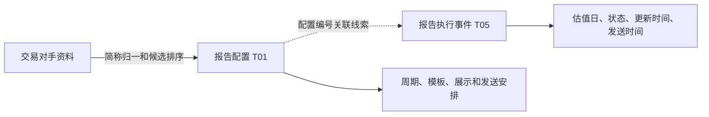

# OIS：主体准入、协议条件与运营如何围绕合约展开

OIS 的本地来源字典名称是 **OTC综合业务平台**，这里对应用户关注的 OTC 运营管理平台。它在本专题中的价值，是解释一份交易周围的客户资料、协议条件和运营安排。不能只寻找 OIS 写入 T03 的任务：交易对手及协议阈值落在 T01，报告执行落在 T05，它们仍然是理解衍生品合约不可缺少的一部分。

## 1. 先按业务问题看入模位置

| 业务问题 | OIS 来源 | 本次确认的落点或证据层次 |
|---|---|---|
| 交易客户是谁 | `O_OTC_DERIVATIVE_COUNTERPARTY`、`G_HK_COUNTERPARTY` | 全源索引命中 T01 主体、分类和状态等多条候选；216975 已读客户综合结果中的相关分支 |
| 多个客户号是否表示同一当事人 | `G_SAME_COUNTERPARTY` | 149553 → `T01_PTY_RELA_H`，保存客户号间关系 |
| 客户的银行收付款资料 | `O_COUNTERPARTY_ACCOUNT` | 199856 → `T01_PTY_BNK_ACCT_H`，客户银行账户历史 |
| 双方的 ISDA 相关阈值 | `G_HK_THRESHOLD` | 212650 → `T01_OTC_DERI_CUTP_ISDA_AGT_THRH` |
| 复审缓冲安排、白名单及展示标签 | `G_CLIENT_REVIEW_BUFFER`、`G_CLIENT_REVIEW_WHITELIST` 等 | 216975 → `T98_OTC_DERI_CUST_ECR` 的客户综合视图分支 |
| 应如何生成、展示和发送估值报告 | `G_VALUE_REPORT_CONFIG` | 147452 → `T01_OTC_CUTP_VALU_RPT_CFG_INFO` |
| 某次生成或发送发生了什么 | `G_VALUE_REPORT_EXECUTION` | 147451 → `T05_OTC_CUTP_VALU_RPT_EXEC_EVT` |

这些表不能一概称为“合约主表”。客户资料可以被多份交易共享，报告配置也可能按客户、账户或报告类型组织；执行记录又进一步增加状态和时间维度。表的业务位置要同时看它描述的对象和它实际保留的键。

完整发现范围见 [[00-20260911-认知实验/t03专题-协议/证据/衍生品补充/OIS源对象索引|OIS 源对象索引]]。索引中的引用候选与本页逐段读过的加工逻辑分开标记。

## 2. “同一客户”保存的是关系，不是直接把客户号改成一个号

149553 对 `G_SAME_COUNTERPARTY` 做自连接：

```sql
A.COUNTERPARTY_ID = B.COUNTERPARTY_ID
AND A.CLIENT_ID <> B.CLIENT_ID
```

输出 A 的客户号为当事人、B 的客户号为关联当事人，关系类型固定 `01`。本地 CD178 的 `01` 为“同一个当事人”。这说明 `COUNTERPARTY_ID` 在这个分支中承担同一客户分组依据，目标保存的是组内不同客户号之间的关系。

例如一个组里有客户号 A、B、C，连接可以形成 A→B、A→C、B→A、B→C、C→A、C→B。这个例子解释 SQL 结构，并不代表实际样例数据。源有 n 个不同客户号时，组内有向关系候选可达 n×(n−1)；SQL 使用 DISTINCT，但并没有把它们选成一个“唯一主客户号”。单成员组因为是 LEFT JOIN，还可能留下关联方为空的行，不能把关系输出直接等同于有效匹配对数。

两端还各自转换主体类别：源 `IS_PROD_HOLDER='01'` 转 `110500`，`02/03` 转 `210500`，其他值保留。这里的细节很有用：源系统自然人、机构、产品的区分，并没有在这条关系投影中逐项原样保留；不能拿目标类别反向恢复全部源分类。

所以做交易对手汇总时，要先决定是否按单一来源客户号看，还是沿同一当事人关系归并。直接连接全部关系再求和，可能将原来的交易明细展开。历史有效期也需要一起处理。[[00-20260911-认知实验/t03专题-协议/证据/衍生品补充/SQL/149553.json|149553 完整上下文]]，30–46 行。

## 3. 银行账户资料与 TIT 资金账户是两类对象

199856 从 `O_COUNTERPARTY_ACCOUNT` 取客户号、开户银行、账号、账户名称和大额支付号，进入 `T01_PTY_BNK_ACCT_H`。这一分支把账户类型固定为 `01`，SQL 注释为交易银行。

这回答的是“这个客户提供了哪份银行账户资料”。前面 TIT 中的资金账户、保证金账户则是交易管理中的账户对象，分别有协议身份。当前任务没有生成 T03 的 `Agt_Id/Agt_Modifr`，也没有证明 OIS 银行账号可以直接连接 TIT 资金账户编号。

银行账号、内部资金账户号、保证金账户号不能因为字段里都带 ACCOUNT 就互换。正确的桥接必须找到明确关系或相同业务标识及其来源约束。

这条任务维护区间历史，比较条件包含客户号、银行账户类型、银行账号和账户名称。因此名称变化也可能影响记录身份的比较结果，而不只是普通展示字段更新。分析“账户什么时候变了”时，应检查这组条件及起止日期，不能只按账号去重。[[00-20260911-认知实验/t03专题-协议/证据/衍生品补充/SQL/199856.json|199856]]。

## 4. ISDA 相关阈值：有协议条件，不等于整份主协议已经入模

212650 从 `G_HK_THRESHOLD` 读取源 ID 和客户号，并保存双方的三组条件：

| 条件组 | 源字段前缀 | 阅读重点 |
|---|---|---|
| CSA 阈值 | `CSA_PARTYA_*`、`CSA_PARTYB_*` | 甲乙双方分别有币种、金额、是否无穷大 |
| SCHEDULE 条件 | `SCHEDULE_PARTYA_*`、`SCHEDULE_PARTYB_*` | 目标字段注释称“违约金上限”；此处沿用本地术语，不扩写合同法律含义 |
| 最低转移金额 | `MTACSA_PARTYA_*`、`MTACSA_PARTYB_*` | 金额门槛和币种仍需区分双方 |

各组 `INFINITY` 将 true/false 转成 1/0，其他值原样保留。业务上需要一起理解 **哪一方、哪组条件、什么币种、多少金额、是否无穷大**。单看金额字段会丢掉重要含义；无穷大也不能按零解释。没有额外来源约定时，不能自行把 PARTY A 固定解释为我方。

它与 TIT 履保监控的关系在于：协议约定说明双方采用什么担保安排，履保参数和结果说明系统如何组织和监控交易风险。两者在业务上相关，但当前证据没有闭合 `G_HK_THRESHOLD → TIT 履保计算` 的实际字段链路，不应画成已经确认的计算依赖。

这条投影的身份是源记录 ID、客户号，没有据此建立一份完整主协议与所有具体交易的关系。结合 TIT 互换投影中主协议字段填空的情况，比较准确的结论是：**本地能看到部分协议条件入模，但主协议到逐笔交易的完整连接仍有缺口。**

另外，这份 SQL 快照中日期已经绑定为 2026-05-29，写出的数据时间为次日。它说明该次文本的日期，不能被解释成当前阈值或当前调度一直处理这个日期。[[00-20260911-认知实验/t03专题-协议/证据/衍生品补充/SQL/212650.json|212650]]。

## 5. 准入与复审：别把展示标签、配置和最终交易资格混成一个判断

216975 的客户综合结果包含专业投资者类别、复审缓冲、客户性质、注册国家和签署安排等信息。它帮助读者知道运营平台管理了什么，但这些字段并不等同于系统已经执行了某项准入决策。

源 `PROFESSIONAL_INVESTORS` 的 CASE 包含普通投资者、A1—A4、B 类机构和 B 类自然人等本地标签。这里应按该 SQL 解释输出，不能仅凭分类名称推导最新监管规则或客户当前资格。

复审缓冲分支更值得细看：先取缓冲结束字段非空的记录，再连接复审白名单，保留白名单未匹配的客户。它表达的是“进入这份缓冲结果的客户不在白名单中”，**不是从整个客户基础集合里删除白名单客户**。OTC 与 FICC 各有一支，分支标签被保留。

后续连接存在不同的身份约束：客户性质、注册国家字典连接会同时带来源标签，但缓冲结果回连客户的所读条件只按客户号。若两套来源的客户号相撞，可能产生跨来源匹配；当前只有 SQL 风险条件，没有行数据证明已经发生。[[00-20260911-认知实验/t03专题-协议/证据/衍生品补充/SQL/216975.json|216975]]，506–555、726 行附近。

签署相关 CASE 也要按其角色理解：例如确认书盖章优先方式 none/offline/online 被翻译为无、线下盖章、线上电签。这是配置或展示属性，不是某份确认书已经盖章的执行证明。

## 6. 报告配置解决“应该怎样”，执行事件解决“这次怎样了”



### 6.1 配置与交易对手：实际使用的是简称匹配

147452 以配置 ID 为 `Valu_Rpt_Cfg_Id`，保留交易对手简称、估值周期、有效标志、报告类型与类别、时间组、节假日规则、邮件模板及收件配置。周期用 LPAD 补成两位；有效标志把源 2/1 转成 0/1。

客户号来自一个 LEFT JOIN：香港交易对手资料，与国内交易对手中部门不为 HK 的部分合并；去掉简称中的普通空格；按简称分组，以 `AUDIT_STATUS DESC, CLIENT_ID DESC` 排序取一条，再与报告配置的简称匹配。

这比“按客户主键关联”多了三个业务前提：简称归一能否对应正确客户，同简称候选排序是否符合运营选择，以及报告配置里是否使用同一种简称。排序取一条仅解决此处的候选选择，不能说明简称天然唯一；审核状态降序也不能未经字典确认就改称“最新已审核客户”。未匹配时，配置仍可留下来，但客户号为空。

因此出现“报告配置存在，但按客户号查不到”时，应优先检查简称和候选规则，而不是立即认定配置没入模。[[00-20260911-认知实验/t03专题-协议/证据/衍生品补充/SQL/147452.json|147452]]，98 行以后。

### 6.2 显示口径本身就是运营知识

| 配置 | 它帮助解释什么 |
|---|---|
| 资金账户拆分 | 同一个客户为什么可能按不同资金账户组织报告 |
| 算头算尾计息标志 | 阅读报告利息口径时，日期端点是重要条件 |
| 显示拆分资金流水 | 汇总金额与明细流水的展示方式可能不同 |
| 添加期权参考估值 | 报告中哪些值属于参考信息 |
| 展示未含费成交均价 | 均价与费用是否在同一口径里 |
| 展示内在价值和时间价值 | 期权总价值可能被进一步分解展示 |

这些配置说明报告为何可能长得不同，当前任务只是传递配置，不是执行估值或计算利息的引擎。看到开关为 1，也不能单凭这一条配置证明下游模板已正确执行。

### 6.3 执行表不是每天每份配置一条“最终状态”

147451 构造事件 ID：`OIS019-配置ID-状态-估值日-更新时间`。去重窗口也按配置 ID、估值日、更新时间、状态分组，以发送时间降序取一条。由此可见，同一配置、同一估值日的失败与重新生成成功，可以保留为不同事件。

源读取范围为业务日向前 3 个月至业务日，目标按来源及业务日期分区。这是滚动读取与事件组织方式，不等于无限完整执行历史；查旧事件要先确认所在快照和加载范围。

本地 CD1164 的状态如下：

| 码值 | 名称 |
|---|---|
| 1 / 2 | 成功 / 失败 |
| 3 / 4 | 重新生成成功 / 重新生成失败 |
| 5 / 6 | 手动发送成功 / 手动发送失败 |

“成功”必须结合事件类型理解；不能将重新生成成功直接当作邮件已成功送达，也不能把一条失败事件解释为整天最终失败。状态码快照为 2024-03-04，本地导入状态 UNVERIFIED。[[00-20260911-认知实验/t03专题-协议/证据/衍生品补充/SQL/147451.json|147451]]、[[00-20260911-认知实验/t03专题-协议/证据/衍生品补充/履保与运营代码域.json|代码域及日期]]。

## 7. 从交易对手视角怎样串起来

围绕一个客户，先确认来源客户号及同一当事人关系，再看银行资料和协议阈值，随后检查复审及配置条件，最后分别找交易事实和报告执行。每一步都应保留本身的时间和身份：客户关系有有效区间，报告配置有配置号，执行事件有状态和更新时间，交易则有合约身份。

这样能够解释“同一客户有多个号”“有协议条件却没有主协议编号”“有配置却找不到报告”“报告出现过失败后又成功”等真实问题，也避免把它们压成一个宽泛的‘客户状态’字段。

[[00-20260911-认知实验/t03专题-协议/衍生品重点/05-OIS产品归属系数与字典|继续：OIS 产品、销售归属与系数]] · [[00-20260911-认知实验/t03专题-协议/衍生品重点/README|返回重点入口]]
