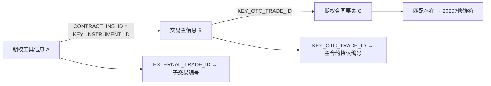

# 合约模型查询：五个容易误判的问题

本篇供遇到具体疑点时查阅，不是读完[[00-20260911-认知实验/t03专题-协议/衍生品重点/01-一笔衍生品交易如何贯穿模型|01贯穿篇]]后的必读作业。已读来源、对象与字段的说明集中在[[00-20260911-认知实验/t03专题-协议/衍生品重点/02-TIT交易结构与存续期|02模型查阅]]；这里只追问：看似合理的查询，在哪一步改变了业务含义？

| 遇到的问题 | 直接进入 |
|---|---|
| 连接几张明细后，本金突然变大 | [[00-20260911-认知实验/t03专题-协议/衍生品重点/07-合约结构与模型对应#1. 为什么连接没有增加合约，本金却被放大了\|问题1：连接放大]] |
| 查询名称叫“互换”，却少了来源或腿 | [[00-20260911-认知实验/t03专题-协议/衍生品重点/07-合约结构与模型对应#2. 为什么查到的互换，只是其中一部分\|问题2：覆盖范围]] |
| 本金字段存在，却不能直接汇总 | [[00-20260911-认知实验/t03专题-协议/衍生品重点/07-合约结构与模型对应#3. 为什么都有本金字段，仍不能直接相加\|问题3：金额口径]] |
| 交易编号有值，修饰符仍然为空 | [[00-20260911-认知实验/t03专题-协议/衍生品重点/07-合约结构与模型对应#4. 为什么交易编号有值，期权修饰符却是NULL\|问题4：身份识别]] |
| 明细太多，想用MAX压成合约一行 | [[00-20260911-认知实验/t03专题-协议/衍生品重点/07-合约结构与模型对应#5. 为什么取MAX，可能拼出一条从未存在的记录\|问题5：日期与明细选择]] |

## 1. 为什么连接没有增加合约，本金却被放大了

先假设主表只有一份合约，本金为100万元。另有2条结构记录、10条观察日记录和3条保证金记录。下面的数字只是演示连接原理，不表示真实系统中存在这组记录。

如果把三张明细都**仅按合约编号**连接，每条结构记录会碰到全部10条观察记录；形成的每一行，又会碰到全部3条保证金记录：

| 查询走到哪一步 | 结果行数 | 同一笔100万元出现几次 |
|---|---:|---:|
| 只有合约主表 | 1 | 1 |
| 连接2条结构 | 2 | 2 |
| 再连接10条观察记录 | 20 | 20 |
| 再连接3条保证金记录 | 60 | 60 |

此时 `SUM(本金)` 得到6000万元，但合同并没有增加。增加的是明细之间的组合。改用LEFT JOIN也不会消除这种多匹配：它保留主记录，不保证每份合约只输出一行。

问题发生在连接之前：报表想要“一份合约一行”，输入却分别记录结构、日期和保证金对象。合约编号只能证明它们与同一份合约有关，不能证明这些明细彼此一一对应。它们若还有子交易、序号、业务日期或有效期要求，仅靠合约编号也无法表达。

因此，先说清最终要回答什么。如果是“这些合约的本金总额”，本金应在已经明确来源、日期和合约身份的主表范围内统计；若还要展示最近观察结果，应先按明确规则选出对应观察记录，并核验每份合约是否最多匹配一行。若要查看全部观察日，就保留日期明细，同时明确主表本金只是重复展示，不能沿这些行再次求和。保证金参数、余额、追保结果各有自己的对象与时间范围，也不能为了凑成一行就任意相加。

实际核验应记录每次连接前后的合约数、行数，以及每个连接键在右表匹配几行。静态SQL可以指出多匹配的条件，实际放大多少仍需业务行验证。腿与持仓的已见连接键见[[00-20260911-认知实验/t03专题-协议/衍生品重点/02-TIT交易结构与存续期#4. 互换腿：收益组成和支付方向|02第4—5节]]；履保对象各自记录什么见[[00-20260911-认知实验/t03专题-协议/衍生品重点/03-TIT履保账簿映射与结算#4. 同一履保参数表，装了静态条款和动态输入|03参数与结果说明]]。

## 2. 为什么查到的互换，只是其中一部分

`T03_OTC_SWAP_COMP_INFO`接纳普通互换、极速互换、确认书等来源。表名说明它们进入同类模型，不保证每个下游都消费全部来源。

107018提供了一个具体例子。它的两个 `UNION ALL` 分支，都把主合约来源限定为 `D_REF_TRS`；连接腿时，又要求腿类型为 `STRUCTURE_LEG_TYPE`。这两步是在依次缩小集合：

1. 先从互换主信息中选普通TRS来源，确认书等来源没有进入这条路径。
2. 在这些合约内，只保留结构化收益腿，固定收益腿和浮动收益腿不由该连接进入。
3. 再用腿的 `Leg_Glbl_Seq_No` 连接指定来源的持仓，并由持仓产品编号连接产品。

因此，假设某合约有一条固定收益腿、一条结构化收益腿，查询只出现后者，可能正是代码规定的结果；假设某确认书来源合约完全没出现，也不能立即解释为该合约不存在。这里描述的是筛选如何生效，不是实际漏数案例。

这还不是全部准入条件：任务另有状态、分类、账簿等内连接和状态排除。主表及部分关联使用处理日，持仓按更新日期集合选择，输出业务日来自持仓。因此不能把这条加工概括成“同一天的全部普通互换结构化腿清单”。[[00-20260911-认知实验/t03专题-协议/证据/SQL/107018.json|107018]]103—155、206—255行。

判断结果是否满足需求，应先明确业务要“全部来源的合约”“普通TRS的全部腿”，还是“满足这条加工准入条件的合约标的信息”。前两种要求不能由第三种结果自动满足。然后逐个核对来源、腿类型、持仓日期、状态及关联条件；已知被排除的范围应明确列出，而不是用下游名称替代覆盖说明。三类来源的身份和填充规则见[[00-20260911-认知实验/t03专题-协议/衍生品重点/02-TIT交易结构与存续期#2. 普通互换、极速互换、确认书分支怎么共存|02第2节]]。

## 3. 为什么都有本金字段，仍不能直接相加

假设需求是“按人民币汇总合约本金”。看到 `Cny_Nom_Prin` 这列，很容易直接取它；看到结果为空，又可能想将空值替成0，或者换取名字相近的本币本金。这两步都需要证据。

普通互换103941和确认书112119写同一张主表，但投影如下：

| 目标口径 | 普通互换103941 | 确认书112119 |
|---|---|---|
| 本币名义本金 | NOTIONAL_BASE | NOTIONAL |
| 原币名义本金 | NOTIONAL_ORG | 空字符串 |
| 本币动态名义本金 | DYNAMIC_NOTIONAL_BASE | DYNAMIC_NOTIONAL |
| 原币动态名义本金 | DYNAMIC_NOTIONAL_ORG | 空字符串 |
| 人民币名义本金 | 空字符串，注释标明停用 | 空字符串 |
| 结算币种名义本金／动态本金 | NOTIONAL／DYNAMIC_NOTIONAL | 空字符串 |
| 本币币种 | BASE_CURRENCY | 空字符串 |

这张表说明两件事。首先，同名源字段 `NOTIONAL` 在两个分支进入不同目标口径，不能按源字段名统一。其次，普通互换的人民币本金列虽然存在，该任务却明确不供值；确认书的本币本金有值，也不意味着本币币种已经一并提供。[[00-20260911-认知实验/t03专题-协议/证据/SQL/103941.json|103941]]187—191、234—240行；[[00-20260911-认知实验/t03专题-协议/证据/SQL/112119.json|112119]]185—189、237—243行。

若把这些空字符串填0，报表会将“此来源没有提供这个口径”改写成“该口径本金为零”。若改用本币本金却默认本币都是人民币，又会把尚未确认的币种转换包装成已有数据。空字符串、SQL NULL与数值0是三种不同状态，不应在清洗时无条件互换。

“原币”描述币种口径，不能读成“最初的本金”。名义本金和动态名义本金的这些投影也只是取源值，没有给出动态本金与部分终止之间的通用计算公式。

要完成最初的人民币汇总，需先明确采用哪种名义本金口径、是否取动态值，以及统计哪个业务日，再逐来源确定可用金额与币种，以及获认可的换算规则。缺失的来源应单列覆盖缺口；在这些条件未满足前，仅凭本地投影不能给出完整人民币总额。远期同时保存两种货币及多个汇率的情况，另查[[00-20260911-认知实验/t03专题-协议/衍生品重点/02-TIT交易结构与存续期#8. 外汇远期：两种货币和多个汇率不能压成一个金额|02第8节]]，同样不能把两边数量直接相加。

## 4. 为什么交易编号有值，期权修饰符却是NULL

105395不是从一张已具备完整协议身份的源表直接复制。它从子工具记录出发，经过两次LEFT JOIN，分别回答“属于哪笔交易”和“这笔交易能否在期权合同要素中匹配”：

编号取自B，修饰符却由C的匹配决定：`CASE WHEN C.KEY_OTC_TRADE_ID IS NOT NULL THEN '20207' END`。这段CASE没有ELSE，所以未匹配C时得到SQL NULL。[[00-20260911-认知实验/t03专题-协议/证据/SQL/105395.json|105395]]100—103、182—186行。

| 假设的匹配情况 | 主合约协议编号 | 期权修饰符 | 能确认到哪一步 |
|---|---|---|---|
| B与C均匹配 | 来自B | 20207 | 两步身份链均匹配 |
| B匹配、C未匹配 | 仍来自B | NULL | 找到了交易，未完成该任务的期权身份识别 |
| B未匹配 | NULL | NULL | 未经B找到主交易；A自己的外部子交易号仍可能有值 |

因此，“子交易编号有值”“主交易编号有值”“协议编号与修饰符完整”不是同一个判断。LEFT JOIN允许工具记录留下来，不要求每一步都匹配成功。以上是SQL允许的情况，尚无业务行证明当前实际出现了哪一种。

排查时沿相同业务日逐步核对A的 `CONTRACT_INS_ID`、B的工具与交易编号、C的交易编号，先定位缺在哪次连接，再查源记录为何没有匹配。不能仅因表名叫期权子交易，就把缺失修饰符统一补成20207；这样会掩盖原本待识别的身份。产品、账簿、系数、方向和日期的其他投影集中见[[00-20260911-认知实验/t03专题-协议/衍生品重点/02-TIT交易结构与存续期#6. 期权为什么需要主合约、子交易、观察日三层|02第6节]]。

## 5. 为什么取MAX，可能拼出一条从未存在的记录

假设同一份合约有两条观察约定：

| 观察日期 | 障碍比例 |
|---|---:|
| 2026-09-01 | 90% |
| 2026-10-01 | 80% |

这只是教学数据。如果按合约分组，分别取 `MAX(观察日期)` 和 `MAX(障碍比例)`，就会得到“10月1日、90%”。日期来自第二行，比例来自第一行，组合后的约定从未出现在输入中。字段各自都能转成一个值，不表示这些值属于同一条记录。

若问题是“最近一次观察的约定”，需要按日期选中那条完整记录，并处理同日多条的情况；不能独立取各列最大值。若问题是“合约全部观察安排”，只保留最近一条本身就丢了问题所需的历史。先确定问题，才有理由决定保留哪些行。

其他附表也有不同的明细维度。障碍线、障碍价格、协商价格、执行价、票息率和结构要素可能按序号区分；观察日、观察区间及子交易自动赎回、日期/区间属性保存各自条件；压力场景保存特定情景下的结果；结算则记录业务结果。它们不能因为都带合约号，就互相补成一个“价格”或“金额”。压力场景的多个结果也不是可以任意择最大值代替实际结算的候选值。现有对象范围可追查[[00-20260911-认知实验/t03专题-协议/资料/物理对象与字段.json|本地元数据]]。

真正将明细横向展开，需要先说明选取规则。103943把障碍和参与率两张表各按序号0、1展开为固定列，具体投影见[[00-20260911-认知实验/t03专题-协议/衍生品重点/02-TIT交易结构与存续期#6. 期权为什么需要主合约、子交易、观察日三层|02第6节]]。即便规则明确，所选“交易ID+序号+日期”是否唯一仍需数据核验；筛了序号也不能代替这一步。

本轮没有逐份审读全部观察区间与压力场景生产任务，尚不能给出它们的精确唯一键、情景码值和收益公式。涉及这些对象时，应保留对应明细与疑问，再查生产任务；没有依据的 `MAX` 只会让问题暂时看不见。

以上问题解决到当前查询能够正确解释即可，不需要顺读所有关联主题。若疑点转向账簿的管理标志、履保参数与监控结果、结算与实际付款的区别，直接查[[00-20260911-认知实验/t03专题-协议/衍生品重点/03-TIT履保账簿映射与结算|03资金、履保与账簿说明]]。
