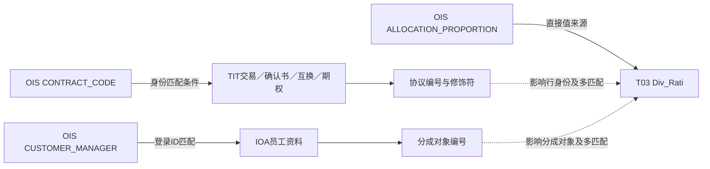

# TIT 与 OIS：从合约事实到销售归属

本篇保留原有合约与销售归属推导。系统范围已在 [[00-20260911-认知实验/t03专题-协议/衍生品重点/README|衍生品重点]] 中扩充：TIT 新增结构、履保和收付款深入分析，OIS 新增主体准入、协议阈值、报告运营、产品与系数。下文“本次已读任务”指本篇原有案例范围，不代表 OIS 的全部入模贡献。

## 1. 先区分系统，再连接业务

本地 CD100 将 TIT 命名为“场外衍生品投资管理系统”，OIS 为“OTC综合业务平台”。用户习惯称前者 TITANS、后者 OTC 运营管理平台；本稿保留系统代码和字典中文名称，避免只给缩写。IOA 的本地名称是“企业门户2.0”。[[00-20260911-认知实验/t03专题-协议/字典/来源系统中文名称.json|来源名称及日期]]。

在本次已读任务中，TIT 主要提供合约、资金账户、账簿、结构、持仓和交易状态；OIS 的重点来源是合约开发关系与分成比例；IOA 补充登录账号到员工编号的连接。这是所核验链路里的分工，不是说 OIS 只有销售信息或 TIT 独占所有合约事实。

从学习上应先看 TIT 如何把一个交易拆成协议身份、账户、交易对手、账簿和结构；再看 OIS 如何用其合约代码找到这份交易、指定分成人及比例；最后看下游如何选择合同级和客户级归属。这个顺序能避免一开始就把“交易对手、客户经理、销售商、所属部门”混在一个人员组织表里。

## 2. TIT 的一个交易，在 T03 中分散成什么

| 问题 | 本次核验对象或任务 | 关键点 |
|---|---|---|
| 哪份互换 | AGT 103930、互换专表 103941 | 交易ID与20206身份；共性与特性可平行来自源表 |
| 谁是对手 | 主体关系 103933、专表交易对手字段 | 角色06和TIT060前缀，不能替代所有来源分支规则 |
| 用哪个资金账户 | 协议关系 103935、专表账户字段 | A17实际由合约指向账户 |
| 放在哪个账簿 | 107018消费N03关系、105382账簿属性 | 账簿是20411协议对象，名称和归属有时间限定 |
| 互换经济结构 | 103942 | 合约内多条腿，腿标识用于连接持仓 |
| 期权经济结构 | 103943、105395 | 主合约和子交易编号不同，工具ID参与桥接 |
| 外汇远期结构 | 163771、163772 | 合约级信息与双币种支付结构分开 |
| 余额如何入仓 | 107280 | 源余额进入期初余额，币种与当前余额填空 |

它们不是一条固定的物理流水线。通用身份、专用合约、关系和属性往往各自从源系统加工。模型图中的“属于”关系与任务图中的“读取”关系必须区分。

## 3. OIS 合约代码如何对齐 TIT 合约身份

任务 134215 从 OIS `O_CONTRACT_INTRODUCTION`（合约开发关系分成表）生成 `T03_AGT_DIV_RATI`。最核心的两段是：

```sql
COALESCE(T2.KEY_OTC_TRADE_ID,
         T3.KEY_TRADE_COMFIRM_ID,
         T1.CONTRACT_CODE) AS Agt_Id

CASE WHEN T4.KEY_OTC_TRADE_ID IS NOT NULL THEN '20206'
     WHEN T5.KEY_OTC_TRADE_ID IS NOT NULL THEN '20207'
     WHEN T3.KEY_TRADE_COMFIRM_ID IS NOT NULL THEN '20206-KST'
     ELSE '' END AS Agt_Modifr
```

T1 是 OIS 合约开发关系；T2 是 TIT 交易主信息，通过 `T1.CONTRACT_CODE=T2.INTERNAL_TRADE_ID` 连接；T3 是 TIT 交易确认书信息的确认书编号集合；T4、T5 则识别该交易是否存在于互换或期权来源。

这里要注意，编号和修饰符分别决策。编号先尝试交易ID，再尝试确认书ID，最后保留源合约代码；修饰符则依据互换、期权、确认书是否匹配选择。不能把这两段描述成“只要得到一个编号，就一定成功标准化为某类协议”。可能出现源代码保留下来而修饰符为空，也可能存在多个来源同时匹配时的优先级效应。

保留 `Src_Agt_Id=T1.CONTRACT_CODE` 很重要：它提供回到 OIS 原始合约的入口。实际核验时应同时看源合约代码、标准编号、修饰符和匹配路径，不能只检查 Agt_Id 非空。

证据：[[00-20260911-认知实验/t03专题-协议/证据/SQL/134215.json|134215]] 的 SELECT 与关联段。本文将语句排版简化，完整上下文保留在证据中。

## 4. 分成人身份也存在回退

任务固定 `Div_Type_Cd='IB_CUST_DIV'`、`Div_Obj_Type_Cd='01'`，分成对象取 `NVL(D.ERP_ID,T1.CUSTOMER_MANAGER)`，比例直接取 `T1.ALLOCATION_PROPORTION`，删除标志由源 Y/N 转成 1/0，其他值保留。

员工连接 D 由 IOA 在职与删除用户资料 UNION ALL 组成，筛选主部门和非空 ERP 编号，再以 OIS 客户经理字段连接登录 ID。由此可见：能匹配 IOA 时输出 ERP 编号，不能匹配时保留源客户经理值。目标列虽然统一叫分成对象编号，内容并不保证全部都是 ERP 身份。

UNION ALL 也没有自动确保一个登录账号只有一行。若在职和历史用户中有重复匹配，分成行可能增多；这需要行数据核验，当前不能宣称已经发生。类似地，比例直接传递只证明来源，不证明各分成人比例之和为100%，也不证明已经计提或支付了收入。

本地没有确认 `IB_CUST_DIV` 和 `01` 对应的完整独立字典全集，因此本文依据源表和投影解释为合约开发关系的销售归属输入，未将样例码值推广为所有分成类型。表注释如果写“合约结算”，也不应压过这条实际加工链。

## 5. 图谱里要分开“数值来自哪里”和“哪些行能匹配”



字段图已经确认 `Div_Rati` 的值表达式为 `T1.ALLOCATION_PROPORTION AS Div_Rati`，并绑定任务 134215 的具体写入。TIT 和 IOA 的参与主要在身份匹配、对象映射和可能的行基数上，不能因为它们与任务相连，就声称比例数值由这几个系统共同计算。[[00-20260911-认知实验/t03专题-协议/证据/图谱-分成字段.json|字段图证据]]。

## 6. 消费端的“合约优先、客户兜底”要精确到字段

105743 是另一条管理和销售归属消费案例。它从 `T98_OTC_DERI_COMP_SALE_INFO` 选择当日、账簿部门为 OTC/OTC_HK 的合约信息，再分别连接合约级归属 ci 与客户级归属 cpi，输出多组机构、客户经理和比例。

多处表达式是逐字段 `COALESCE(ci.field,cpi.field)`。这不等于“整套合约归属存在就全用合约，否则全用客户”。构造一个例子：ci 的部门为 D1、员工姓名为 NULL、比例为 0；cpi 的部门为 D2、姓名为王某、比例为 0.5。结果可能是部门 D1、姓名王某、比例 0，三个值分别按空值情况选取，而不是整体来自一套记录。

空字符串也不是 NULL。上游临时表的多处条件聚合使用 `ELSE ''` 或 `ELSE '0'`，这些占位值可能阻止 COALESCE 继续回退。要解释“为什么明明有客户归属却没补上”，必须检查值是 NULL、空串还是零，而不是只检查 ci 是否关联成功。

这条消费链还包含特定场景下的交易对手替换规则，不能把客户级回退概括为对所有合同完全一致。本文未将具体业务主体编号搬到学习材料中，完整规则请回本地任务原文核验。重点是保留逐字段优先级、占位值与业务限定这些影响结果的机制。[[00-20260911-认知实验/t03专题-协议/证据/SQL/105743.json|105743]] 127–164、220–244、278–298 行。

## 7. 不要把两条销售链强行连成一条

134215 明确生产 T03 分成比例；105743 展示下游管理归属的合约级与客户级选择。但本次所读 105743 来源包括其本地临时归属计算，并没有据此证明它直接读取 `T03_AGT_DIV_RATI`。两者说明相近业务如何建模和消费，不应画成未经证明的 `134215 → 105743` 直连。

如果要追踪某个业务数字，应该指定目标表和字段，再沿真实 SQL 或字段图查询；如果要理解业务概念，可以横向比较两条链，但要标清“概念对照”和“物理血缘”是不同证据。

## 8. 实际学习和核对时，可以沿四个问题回查

第一，源合约在 OIS 与 TIT 各用哪个编号，桥接是否成功，是否保留了未识别的修饰符。第二，这个人是交易对手、销售商、客户经理、经办人还是分成人，使用主体编号、登录号还是员工号。第三，这个值是比例、名义本金、余额、收益还是结算金额，是否存在不同来源与空值回退。第四，结果表达哪个日期、哪个账簿视角，是当时有效还是当日重新归属。

回答清楚这四个问题，比只记住两个系统的全称更有用：它能解释一份合约为何在两个平台表现不同，也能帮助定位报表归属、分成和持仓不一致时应从哪一层查起。
