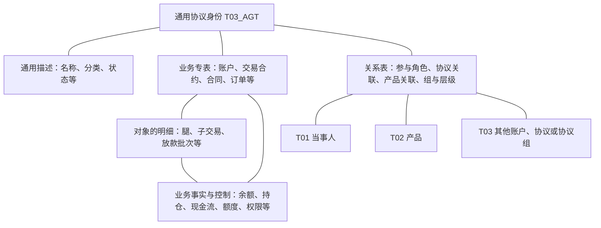

# 物理模型清单与连接示意

这里保留已整理表目录的覆盖数量及共用连接示意，用于查表。业务全貌见[[00-20260911-认知实验/t03专题-协议/00-全貌与证据边界|全貌与业务矩阵]]；目录分组不作为业务分类。

## 2. T03 模型地图：有哪些表，彼此怎样连接

**T03 的范围需要同时看业务对象和围绕对象保存的信息。** 账户、合约、合同、订单与管理对象构成业务对象范围；通用属性、关系、结构、余额、持仓和控制信息使这些对象能够被完整描述。第3节展开业务范围，本节先把现有物理表及其连接方式定位清楚。

### 2.1 现有表清单覆盖到哪里

本地已整理的 Hive / pdata_n 可解析目录有 **256 条物理记录**，以下九行完整汇总该目录的九组，数量合计256。右栏只列定位用的代表表，逐表名称和注释见[[00-20260911-认知实验/t03专题-协议/资料/逐表对象目录|256条逐表目录]]。

| 现有目录分组     | 记录数 | 包含什么及代表表（省略 pdata_n 前缀）                                                                                                                 |
| ---------- | --: | --------------------------------------------------------------------------------------------------------------------------------------- |
| 通用协议属性与关系  |  39 | `T03_AGT` 登记共性；`T03_AGT_NAME_H / CLAS_H / STAT_H` 保存名称、分类、状态；`T03_AGT_PTY_RELA_H / RELA_H / PRD_RELA_H` 连接当事人、其他协议和产品；本组还收录部分算法、费用与持有信息 |
| 场外合约及结构    |  26 | 互换、期权、外汇远期主信息；互换腿、头寸、持仓；期权子交易、观察日、障碍线与结算。入口为 `T03_OTC_SWAP_COMP_INFO`、`T03_OTC_OPT_COMP_INFO`、`T03_OTC_FX_FWD_COMP_INFO`                |
| 场外账簿与运营支撑  |  17 | 账簿配置、协议组附加、映射规则、履保参数及组合追保，如 `T03_OTC_DERI_BOOK_ADTNL_INFO`、`T03_OTC_COMP_PERF_MARG_REF`                                                 |
| 订单与业务办理    |  13 | `T03_ORD` 及不同业务的办理信息；各业务的申请、触发、执行过程需分别解释                                                                                                |
| 持有余额与对账    |  34 | 账户余额、持仓及对账相关表，如 `T03_AST_CRRC_ACCT_BAL`；目录也把托管股东账户 `T03_CVS_MKTHOLD_ACCT` 放在这里                                                          |
| 额度权限与控制    |  18 | 业务权限、限额与控制相关表，如 `T03_PB_AST_UNIT_OPER_BUSI_RIGH`；通用额度和权限表另在第一组                                                                          |
| 其他合约与签约    |  43 | 两融合约、股票质押、转融通、托管、租赁、借款及公司合同，如 `T03_MARG_COMP_INFO`、`T03_REF_COMP_INFO`、`T03_CSTD_CONTR_INFO`；还含放款、提款、付款与现金流明细                           |
| 账户与管理单元    |  54 | `T03_AST_ACCT`、`T03_SCR_ACCT`，PB、资管、自营等专用账户；投顾资产单元、组合及账户附加信息                                                                            |
| 其他业务附加与待归类 |  12 | 银行存款及每日明细、负债、保单附加险、未结束结算等；不能因尚未归类而从全貌中删去                                                                                                |

**这九组是现有目录的归档位置，尚不是业务层级。** 例如账户本身和账户余额分在不同组，通用持有表与专用持仓表也分散在不同组。理解某个业务对象时，需要跨组把相关表连接起来。

这个清单也有明确边界：同一 Hive / pdata_n 范围另有90条未成功解析的记录；跨平台、schema的完整元数据共1,073条。因此，上表是已整理部分的完整索引，整个本地采集范围仍需结合[[00-20260911-认知实验/t03专题-协议/资料/物理对象与字段.json|物理对象与字段]]查看。

### 2.2 表之间怎样构成一个业务对象

下面展示模型之间的逻辑联系。连线表示“共同描述或关联”，具体 Join 仍需按源系统、键和时间核对；不是任务加工顺序，也不表示所有专表均已验证能与 `T03_AGT` 对齐。

读这张图时，关键是区分以下实际连接：

- **同一个对象的不同描述**：资金账户的通用身份与 `T03_AST_ACCT` 的账户信息，互换的通用身份与 `T03_OTC_SWAP_COMP_INFO` 的合约信息。两张表可以分别从源系统生产；身份对应不等于一张读取另一张。
- **一个对象的内部展开**：互换主信息与 `T03_OTC_SWAP_COMP_LEG_INFO`，期权主信息与子交易及观察要素；融资租赁则展开为合同、放款明细、放款明细现金流。此时要增加腿、子交易、批次或现金流标识，不能只按协议号连接全部明细。
- **两个独立对象的关联**：`T03_AGT_RELA_H` 连接合约和账户等协议；`T03_AGT_PTY_RELA_H` 说明当事人在协议中的角色；`T03_AGT_PRD_RELA_H` 连接产品。关系类型、两端身份和有效期共同决定含义。账户、合约和客户不会因有关联就变成同一个对象。
- **对象在某时点的业务事实**：账户余额增加币种和日期，持仓增加标的、头寸等维度，现金流增加支付或计息安排。具体一行是什么，以各表字段和加工为准；不能把这些表一律理解成“一份协议一行”。

上述连接分别在[[00-20260911-认知实验/t03专题-协议/建模基础/关系角色与连接|关系方向]]、[[00-20260911-认知实验/t03专题-协议/衍生品重点/07-合约结构与模型对应|场外结构]]、[[00-20260911-认知实验/t03专题-协议/实现详解/服务与经营合同|合同与现金流]]及[[00-20260911-认知实验/t03专题-协议/建模基础/历史时间与消费口径|持仓余额]]展开。已有代表源加工说明，尚未逐一验证全部表、全部来源和键唯一性，具体缺口见[[00-20260911-认知实验/t03专题-协议/证据/全域分支补充/覆盖与证据|覆盖台账]]。

TIT（场外衍生品投资管理系统）与OIS（OTC综合业务平台）要沿这些对象和关系继续穿透：TIT重点涉及账户、合约、结构、账簿与持仓；OIS已读案例中的合约分成进入 `T03_AGT_DIV_RATI`，其他客户、产品及报告配置还涉及T01、T02、T05等主题。它们是来源视角，具体落点见[[00-20260911-认知实验/t03专题-协议/衍生品重点/00-模型层与贴源层如何对应|TIT/OIS模型与来源对应]]。下游T98等消费在本专题追踪，但不计入T03表清单。
