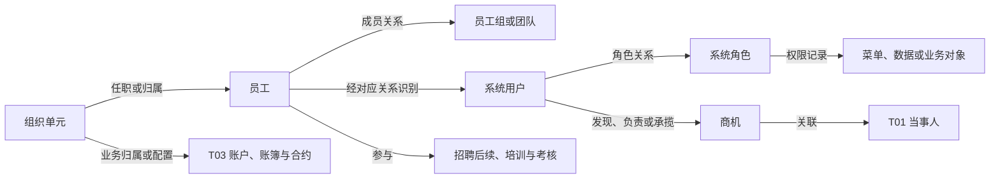

# 全貌：先分对象，再理解关系和管理活动

[返回入口](README.md)

## 1. T04 在整套模型里回答什么

T01 主要提供参与者身份，T02 提供产品与标的资料，T03 提供账户、合同、交易合约等业务安排。T04 则提供组织开展这些业务的人、组织单元、系统身份及相关管理记录。

Wiki《模型层主题划分》（pageId `255499828`）明确列出员工、用户、角色、内部机构、员工组、用户组、职务和课程，也明确说用户包括对客平台和内部平台用户。“公司内部的数据都属于这个主题”是页面中的概括；本专题用实际表来收窄它：财务核算仍有 T09，营销活动仍有 T07，不能凭这句话把它们都归到 T04。[正文快照](attachments/03-系统用户角色与权限/IMG-03-系统用户角色与权限-20260914110757618.json)

可以用一个**概念示例**理解各对象的分工：员工甲调到另一部门，使用 OA 和交易系统两个账号，参加研究团队，拥有某菜单权限，同时完成一门课程。这里至少存在员工、任职分配、部门、两个系统用户、团队成员关系、权限记录、课程和学习结果。把它们做成“员工一行”，会丢失不同账号、多个任职和不同生效时间。

## 2. 三层认识，六个业务入口

先从三个问题看模型表达：

| 层次 | 业务问题 | 典型表达 |
|---|---|---|
| 对象与资料 | 存在什么对象，它有什么属性？ | 内部机构、员工、用户、角色、团队、职位、课程 |
| 关系与安排 | 谁与谁相连，以什么方式、在什么期间相连？ | 上级机构、机构映射、用户员工对应、职位分配、团队成员、授权 |
| 管理事项与结果 | 围绕这些对象办理了什么，记录了什么？ | 应聘、面试、培训、学分、考核、津贴、商机、分成 |

这三层是解释方式；首页六个业务分支是阅读入口。同一业务分支通常同时涉及三层，不把“员工”“历史”“PAS”“权限”混成一棵同级目录。

图中是业务联系，箭头表示阅读方向，不声明主外键、唯一基数或加工血缘。例如“员工—系统用户”必须经过身份对应；它不是姓名相等。

## 3. 为什么“内部机构”也不是一套统一组织树

相同的营业部可以在不同系统承担不同用途：柜台办理业务、行政管理、结算核算、OA 工作协作。系统编号、分类方法和停用状态可以不同。

`T04_INR_ORG` 接纳这些机构档案；`T04_INR_ORG_RELA_H` 同时存上级关系和跨体系映射；`T04_INR_ORG_HRCH_RELA` 把若干祖先位置展开到列；`T04_ERP_INR_ORG`、`T04_OAS_INR_ORG`、`T04_RCC_INR_ORG`、`T04_PB_INR_ORG` 保存不同业务体系的附加表达。

从表名看，它们都带 ORG；从业务问题看，分别是“这个机构是什么”“另一个编号对应谁”“它在某套层级哪里”“该体系还需要哪些属性”。先分开问题，再决定用哪张表。

## 4. 不要把可用资料误当同一份事实

业务数据的来源分工见 [来源职责与交叉矩阵](00-20260911-认知实验/t04专题-内部机构/建模基础/来源职责与交叉矩阵.md)，涵盖系统中文名、源对象和多来源共同进入模型的关系。下面列的是核实这些结论所使用的资料类型。

| 资料 | 用来回答 | 不能直接替代 |
|---|---|---|
| Wiki 正文 | 主题设计、命名规范、历史问题背景 | 当前 SQL 和实际运行结果 |
| 平台目录及分类 | 有哪些已收录资产、平台给了哪些标签 | 全公司表全集、字段代码层级 |
| 表字段元数据及 DDL | 一张物理表有哪些列和分区 | 数据唯一性、填充率、源字段转换 |
| 任务 SQL | 这份采集代码怎样筛选、映射、连接和写入 | 运行成功、参数完整性、业务认可 |
| 码值库 | 特定代码域中的含义、备注和日期 | 源系统代码一定已成功转换 |
| 图谱或词法候选 | 定位相关表和任务 | 已证实的分区因果关系与全量闭包 |

本次有一项具体冲突：平台给 `t04_inr_org` 的描述称“历史拉链表”，但已读 PAS 分支取组织当前版本后覆盖来源分区，主表没有 `strt_date/end_date`；OA 分支又维护另一种存量更新逻辑。因此正文解释到来源分支，不把注释直接推广到全表。

## 5. 怎样判断自己已经理解一个分支

以“员工属于哪个部门”为例，应能继续回答：问行政归属、OA 叶子节点、费用部门还是部门负责人？用员工号还是系统用户号？是当前关系还是某天关系？是否允许多个任职？需要最终柜台四位码，还是 `ERP-` 前缀的行政机构编号？

能解释这些选择，就可以独立推理。单独记住 `Emp_Id` 和 `Inr_Org_Id` 两个字段，还不足以写出正确连接。
