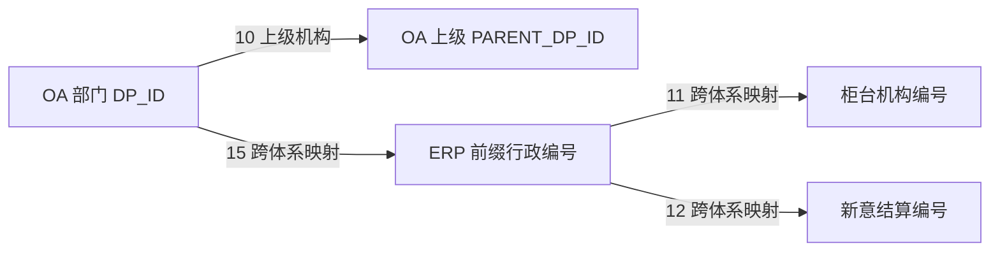

# 机构体系：先问是哪一套，再问它与谁相连

[返回入口](00-20260911-认知实验/t04专题-内部机构/README.md)

## 1. 一家营业部为什么会有好几个机构编号

业务办理、行政管理、清算核算和办公协作使用不同机构体系。T04 接纳这些体系，没有证据表明它已经把所有机构合并成唯一的企业组织主数据。

`t04_inr_org` 保存机构共性资料；名称、状态、分类、联系地址可以单独保存历史；关系表说明另一端是谁；各体系附加表保存专属字段。以下表默认指 Hive `pdata_n`。

| 模型入口                                                                                     | 解决的问题                 | 需要保留的区别                       |
| ---------------------------------------------------------------------------------------- | --------------------- | ----------------------------- |
| `t04_inr_org`                                                                            | 某来源中的机构编号、名称、类别和状态    | 一套体系内识别对象，不承诺全局统一编号           |
| `t04_inr_org_name_h`、`t04_inr_org_stat_h`、`t04_inr_org_clas_h`                           | 名称、状态、分类随期间怎样变化       | 分类类型与分类结果、状态类型与状态结果各自配对       |
| `t04_inr_org_rela_h`                                                                     | 与上级或另一套机构编号有什么关系      | 关系代码决定语义，方向不能颠倒               |
| `t04_inr_org_hrch_rela`                                                                  | 在一套机构结构中有哪些祖先位置       | `lvl1…lvl7` 是展开列，不是七种全国统一机构类型 |
| `t04_erp_inr_org`、`t04_oas_inr_org`、`t04_rcc_inr_org`、`t04_pb_inr_org`、`t04_ssm_inr_org` | 行政、办公、柜台、PB、席位体系的专属资料 | 不能仅按相近名称互相替代                  |
| `t04_otc_deri_dept_adtnl_info`                                                           | 场外账簿部门的公司、本币与履保配置     | 粒度首先是源配置记录，未证明部门一行            |

## 2. 类别与类型是两层描述，但不是统一前缀树

本地 `CD014 / INR_ORG_CATE_CD` 有 22 条码值，包括柜台 `1`、ERP `2`、新意 `3`、OA `4`、财务核算管理 `5`、场外衍生品 `17`。类别更多表达来源中的机构体系，而非同一棵树上的行政级别。

`CD015 / INR_ORG_TYPE_CD` 再解释各体系里的类型。比如 OA 的 `401` 为营业部；ERP 的 `20701/20702/20703` 为一级／二级／三级营业部；TIT 的 `620/621` 为场外衍生品部门／公司。TIT 类别是 `17`，类型却是 `620/621`，所以不能把“类型截首位”等同于类别映射。

ERP 类型里还有历史类型和新类型并存。`205` 的备注说明旧区域业务总部与新分公司类型含义有区别；`22002` 明确为不属于任何一家分公司的总部直属营业部。取数不能默认每家营业部都能找到一个分公司。[完整码值及备注](00-20260911-认知实验/t04专题-内部机构/字典/机构类别与类型.md)

## 3. 机构关系至少要分成三类

| `CD018` 代码 | 关系含义 | 按什么方向阅读 |
|---|---|---|
| `10` | 上级机构 | 本机构 → 上级机构 |
| `20` | 合规视角的上级机构 | 特定视角内的层级，不自动等于行政上级 |
| `11` | ERP 与零售经纪柜台机构映射 | ERP 编号 → 柜台编号 |
| `12` | ERP 与新意结算机构映射 | ERP 编号 → 新意编号 |
| `15` | OA 与 ERP 机构映射 | OA 编号 → ERP 编号 |
| `14` | 营业部与分公司归属关系 | 营业部 → 所属分公司 |
| `18` | 智慧人力一级机构 | 源 `FIRST_LEVEL_ORG_ID` 指向当前机构版本，不等同于直接上级 |

例如 OA 加工从同一张 `I_GF_DEPARTMENT` 产生两类边：`DP_ID → PARENT_DP_ID` 写 `10`；`DP_ID → CONCAT('ERP-',ORG_ID)` 写 `15`。这不是两条上级关系，第二条是在切换身份体系。[61608.sql，32–60 行](attachments/01-机构体系与跨系统映射/IMG-01-机构体系与跨系统映射-20260914110757619.sql)

图表达已读分支的方向规则，不断言每个节点都有全部映射，也不声明一对一。

PAS 的完整文件缓存还解释了关系期间怎样由源版本日期形成、相邻同内容期间怎样合并，以及关系 `14` 怎样跨不同层级推导分公司。它另外写入财务机构段／部门段关系 `21/22`，这两个值没有命中本地 CD018。完整推导和证据差异见 [机构历史与分公司归属](00-20260911-认知实验/t04专题-内部机构/实现详解/机构历史与分公司归属.md)。

## 4. PAS 与 OA 如何写进同一机构模型

PAS 分支 `61476` 把 `J_HSSORG_ORG` 与版本表按 `A.ID=B.ORG_ID AND A.CUR_VERSION=B.VERSION` 连接，源主表限定 `ENABLE_STATUS IN ('1','2')`。它把版本 `CODE` 拼为 `ERP-` 编号，从 JSON 名称取中文，用转换表映射机构类型和状态，最后覆盖沿用的 ERP 来源分区。[61476.sql，30–81 行](attachments/README/IMG-README-20260914110800287.sql)

这里有两个容易忽略的细节。第一，保留 ERP 命名不等于仍由 ERP 表生产。第二，虽然投影中还写了 `ENABLE_STATUS='9'` 时的删除标志，当前源过滤已把 `9` 排除；因此不能仅看 CASE 就说本分支会输出全部删除机构。

OA 分支 `61543` 直接用 `DP_ID` 作编号，类型通常是 `4` 加补齐两位的源 `DEPT_TYPE`，另外含一条明确例外。它把当天数据与本来源存量按机构 ID 全外连接，区分新增、更新、删除和不变；更新时保留旧 `busi_date`，新增时写当天，消失记录设置删除标志。[61543.sql，36–195 行](attachments/01-机构体系与跨系统映射/IMG-01-机构体系与跨系统映射-20260914110802434.sql)

因此机构主表的 `busi_date` 不能跨来源统一理解成“这一行的每日快照日”，也不能因为平台注释写了拉链，就对主表使用开始结束区间。

## 5. 层级展开表为什么也要看来源

柜台分支 `61565` 读取 `U_ALLBRANCH` 的 `LEVEL1…LEVEL4`，回连同一天的机构记录取名称，并排除某级指回自身的情形；五至七级留空。行政分支 `145723` 则按另一套祖先路径展开到七级，包含组织结构编号和名称。[柜台 SQL](attachments/01-机构体系与跨系统映射/IMG-01-机构体系与跨系统映射-20260914110802467.sql)、[PAS SQL](attachments/01-机构体系与跨系统映射/IMG-01-机构体系与跨系统映射-20260914110804368.sql)

不能据此说 `lvl2` 总是分公司、`lvl3` 总是营业部。行政样例还有一处明确文本问题：判定第七级的条件同时要求 `lvl6` 非空和为空，分支不可满足。它证明这份 SQL 的该表达式有问题，未证明当前线上数据已受影响；后者还需核实执行版本和数据。[差异台账](00-20260911-认知实验/t04专题-内部机构/证据/已知差异与待核实事项.md)

## 6. TIT：账簿部门是经营配置对象

`D_BK_DEPARTMENT_PROPERTIES` 同时包含 `ID、DEPARTMENT、COMPANY、BASE_CURRENCY、ENABLE_CURRENCY_MARGIN`。已读三个生产任务从同一源对象表达三件事：

| 目标 | 实际加工 | 业务解释 |
|---|---|---|
| `t04_inr_org`，`165634` | 分别抽 `DEPARTMENT` 和 `COMPANY`，按 `Department/Company` 匹配字典项名称与字典名，写类别 `17`、类型 `620/621` | 登记部门和公司两个对象类型 |
| `t04_inr_org_rela_h`，`165637` | `DEPARTMENT → COMPANY`，关系 `10`；用日期区间维护变化 | 某部门归属哪个业务公司 |
| `t04_otc_deri_dept_adtnl_info`，`165638` | 保留源 `ID`，投影部门、公司、本币；跨币种履保 `Y/N → 1/0` | 保留配置记录和业务参数 |

`165634` 在两类对象间使用 `UNION ALL`，比对时又按机构 ID 连接。若公司和部门恰好出现同值 ID 是否冲突，现有元数据和 SQL 无法证明不会发生。附加表也保留 `src_id`；下游只按部门连之前，要核实同一来源部门是否有多条配置。

本币的实际消费者已在 `211619` 中找到：T03 账簿的 `Bel_Dept` 连 T04 的 `Inr_Org_Id`，输出 `DP.Lcrrc_Crrc_Cd`。所以这里的部门不是页面展示标签，它参与交易结果的币种解释。完整路径见 [下游消费](00-20260911-认知实验/t04专题-内部机构/07-从模型到下游消费.md)。

本节依据：[机构主表](attachments/01-机构体系与跨系统映射/IMG-01-机构体系与跨系统映射-20260914110806203.sql)、[关系](attachments/01-机构体系与跨系统映射/IMG-01-机构体系与跨系统映射-20260914110807708.sql)、[附加配置](attachments/07-从模型到下游消费/IMG-07-从模型到下游消费-20260914110758654.sql)。源变量及物理绑定仍按证据台账保留边界。
