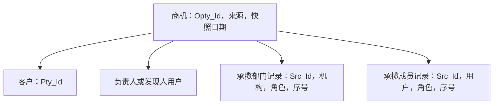

# 商机：客户需求怎样变成内部协作记录

[返回入口](00-20260911-认知实验/t04专题-内部机构/README.md)

## 1. 商机以待推进的事项为中心

客户是参与者，商机是围绕某个客户需求需要识别、跟进或促成的机会。商机可以有负责人、发现人、多个承揽部门和多个成员；这些角色不能压成客户主档上的一个员工字段。

`pdata_n.t04_busi_opty` 保存商机 ID、名称、类别、客户、需求、状态、成功概率、预计及实际签约日期、预计收入、负责人和发现人。部门与成员另在 `t04_busi_opty_ctrt_dept` 和 `t04_busi_opty_ctrt_mem` 中保存；转介绍在 `t04_busi_opty_covt_intro`，线索和撮合在 `t04_clue_info`、`t04_clue_attr_info`、`t04_opty_mtch_info`。

这些对象位于 T04，并不意味着所有营销活动都属于 T04。T07 的营销活动、权益等仍有独立主题；这里的重点是内部对商机的责任和办理组织。

## 2. 商机类别比表名更能限定范围

本地 `CD940` 给出四类：ECR 战略客户商机、电商客户商机、易淘金运营活动商机、企业微信资讯浏览商机。它们同放 `t04_busi_opty`，并不保证触发方式、负责人身份或转化口径一致。

本版精读 ECR 战略商机，其他类别保留元数据、码值及 SQL 候选。不能用 ECR 一条签约规则代表资讯浏览线索的全部处理过程。[字典](00-20260911-认知实验/t04专题-内部机构/字典/README.md)、[逐表候选](00-20260911-认知实验/t04专题-内部机构/证据/逐表SQL覆盖.md)

## 3. ECR 主表怎样进入模型

`126738` 的源对象为战略商机 `CX_OPTY` 分支；SQL 将 `ROW_ID` 写商机号、`ACC_ID` 写当事人号，类别固定 `STRG_CUST_OPTY`。它转换商机状态和签约标志，保留成功概率、预计签约时间、实际签约时间与预计收入，并以 `src_tbl+busi_date` 保存当天快照。[126738.sql，41–90 行](attachments/06-商机与协作办理/IMG-06-商机与协作办理-20260914110757622.sql)

负责人和发现人并非直接使用员工号：分别按源人员 ID 左连 `S_CRM_S_CX_EMPLOYEE_V`，优先取小写登录名；未命中则用 `ECR025-` 加源 ID。于是同一字段内可以同时存在已对齐的登录名和待对应的来源身份。连接 `t04_user` 或员工关系时，不能默认它们全部都是 OA 账号。

这里的 `Pty_Id=ACC_ID` 是已读映射事实；到 T01 具体类别与来源的完整对应尚未验证，不能只凭同列名就直接连接任意客户表。

## 4. 承揽部门和成员为什么要另外建表

`69883` 以源行 ID 为记录坐标，保存商机 ID、机构编号、序号、角色和创建修改信息。它先经 ECR 部门视图取得统一部门码，再连 OA 当前及删除部门资料的 `UNI_DEPT_CODE`，优先写 OA `DP_ID`，失败时保留 `ECR022-` 加源部门 ID。[69883.sql，36–68 行](attachments/06-商机与协作办理/IMG-06-商机与协作办理-20260914110800135.sql)

这表中的“机构编号”因此也可能属于两套身份。不能统一加 `ERP-`，不能统一补四位，更不能拿名称替代映射。

成员表 `69884` 采用类似方式：优先用小写登录名，未对应时用 `ECR023-` 加成员 ID，并保留自己的源记录 ID、商机 ID、序号和业务角色。[69884.sql，36–61 行](attachments/06-商机与协作办理/IMG-06-商机与协作办理-20260914110803135.sql)

这张图是记录分工，不声明实际基数。若某商机有两个部门和三个成员，两个明细直接按商机拼接就可能得到六行。要算商机数、预计收入，应保持商机粒度；要分析参与者，则明确保留部门或成员粒度。

## 5. 商机有效、已签约、实际收入是三种判断

`CD942` 的商机状态包括生效、失效、已删除、草稿和进行中；状态“生效”并不等于签约。主表又单列 `Sign_Flag`、预计签约日、实际签约日、成功概率和预计收入，所以它们本来就在回答不同问题。

`Expe_Income` 的字段说明为预计收入（万元），源值直接写入；没有证据表明它是实际到账金额，成功概率的单位也未由该 SQL 证明。不能自行拿“预计收入 × 成功概率”构造正式收入指标。

主表按日快照，部门和成员样例则维护来源存量。若要还原历史某天的协作人，需要验证附表是否保留足够历史，不能用今天的成员配置回填过去的商机并称之为当日事实。
