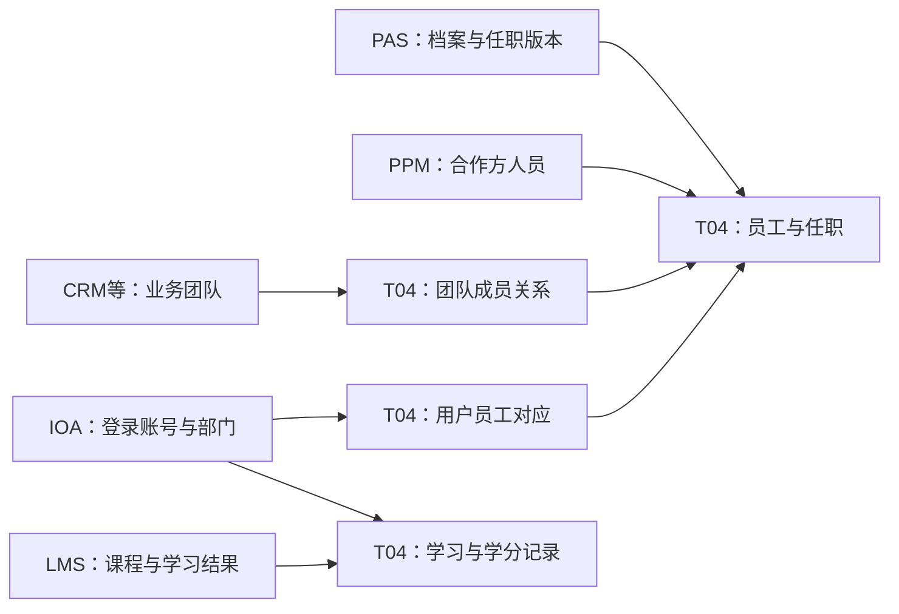

# 来源职责与交叉矩阵

[返回专题入口](00-20260911-认知实验/t04专题-内部机构/README.md) · [全部来源系统及数量](00-20260911-认知实验/t04专题-内部机构/资料/来源系统汇总.md) · [来源表与模型映射明细](00-20260911-认知实验/t04专题-内部机构/资料/来源表与模型映射明细.md)

T04 的资料来自多套系统：人事系统提供员工和任职，办公系统提供账号与部门对应，各业务系统提供自己的用户、角色、团队及管理记录。理解来源，首先要知道每套系统在这组数据里负责记录什么，再决定哪些编号和时间可以连接。

本页参照 T05 的来源职责编排，按业务分工解释主要来源；配套汇总页参照 T01，给出中文名称、来源表数量与名称依据。**下文职责限于 T04 已读代码及已定位源对象，不是这些系统的完整功能清单。**

## 1. 按来源系统理解 T04

### 人事、机构与基础身份

| 来源 | 中文系统名及依据 | 提供给 T04 的内容 | 代表源对象与阅读入口 |
|---|---|---|---|
| PAS：组织人事分支 | 智慧人力系统；数据源目录与已读人事分支 | 组织及版本、员工档案及版本、任职分配、职位、团队负责人、旧新工号关系 | `J_HSSORG_ORG`、`J_HSSEMP_EMPLOYEE_BASEDOC`、`J_HSSEMP_EMPLOYEE_POST` → [机构](00-20260911-认知实验/t04专题-内部机构/业务专题/01-机构体系与跨系统映射.md)、[员工](00-20260911-认知实验/t04专题-内部机构/业务专题/02-员工任职与身份变更.md) |
| PAS：招聘分支 | 目录系统名为绩效考核系统，数据源另有“大易云招聘数据库”别名 | 简历、应聘、招聘职位及相关候选人记录；不能直接当已入职员工名册 | `J_T_DY_CANDIDATE_CAREER_RELATION` → [招聘](00-20260911-认知实验/t04专题-内部机构/业务专题/05-招聘培训与学习记录.md) |
| ERP | 企业资源计划；CD100 | 已采集 ERP 库的用户、人力和机构相关分支；另有 PAS 结果沿用 ERP 编号或来源标签 | ERP 用户与员工对应见 [系统身份](00-20260911-认知实验/t04专题-内部机构/业务专题/03-系统用户角色与权限.md)；不能由标签判断仍由 ERP 物理表供数 |
| IOA / OAS | 企业门户2.0／广发证券办公自动化系统；CD100 | 办公部门、登录账号、在离职账号资料和角色关系；也供其他系统对齐部门或人员 | IOA 的 `I_GF_DEPARTMENT`、`I_GF_USER`、`I_GF_USER_DEL` → [机构映射](00-20260911-认知实验/t04专题-内部机构/业务专题/01-机构体系与跨系统映射.md)、[账号员工对应](00-20260911-认知实验/t04专题-内部机构/业务专题/03-系统用户角色与权限.md) |
| PPM | 合作方人员管理系统；CD100 | 合作方人员及其状态，作为员工模型中单独的人群分支 | `P_PERSON_BASE_INFO` → [员工主表的人群范围](00-20260911-认知实验/t04专题-内部机构/业务专题/02-员工任职与身份变更.md) |
| MMS | 营销管理平台；CD100 | 营销人员及其扩展资料；专用模型保留来源中的人员范围 | `_PB` 人员来源中的 `GRP_ID='h22'` → `pdata_nds.t04_emp_mms`，见 [跨库员工分支](00-20260911-认知实验/t04专题-内部机构/业务专题/02-员工任职与身份变更.md) |
| RCC / ICC | 零售／机构柜台新一代清算系统；CD100 | 柜台机构、操作人员及相关系统身份；其中 RCC 机构层级已读到具体展开规则 | RCC `U_ALLBRANCH` → [柜台层级](00-20260911-认知实验/t04专题-内部机构/业务专题/01-机构体系与跨系统映射.md)；其他对象见逐表映射 |
| SIP | GF-SMART智能化平台；CD100 | 已定位证券业协会、基金业协会等资格注册与考试采集资料，进入员工资格、用户鉴别和考试记录 | `G_SAC_EXAM_SCORE`、`G_AMAC_EXAM_SCORE`、协会人员采集表 → [SIP 来源表](00-20260911-认知实验/t04专题-内部机构/资料/来源表与模型映射明细.md#source-sip) |

PAS 在这里分成两行，是为了区分人事与招聘对象；它们仍在同一贴源库分组里，不能据此推断为同一物理数据库。SIP 则体现另一种来源职责：库代码说明采集承载平台，源表说明中的协会才是相关业务资料的发布方；本版没有把平台采集表说成协会原始数据库。

### 业务系统中的用户、角色与组织安排

| 来源 | 中文系统名及依据 | 本次定位或核对的 T04 内容 | 代表源对象与阅读入口 |
|---|---|---|---|
| CRM | 金管家综合服务系统；CD100 | 服务团队、角色成员、岗位人员、部分营销考核与提成资料 | `C_TFWTD`、`C_LBMEMBER` → [CRM 来源表](00-20260911-认知实验/t04专题-内部机构/资料/来源表与模型映射明细.md#source-crm)；不与 ECR 按名称相近合并 |
| GKS | 金钥匙系统；CD100 | 经理／投顾用户、专家组、二维码、用户关联，以及已定位的课程学习记录 | `M_TUSER`、`M_UNION_USER`、`M_EXPERT_GROUP`、`M_COURSEPROGRESS` → [GKS 来源表](00-20260911-认知实验/t04专题-内部机构/资料/来源表与模型映射明细.md#source-gks) |
| WCM | 企业微信会话留痕系统；CD100 | 已定位企业微信部门、内外部联系人、群及成员关系，也有商机分支 | `Q_SYNC_QYWEIXIN_DEPARTMENT`、`W_TB_EXTERNAL_CONTACT`、`Q_TB_JGJ_APPCHAT`、`S_DATA_BUS_OPPTY` → [WCM 来源表](00-20260911-认知实验/t04专题-内部机构/资料/来源表与模型映射明细.md#source-wcm) |
| IPS | 投保报送系统；库目录 | 系统用户、用户角色、角色菜单权限 | `E_USERS`、`E_USER_ROLE_RELA`、`E_USER_ROLE_RIGHT` → [已读角色菜单路径](00-20260911-认知实验/t04专题-内部机构/业务专题/03-系统用户角色与权限.md) |
| URC | 联合风控系统；库目录 | 系统组织、角色、用户及权限，包含用户—机构—角色的联合授权记录 | `U_T_USER_ROLE` 等 → [三元授权关系](00-20260911-认知实验/t04专题-内部机构/业务专题/03-系统用户角色与权限.md) |
| HPB / GPB / XPB | 恒生PB主经纪商系统／广发投易通系统（极速版）／迅投PB主经纪商系统；CD100 | 已定位各自系统的机构、用户和身份关系，以及 HPB／GPB 的权限对象 | [HPB](00-20260911-认知实验/t04专题-内部机构/资料/来源表与模型映射明细.md#source-hpb)、[GPB](00-20260911-认知实验/t04专题-内部机构/资料/来源表与模型映射明细.md#source-gpb)、[XPB](00-20260911-认知实验/t04专题-内部机构/资料/来源表与模型映射明细.md#source-xpb)；不能从其中一套推定另两套编号相同 |
| TIT | 场外衍生品投资管理系统；CD100 | 已精读账簿部门、所属公司、本币及跨币种履保配置；目录另保留其他身份配置来源 | `D_BK_DEPARTMENT_PROPERTIES` → [TIT 部门配置](00-20260911-认知实验/t04专题-内部机构/业务专题/01-机构体系与跨系统映射.md)、[本币下游消费](00-20260911-认知实验/t04专题-内部机构/07-从模型到下游消费.md) |
| ECR | 企业级CRM；CD100 | 战略商机、发现人／负责人、承揽部门和成员，并借助办公身份作对应 | `CX_OPTY` 分支及部门、人员视图 → [商机](00-20260911-认知实验/t04专题-内部机构/业务专题/06-商机与协作办理.md) |

这些系统首先提供“本系统中的身份和管理安排”。某交易系统的用户、某企微外部联系人、某金钥匙投顾账号，都不能不经关系表就直接当成员工主表的一行。完整汇总还包含 ATP、QMT、SSO 等其他柜台或策略来源，本页不以这几个例子冒充全部来源。

### 团队考核、招聘培训与人员管理事项

| 来源 | 中文系统名及依据 | 提供给 T04 的内容 | 代表源对象与阅读入口 |
|---|---|---|---|
| AUM | 客户资产包管理系统；库目录 | 考核方案、维度、因子、目标和来源已算好的考核结果；另有角色授权分支 | `A_TPRFM_RESULT_DATA`、`L_LBAUTHMEMBER` → [考核结果](00-20260911-认知实验/t04专题-内部机构/业务专题/04-团队分成与考核.md)、[角色业务有效期](00-20260911-认知实验/t04专题-内部机构/业务专题/03-系统用户角色与权限.md) |
| WMP | 财富管理平台；CD100 | 直播团队成员、团队角色配置及对应分成比例 | `P_LIVE_TEAM_MEMBER`、`H_LIVE_TEAM_INFO` → [直播分成](00-20260911-认知实验/t04专题-内部机构/业务专题/04-团队分成与考核.md) |
| DIA | 数字化投顾人员管理系统；数据源目录同码候选 | 团队、人员及来源有效期间内的分成比例 | `RYXX/TD/TCBL` 等源字段的直接投影 → [DIA 分成](00-20260911-认知实验/t04专题-内部机构/业务专题/04-团队分成与考核.md) |
| RMS | 研究业务管理平台；CD100 | 已定位研究团队、成员、月费用和季度派点等管理记录 | 团队、分析师及销售人员资料 → [RMS 来源表](00-20260911-认知实验/t04专题-内部机构/资料/来源表与模型映射明细.md#source-rms)；费用算法未逐源还原 |
| LMS | 移动学习系统（爱学）；库目录 | 课程、讲师、班课关系、学习与学分结果；部分学习结果还需 OA 身份对应 | `I_V_LESSON` 及用户课程结果 → [课程与学分](00-20260911-认知实验/t04专题-内部机构/业务专题/05-招聘培训与学习记录.md) |
| LSE | 考试系统；数据源目录同码候选 | 已定位考试、批次、用户和分配范围；与员工绩效考核分开 | [LSE 来源表](00-20260911-认知实验/t04专题-内部机构/资料/来源表与模型映射明细.md#source-lse) |
| IBS | 投行业务管理系统；CD100 | 已读实习补助记录，需关联招聘资料和部门；目录还收录其他投行人员管理对象 | `G_EXT_FSSC_INTERN_BONUS` → [实习津贴](00-20260911-认知实验/t04专题-内部机构/业务专题/05-招聘培训与学习记录.md) |

中文名称核对于 2026-09-14。CD100、库目录、数据源目录有各自的快照日期与覆盖限制；同码候选尚不等于逐表采集连接确认。可在 [来源系统名称证据](attachments/来源系统汇总/IMG-来源系统汇总-20260914110757648.json) 查看原名称、日期与差异。上表明确标为“已定位”的分支以源注释、结构和任务引用为依据，尚未全部精读转换逻辑。

## 2. 同一业务对象横向看来源

以下表默认在 `pdata_n`，标明其他 schema 的除外。

| 业务对象 | 主要模型表达 | 来源怎样分工 | 连接和使用时必须保留的区别 |
|---|---|---|---|
| 员工记录 | `t04_emp`、`pdata_nds.t04_emp_mms` | PAS 提供组织人事档案，PPM 提供合作方人员；MMS 另有营销人员专用范围 | 自然人、源档案 ID、工号分开；不同人群不能只按表名合并 |
| 任职与部门 | `t04_emp_pos_asgn_h`、`t04_emp_inr_org_rela_h` | PAS 任职版本说明员工何时担任何岗；OA 及其他关系分支补办公部门、费用段、负责人等 | 行政任职、办公归属、费用归属是不同关系；不能压成单一“员工部门” |
| 机构及层级 | `t04_inr_org`、`t04_inr_org_rela_h`、`t04_inr_org_hrch_rela` | PAS 行政机构、IOA 办公部门、RCC 柜台机构、TIT 账簿部门分别服务不同管理用途 | 上级关系与跨体系编号映射分开；机构类型、层级列和有效期间按来源解释 |
| 系统用户 | `t04_user`、`t04_user_emp_rela_h`、`t04_user_pty_rela_h` | 每套业务系统提供自身用户；IOA 等资料用于员工对应，对客身份另需当事人关系 | 账号 ID 可能带来源前缀，也可能直接使用登录名；用户不一定是员工 |
| 角色与权限 | `t04_role`、`t04_user_role_rela_h`、`t04_role_righ_h`、`t04_user_role_dept` | IPS 提供用户角色和菜单权限，URC 保留用户机构角色组合，AUM 保留角色关系类型和业务有效期 | 角色成员、管理员、权限对象类型及三元组合不能互相替代 |
| 团队与成员 | `t04_emp_grp`、`t04_emp_emp_grp_rela_h` | PAS 已读队长关系；CRM、RMS、WMP 等提供各自业务团队与参与者 | 队长名单不等于全体成员；员工组不自动等于行政部门 |
| 分成与考核 | `t04_emp_emp_grp_divd_rati_h`、`t04_inr_org_exam_rslt_det` | WMP 按团队角色取配置比例，DIA 直接取源比例与期间，AUM 投影来源考核结果 | 分成参数、得分结果和实际薪酬分开；比例单位及可加总规则另核 |
| 招聘与实习 | `t04_cand_acpt_empt_info`、`spdata_n.t04_intn_sbsd_info` | PAS 招聘分支提供简历／应聘身份，IBS 补助记录关联招聘和部门资料 | 候选人、应聘号、员工号不是同一身份；补助记录不等于到账 |
| 培训与考试 | `t04_less_info`、`t04_user_less_score_info`、`t04_exam_*` | LMS 提供课程与学习结果，LSE 提供考试相关对象；学习记录可能借 OA 对齐员工 | 课程分、学分、考试成绩分别理解；OA 无法对应时可能被过滤 |
| 商机与协作 | `t04_busi_opty`、承揽部门／成员表 | ECR 战略商机已精读；WCM 等另有商机来源；IOA 可参与人员和部门对齐 | 来源决定商机含义；负责人、承揽部门、成员是不同粒度，主附表时间可能不同 |

## 3. 用“一个员工”理解为什么会跨系统

假设要解释某员工的部门、账号、团队和学分，可以按下面的职责顺序读。图是说明性的对象联系，不代表已确认的自然人唯一键或完整加工血缘。

PAS 分支里的源档案 ID 经加工变成员工号，任职还需要版本和期间；IOA 提供登录名与工号对应；团队表说明该工号参加哪个业务组；学习结果则有自己的课程和获分日期。即使最后都出现 `Emp_Id`，也不能把五种记录都归纳成“数据来自人力系统”。

同理，学习任务读取 IOA 资料，是为了对齐学习者身份。来源汇总里 IOA 会因此增加一次任务命中，但学分的业务事实仍来自学习系统。**读取次数说明复用情况，不能用来判断谁是某类业务事实的权威来源。**

## 4. 来源标签与实际读取要对照

| 已读情况 | 表里可能看到的标识 | 正确读法 |
|---|---|---|
| PAS 组织／员工／任职分支 | `ERP-` 机构号，部分 ERP／MMS 来源标签 | 同时查实际 FROM/JOIN、`Real_Src_Tbl`、`Src_Tbl` 与来源分支；旧标签不是旧系统仍在供数的证明 |
| IOA 部门／用户分支 | OAS 的 `Src_Tbl` 标签 | 代码已读 IOA 贴源表，模型保留兼容标签；不要把标签直接当当前物理源表 |
| 一般来源模板 | `${src_table}`、`${data_src_cd}` | Source Table 注释能提供定位候选；参数未绑定时，仍不能据注释断言唯一物理来源 |
| 同一任务读取多个系统 | 员工、部门、字典、配置等多个来源 | 逐段辨认主对象输入和补充关联；任务内同现不等于所有读取表都直接生产全部目标字段 |

需要查“有哪些来源、多少来源表”，看 [来源系统汇总](00-20260911-认知实验/t04专题-内部机构/资料/来源系统汇总.md)；需要解释“某一行如何形成”，回到对应业务章节及 SQL。前者提供整域查阅入口，后者保留编号、筛选、时间和来源分工的实际规则。
