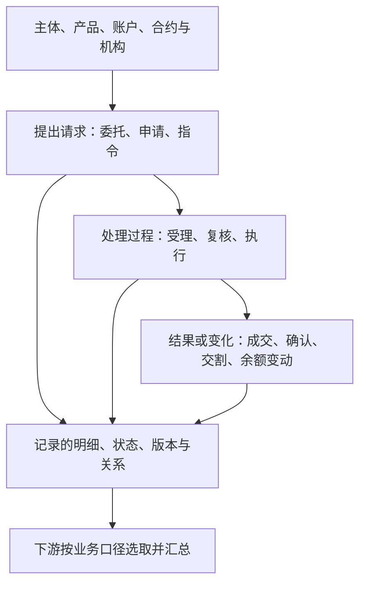

# T05 全貌：业务发生怎样变成记录

## 1. 先与其他主题分工

本地 Wiki《2.基础模型命名规范》（pageId `172993522`）明确 T05 = EVT = Event = 事件。与它并列的 T01、T02、T03、T04 分别是当事人、产品、协议、内部机构。

可以用一个问题理解它们的联系：**谁，通过什么账户或合约，对什么产品，发生了什么，由哪里经办或管理？** T01/T02/T03/T04提供对象坐标；T05 保存办理、变化与执行的记录。具体表可能把对象名称、类别直接带入，仍须确认记录粒度。

这只是阅读分工，不能变成强制的物理分层。例如 T03 已有订单和持仓，T05 中也有支付计划、流程实例、问卷与主从明细。真实模型并不服从“静态资料一定在 T03，所有动态事实一定在 T05”的绝对划分。

## 2. 七组业务入口

| 业务范围      | 核心对象                   | 代表模型（未标库时为 `pdata_n`）                                                                                    |
| --------- | ---------------------- | -------------------------------------------------------------------------------------------------------- |
| 交易达成与履行   | 委托、成交、申请、确认、交割         | `t05_exch_scr_entr_evt`、`t05_exch_scr_mtch_evt`、`t05_exch_scr_deli_evt`、`t05_ams_ta_trd_cfm_evt`         |
| 资金与资产变化   | 划款指令、收付、资金与保证金流水、股份变动  | `t05_cstd_tran_instr_evt`、`t05_otc_recv_pymt_evt`、`t05_otc_deri_cutp_fnd_chg_evt`、`t05_exch_shr_chg_evt` |
| 合约存续      | 合约调整、腿或持仓变动、费用计划、回报分配  | `t05_otc_comp_dura_chg_evt`、`t05_otc_swap_comp_hold_chg_det`、`t05_otc_deri_comp_fee_pymt_plan`           |
| 账户及业务办理   | 受理单、复核、步骤、执行、变更        | `t05_acct_chg_evt`、`t05_nbo_busi_acpt_evt`、`t05_nbo_busi_acpt_exec_evt`、`t05_proc_cir_evt`               |
| 客户服务与数字行为 | 服务记录、回访、会话、点击、活动节点执行   | `t05_crm_cust_serv_evt`、`t05_cc2_clbk_exec_evt`、`t05_meg_cust_act_evt`、`t05_mio_prom_log`                |
| 风险合规及经营运作 | 测评、审核、预警、损失、版本、经营流程与日志 | `t05_cust_elig_qstnn_evt`、`t05_oper_risk_los_evt`、`t05_emp_atten_evt`、`t05_data_mdl_mgmt_oper_log`       |
| 报告交付      | 配置的执行、报告生成、发送状态        | `t05_otc_cutp_valu_rpt_exec_evt`、`t05_otc_deri_send_cust_valu_rpt_create_evt`                            |

这些是阅读分组，允许交叉，不是互斥的官方分类，也不据此硬分全部表。例如风险预警后的处置可以进入流程；一条服务记录也可能来源于营销活动。

图表达业务理解顺序，未声明这些表之间存在数据血缘。实际加工经常是多个 T05 表分别读取不同源表，不能把流程箭头解释为逐表 ETL。

## 3. 看见“事件”仍需再问三层

第一层问业务：客户发起一次申购，是提出申请，还是份额已确认？第二层问模型：这一行代表申请、总确认还是确认明细？第三层问证据：编号怎样生成，状态怎样过滤，哪个日期属于这次业务？

以 TA5 为例，申请模型保留申请金额和申请份额；确认模型保留确认金额和确认份额；确认明细通过 `Main_Evt_Id` 指回总确认。用申请金额衡量确认规模，或者把总确认金额再加确认明细金额，都会跨越记录粒度。[加工证据](业务/01-委托成交与交割.md)

## 4. 全貌怎样保证不偏科

本次以整个 `t05_` 物理元数据范围和平台目录为发现入口，再选不同结构的来源加工核对。除 TIT/OIS 外，已展开柜台交易、TA5、期货、衡泰、托管划款、经纪业务办理、CRM服务、行为日志、运营活动、操作风险等。

全量目录用于发现遗漏，代表 SQL 用于解释模型；两者都不代表全来源审计。香港及部分经营、技术日志分支仍以元数据定位为主，深度差异见 [来源与覆盖](证据/来源与覆盖.md)。

证据：本地 Wiki 镜像 pageId `172993522`；[物理元数据](资料/物理对象与字段.json)；[平台分类](资料/平台分类快照.json)。镜像现行版本未在线核验。
