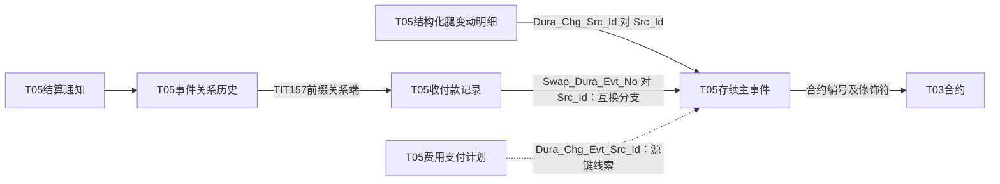

# 合约存续：一次变化怎样关联多种记录

## 1. 为什么合约之外还需要事件

T03合约描述双方的具体交易约定；存续期间可能出现部分终止、到期、重置、分红等事项。T05记录变化本身、影响的结构、对应收付和操作留痕。合约当前本金与某次事件的本金变化量回答不同问题，不能用当前值代替历史事件。

本地Wiki《TITANS交易试算和存续期事件查询操作指引》（pageId `162682335`）说明其存续查询页面只显示审核通过事件，清算流程另经历交易员确认、复核、资金部确认等环节。该镜像提供业务背景，不能证明数据库所有事件都已审核，也不能证明当前界面仍完全相同。已读模型SQL会保留状态，下游另行筛选。

## 2. 一张主模型，三个来源变体

主模型为 `pdata_n.t05_otc_comp_dura_chg_evt`。

| 来源 | 业务对象与身份 | 字段差异 |
|---|---|---|
| TIT229：`D_TRD_TRS_EVENT` | TRS存续事件；编号由事件日、源事件号、合约号拼接；合约修饰符 `20206` | `EVENT_AMOUNT`进入事件金额；保留前后名义本金及变化量；状态经转码 |
| TIT230：`D_TRD_OPTION_EVENT` | 期权存续事件；拼入期权事件号与期权合约号；修饰符 `20207` | 事件金额取 `EVENT_FEE`；还保留绝对名义本金、公司行为等字段 |
| TIT337：`D_TRD_FAST_TRS_EVENT` | 极速互换存续事件；需要辅助对象取得合约编号 | 事件金额取 `A.AMOUNT`；已读分支将事件状态和多项本金字段填空 |

`Evt_Amt`在三条来源里不是同一个源字段。“空状态”也不能解释成已生效或失败。若只使用 `Evt_Stat_Cd='3'`消费整个模型，极速互换分支在这份SQL规则下不会进入结果；是否符合业务需求需由具体消费者决定。

证据：[124565](../../../attachments/03-合约存续与衍生品链路/IMG-03-合约存续与衍生品链路-20260914110158574.sql)、[124566](../../../attachments/03-合约存续与衍生品链路/IMG-03-合约存续与衍生品链路-20260914110159211.sql)、[216458](../../../attachments/03-合约存续与衍生品链路/IMG-03-合约存续与衍生品链路-20260914110200772.sql)。

## 3. 主事件、结构明细、收付和通知

| 对象 | 模型 | 识别与连接 |
|---|---|---|
| 存续主事件 | `t05_otc_comp_dura_chg_evt` | `Src_Id`保留源事件号，Evt_Id另拼前缀、日期和合约 |
| 结构化腿变动明细 | `t05_otc_swap_comp_hold_chg_det` | 自身 `TIT215-ID`；`Dura_Chg_Src_Id`保留源主事件号；另保留持仓与腿 |
| 费用支付计划 | `t05_otc_deri_comp_fee_pymt_plan` | `TIT327-KEY_FEE_PAYMENT_ID`；费用源编号、存续源ID、计划与实际金额并列 |
| 收付款记录 | `t05_otc_recv_pymt_evt` | `TIT157-TRANSFER_ID`；交易、合约、源事件、支付计划编号及多种金额 |
| 结算通知发送记录 | `t05_otc_deri_comp_sett_ntfc_send_evt` | TIT292编号由其生产分支定义 |
| 通知与收付关系 | `t05_otc_deri_evt_rela_h` | TIT292通知 → TIT157收付；关系类型01；有有效期间 |

实线连接来自本次源投影或消费条件；虚线仍是字段提供的关系线索。图不是任务依赖图，不声明一对一、执行顺序或运行因果。明细生产也会通过腿对象获得合约，不能省略其辅助Join。

证据：[124564](../../../attachments/03-合约存续与衍生品链路/IMG-03-合约存续与衍生品链路-20260914110201429.sql)、[104934](../../../attachments/03-合约存续与衍生品链路/IMG-03-合约存续与衍生品链路-20260914110201939.sql)、[207947](../../../attachments/03-合约存续与衍生品链路/IMG-03-合约存续与衍生品链路-20260914110202121.sql)、[181103](../../../attachments/03-合约存续与衍生品链路/IMG-03-合约存续与衍生品链路-20260914110202261.sql)、[185098](../../../attachments/02-加工与分区/IMG-02-加工与分区-20260914110200114.sql)、[228195](../../../attachments/01-TIT事件怎样进入T98/IMG-01-TIT事件怎样进入T98-20260914110158581.sql)。

## 4. 费用计划为什么不等于已付款

TIT327读取 `F_TRD_FEE_PAYMENT_SCHEDULE`，通过 `KEY_FEE_ID`关联当天 `F_TRD_FEE`。合约编号优先取有效的 `KEY_OTC_TRADE_ID`，否则回退 `ENTITY_ID`；修饰符随之选择 `20207`或`20206`。这是一条具体代码分支，不足以仅凭源字段名推导所有费用归属。

同一记录同时有支付日期与实际支付日期、本币/原币/人民币金额、实际支付金额、费用状态和汇率。回答“计划支付多少”与“实际支付多少”时应分别取相应字段，并核对状态和币种。不能用 `Evt_Id`存在或计划日期已到来代替付款证据。

## 5. 成交回报与分配也是两个层次

`t05_otc_deri_swap_mtch_retu_evt`接入 `D_TRD_TRS_UNDERLYING_DEAL`，事件号为 `TIT306-ID`，保存交易日、数量、成交金额等。`t05_otc_deri_swap_mtch_retu_asgn_evt`接入 `F_TRD_TRS_UDLY_DEAL_ALLO`，自身为 `TIT307-ID`，`Mtch_Retu_Id`取 `KEY_UNDERLYING_DEAL_ID`，同时保存合约、存续事件源ID、分配状态、分配前数量和分配数量。

因此回报量与分配量不能直接相加；同一回报可能被分配到不同对象，仍需核对实际基数。分配SQL还提示可能有前台已删除、在协议表找不到的合约，不能将左侧记录丢失直接解释为源数据错误。[202899](../../../attachments/03-合约存续与衍生品链路/IMG-03-合约存续与衍生品链路-20260914110202472.sql)、[202900](../../../attachments/03-合约存续与衍生品链路/IMG-03-合约存续与衍生品链路-20260914110202571.sql)

## 6. 读者应能回答的完整问题

遇到“某份合约发生了什么”，先定位合约及来源，找主事件、类型和状态；解释影响时看腿明细、前后值；解释资金时沿已核对的源事件键找收付或费用；解释通知时走关系表；最后采用具体下游的日期、状态和聚合口径。

下一篇 [T98消费案例](../实现详解/01-TIT事件怎样进入T98.md) 展示一条真实任务如何执行这些选择，也保留当前Join粒度带来的风险。

## 字典补充：动作类型不能代替状态或模型粒度

[事件类型分组](../字典/01-事件类型分组与模型对应.md)把设立调整、终止清算、公司行为、费用收益分别展开，保留CD375原码值。TRS/期权直接带入源类型，极速互换显式转小写，已读T98又有大写筛选；分类没有抹平这些差异。CD1318的场内交易/票据交易则属于另一个成交模型，不能拿来充当全部存续动作的上层分类。[状态矩阵](../字典/02-状态与阶段矩阵.md)另列通用事件状态的来源差异。
