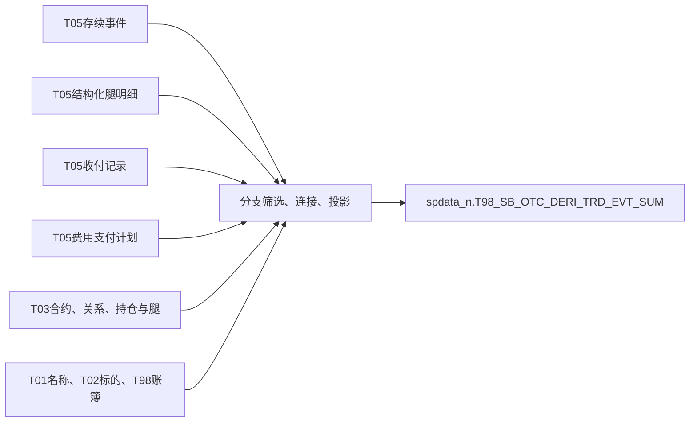

# TIT事件怎样进入T98：看真实消费者怎样缩小范围

本篇精读任务228195。SQL头部定位到 `spdata_n`，目标是 `T98_SB_OTC_DERI_TRD_EVT_SUM`。它是已存在的静态消费实现，不代表全部衍生品口径，也没有用任务存在来证明运行结果。

## 1. 先看结果是什么

目标将多类事件或合约信息统一投影后 `UNION ALL`。期权部分终止、费用、互换等分支各自选择来源和条件；所以结果是一套特定汇总规则，不能将其中某个筛选推广为整个T05的定义。



图概括已读SQL输入，不是完整字段血缘或运行实例关系。

## 2. 期权部分终止：先限定业务，再汇总收付

事件来源限定 `D_TRD_OPTION_EVENT`，通过 `Otc_Comp_Agt_Id`连接期权合约。收付款子查询限定：

```sql
Src_Prd_Type_Cd = 'OTC_OPTION_CONTRACT'
AND Src_Tbl = 'ODATA_N_TIT.D_TRD_TRANSFER'
AND Del_Flag = '0'
AND Recv_Pymt_Stat_Cd = 'VERIFIED'
```

之后按支付日期、清算日期、交易编号分组，求 `SUM(Aft_Adj_Amt)`；再用交易编号对应事件合约号、清算日对应事件日连接。

事件自身还限定 `Evt_Stat_Cd='3'`与 `Evt_Type_Cd IN ('PARTIAL_TERMINATION')`，并筛选账簿部门为 `GFS_FICC`、账簿名不含“虚拟”、合约状态不为 `218`。这些只是本任务的筛选事实，本次未给 `218`补写未经核实的状态含义。

不能将 `VERIFIED`解释成实际付款到账；也不能因为本地字典的 `partial_termination`是小写，就忽略此处SQL使用大写。字符串是否在上游已经规范化，本次未用数据核验。[原SQL约119—147行](../../../attachments/01-TIT事件怎样进入T98/IMG-01-TIT事件怎样进入T98-20260914110158581.sql)

## 3. 互换：明细驱动，与源事件连接

互换分支从 `D_TRD_TRS_EVENT_STRUC_DETAIL`对应模型开始，使用：

```sql
tte.Src_Id = ttesd.Dura_Chg_Src_Id
```

随后经协议关系 `N03`连合约与账簿，关系取 `Strt_Date <= d AND End_Date > d`；合约、账簿与腿取调度日，持仓则用合约期初定价日匹配持仓业务日。这是一条混合时点的业务实现，不能概括为“所有表都取同一天”。

互换收付限定产品类型 `TRS`、来源 `D_TRD_TRANSFER`、未删除、状态 `VERIFIED`，按 **支付日 + 源存续事件号**聚合调整后金额，再仅按源事件号连接主事件。

这带来一个需要数据验证的粒度风险：若一个事件存在多个支付日，聚合后仍有多行；若事件又存在多条结构明细，Join结果可能进一步展开。本次确认的是SQL形状，尚未证明实际发生了重复计量。不能把聚合子查询已经用了 `sum`当作后续Join必然安全。[原SQL约301—334行](../../../attachments/01-TIT事件怎样进入T98/IMG-01-TIT事件怎样进入T98-20260914110158581.sql)

## 4. 费用分支：按费用源编号连接计划

费用模型 `T03_SB_OTC_COMP_TRD_FEE`用 `Src_Id`连接支付计划的 `Trd_Fee_Src_Id`，再关联期权合约、账簿、对手方和产品。分支筛选费用类型 `14`；本次没有将这个来源内筛选值扩写成全主题费用定义。

支付计划中有计划和实际金额，具体消费取哪项必须看投影，而不是只看输入表名。该分支也使用指定部门、账簿和合约状态条件。[原SQL约241—262行](../../../attachments/01-TIT事件怎样进入T98/IMG-01-TIT事件怎样进入T98-20260914110158581.sql)

## 5. 这个案例真正证明了什么

T05向下游提供的是多种粒度的业务记录。消费者通过来源、状态、日期、对象关系和聚合进一步定义统计口径。已经看到了静态消费规则；尚未验证每个Join的唯一性、缺失率、结果行数与实际业务金额。

因此这份T98规则可以作为理解T05的具体案例，不能成为全主题的默认取数模板。
