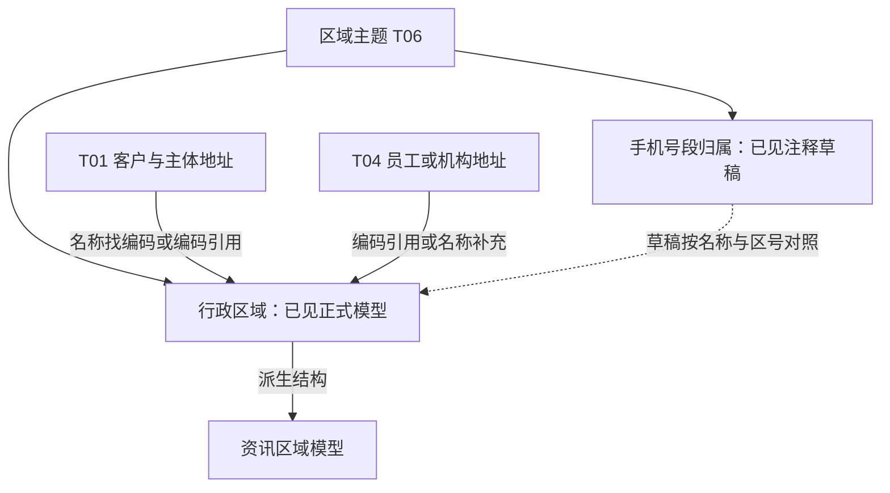

# T06 全貌：给业务资料提供区域坐标

[返回入口](README.md)

## 1. 先从一个问题理解它

客户资料写着“安徽、合肥”，业务想按省份统计客户。要得到可比较的分组，至少有两步：先理解客户资料里的文字指哪个地方，再把这个地方映射到统一的区域编号。T01 保存“哪个客户填了什么地址”，T06 保存“这个区域叫什么、属于哪一级、上级是什么”。客户与区域是两个对象，一张区域表可以被很多业务共享。

另一个问题是“这个手机号段归属哪座城市”。其输入身份是号段，输出属性包含区域；它需要引用或对照区域资料，却不应与行政区域行混在同一粒度。这是 T06 的第二条主题线索。

## 2. 整个主题的两支

| 分支 | 业务对象 | 当前证据与落地状态 |
|---|---|---|
| 行政区域 | 一个来源内的行政区域记录，可能是省级、地市级或县区级 | 正式表元数据、主加工 SQL、实际首屏样例、多个直接消费者均已取得 |
| 手机号归属区域 | 一个来源中的手机号段及其运营商、省市归属等资料 | Wiki 定义与共享手工脚本的注释草稿；正式表与生产状态未核实 |

Wiki《模型层主题划分》明确列出 T06 / LOC / 区域，并列“行政区域划分、手机号归属区域”。平台分类又把正式行政区域表挂在“模型主题/地址”，并有“配置及参数信息”“资讯/模型表”等标签。它们分别是主题概念和资产标签，不是相互排斥的业务定义。[Wiki 255499828](attachments/证据台账与覆盖边界/IMG-证据台账与覆盖边界-20260914105650273.json)、[平台分类快照](attachments/00-全貌与范围/IMG-00-全貌与范围-20260914105651214.json)。

这是一张业务联系图。虚线是设计线索；图中不声明平台外键、运行先后或分区因果。手机号草稿实际读取 RPA 源表派生的区域临时结果，并非已确认直接读取正式 T06 表。

## 3. 不同维度怎样分开

| 维度 | 问题 | 例子 |
|---|---|---|
| 业务对象 | 正在描述什么 | 一个行政区域、一段手机号 |
| 模型表达 | 这个对象的哪一面 | 名称、层级、归属、直接上级、邮编、删除标志 |
| 来源职责 | 谁提供资料 | RPA 源数据、人工补充、手机归属草稿中的测试源 |
| 加工与消费 | 如何转换、用于什么 | 补省级行、名称转码、拼地址、资讯三层结构 |
| 物理位置与时间 | 哪份数据、哪个时点 | 正式库与测试库、来源分区、源业务日期、加载日期 |

“省份、RPA、删除、客户地址”不能作为同一层的四种区域分类。省份是对象层级，RPA 是来源，删除是记录状态，客户地址是消费场景。

## 4. 与其他主题的边界

| 邻近内容 | 与 T06 的关系 | 不宜混同的原因 |
|---|---|---|
| T01 主体地址 | 联系地址、办公地址可携带省市县编码 | 地址属于某个主体和联系方式；区域本身不属于某个客户 |
| T04 员工及内部机构地址 | 用区域编码解释所在地或拼接展示地址 | 行政上下级不同于公司组织上下级 |
| T02／资讯模型的区域表 | 已读 `tyzx_admin_area` 重组 T06 及外部区域资料 | 消费表可能引入中间层级、其他编号和按日快照 |
| 国家和地区代码 | 客户国家字段等使用的另一套代码域 | `CHN`、`HKG` 不能直接作为六位行政区域编号关联 |
| 经营区域与投资区域 | 某种业务分类维度 | 华南、股票销售组等分类不等于某个行政区域节点 |
| 手机号码核查、IP 归属 | 有地理相关性，但不是已确认的 T06 分支 | 不能按“手机”“归属地”关键词全部并入 T06 |

## 5. 规模数字如何读

| 本次实测 | 身份及范围 | 不代表什么 |
|---|---|---|
| 3 个元数据物理对象 | 1 个正式模型，2 个 TEMP 中间对象；正式对象有 21 个字段 | 3 张独立业务模型 |
| 3 个平台资产 GUID | 正式库 1 个、测试库 2 个；目录整体状态 PARTIAL | 与元数据 3 个相加得到 6 张表 |
| EDW_LOC 主题快照 4，任务目录命中 3 | 两个手工任务和一个每日加工任务 | 本次已解释了缺少的第 4 个任务 |
| 21 份直接提及 T06 行政区域表的 SQL | 1 主加工、20 读取任务；移除注释与空白后共 17 组内容 | 全平台完整下游闭包或独立业务系统数 |
| 正式表 10 行、RPA 源表 10 行 | 2026-09-14 首屏返回样例 | 全量、随机抽样、最新分区或当前人口统计 |

正式表样例更新时间为 2022-01-07，源表样例业务日期为 2021-04-28。两批样例不是同一次运行的输入输出，不能拼成已核验加工链。具体边界见[证据台账](00-20260911-认知实验/t06专题-区域/证据/证据台账与覆盖边界.md)。
