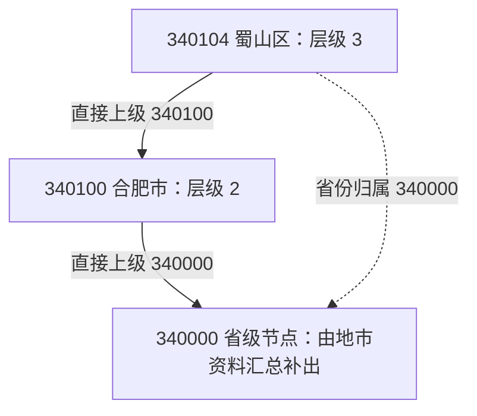

# 区域对象与层级：身份、归属和直接上级

[返回入口](README.md)

## 1. 一行究竟是什么

`T06_ADMIN_AREA` 的一行按模型用途描述一个区域节点。省、地市、县区共用同一结构，以 `ADMIN_AREA_LVL_CD` 区分层级，以 `ADDR_ID` 标识该节点。它不是一行客户地址，也不是一行机构所在地。

更准确的查询粒度还要包括物理表身份和 `SRC_TBL` 来源分区。主加工在单一来源分区内按 `ADDR_ID` 比较新旧记录；本次没有主键约束或全量数据证明 `ADDR_ID` 跨来源唯一。详见[字段与身份](00-20260911-认知实验/t06专题-区域/建模基础/字段与身份.md)。

## 2. 四种字段分工

| 字段 | 正在回答的问题 | 为什么需要它 |
|---|---|---|
| `ADDR_ID` | 这一行描述谁 | 区域节点本身的身份 |
| `ADMIN_AREA_LVL_CD` | 这一行在哪一层 | 同一张表同时有不同层级 |
| `PROV_ID`、`CITY_ID` | 它归属哪个省、市 | 便于直接汇总或补充资料，不必每次递归上级 |
| `UPPER_ADDR_ID` | 它的直接上级是谁 | 表达层级中的一步关系 |

归属省、市字段与直接上级字段可能指向同一节点，也可能不同。不能把 `CITY_ID` 永远当作 `UPPER_ADDR_ID`，或要求所有省级节点都有市级归属。

## 3. 用已取得的源样例推导普通省市县

RPA 源表首屏中实际有 `340100 / 安徽省（皖）-合肥市`、`340104 / 安徽省（皖）-合肥市-蜀山区`。下图展示 **按 61790 已读 SQL 推导的结果**，没有声称它们已经在目标表样例中得到验证。[源样例](attachments/01-区域对象与层级/IMG-01-区域对象与层级-20260914105650249.json)、[61790 SQL](attachments/01-区域对象与层级/IMG-01-区域对象与层级-20260914105651381.sql)。

推导条件：如果同日 RPA 源数据没有 `340000` 原始省级行，县区的 `CITY_ID` 走前四位补 `00` 的分支，得到 `340100`。如果存在省级原始行，当前 SQL 的另一分支可能把 `CITY_ID` 设为省级编号；这是一个依赖源形态的条件，不能从 10 行样例判定全量是否满足。详见[生产实现](00-20260911-认知实验/t06专题-区域/实现详解/61790-行政区域生产.md)。

## 4. 用真实人工样例理解同表异源

正式 T06 表本次返回的样例中有：

| 区域 | `ADDR_ID` | 层级 | `PROV_ID` | `CITY_ID` | 直接上级 | 来源 |
|---|---|---|---|---|---|---|
| 台湾省 | `710000` | `1` | `710000` | 空字符串 | 空字符串 | `MANUAL` |
| 台北市 | `710100` | `2` | `710000` | `710100` | `710000` | `MANUAL` |
| 高雄市 | `710200` | `2` | `710000` | `710200` | `710000` | `MANUAL` |
| 台东县 | `713400` | `2` | `710000` | `713400` | `710000` | `MANUAL` |

样例只用于解释本系统记录方式，更新时间均为 2022-01-07。不能把这个旧样例当作现行行政区划权威名录。[正式表样例](attachments/03-来源职责与交叉矩阵/IMG-03-来源职责与交叉矩阵-20260914105650268.json)、[样例口径](attachments/01-区域对象与层级/IMG-01-区域对象与层级-20260914105652759.json)。

这里有两个很具体的认识：名称带“县”不自动等于本表层级 `3`；省级行的市归属可以为空。字段值应按本表记录和来源理解，不能仅靠中文后缀重新分类。

## 5. 直辖市为什么容易出问题

主加工的直辖市意图是让相关记录的 `CITY_ID` 指向省级编号，而县区的 `UPPER_ADDR_ID` 仍由前四位补零得到中间编号。于是直接上级可能没有对应的正式节点。

资讯消费者 122045 明确补充四个直辖市的二级节点，并给重庆另补一个二级节点；它把相关县区的 `CITY_ID` 调整为原 `UPPER_ADDR_ID`。这是一种为了消费而构造的三层结构，不能反过来宣称 T06 原表已经有完整三层树。[资讯重组](00-20260911-认知实验/t06专题-区域/实现详解/名称回填与资讯重组.md)。

## 6. 自己判断一个关联是否合理

看到 `业务表.Prov = 区域表.ADDR_ID` 时，先确认 `Prov` 实际存的是区域编号，而非省份名称或兜底值。看到“市名称相等”时，继续看是否约束了省份和层级。看到某个上级编号时，再确认同一来源范围是否真的有上级行。

判断顺序是：**对象与粒度 → 编码体系 → 来源范围 → 有效状态 → 关联基数 → 时间口径**。任何一项尚未成立，都不能只因 Join 写出来就认定业务含义成立。
