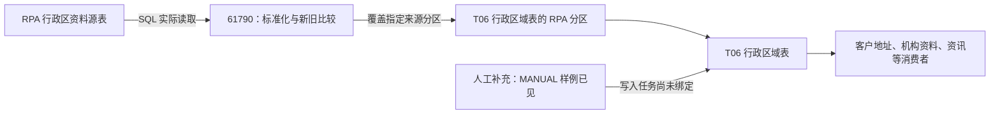

# 来源与加工职责：RPA、人工补充与共享手工脚本

[返回入口](README.md) · [来源职责与交叉矩阵](00-20260911-认知实验/t06专题-区域/建模基础/03-来源职责与交叉矩阵.md)

## 1. 已确认的来源主线

此图表达来源与消费关系，不表示人工分区已经找到明确生产任务，也不表示两条分支使用同一业务日期。

## 2. RPA 与 SIP 分别说明什么

元数据将 `odata_n_sip.f_webdata_rpa_xzqh_code` 描述为“[RPA]行政区域划分码表”。CD100 中 `SIP` 的本地名称为“GF-SMART智能化平台”；RPA 指文档所述采集方式，SIP 是加工字段中的来源系统代码。主任务还写入完整源表名作为 `SRC_TBL`。[来源字段](attachments/README/IMG-README-20260914105650256.json)、[代码域证据](attachments/02-来源与加工职责/IMG-02-来源与加工职责-20260914105651316.json)。

源表有 8 个区域内容字段、`DATA_TIME`，加 `BUSI_DATE` 分区。61790 从同一个源业务日期读取区域编号、名称、邮编、区号、驻地、人口和面积，并自行派生省市编号及层级；主加工的 `DATA_TIME` 使用任务参数，没有直接复制源 `DATA_TIME`。

任务目录中 40853 与 61839 都配置这个贴源目标，配置描述关联“自动维护营业部行政区域划分码”的需求。它们属于不同调度记录；当前只取得配置证据，61839 的本地 SQL 文件还明确是 `UNAVAILABLE`。因此不能单靠同名目标认定谁在当前时点唯一供数。[来源与质量任务](attachments/字段与身份/IMG-字段与身份-20260914105652092.json)。

## 3. 人工来源已经有样例，写入来源仍需分开确认

Wiki《模型层常用表》说明行政区数据来自机器人采集，也提到部分区域人工维护。本次正式表首屏实际返回 `SRC_TBL='MANUAL'`，这让人工来源从“文档描述”推进到了“本次样例可见”。[Wiki 255497706](attachments/02-来源与加工职责/IMG-02-来源与加工职责-20260914105652663.json)、[区域样例](attachments/03-来源职责与交叉矩阵/IMG-03-来源职责与交叉矩阵-20260914105650268.json)。

这些行的 `DATA_SRC_CD` 为空，`TASK_NAME` 却写主加工任务名。它们的来源分区与主加工代码写入的 RPA 分区不同。**行内任务名可以保留历史标记，不能替代实际写入程序的证明。**

由此也能看出，只筛 RPA 来源的下游在范围上排除了 `MANUAL` 样例。是否符合消费者的业务需求，需要由该消费者的覆盖要求决定；不能一律称为错误，也不能把结果叫整张区域表的全部范围。

## 4. 两个手工任务不是两个已经证明的生产者

本次补查 101575、102166，元数据 SQL 都为空。进一步读取配置与代码，发现两者关联同一个共享手工脚本，代码版本均为 `538a331`，所取文件内容哈希相同。

脚本中的 T06 相关内容有两段：手机号归属模型草稿，以及从测试表的 `QUERY_TEMP.TMP_ADDR_CODE` 分区复制行政区域资料的历史语句。它们都以 SQL 行注释保留。本次仅保存相关行号、节选和内容哈希，不把共享脚本的大量其他主题内容收入 T06。[手工脚本核对](attachments/03-来源职责与交叉矩阵/IMG-03-来源职责与交叉矩阵-20260914105652248.json)、[T06 节选](attachments/04-手机号归属区域/IMG-04-手机号归属区域-20260914105650253.txt)。

因此，“任务名称叫 T06”“脚本提到 T06”“注释曾写到区域补充”和“实际生产某来源分区”是四层不同证据。这里能解释历史线索，尚不能将 `MANUAL`、`QUERY_TEMP.TMP_ADDR_CODE` 或两个手工任务互相绑定。

## 5. 从来源走到消费，职责如何变化

| 位置 | 已读职责 | 应留意的范围变化 |
|---|---|---|
| RPA 源表 | 保存带源业务日期的区域资料 | 本次首屏是 2021-04-28，不能代表最新分区 |
| 61790 主加工 | 派生编号、层级、补省级记录并覆盖 RPA 分区 | 仅该分支；新增、删除由源快照与旧目标比较产生 |
| 正式 T06 表 | 汇集区域资料与来源标记 | 实际有人工样例，不能只按 SIP 字段猜全部来源 |
| 客户资料消费者 | 把文本或源代码转成区域坐标 | 可能保留原文字、空字符串或兜底编码 |
| 机构、员工与同步消费者 | 查名称、拼接地址、转存区域资料 | 删除条件和来源过滤各异 |
| 资讯消费者 | 重新组织三级区域与补充节点 | 引入 UIP 源编号，输出按日快照，已经改变模型口径 |

来源系统中文名与任务用途见[字典](00-20260911-认知实验/t06专题-区域/字典/代码与编码边界.md)及[消费者对照](00-20260911-认知实验/t06专题-区域/证据/直接读取任务对照.md)。系统名称不是对该系统全部功能的描述。
