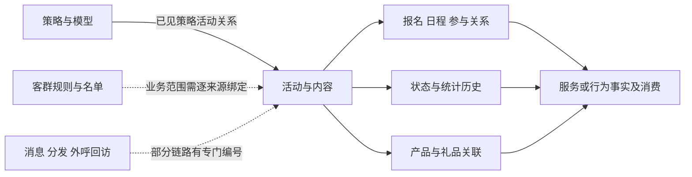

# T07 全貌与范围

[返回学习入口](README.md)

## 1. 先用业务问题理解整个主题

T07/CAM 对应营销。Wiki《模型层主题划分》明确列出营销活动、营销策略、推送、礼品、权益、活动状态历史及投研合集。[Wiki 正文节选](attachments/06-投研内容与活动办理/IMG-06-投研内容与活动办理-20260914110643018.json)

实际目录比这份简介更细：还有客户分群、呼叫中心回访、数字运营、销售目标、私募比赛榜单和广告投放素材。因此不能把“营销活动主表”当作整个 T07，也不能把简介中的七个名称当作完整物理模型清单。

| 业务层次 | 回答的问题 | 典型对象 |
|---|---|---|
| 安排与表达 | 准备推广什么，以什么方式展示 | 活动、直播、短视频、文章、销售活动、投研活动 |
| 决策与规则 | 为什么向这类人推荐，何时触发 | 策略、营销模型、客群规则、触发事件定义 |
| 对象范围 | 哪些人、产品、机构或员工在范围内 | 客群成员、客户名单、产品关联、角色关系 |
| 执行与办理 | 谁报名、谁分发、谁回访、进行到哪一步 | 报名、分发明细、回访任务、AI 外呼详情 |
| 激励资源 | 提供什么权益，归谁，数量与期限如何变化 | 礼品、优惠券、权益配置、归属关系、香港库存历史 |
| 观察与评价 | 有多少关注，是否达成某类目标 | 状态历史、统计历史、活动目标、榜单、下游指标与汇总 |

这是业务阅读框架，不是声称所有来源都实现了同一条闭环。比如 MSC 消息没有统一 `Prom_Id`，RMS 合集有自己的 `Set_Id`，香港礼品以批次号作身份。

图为概念导航；实线也不声明任意来源都可按同一键直接 Join。具体连接见[关系与时间](00-20260911-认知实验/t07专题-营销/建模基础/02-关系时间与连接.md)。

## 2. 与其他主题怎样分工

| 相邻主题 | 与 T07 的关系 | 读数时的约束 |
|---|---|---|
| T01 当事人 | 参与人、客户、嘉宾、礼品归属人 | `Cust_Id` 可为交易账号、广发通账号、游客或空值；先辨身份类型 |
| T02 产品 | 推广标的、比赛产品、销售产品池 | 原始证券代码还需要市场及来源映射，不自动等于仓库产品编号 |
| T03 协议 | 回访关联资产账户；广告素材关联广告主协议 | 广告素材示例使用 `Agt_Id + Agt_Modifr`，不是活动身份 |
| T04 内部机构 | 主办方、执行人、研究组、费用承担方 | 关系类型、员工编号转换及有效期决定角色 |
| T05 事件 | 服务、销售、观看、运营执行等事实 | T07 也存部分执行记录，主题前缀本身不能区分“配置/事实” |
| T06 区域 | 日程所在地、拜访地址相关编码 | 区域是属性；不同来源名称与编码需另行标准化 |
| T08 渠道 | 网店、直播入口、应用渠道 | 直播 `Live_Id`、活动 `Prom_Id`、渠道编号不一定同形 |
| T98、DM、指标与标签 | 组合映射、筛选、汇总与面向业务消费 | 下游会增加业务范围与统计窗口，不能只读 T07 猜成效 |

实例来自 [RMS 服务关系](attachments/02-关系时间与连接/IMG-02-关系时间与连接-20260914110643755.sql)、[消息消费](attachments/00-全貌与范围/IMG-00-全貌与范围-20260914110647092.sql)、[广告素材](attachments/00-全貌与范围/IMG-00-全貌与范围-20260914110650039.sql)、[直播销售关联](attachments/00-全貌与范围/IMG-00-全貌与范围-20260914110650127.sql)。

## 3. 本次范围是怎样确定的

| 证据集合 | 本次命中 | 正确解释 |
|---|---:|---|
| 字段元数据目录的 `t07_` 前缀 | 131 个物理对象 | 含 77 个模型对象、54 个中间对象；字段采集时间逐项保留 |
| 平台表目录的 `t07_` 前缀 | 105 个目录资产 | 80 个境内/香港模型资产、23 个 UAT、2 个 public 来源 |
| 两者按已见库表名交叉后的并集 | 160 个对象条目 | 本次快照中未见同库表名的多来源冲突；原始物理身份不删除 |
| 其中本专题模型范围 | 81 个 | 境内 77、香港 4；平台目录为 PARTIAL，不能称全平台全集 |
| 本地 SQL 字面候选 | 195 个任务 | 81 个模型对象都命中可见写入候选；人工精读深度不等同逐任务验收 |

字段元数据中的模型字段记录 1,587 条，平台目录中的模型字段记录 1,620 条。它们是**两份不同来源的字段记录数**，不是业务数据量，也不是可以相加的不同字段数。[统计结果](attachments/00-全貌与范围/IMG-00-全貌与范围-20260914110652620.json)

较新平台目录新增见到四个对象：策略触达客群名单、销控活动、私募比赛榜单、广告素材。较早元数据独有 `t07_cam_mdl_idx_rela_h`。后者仍有明确的本地加工 SQL，不因目录未命中就删除。[范围差异](00-20260911-认知实验/t07专题-营销/资料/平台分类与范围差异.md)

## 4. 三个阅读原则

第一，先定位对象及来源，再解释表名。`prom` 是公共活动表达；`cam_strg` 是策略；`rms_set` 是内容集合；`gift_info` 还要区分境内和香港。

第二，身份、类型和时间一起看。表注释写“客户”“状态”“次数”，不足以确定账号体系、代码域或可加性。

第三，正文结论区分元数据定义、已读 SQL 行为和未解决差异。字典命中也不证明源值已经成功转为仓库代码。完整边界见[来源与覆盖](00-20260911-认知实验/t07专题-营销/证据/来源与覆盖.md)。
