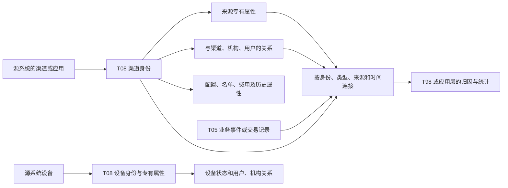

# T08 全貌：先分清对象，再理解业务沿哪条路发生

[返回入口](README.md)

## 1. 什么进入 T08

Wiki《模型层主题划分》把 T08 定义为渠道，范围包括营销服务渠道和运行管理中的信息资产管理。现有物理目录进一步显示，应用入口、渠道限制、客户名单、引流费用、通讯设备和数据分发配置也归入这个主题。[主题定义](证据/Wiki/255499828.json) · [平台分类快照](资料/平台分类快照.json)

可以用一次客户旅程理解对象的分工：客户通过某个开户入口留下申请，后来从 APP 某页面购买基金，又进入一个直播间。三个场景都有“渠道”，但开户来源编号、基金的页面/模块参数和直播间编号是三套身份。它们有共同的接入含义，却没有天然的一对一关系。

T08 还保存内部运行对象。员工联网设备、移动柜台设备、呼叫中心录音或留言设备描述的是服务载体。结算分发渠道则描述数据交付路线。它们不会因为被归在 T08，就成为同一种客户获客渠道。

## 2. 七个业务分支

| 分支 | 模型对象 | 为什么需要分开 |
|---|---|---|
| 开户引流与合作 | `t08_chan`、`t08_gks_chan_info`、`t08_crm_dvrs_chan_info`、`t08_gu_bnk_org_info`、`t08_oact_dvrs_bnk_info`、`t08_oact_chan_lmt_plac_info`、`t08_chan_dvrs_fee` | 渠道身份、引流属性、银行组织、限制配置和费用记录粒度不同 |
| 网店与内容 | `t08_shop_info`、`t08_wos_live_info`、`t08_wos_shor_vdo_info` | 店铺是经营空间；直播和短视频是具体内容/服务对象 |
| 运营投放 | `t08_ad_oper_site_info`、`t08_oper_site_ai_mdl_plac_info`、`t08_ad_oper_site_mtrl_plac_rec`、`t08_chan_cust_list` | “展示位置”“模型配置”“放置素材”“受众或黑名单”分别建模 |
| 应用与销售入口 | `t08_agent_app_chan_info`、`t08_ew_chan_adtnl_info`、`t08_pmb_acs_chan_info`、`t08_sip_chan_info`及 `t08_chan` 来源分支 | 应用对象、企微二维码配置、商城接入和交易埋点不共用同一键 |
| 设备运行 | `t08_dvc_base_info`、两张设备附加表、三张设备历史表 | 基本身份、专有属性、状态、机构归属与用户关系分别变化 |
| 呼叫中心 | `t08_cc_acpt_chan_plac_info`、`t08_cc_pst_dvc_plac_info`，以及渠道、设备、统计信息历史的 CC2 分支 | 受理入口和录音/留言设备各有独立编号 |
| 数据分发与报送 | `pdata_n.t08_sett_distr_chan_info`、`spdata_n.t08_cstd_rep_chan_info`，以及各库的 `t08_chan` | 分发介质、路径规则、报送对象属于配置；不表示发送已完成 |

四张共用关系/属性表贯穿多个分支：`t08_chan_rela_h`、`t08_chan_inr_org_rela_h`、`t08_chan_user_rela_h`、`t08_chan_stati_info_h`。它们分别描述渠道之间、渠道与机构、渠道与用户、渠道的某类历史属性。

## 3. 一张概念关系图

图表示已读模型和 SQL 的概念关系，不是图库返回的正式血缘，也不表示每一条专有表记录都有可匹配的 `t08_chan` 行。`t08_sip_chan_info` 就没有 `Chan_Id`；它通过两级入口参数参与消费。

## 4. 与其他主题交叉时怎么理解

| 邻接主题 | 在 T08 中看到什么 | 还需去哪里回答 |
|---|---|---|
| T01 当事人 | 名单中的客户标识、归因结果中的客户号 | 用户号/手机号如何对应客户，客户归属与状态 |
| T02 产品 | 直播资料中的产品代码、销售入口关联交易 | 产品是什么、份额/证券代码怎样统一 |
| T03 协议 | 开户与交易所依托的账户、订单等 | 账户、合约和订单自身的身份及状态 |
| T04 机构与用户 | 内部机构号、店主、设备负责人、渠道申请人 | 编号所属体系、员工和系统用户的对应 |
| T05 事件 | 浏览、触达、下单、服务、发送等记录 | 实际发生了什么及其金额、次数、结果 |
| T07 营销 | 直播活动、运营资源和营销动作 | 活动组织、资源内容、执行情况 |
| T09 财务 | 渠道费用、结算分发配置可能被财务分类 | 会计入账、账单、支付核销等；本专题不建设 T09 |
| T98 / 指标层 | 渠道资料被用于归因和聚合 | 最终筛选、优先级、重复消除及指标口径 |

“同主题”“同名字段”“同来源系统”都只能帮助寻找候选。真正的连接要回到对应记录的粒度、键和日期条件。

## 5. 如何理解覆盖数字

平台目录有 49 个 T08 前缀资产，其中 `pdata_n` 31、`spdata_n` 2，另外是应用副本和 UAT 对象。字段库有 67 条 T08 元数据，其中 `pdata_n` 29、`temp` 38。两者收集对象和日期不同，不能相减后声称“漏了多少正式表”。本专题的阅读范围采用前者定位正式对象，用字段快照、任务 DDL 和本次三张平台 DDL 逐项说明结构依据。[完整数量口径](资料/平台分类与数量口径.md)
