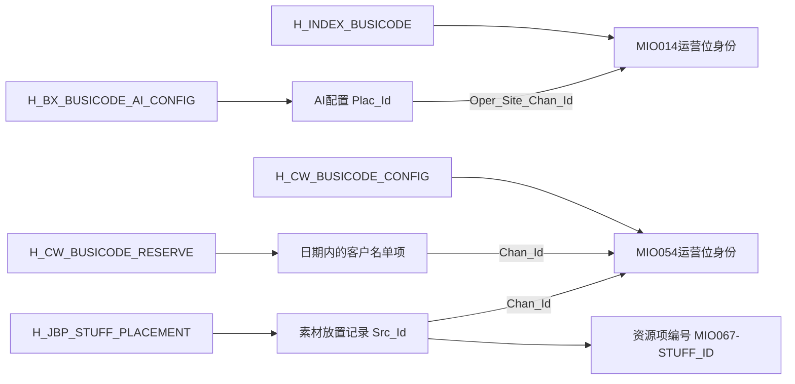

# 运营位如何连接配置与客户

[返回入口](../README.md) · [业务对象说明](../业务/03-运营位素材与名单.md)

## 1. 先建立不同的身份层

图中连线是已读SQL投影支持的候选对应。没有将MIO014和MIO054合并，也未据资源项编号猜测其物理主表。[156751](../../../attachments/03-运营位如何连接配置与客户/IMG-03-运营位如何连接配置与客户-20260914110950621.sql)、[171321](../../../attachments/03-运营位如何连接配置与客户/IMG-03-运营位如何连接配置与客户-20260914110952083.sql)、[212677](../../../attachments/逐表对象目录/IMG-逐表对象目录-20260914110953623.sql)

## 2. AI配置从源头到字段

156751直接映射 `ID→Plac_Id`；`BUSICODE`加MIO014前缀；CMS_ID和CMS_DATA_SNAPSHOT保存资源标识与配置时的资源信息；AI_MODEL_KIND/AI_MODEL_ID保存模型类型与编号；SCORE_THRESHOLD保存阈值；START_AT/END_AT保存配置有效期。

配置表按来源覆盖，内部有显式生效/失效时间。因此查询某时点配置不能只看ETL日期，需按源业务时间判断。该SQL没有输出曝光、点击、调用结果或成交金额，不能由此判断模型效果。

## 3. 素材放置记录并不是运营位主数据

212677中：

| 源字段 | 输出 | 需要保留的含义 |
|---|---|---|
| ID | Src_Id | 一条放置来源记录 |
| CHANNEL_ID | Use_Chan | 原样使用渠道字段，与模型Chan_Id分开 |
| MODEL_ID | Src_Chan_Id；非空时生成MIO054-编号 | 被配置的运营位 |
| STUFF_ID | 非空时生成MIO067-资源项编号 | 被放置的资源对象 |
| DATA_ID | Rpt_Data_Id | 上报数据编号，具体下游绑定未查明 |
| CREATED_AT | Create_Time | 放置记录的源创建时间 |

一个运营位可能有多条放置记录，一项素材也可能用于多个位置。不能在渠道总数里把这些记录计成新渠道，也不能把Use_Chan当作已经标准化的Chan_Id。

## 4. 客户名单的标识需要类型解释

MIO名单对PLAYER_KIND先执行限定目标字段与源字段的转换，再 `NVL(DW_CD_VAL,PLAYER_KIND)`。因此转换未命中会保留源值，不能假定Cust_Type_Cd始终是仓库字典值。portal分支生成CFM001用户编号，其余PLAYER_ID原样保留；来源记录ID还单独保存。

读取某渠道的定向名单时，至少选定来源、业务日期、List_Type_Cd和客户类型；若要统计真实客户人数，还需身份映射与去重。手机号黑名单没有Chan_Id，不能套用该渠道名单的连接方式。

## 5. 把认识连起来

“哪个位置配置了什么、面向哪些标识类型的人群”能由这几张配置表解释；“实际触达谁、谁看过、是否购买”必须继续接行为和交易。多表都共享渠道编号，仍应先按目标问题把配置、名单或素材聚合到需要的粒度，再与事件连接。
