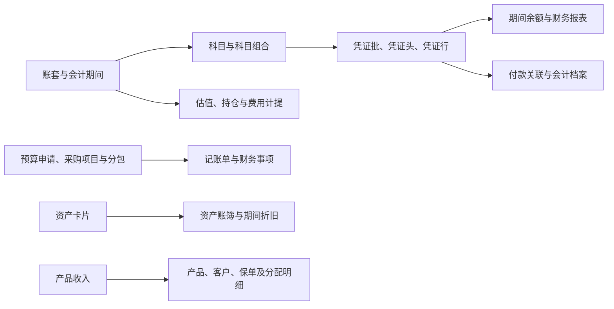

# 全貌：财务对象怎样组成一套可解释的记录

[返回入口](00-20260911-认知实验/t09专题-财务/README.md)

## 1. T09 确实存在，而且不限于六张代表表

Wiki《基础模型命名规范》（pageId `172993522`）明确列出 `T09 / FIN / Finance / 财务`。《模型层主题划分》（pageId `255499828`）把它概括为会计核算、估值清算、财务数据及固定资产，列举账套、账单、估值历史、固定资产、记账单明细和科目组合。两段正文见 [Wiki 证据](00-20260911-认知实验/t09专题-财务/证据/Wiki/主题与命名.md)。

这些例子是导航。实际目录还出现预算采购、收入分配、费用计提、凭证付款、档案附件和成本分摊。因而本次以原始目录重建范围，再用 SQL 解释重要分支，不能把旧概览的六个名词当成完整边界。

## 2. 先分业务分支，再观察模型表达

| 业务分支 | 主要问题 | 主库名称数 | 代表对象 |
|---|---|---:|---|
| 账套科目与核算框架 | 在哪套账和分类框架下记账 | 19 | `T09_SOB`、`T09_ACCTNT_SUBJ`、`T09_SUBJ_COMB`、`T09_ACCTNT_PD` |
| 凭证账单与余额 | 如何记录分录、单据和期间结果 | 20 | `T09_VCHR_INFO`、`T09_VCHR_LINE_INFO`、`T09_BILL`、`T09_SUBJ_BAL_S` |
| 估值持仓与计提 | 某时点价值、数量、费用及确认 | 28 | `T09_VALU_H`、`T09_SUBJ_HOLD_STOR_DET`、计提设置和明细 |
| 预算采购与申请 | 请求什么、怎样拆分、由谁审批 | 18 | `T09_BDGT_FEE_APP_DOC`、采购项目、分包、报价及关系 |
| 固定资产与折旧 | 资产卡片怎样形成期间核算 | 7 | `T09_AST_ACCTNG_CARD_INFO`、`T09_AST_PD_BAL_INFO`、固定资产附加信息 |
| 产品收入与分配 | 收入从总额怎样展开到受益对象 | 7 | `T09_CHREM_PRD_ACTL_RECV` 及明细、下发、奖励切分 |
| 财务报表成本与档案 | 怎样表达报表、分摊成本、保存材料 | 8 | 报表项与指标、成本动因与费用、会计档案 |

数量来自 [主库对象对照](attachments/00-全貌与对象地图/IMG-00-全貌与对象地图-20260914111012579.json)，每个名称只分配一个阅读入口。这是本专题的阅读分类，不是七套相互独立的业务系统，也不等于平台分类树。

观察任意分支，都可以再问四个问题：对象是谁、怎样与其他对象对应、记录哪个时间的事实、数值应按什么单位和层级使用。“历史表”“ERP 来源”“借方金额”分别属于这几个观察维度，不应与采购、估值并列为业务分支。

## 3. 一张概念关系图

这是阅读关系图，箭头不声明全量 SQL 血缘、外键或已核实的因果链。实际连接见六个实现案例；例如凭证与余额都是来自源系统的加工，不能由图推断余额任务直接读取了凭证行。

## 4. T09 与邻接主题如何分工

T01 提供客户、供应商等当事人身份，T02 提供产品和证券资料，T03 提供账户、合同和协议关系，T04 提供机构及人员，T05 留下业务事件。T09 关注相关事项的财务表达，T98 和集市继续选择范围、连接、聚合。

这种分工不是严格的一物一主题。固定资产在 T09 有会计卡片及经营管理附加信息；`pdata_ams` 的 T09 表族又以资产类别持仓为中心。不能看到 `T09` 前缀就把所有 schema 的对象合成一张统一财务模型。

同样，T09 的估值历史不能自动代表 TIT 的合约估值、OIS 的报告生成或交易对手最终收到的估值报告。本次证据的主体是财务、托管、自营及资管核算对象，未找到足以建立 T09 到 TIT/OIS 全链对应的证明。

## 5. 读完以后应该能回答什么

以“某部门这个月收入多少”为例：先确定用记账单金额、凭证分录净额、产品收入分配金额还是报表指标；再确定公司及部门段、币种、期间、状态、来源和聚合粒度。不同答案可能都能从 T09 找到数据，但它们回答的业务问题不同。

本专题的目标是让这些选择可以解释和复核。实时数据量、借贷平衡、关账结果及正式业务口径，需要独立的数据与业务验收，不能由字段名或静态代码推出。
