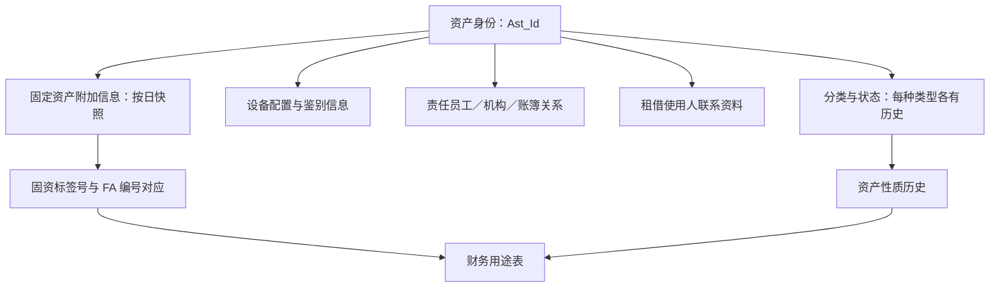

# 全貌：从一项资产出发组织知识

[返回入口](README.md)

## 1. T10 存在，但主题名称比当前已读实现更宽

本仓库的[主题编码表](../00-模型层主题划分.md)列出 `T10 / AST / Party Asset / 资产`；调度主题 `EDW_AST` 的说明是“资产主题数据加工”，本地目录含 10 个任务。平台目录中的十张 `pdata_n.t10_*` 表与这十个任务一一对应。本次又按各表 GUID 取得了当前 DDL。这些证据共同确认了专题的存在，不能只凭表名前缀判断。[主题与任务](./证据/调度主题与任务.json)、[当前 DDL 字段](../../attachments/00-全貌与阅读地图/IMG-00-全貌与阅读地图-20260914110004241.json)

模型主表具有权属人、资产类别、资产类型等较通用字段，字典也包含自有、租赁、托管等权属类型；但**已读十个生产分支均以 FAM 资产台账为主来源，主表还固定写“自有”和权属人 `GF`**。因此这版用我司固定资产解释已实现部分；没有把字典允许的所有资产类型都写成已接入来源，也没有把整个 T10 限定为电脑设备。

## 2. 为什么要拆成这些对象

| 认识顺序 | 模型表达 | 为什么单独存 |
|---|---|---|
| 先识别资产 | `t10_ast_info` | 名称、标签身份、类别、权属、当前属性构成公共资料 |
| 解释变化 | `t10_ast_stat_h`、`t10_ast_clas_h` | 同一资产同时有多种状态与分类，每种都可能有不同历史 |
| 描述和识别设备 | `t10_ast_plac_h`、`t10_ast_idty_info_h` | 配置是一组属性，序列号/MAC 等是带类型的鉴别信息 |
| 指明关系另一端 | `t10_ast_emp_rela_h`、`t10_ast_inr_org_rela_h`、`t10_ast_ast_book_rela_h` | 责任人、成本归属和账簿各自有角色、编号体系与有效期间 |
| 保留联系人资料 | `t10_ast_lkman_h` | 租借使用人按姓名、单位及电话表达，未提供统一员工身份 |
| 承接固定资产专属资料 | `t10_our_fix_ast_adtnl_info` | FA 编号、原净值、折旧、租借、保险、流程等按日保留 |

以上默认指 Hive `pdata_n`。`_h` 是否真是历史，必须看实际日期条件；本专题已读的这些历史生产分支采用 `strt_date <= d < end_date`。

这是依据模型与已读 SQL 整理的业务关系图，箭头不表示每条关系都已在图库中确认。本次图库查询返回 `ARCADEDB_UNAVAILABLE`。

## 3. 与其他主题怎样分工

| 相邻主题 | 连接点 | 不能直接等同的东西 |
|---|---|---|
| T01 当事人 | 主表有 `proprt_prsn_id` 权属人字段 | 已读分支写常量 `GF`，不能因此认定已经连接到某条 T01 记录 |
| T02 产品 | 产品定义、品种、行情可描述金融产品 | 本次 T10 的资产标签号不等于证券/产品编号 |
| T03 协议 | 附加表保留采购订单号、合同号、PO 号 | 这些号尚未取得与某种 T03 协议身份的实际连接证据；资产账户也不等于本主题资产台账 |
| T04 机构与人员 | 责任人实际读取用户员工关系；机构关系表达使用和成本归属 | 用户、员工、使用部门、核算公司段不是同一种身份 |
| T05 事件 | 入库、转移、报废等是发生的业务 | T10 的状态历史和附加表流程字段不能直接代替事件流水 |
| T06 区域 | 资产地址测试分支涉及省市县字段 | 尚不能把测试地址加工写成已闭合的正式 T10→T06 链路 |
| T09 财务 | 资产账簿编号、FA 编号、金额与折旧资料 | 有财务字段不意味着它就是会计分录、账簿余额或某套完整财务核算模型 |
| T98 汇总 | 可作为潜在汇总消费层 | 本次已核实消费者是 `dm_fin_n.erp_fix_ast_ast_nature`，未核实 T98 消费者 |

## 4. 范围不是“搜到多少 t10 就有多少资产模型”

本地旧物理元数据有 23 条 T10 前缀记录，新平台目录有 12 条；其中重合 3 条，按原始物理标识对照后共 32 个对象位置。主模型仅占其中 10 张。其余是资产管理/风控库的估值和报表对象、其他数据库中的同名对象、临时对象等。ECIF SQL 中还存在另一套 `t10_` 命名。

这些都保留在[范围对照](资料/平台分类与同前缀对象.md)，用于防止漏看和误归类。它们不能取代以 `EDW_AST + pdata_n + 具体模型对象` 确定的主范围。
