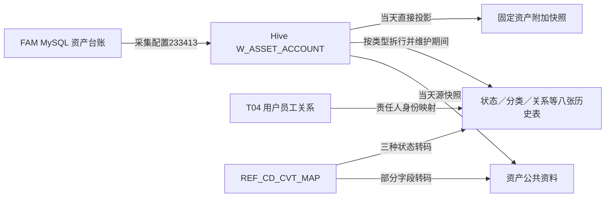

# 来源与加工职责：一张台账为什么产生十张模型表

[返回入口](README.md)

## 1. 先分清源系统、贴源采集与模型加工

已取得的源元数据将 `fams_ac_paas_lowcode.w_asset_account` 注释为资产台账，包含固资标签号、FA 编号、分类、性质、责任人、费用部门、设备和折旧等字段。采集任务 `233413` 的配置 SQL 从这张 MySQL 表选取字段，配置的 Hive 目标为 `odata_n_fam.w_asset_account`。

任务名字末尾有 `_f`，**实际配置目标却没有 `_f`**。不能仅按调度名称新造一张 `w_asset_account_f` 作为模型输入。采集配置记录为 `truncate`，这里只把它作为该环节的写入配置；模型则实际按贴源表的 `busi_date=d` 读取。本次没有以这个配置字段推断全部历史分区保留策略。[来源配置](证据/来源与消费者配置.json)、[采集目标 DDL](证据/SQL/233413.sql)

图中八张历史表为状态、配置、员工关系、鉴别信息、账簿关系、联系人、分类、机构关系；不包括单列的测试地址分支。源采集边依据配置 SQL，模型边依据已读生产 SQL，均不代表某天已经成功执行。

## 2. 对象 × 来源字段 × 加工 × 使用的交叉矩阵

| 模型对象 | 源台账主要信息 | 本任务额外做什么 | 后续怎样理解 |
|---|---|---|---|
| 资产主表 | 标签号、名称、类别/性质/状态 | 四组属性转码；类别有优先级；维护新增、更新、删除标记 | 保存主对象及当前属性，不是每日完整历史 |
| 状态历史 | `STATUS/INSURE_STATUS/ENTRY_STATUS` | 三种类型拆行、各自转码、维护区间 | 一项资产可同时有多种状态 |
| 配置历史 | 操作系统、供应商、型号、数量 | 按资产号比较属性变化 | 设备资料的观察历史 |
| 员工关系历史 | 责任人用户号与 ERP 号 | 先连 T04，再回退源员工号 | 员工身份转换结果 |
| 鉴别信息历史 | MAC、硬盘序列号、SN | 固定三种类型拆行 | 识别特征，非统一主键 |
| 账簿关系历史 | 资产账簿 | 统一小写、维护区间 | 另一端账簿编号待独立核实 |
| 联系人历史 | 使用人、电话、使用单位 | 固定租借使用人角色 | 联系资料，无员工身份映射 |
| 分类历史 | 大类、小类、性质 ID | 固定三种类型拆行；不转码 | 保留源分类体系；性质供财务读取 |
| 机构关系历史 | 费用承担编号、使用部门 | 拆公司段/部门段、保留使用部门号 | 不同机构体系的三种角色 |
| 固定资产附加信息 | FA 号、金额、折旧、采购、租借、保险、流程 | 当日投影，未做估值或折旧计算 | 编号桥接与每日经营快照 |

每张表的精确任务、比较键和分区见[逐表目录](./资料/逐表对象目录.md)，不用把任务编号当业务分类。

## 3. 三种保存方式

**主表维护当前资料及删除痕迹。** 当天 TEMP 与该来源存量按资产号全外连接，形成 I（新增）、U（属性变更）、D（源中消失）、S（未变）。新增/变更写新属性，源消失则保留旧记录并设删除标志；变更保留原加载日，更新数据更新日。这里的删除首先是相对源快照的消失，不等于业务已报废。[236109.sql](证据/SQL/236109.sql)

**八张历史表按属性/角色维护期间。** 取在 `d` 有效的旧版本与当天 TEMP 比较；新增开链，变更关闭旧链并开新链，消失只闭链，未变保留原期间。源业务发生日与加工观察日是否一致并未得到验证。[历史推演](实现详解/历史维护与连接推演.md)

**附加表按天保存快照。** `src_tbl + busi_date` 是分区字段，模型直接保留当天的 FA 号、原净值、责任资料等。因此它与历史表连接时，需要明确使用哪个日期的映射。[236119.sql](证据/SQL/236119.sql)

## 4. 字典转换与字典解释承担不同职责

`REF_CD_CVT_MAP` 决定“某源字段的值转换为什么仓库值”；`REF_DW_CD_VAL` 解释“某代码域中的某值是什么意思”。本地 SQLite 已有后者的码值快照，没有独立完整的转换表记录供本次核验。

例如资产性质原值 `ASSET_NATURE` 在主表经过转换成为 `Ast_Prop_Cd`，在分类历史 `03` 分支却原样保留。两个字段内容可能相似，但使用不同的代码解释。即使字典两组中文含义一致，也不能凭含义补造 `1→31` 的实际映射记录。

## 5. 覆盖和质量检查能说明什么

本地任务目录有 49 个 T10 相关质量任务，涉及记录数、唯一性、值域、期间交叉/重复等；这些证明配置了相应检查对象，不证明检查运行通过。主模型代码来自 2026-09-05 采集的本地源脚本；当前 DDL 与其建表字段已逐表对照，无字段名集合差异，但这也不能证明平台当前生产代码与本地脚本完全一致。

因此本专题把“结构已当前补查”“历史代码已精读”“当前消费者已补查”“运行与数据待验”分开标记，详细见[证据台账](证据/证据台账与待核问题.md)。
