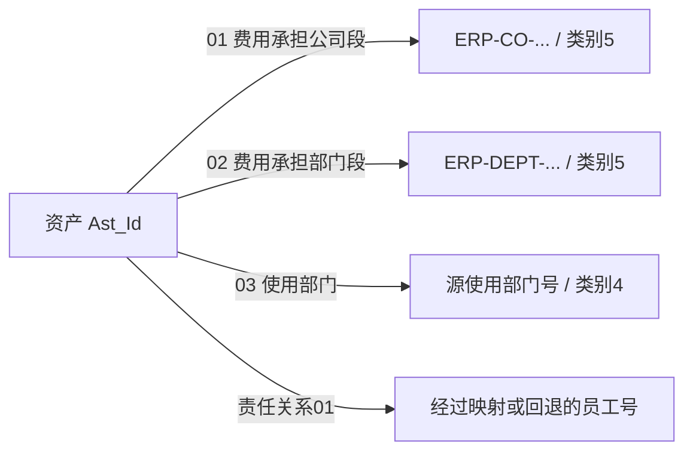

# 责任人、机构、账簿与联系人：一项资产的多种关系

[返回入口](../README.md)

## 1. 责任人需要跨过用户身份这一步

`t10_ast_emp_rela_h` 表达资产到责任员工的关系，当前关系类型固定为 `01`。加工不是直接使用源中的责任人用户号作为员工号，而是先匹配：

```text
源 ASSET_RESPONSIBLE_PERSON
  → T04_USER_EMP_RELA_H.USER_ID
  → EMP_ID 非空时优先使用该员工号
  → 否则回退源 ASSET_PERSON_ERP_CODE
```

T04 取数范围是 `SRC_TBL='ODATA_N_OAS.P_GF_USER' AND DEL_FLAG='0'`，并取 `DISTINCT USER_ID,EMP_ID`；本段没有筛选关系类型，也没有用资产加工日套 `strt_date/end_date`。[236113.sql，29–40 行](../../../attachments/03-责任人机构账簿与联系人/IMG-03-责任人机构账簿与联系人-20260914110004248.sql)

这能证明用户到员工的转换确实参与 T10 生产，却不能证明同一用户在该集合只有一个员工号。若出现两个不同员工号，`DISTINCT` 后仍是两行；源资产会被放大。回退字段为空时，模型员工号也可能为空。

已读 T04 关系生产 `61612` 从新 OA 的 `I_GF_USER` 及删除记录来源提取 `LOGIN_ID/CODE`，按员工 `CODE` 排序选取记录，但仍沿用旧 `ODATA_N_OAS.P_GF_USER` 来源分区。因此分区标签不能直接当作仍由旧源表生产的证明；按 `CODE` 去重也不等于按 `USER_ID` 唯一。[61612.sql，29–76 行](../../../attachments/03-责任人机构账簿与联系人/IMG-03-责任人机构账簿与联系人-20260914110004962.sql)

附加表 `Respon_Prsn_Emp_Id` 则直接用源 `ASSET_PERSON_ERP_CODE`。**关系表的转换结果和附加表的原始员工号不一定相同**，出现差异时应先核对映射与来源时间。

## 2. 使用部门和费用承担部门不在一棵编号树里

`t10_ast_inr_org_rela_h` 对每项资产产生三种关系：

| 关系类型 | 目标 `Inr_Org_Id` | `Inr_Org_Cate_Cd` | 含义 |
|---|---|---|---|
| `01` | `ERP-CO-` + `COST_BEAR_DEPT_CODE` 前五位 | `5` | 费用承担公司段 |
| `02` | `ERP-DEPT-` + 该字段第六位起的余串 | `5` | 费用承担部门段 |
| `03` | 原样保留 `ASSET_USE_DEPT` | `4` | 使用部门 |

费用段字段空白时前两组输出空字符串；代码没有在分支中过滤掉空关系端点。切分表达式也没有验证源编号长度或格式。[236118.sql，24–78 行](../../../attachments/03-责任人机构账簿与联系人/IMG-03-责任人机构账簿与联系人-20260914110005315.sql)

本地 `CD014` 将 `5` 解释为 ERP 内部机构（财务核算管理），`4` 为 OA 机构。旧固定资产关系类型域 `CD2079` 的 `01/02/03` 与上述含义对应；当前 `AST_*` 字段与旧域的正式绑定仍待核实。

**教学例子，非实测记录**：费用承担编号 `123456789` 将产生 `ERP-CO-12345` 和 `ERP-DEPT-6789` 两个目标；使用部门原号不随之改写。不要用使用部门号直接连接财务部门段，更不要把三种关系解释为三级上级机构。



这是关系类型与编码规则图，不是已经逐条验证端点存在的组织图。连接 T04 时需保留机构类别、来源与有效时间，先检查目标节点是否存在。

## 3. 账簿关系保存的是另一个业务对象的编号

`t10_ast_ast_book_rela_h` 把 `LOWER(ASSET_LEDGER)` 作为 `Ast_Book_Id`，类型固定 `01`，按 `Ast_Id + 关系类型` 维护变化。[236115.sql，29–37 行](../../../attachments/03-责任人机构账簿与联系人/IMG-03-责任人机构账簿与联系人-20260914110005476.sql)

这里大小写归一化是实际加工的一部分。对接别的账簿表时要确认对方采用相同规则，不能直接用源账簿原文本假设大小写敏感匹配成立。也不能把账簿号当银行账号、资产账户号或 FA 资产号。

本地元数据能找到 `t09_ast_book_user_rela_h`，但本次没有找到可确认的 `pdata_n.t09_ast_book` 主表记录，也没有实际 T10→T09 账簿 Join SQL。故目前闭合到的是“资产指向一个账簿编号”，端点与消费边仍待核实。

## 4. 租借使用人不是责任员工的另一列名称

`t10_ast_lkman_h` 固定联系人类型 `61`，把 `USE_PERSON` 同时写为简称和全称，`PHONE` 写联系电话，`USE_UNIT` 写工作单位；没有输出员工 ID，也没有关联 T04。[236116.sql，38–55 行](../../../attachments/03-责任人机构账簿与联系人/IMG-03-责任人机构账簿与联系人-20260914110005533.sql)

本地 `CD028 / 61` 的含义是租借使用人，备注“我司固定资产租借”。所以资产可由公司员工负责，实际租借使用人另有其人。不能按同名联系人给它补一个员工号，也不能用联系人行数统计负责员工人数。

该分支没有按租借状态过滤，亦未排除空姓名；它保存的是源台账当前提供的联系资料及变化历史，不保证每条都是当前有效租借关系。

## 5. 沿关系取数的最小顺序

先选资产与时点；再选责任、费用、使用或账簿中的一种关系；明确关系类型与来源；最后连接另一端的身份资料。多关系并列展示时，应逐个验证基数，再组成资产视图。资产责任、实际使用、费用承担、所有权各有独立含义，任何一项都不能代替另外三项。
