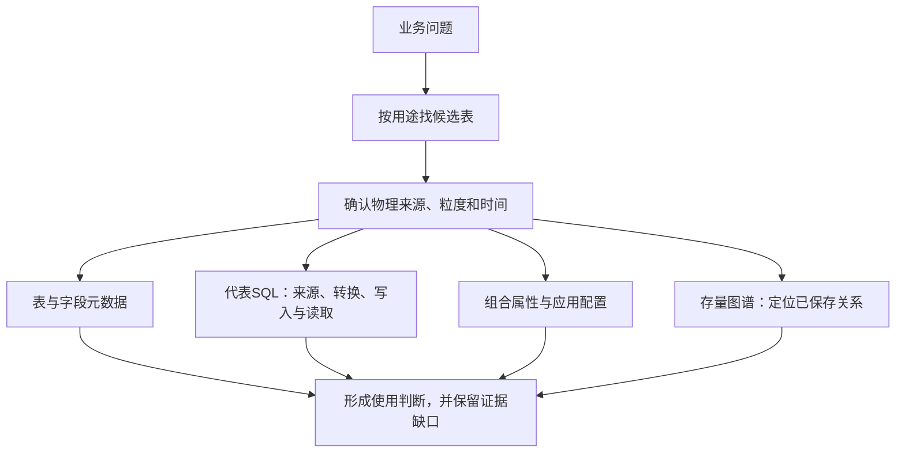

# 全貌与盘点边界

[返回专题](README.md)

## 1. 先解释 T98 为什么难整理

T01、T03 等专题可以从当事人、协议等对象建立阅读主线。T98 的主题名称是“汇总”，同一前缀下既有围绕一个对象拼接的资料，也有跨对象的统计结果和应用配置。对 T98，先问“这份数据为了哪一种使用而组织”，比先背一棵统一对象树更有效。

本地 Wiki 镜像《2.基础模型命名规范》（页面 172993522）把 T98 列为 SUM / Summary / 汇总。这个命名只确定主题标识，不足以推出每张表必须做 SUM、每行必须是聚合结果，或者所有 T98 都有统一主键。镜像尚未刷新远端版本，出处见[来源与核验范围](证据/来源与核验范围.md)。

从已见元数据与代表 SQL，可以区分下列使用形态。这是解释维度，不是给每张表做过完整验收的分类结果。

| 使用形态 | 代表表 | 首先要问 |
|---|---|---|
| 对象资料拼接 | t98_org_emp_base_info | 每个对象选哪份资料、哪个时点、哪种身份？ |
| 分类后的业务统计 | t98_cust_prd_sale_info | 哪些流水被纳入，按哪些维度合并？ |
| 存量与时点观察 | t98_cust_prd_ret_info、t98_otc_book_hold_sum | 是哪个时点的持有量，能否跨日相加？ |
| 业务规则派生明细 | t98_otc_deri_comp_sale_adtnl_det | 日期怎样展开，同一合约为何有多行？ |
| 归属与分配关系 | t98_otc_comp_mng_rela_info | 交易、客户、员工和机构分别扮演什么角色？ |
| 应用配置 | t98_cid_prd_subj_index_conf | 哪些配置决定选择什么数据和什么取值列？ |
| 技术活动统计 | t98_ai_app_dilg_stati_info | 统计对象是会话、用户、工具还是应用？ |

## 2. 本次范围怎样固定

以两套本地目录中**表名以 t98_ 开头**的记录为基础，覆盖所有已见 schema。Hive `pdata_n` 作为主阅读入口，`spdata_n`、`pdata_hk` 等保留独立物理范围；临时、测试、备份等名称线索单列，不据名称认定上线或下线状态。

此外，检索了平台“模型主题/汇总”标签，以及任务 SQL、组合配置中的 T98 名称。当前 PARTIAL 平台快照的汇总标签未见非 T98 前缀资产，[补查结果](资料/汇总标签非T98前缀对象.json)单独保留；这只描述该快照，不能推断正式分类已完整。

这是一张查证路线图，箭头不表示数据血缘、调度顺序或执行结果。

## 3. 数量要按来源读

| 数量 | 精确含义 |
|---:|---|
| 689 | 字段目录中的 T98 前缀物理记录，物理身份按平台、来源和完整表名区分 |
| 637 | 上述记录去掉物理来源后得到的不同表名数；不能据此合并物理对象 |
| 20,148 | 已采集字段记录数，包含分区字段；不是不同业务字段数 |
| 428 / 88 / 55 | 字段目录中的 Hive pdata_n / spdata_n / pdata_hk 记录数 |
| 625 / 64 | 解析状态 PARSED / UNSUPPORTED；解析成功不等于表或业务验收 |
| 115 | 缺少表说明的物理记录数 |
| 728 | 平台目录中的 T98 前缀资产 GUID 数，采集状态 PARTIAL |
| 423 | 平台目录中 database_name=pdata_n 的 T98 资产数 |
| 388 / 40 / 35 | pdata_n 两目录同名 / 字段目录独有 / 平台目录独有名称数 |
| 1,727 | 本地 hive-task SQL 文本中出现 T98 名称的任务数，尚未逐份精读 |
| 47 | 属性表配置或定义 SQL 提及 T98 的组合类型配置记录数 |

字段目录建库时间为 2026-09-10，所涉对象的采集时间在 2026-08-22 至 2026-09-08；平台目录本次读取的更新时间为 2026-09-12。详细时间戳、集合及口径保存在[统计与来源 JSON](证据/盘点统计与来源.json)。

两套目录不能相加。463 是 pdata_n 两套目录按名称比较的并集，不是确认过的正式物理表总数；SQL 中额外出现的 661 个名称也不能追加成“表数”。

## 4. 这版在哪里停止

已见目录对象都能查到；主库对象有用途导航；其他库、目录差异和仅 SQL 出现的名称都有独立位置。四组代表内容核对了必要字段或 SQL，帮助理解不同使用形态。

没有执行生产 SQL，没有读取客户、员工或交易的实际行数据，没有验证运行状态、金额、唯一性或全量上下游闭包。现有证据也不足以给全部对象标注“正式在用”“废弃”“唯一主键”。
