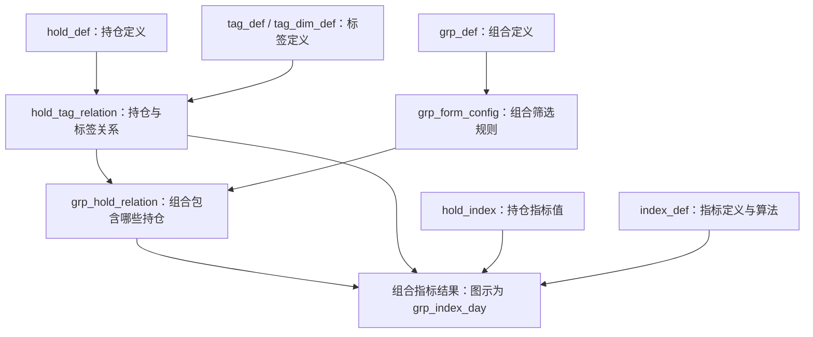

# 如何理解 dm_index_n 指标体系

记录日期：2026-09-11。

这份笔记结合本地 Wiki、表元数据 SQLite、平台返回的生成 SQL 和少量数据样例，回答三个问题：这些表存什么，为什么长得相似，它们如何配合工作。它不是对全库每张表的业务认证。

## 0. Wiki 核心设计基线

Wiki《1. 指标体系核心设计》（Page ID：`213531115`，当前读取版本：83）给出的是指标体系的公共概念、术语和加工关系基线。它明确说明核心设计不绑定某个具体系统，不能直接替代当前表结构、任务 SQL、运行状态或业务验收证据。

对**指标**本身，Wiki 使用两组分类维度：

| 分类维度 | 类型 | 说明 |
| --- | --- | --- |
| 按来源 | 基础指标 | 以数据集为来源 |
| 按来源 | 衍生指标 | 以其他来源指标为来源 |
| 按统计对象 | 持仓指标 | 以持仓单元为对象，通常按日统计 |
| 按统计对象 | 组合指标 | 以组合为对象，可按日、月、季、年统计 |

标签是对持仓或组合的业务信息扩展，不是上述“基础／衍生”指标来源分类的第三种类型。本文后面的“指标结果”和“标签结果”是按结果形态组织的另一种视角。

## 1. 先记住：对象是谁，记录什么

这套体系可以从两个维度理解：

| 针对的对象 | 指标：值是多少 | 标签：具有什么特征 |
| --- | --- | --- |
| 持仓对象 | 持仓指标 | 持仓标签 |
| 组合对象 | 组合指标 | 组合标签 |

**四种业务结果确实存在，但不能按 `grp_*` 与非 `grp_*` 前缀来划分。**

例如，`index_grp_all_entr_num` 不以 `grp` 开头，生成 SQL 却仍按 `grp_id` 处理，是组合对象这条链上的指标数据。

### “组合”不一定是投资组合，也不一定都是客户

这里的组合是平台用 `grp_id` 标识的一类对象。已查的委托、咨询指标限定为个人客户和机构客户；Wiki 还举了“直播”组合类型的例子。

`grp_def` 中的 `grp_type_code` 说明对象类型，`grp_val` 保存组合值，`grp_name` 保存名称。因此不能把所有 `grp_id` 直接叫作客户号。

### “持仓”有自己的对象标识

`hold_def` 用 `hold_id` 标识持仓对象。本地字段中还包括产品、账户、客户、币种、系统等信息。

这些字段说明它承载持仓身份信息，但不能仅凭 DDL 就断定“一个客户＋一只证券”一定唯一，也不能把 `hold_id` 与 `grp_id` 当成同一个标识。

### 持仓类型、持仓单元和六要素

Wiki 中的持仓数据集是持仓指标的来源，需要包含能够区分持仓单元的字段。相同来源表的持仓单元可以划分为同一个持仓类型；每组要素取值对应一个 `hold_id`。

当前 Wiki 对常见要素的概括是六要素：客户相关的四个要素，加上产品和币种。这个描述用于理解持仓身份的组成，不代表本地已查到的每张 `hold_def` 都严格使用相同字段，也不自动证明字段组合具有唯一性。

## 2. 指标与标签有什么区别

下面是帮助理解的虚构例子，不是真实客户数据。

**指标结果说的是：张三累计咨询了 12 次。**

| 对象 | 指标 | 指标值 |
| --- | --- | ---: |
| 张三 | 累计咨询次数 | 12 |

**标签结果说的是：张三具有“已开通债券 ETF”这个标签。**

| 对象 | 标签 |
| --- | --- |
| 张三 | 已开通债券 ETF |

前者需要指标代码和指标值；后者用“对象与标签的关联”表达结果，不需要另放 `index_val`。

### 标签维度与标签值再分开一层

- 标签维度是一个问题，例如“是否同业客户”。
- 标签值是答案，例如“是”“否”。
- `tag_dim_def` 描述维度、取数逻辑等配置。
- `tag_def` 描述具体标签及其条件。

Wiki 还区分：

- **简单标签**：对应单个标签维度，描述一个方面的业务属性。
- **复合标签**：跨越多个标签维度，描述多个方面的业务属性。

标签维度可以关联 0～n 个持仓要素；标签加工的作用是把持仓单元扩展成可查询、分组或过滤的业务对象。一个标签没有对应记录时，仍不能仅凭缺失推断为“否”。

Wiki《5. 组合标签》明确给出 `tag_clas` 的分类：`1` 为持仓标签，`2` 为组合标签。

**标签结果中没有某对象的记录，不一定表示“否”。** 有的任务只输出命中条件的对象，有的会生成“是”和“否”两类结果，要看具体 SQL。

## 3. 为什么很多表都是相同的九个字段

它们用统一结构保存不同业务指标。读一行时，可以把它翻译成：

> 在某个业务日期，某个组合，在某个标签条件下，某项指标的结果是多少。

| 字段 | 回答什么问题 | 注意点 |
| --- | --- | --- |
| `grp_id` | 给谁算？ | 需要组合定义解释身份，不能直接当客户号 |
| `index_id` | 算什么？ | 指标代码，连接具体指标含义 |
| `index_val` | 结果是多少／是什么？ | 虽叫指标值，也可能承载列表等字符串，不能一律当数值 |
| `tag_id` | 在哪个标签条件下？ | 可以是默认标签，也可以区分不同结果 |
| `busi_date` | 结果对应哪一天？ | 不一定是原始事件发生日；累计指标表示截至该日 |
| `data_time` | 什么时候产生这条数据？ | 已查 SQL 使用执行时的系统时间 |
| `modify_operator` | 修改人是谁？ | 管理信息 |
| `modify_time` | 修改时间是什么？ | 已查 SQL 中有固定填入远期日期的情况，不能据此理解为实际修改发生时间 |
| `status` | 记录是否可用？ | 注释为 `1` 可用、`0` 已失效，不是“已开通／未开通”的业务答案 |

业务含义主要藏在指标定义、标签定义和生成 SQL 中。因此只看 `DESC`，看见很多相同字段是正常的。

### tag_id 是否分区，是另一个问题

截图中的累计咨询次数表只按 `busi_date` 分区；设备数量表按 `busi_date、tag_id` 分区。但两张表都含 `tag_id`，SQL 都按组合和标签处理数据。

Wiki 的组合指标说明中有 `tag_prtt_flag` 配置，控制标签是否作为分区。**不按标签分区，不代表没有标签维度。**

## 4. 用户流程图解释的主链

本地 Wiki《组合指标生成流程》和《0. 指标建设开发步骤说明》说明了从持仓指标生成组合指标的路径。

图中箭头表示帮助理解的逻辑依赖，不是本次逐边核实的运行血缘。

按步骤理解：

1. **定义持仓，准备持仓指标。** 知道每笔持仓是谁，以及它的指标值。
2. **定义标签。** 说明如何判断持仓具有某个特征。
3. **定义组合及筛选规则。** 说明哪些持仓属于某个组合。
4. **生成关系。** 形成持仓标签关系、组合持仓关系。
5. **按指标定义计算组合结果。** 利用这些关系选择持仓，再处理持仓指标值。

虚构例子：某客户组合包含持仓 A、B，金额分别为 100、200。若指标定义是金额求和，组合结果为 300；如果进一步限定某标签且只命中 A，结果为 100。这里的求和只是例子，实际算法由指标定义决定。

### 两张关系表不能混淆

| 表 | 表达的关系 | 已查本地关键字段 |
| --- | --- | --- |
| `hold_tag_relation` | 某笔持仓具有哪个标签 | `hold_id、tag_id` |
| `grp_hold_relation` | 某个组合包含哪些持仓 | `grp_id、hold_id` |

第二张是成员关系，既不是标签结果，也不是指标值。这是前面只分“定义、标签结果、指标结果”三类时漏掉的内容。

### 这不是所有组合指标唯一的生成方式

Wiki《4. 组合指标》还列出了：持仓指标汇总、衍生指标、直接 SQL 写入等方式。直接 SQL 可以提供 `grp_val` 或 `grp_id`。

已查的咨询次数、委托数量任务，其直接上游是其他指标表。因此不能把全库所有指标都强行套进 `hold_index → grp_index_day` 这条路径。

Wiki《1. 指标体系核心设计》还明确补充了几条例外：

- 可以不定义“持仓定义”和“持仓指标”，直接计算组合指标；此时持仓标签仍可作为下钻依据，但不一定需要持仓打标和持仓分组。
- 对时间窗口，一般先计算持仓指标，再使用组合指标统计；较早期的指标存在“持仓指标 → 持仓指标”的路径。
- 多维组合类型可能有多个组合 ID，命名方式可表现为 `grp_id` 加维度，例如 `grp_id1、grp_id2`。
- 派生指标的关联规则、取数规则和统计规则都可以由 SQL 定义，算法不一定固定存放在某个统一位置。

组合指标结果中的 `(grp_id, tag_id)`，在设计上来自“包含组合类型”和“包含标签维度”所确定范围的组合关系；实际表是否完整体现这一关系，仍需结合具体定义和生成 SQL 核验。

## 5. 怎样给表分类才不容易混乱

**四种业务结果**与**表在体系里的用途**是不同的分类角度。

| 表的用途 | 回答的问题 | 例子 |
| --- | --- | --- |
| 定义／配置 | 对象、标签和指标是什么意思，如何生成？ | `grp_def、hold_def、tag_def`；文档中的 `index_def、grp_form_config` |
| 标签关系／结果 | 对象具有哪个标签？ | `hold_tag_relation、grp_cust_open_bond_etf_flag` |
| 组合持仓关系 | 组合包含哪些持仓？ | `grp_hold_relation` |
| 指标计算／结果 | 对象的指标值是什么？ | `hold_index、index_grp_all_entr_num、grp1_all_entr_num_year` |
| 业务明细／中间加工／应用输出 | 计算需要哪些明细，下游怎样使用？ | `cust_prd_actl_income_info` 等，需逐表确认 |

这些用途用来组织理解，不是只靠表名就能自动完成的正式分类。

**看表的顺序：对象键 → 指标值或标签字段 → 日期和分区 → 定义与生成 SQL。**

- 含 `grp_id`：组合对象线索。
- 含 `hold_id`：持仓对象线索。
- 含 `index_id、index_val`：指标结果结构线索。
- 对象键与 `tag_id` 关联且没有指标值：标签关系结构线索。
- 同时含 `grp_id、hold_id`：组合持仓关联线索。

这些只是线索，定义表也可能包含相关字段；字段组合本身不证明唯一性或业务用途。

## 6. 已经查实的例子

### 6.1 客户当年委托数量

表：`dm_index_n.grp1_all_entr_num_year`。生产任务：`128029`。

已查 SQL 从 `dm_index_n.index_grp_all_entr_num` 取指定上游指标，自当年 1 月 1 日至统计日，按 `grp_id、tag_id` 求和，并限定个人／机构客户类型。

平台返回的 10 行样例中，一行的业务日期为 `2024-01-11`，指标值为 `4.0`，标签为 `tag999999999`。标签查询确认它的正式名称是“默认”。

这证明本次读到了历史样例，不证明它是最新分区。年累计值也不能直接跨业务日期再次求和。

### 6.2 客户累计咨询次数

表：`dm_index_n.grp1_consutimes_must_ans_accum`。生产任务：`127351`。

SQL 读取 `index_grp1_cust_sendmsgtimes_must_ans_tdy`，将统计日及以前的值按 `grp_id、tag_id` 求和。

已确认的是累计上游指标值。表注释叫“咨询次数”，上游名称叫“发送消息次数”；消息如何折算为咨询，尚未继续核验。

### 6.3 客户委托设备数量

表：`dm_index_n.grp1_trust_dvc_det_cnt_ostsrc_halfyear`。生产任务：`183049`，直接上游任务：`183044`。

结果层读取当日上游结果，对 `index_val` 的逗号列表拆分计数，再按组合和标签汇总。直接上游 SQL 的窗口是六个月前之后、统计日及以前。

**表注释写“当月”，但上游 SQL 使用近六个月窗口，存在口径描述冲突。** 设备信息的去重方式与业务过滤还需继续核验，不能直接称作“全部设备数”。

### 6.4 客户是否开通债券 ETF

表：`dm_index_n.grp_cust_open_bond_etf_flag`。生产任务：`123838`。

平台说明为“组合标签_客户_是否开通债券ETF”。SQL 选取当天未删除、权限字符串包含 `Z` 的账户记录，按客户归并，通过 `grp_def` 映射组合，再关联相应标签定义。

它输出组合与标签关联，没有 `index_id、index_val`，属于组合标签结果。该查询没有证明权限码 `Z` 在其他场景中也具有相同含义。

本次平台元数据标记该表为 `DELETED`，但用户截图能展示结构，两者存在差异；当前实际存在性和运行状态尚未确认。

### 6.5 持仓侧的本地结构证据

- `hold_def`：持仓定义，含 `hold_id` 与产品、账户等字段。
- `hold_tag_relation`：持仓标签关系，含 `hold_id、tag_id`。
- `hold_index`：持仓指标，含 `hold_id、index_id、index_val`，本地结构不含 `tag_id`。
- `grp_hold_relation`：组合持仓关系，含 `grp_id、hold_id`。

上述为本地 DDL 与注释证据，尚未逐表读取实时样例和生成 SQL。

## 7. 为什么有那么多独立结果表

Wiki《5. 组合标签》明确说明：组合标签作为最终结果需要保留历史分区，设计为**一个组合标签维度一张表**。例如“是否同业客户”是一个维度，对应表可以保存“是”和“否”的标签关联。

文档命名示例为 `grp_tag_组合类型_标签英文名称`，实际已见 `grp_cust_*` 等变体，不能因为前缀不同就当成另一套体系。

对指标表，当前样例各自写入固定指标代码、使用各自计算 SQL；这说明相同的统一字段可以装不同指标。尚未核实全库是否严格执行“一指标一表”，不要推广为绝对规则。

## 8. 本地清单的范围

本次表元数据目录构建于 2026-09-10，筛选 Hive 平台、`dm_index_n` 库，收录情况为：

| 范围 | 目录记录数 |
| --- | ---: |
| 表名以 `grp` 开头 | 1,398 |
| 非 `grp` 开头 | 7,549 |
| 合计 | 8,947 |

目录混合了平台查询、离线快照、任务 SQL 建表提取及少量查询投影拼接记录。**这些数字不是平台当前实际存在的表数。**

已整理的 Excel 保留原 grp 清单，并新增非 grp 清单与“体系理解”页。非 grp 清单提供关键字段、分区和结构线索，方便进一步筛选。

[打开表清单 Excel](../../../outputs/01a08f27-grp/dm_index_n_grp表清单.xlsx)

## 9. 参考与证据边界

本地 Wiki 来源位于“大数据研发组／3.数据基础／指标体系”：

- [1. 指标体系核心设计，213531115](http://wiki.gf.com.cn/pages/viewpage.action?pageId=213531115)：核心设计目的、术语表、指标加工路径、持仓／组合指标结构和算法分类。
- [组合指标生成流程，139723083](E:/03_resource/wiki-down/大数据研发组/大数据研发组/3.数据基础/指标体系/组合指标生成流程-139723083.md)：持仓打标签、组合筛选、指标汇总。
- [0. 指标建设开发步骤说明，207230625](<E:/03_resource/wiki-down/大数据研发组/大数据研发组/3.数据基础/指标体系/指标开发指引/0. 指标建设开发步骤说明-207230625.md>)：用户所给流程图对应的开发步骤。
- [3. 组合定义，207230714](<E:/03_resource/wiki-down/大数据研发组/大数据研发组/3.数据基础/指标体系/指标开发指引/3. 组合定义-207230714.md>)：组合类型配置及直播对象示例。
- [4. 组合指标，207230724](<E:/03_resource/wiki-down/大数据研发组/大数据研发组/3.数据基础/指标体系/指标开发指引/4. 组合指标-207230724.md>)：多种生成路径、周期及标签分区配置。
- [5. 组合标签，207230730](<E:/03_resource/wiki-down/大数据研发组/大数据研发组/3.数据基础/指标体系/指标开发指引/5. 组合标签-207230730.md>)：持仓／组合标签分类，标签维度与值，结果表设计。

本地镜像可能过时或不完整。《4. 组合指标》含 2022 年测试环境和尚未生产上线的历史声明，本文只用它解释文档设计，不据此判断当前上线状态或人员分工。

平台证据来自本次对话中的 `opencli szdata table`、`task-sql`、`table-sample`、`tag-detail` 返回。少量样例只代表样例范围；静态 SQL 不证明任务运行成功或业务验收通过。

`tag_dim_def、index_def、grp_form_config、grp_index_day` 有文档依据，但本次没有在本地表目录精确命中。不把本地未收录解释为平台不存在。
