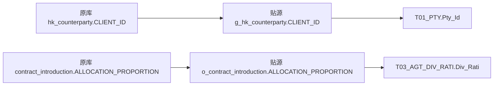

# OIS 入模认知

OIS 在本地来源字典中称为“OTC综合业务平台”。从现有加工证据看，它把交易周围的客户资料、产品资料、销售归属、管理参数和运营记录送入数仓。理解它的入模方式，需要沿着这些对象看各自的身份、粒度和落点：客户进入 T01，产品进入 T02，合约分成进入 T03，机构属性进入 T04，报告和流程记录进入 T05。

同一个业务过程会跨越多个主题。例如，客户的估值报告配置落在 T01，一次报告执行落在 T05；合约分成比例来自 OIS，但识别合约和分成人员还会读取 TIT、IOA。模型按对象职责组织，不能只按来源系统或表名中的业务词判断落在哪个主题。

本次采用现有图谱和本地材料完成整理，图谱范围维持原状。正文解释已核对的加工分支，附录保留本地已发现的全部 OIS 源名和候选任务。**这里的完整范围是本地发现范围，尚未证明覆盖生产系统所有 OIS 对象、所有有效任务及所有间接入模路径。**

## 先建立对象之间的关系

| OIS 中描述的对象 | 进入模型后回答的问题 | 主要落点 | 阅读入口 |
|---|---|---|---|
| 国内、香港交易对手及名称、类别、状态 | 是谁，以什么身份参与业务 | T01 当事人及相关资料 | [客户身份与主体入模](01-客户身份与主体入模.md) |
| 同一客户关系、银行账户、受益所有人、协议阈值 | 和谁相关，有哪些附属资料和条件 | T01 关系、资料及专用扩展表 | [客户身份与主体入模](01-客户身份与主体入模.md) |
| 收益凭证、产品提前终止记录 | 描述哪只产品，如何取得统一证券编号 | T02 产品 | [产品、合约与销售归属](02-产品合约与销售归属.md) |
| 客户开发关系、合约开发关系 | 哪个客户或合约，归属于哪些人员和机构 | T01 客户分成、T03 协议分成 | [产品、合约与销售归属](02-产品合约与销售归属.md) |
| 价差、基础系数、资金成本等管理参数 | 某项收入计算可能采用什么参数 | T99；相关汇总线索在 T98 | [产品、合约与销售归属](02-产品合约与销售归属.md) |
| 估值报告配置、执行、审批及划款流程 | 应怎样处理，以及发生了什么过程记录 | T01 配置、T05 事件 | [运营流程与机构属性](03-运营流程与机构属性.md) |
| 营业部辖区属性 | 哪个机构具有什么统计属性 | T04 内部机构 | [运营流程与机构属性](03-运营流程与机构属性.md) |

上表是阅读导航。每一条可核验的 SQL 或图谱关系放在对应正文中，不把相邻对象自动画成数据因果链。

## 两条能够从现有图中读出来的入模路径

这是当前图中已确认接续的两条字段路径的简化展示，省略了任务及中间写入节点，不能推广为所有字段均已闭合。[客户编号图证据](证据/图谱-144556-pty_id.json)、[合约分成图证据](证据/图谱-134215-div_rati.json)。

它们也说明了两个不同层次：原库到贴源保留业务字段；贴源到模型还可能引入分类、身份映射、过滤和历史维护。`o_`、`g_`、`f_` 前缀本身不足以证明生产者、先后顺序或主备关系。

## 怎样读这份材料

先按 01→02→03 阅读业务主线。遇到一张具体源表，查[全部源对象](附录/01-全部源对象.md)；遇到一个模型或任务，查[全部候选任务](附录/02-全部候选任务.md)。需要判断图上的边能支持什么结论，读[图谱用法与证据边界](04-图谱用法与证据边界.md)。

本地索引包含 **143 个 OIS 源名、167 个涉及 OIS 的任务**，其中 **86 个任务出现 T01～T10 目标写入候选**，当前图内有 **24 个**。这些数字用于定位材料，不表示 167 个任务都已逐字段解读，也不是业务覆盖率。本次选取 18 份 SQL 核对正文涉及的字段、关联、筛选和时间规则，保留了原始行号及完整 payload 的哈希。

T06、T07、T08、T09、T10 在本地清单中尚未命中直接入模候选。正文没有为凑齐十个主题推断路径；区域、渠道、金额、资产等词出现在字段或源表中，也不足以证明已写入对应主题。

整理日期：2026-09-14。图版本：`8651e582cd851a22a3e8d58ce71683f7ac285f539a54364575a7d9391b1f8c46`。字典、SQL和图属于不同证据快照，具体日期与口径见[证据说明](04-图谱用法与证据边界.md)。
