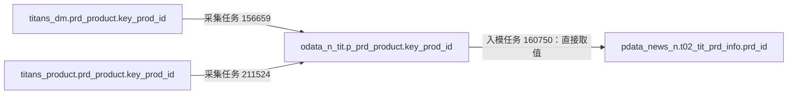

# 从 TIT 贴源往前看原库对象

本次从发布版本 8651e582 的任务清单中，仅筛选目标属于这 638 个 TIT 源名的任务，再核对投影中的实际写入。605 个配置目标名不能直接当作已写入；实际写入证据落到 603 个源名、968 个写入记录。其余 35 个源名在这个限定范围内未匹配到实际写入。

其中 549 个源名的写入任务包含身份已确认的非 Hive 原库读取；另一些仍需沿 Hive 中间加工继续向前追。原库对象是采集 SQL 当前可见的边界，本轮没有进一步展开数据库视图、同义词或应用内部同步逻辑。

258 个源名有多个写入任务，12 个源名涉及多个上游物理对象。保留全部任务、物理身份和写次，不据此选择唯一在用来源。下表中的原库 schema 是技术命名空间，业务职责仍需对象说明与业务资料支持。

## 当前可见的主要原库入口

| 原库命名空间            | 可见对象示例                                   | 写入的 TIT 表                                  | 采集任务示例 |
| ----------------- | ---------------------------------------- | ------------------------------------------ | ------ |
| titans_dm         | titans_dm.v_margin_account_for_risk      | odata_n_tit.d_v_margin_account_for_risk    | 40219  |
| titans_tradeflow  | titans_tradeflow.trd_trs_udly_deal_allo  | odata_n_tit.f_trd_trs_udly_deal_allo       | 202097 |
| titans_product    | titans_product.prd_product               | odata_n_tit.p_prd_product                  | 211524 |
| titans_margin     | titans_margin.margin_acct_bundle_mapping | odata_n_tit.m_margin_acct_bundle_mapping_p | 204962 |
| titans_booking    | titans_booking.trd_deal                  | odata_n_tit.b_trd_deal                     | 34883  |
| titans_admin      | titans_admin.adm_role                    | odata_n_tit.a_adm_role                     | 34880  |
| titans_staticdata | titans_staticdata.bk_book                | odata_n_tit.t_bk_book                      | 34898  |
| titans_refdata    | titans_refdata.ref_instrument            | odata_n_tit.r_ref_instrument               | 34863  |
| titans_marketdata | titans_marketdata.ref_div_curve          | odata_n_tit.m_ref_div_curve                | 44122  |
| titans_operation  | titans_operation.ope_settle_notice       | odata_n_tit.n_ope_settle_notice            | 179125 |
| titans_workflow   | titans_workflow.act_hi_procinst          | odata_n_tit.w_act_hi_procinst              | 126921 |
| titans_service    | titans_service.pricing_option_eod_metric | odata_n_tit.v_pricing_option_eod_metric    | 34896  |

## 已穿透到模型字段的产品例子

[实时字段追溯证据](证据/图谱-160750-prd_id.json)同时返回两条满足当前静态接续条件的采集分支。它证明两条已发布证据路径均存在，不能证明两条任务现在同时运行，也不能把同名原库对象合并为同一来源。入模按 busi_date 读取贴源日期，输出覆盖 src_id=TIT、grp_id=01 分区；日期在数据字段中保留。

## TIT 库名不能代替真实系统来源

已核对 `odata_n_tit.otc_o_margin_account` 的上游：任务 41825 同时读取 `odata_n_tit.d_v_margin_account_for_risk` 和 `odata_n_ois.o_v_margin_account`。同类混合还出现在 `otc_o_margin_parameter`、`otc_o_otc_trs`。所以这些对象应标成“TIT 库内的汇合加工对象”，在本任务中保留外部来源接口，不把所有字段都归给 TIT。见 [图谱核对](证据/图谱-TIT库内混合来源例.json)。

## 638 个源名的上游索引

完整物理身份摘要、读次和写次见 [原库到贴源 JSON](证据/TIT原库到贴源.json)。表内上游是对应写入任务的读取对象；多输入任务仍需按具体输出字段确认贡献。

| TIT 表 | 上游读取对象（含中间层） | 写入任务 |
|---|---|---|
| odata_n_tit.a_adm_department | titans_admin.adm_department | 36975、64049 |
| odata_n_tit.a_adm_employee | titans_admin.adm_employee | 174376 |
| odata_n_tit.a_adm_function | titans_admin.adm_function | 174377 |
| odata_n_tit.a_adm_function_menu_mapping | titans_admin.adm_function_menu_mapping | 206506 |
| odata_n_tit.a_adm_menu_permission | titans_admin.adm_menu_permission | 174378 |
| odata_n_tit.a_adm_menu_role_mapping | titans_admin.adm_menu_role_mapping | 174379 |
| odata_n_tit.a_adm_role | titans_admin.adm_role | 34880、63612 |
| odata_n_tit.a_adm_role_access | titans_admin.adm_role_access | 34881、63613 |
| odata_n_tit.a_adm_user | titans_admin.adm_user | 34882、63837 |
| odata_n_tit.a_adm_user_role | titans_admin.adm_user_role | 34899、63860 |
| odata_n_tit.b_trd_book_mapping | titans_booking.trd_book_mapping | 179796 |
| odata_n_tit.b_trd_book_mapping_condition | titans_booking.trd_book_mapping_condition | 179071 |
| odata_n_tit.b_trd_deal | titans_booking.trd_deal | 34883、63759 |
| odata_n_tit.b_trd_deal_otcoption | titans_booking.trd_deal_otcoption | 34903、63660 |
| odata_n_tit.b_trd_deal_p | titans_booking.trd_deal | 245314 |
| odata_n_tit.d_adm_audit_log | titans_dm.adm_audit_log | 112715 |
| odata_n_tit.d_adm_valuation_check_result | titans_dm.adm_valuation_check_result | 78578 |
| odata_n_tit.d_amazons3_file_info | titans_dm.amazons3_file_info | 113999 |
| odata_n_tit.d_bk_book_mapping | titans_dm.bk_book_mapping | 101937、106098 |
| odata_n_tit.d_bk_book_mapping_p | titans_dm.bk_book_mapping | 244030、245482 |
| odata_n_tit.d_bk_book_mapping_rule | titans_dm.bk_book_mapping_rule | 177317、211588 |
| odata_n_tit.d_bk_book_mapping_rule_p | titans_dm.bk_book_mapping_rule | 244031、245480 |
| odata_n_tit.d_bk_department_properties | titans_dm.bk_department_properties | 164212、211743 |
| odata_n_tit.d_bk_department_properties_p | titans_dm.bk_department_properties | 244881 |
| odata_n_tit.d_bundle_daily_contr_param | titans_dm.bundle_daily_contr_param | 129726 |
| odata_n_tit.d_bundle_margin_daily_result | titans_dm.bundle_margin_daily_result | 146867、211629 |
| odata_n_tit.d_bundle_margin_daily_result_p | titans_dm.bundle_margin_daily_result | 160417、211811、236314 |
| odata_n_tit.d_bundle_margin_daily_result_pb | odata_n_tit.d_bundle_margin_daily_result_p | 160427、211544 |
| odata_n_tit.d_bundle_margin_underlying_type | titans_dm.bundle_margin_underlying_type | 200352 |
| odata_n_tit.d_capital_account | titans_dm.capital_account | 78582、105332 |
| odata_n_tit.d_capital_account_ledger | titans_dm.capital_account_ledger | 78584 |
| odata_n_tit.d_capital_account_p | titans_dm.capital_account | 204954 |
| odata_n_tit.d_capital_acct_current_balance | titans_dm.capital_acct_current_balance | 78568 |
| odata_n_tit.d_capital_acct_current_balance_p | titans_dm.capital_acct_current_balance | 136214、136215、136216 |
| odata_n_tit.d_capital_acct_daily_balance | titans_dm.capital_acct_daily_balance | 78583、113016 |
| odata_n_tit.d_capital_acct_daily_balance_p | titans_dm.capital_acct_daily_balance | 138533、138540、138542、198795、204953 |
| odata_n_tit.d_capital_acct_daily_balance_pb | odata_n_tit.d_capital_acct_daily_balance_p | 198796 |
| odata_n_tit.d_capital_daily_actual_balance | 未匹配到写入证据 | 未匹配 |
| odata_n_tit.d_capital_daily_actual_balance_p | titans_dm.capital_daily_actual_balance | 210678、233155、233156、234818、234820 |
| odata_n_tit.d_cfg_calendar | titans_dm.cfg_calendar | 101935 |
| odata_n_tit.d_cfg_dictionary_desc | titans_dm.cfg_dictionary_desc | 78557 |
| odata_n_tit.d_cfg_pricing_env_curve | titans_dm.cfg_pricing_env_curve | 101119、101121 |
| odata_n_tit.d_cfg_pricing_env_div_curve | titans_dm.cfg_pricing_env_div_curve | 101082、101097 |
| odata_n_tit.d_cfg_pricing_env_vol_surf | titans_dm.cfg_pricing_env_vol_surf | 101080、101096 |
| odata_n_tit.d_dm_option_contract_info | titans_dm.dm_option_contract_info | 78558 |
| odata_n_tit.d_ft_sod_counter_party | titans_dm.ft_sod_counter_party | 148564 |
| odata_n_tit.d_ft_sod_eq_lend_available | titans_dm.ft_sod_eq_lend_available | 148563 |
| odata_n_tit.d_ft_sod_eq_lend_record | titans_dm.ft_sod_eq_lend_record | 148562 |
| odata_n_tit.d_ft_sod_eq_recall_record | titans_dm.ft_sod_eq_recall_record | 148561 |
| odata_n_tit.d_ft_sod_instrument | titans_dm.ft_sod_instrument | 148546 |
| odata_n_tit.d_ft_sod_margin_plan | titans_dm.ft_sod_margin_plan | 148545 |
| odata_n_tit.d_ks_contract_info | titans_dm.ks_contract_info | 102853 |
| odata_n_tit.d_ks_fin_capital_acct_mapping | titans_dm.ks_fin_capital_acct_mapping | 146152 |
| odata_n_tit.d_ks_fin_margin_acct_mapping | titans_dm.ks_fin_margin_acct_mapping | 102420 |
| odata_n_tit.d_ks_fin_margin_daily_report | titans_dm.ks_fin_margin_daily_report | 102412 |
| odata_n_tit.d_ks_fin_trs_valuation | titans_dm.ks_fin_trs_valuation | 101936、106095 |
| odata_n_tit.d_ks_leg_info | 未匹配到写入证据 | 未匹配 |
| odata_n_tit.d_ks_marketval_acc_for_risk | titans_dm.ks_marketval_acc_for_risk | 103601、103602 |
| odata_n_tit.d_ks_risk_long_short_acc | titans_dm.ks_risk_long_short_acc | 139170 |
| odata_n_tit.d_ks_trade_comfirm_info | titans_dm.ks_trade_comfirm_info | 79952、106102 |
| odata_n_tit.d_ks_trs_eod_postion | titans_dm.ks_trs_eod_postion | 79953、103288 |
| odata_n_tit.d_ks_trs_for_risk | titans_dm.ks_trs_for_risk | 102266、106109 |
| odata_n_tit.d_ks_trs_nav_acc_for_risk | titans_dm.ks_trs_nav_acc_for_risk | 103606、103607 |
| odata_n_tit.d_margin_account | titans_dm.margin_account | 78571、105319 |
| odata_n_tit.d_margin_account_ledger | titans_dm.margin_account_ledger | 78594 |
| odata_n_tit.d_margin_account_ledger_p | titans_dm.margin_account_ledger | 243275 |
| odata_n_tit.d_margin_account_p | titans_dm.margin_account | 243267 |
| odata_n_tit.d_margin_acct_bundle_mapping | titans_dm.margin_acct_bundle_mapping | 138675 |
| odata_n_tit.d_margin_acct_bundle_mapping_p | titans_dm.margin_acct_bundle_mapping | 243289 |
| odata_n_tit.d_margin_acct_contract_mapping | titans_dm.margin_acct_contract_mapping | 78587、103286 |
| odata_n_tit.d_margin_acct_contract_mapping_p | titans_dm.margin_acct_contract_mapping | 136211、136212、136213 |
| odata_n_tit.d_margin_acct_current_balance | titans_dm.margin_acct_current_balance | 78573 |
| odata_n_tit.d_margin_acct_current_balance_p | titans_dm.margin_acct_current_balance | 136217、136219、136220 |
| odata_n_tit.d_margin_acct_daily_balance | titans_dm.margin_acct_daily_balance | 78575、107587 |
| odata_n_tit.d_margin_acct_daily_balance_p | titans_dm.margin_acct_daily_balance | 198638、243272 |
| odata_n_tit.d_margin_acct_daily_balance_pb | odata_n_tit.d_margin_acct_daily_balance_p | 198710 |
| odata_n_tit.d_margin_acct_daily_no_calc | titans_dm.margin_acct_daily_no_calc | 103596、103597 |
| odata_n_tit.d_margin_acct_daily_result | titans_dm.margin_acct_daily_result | 78579、103293 |
| odata_n_tit.d_margin_acct_daily_result_p | titans_dm.margin_acct_daily_result | 136201、136202、136203、198811 |
| odata_n_tit.d_margin_acct_daily_result_pb | odata_n_tit.d_margin_acct_daily_result_p | 198812 |
| odata_n_tit.d_margin_bundle_acct | titans_dm.margin_bundle_acct | 198378 |
| odata_n_tit.d_margin_bundle_contract_mapping | titans_dm.margin_bundle_contract_mapping | 138673 |
| odata_n_tit.d_margin_bundle_contract_mapping_p | titans_dm.margin_bundle_contract_mapping | 243295 |
| odata_n_tit.d_margin_daily_contr_param | titans_dm.margin_daily_contr_param | 103599、103600 |
| odata_n_tit.d_margin_daily_contr_param_p | titans_dm.margin_daily_contr_param | 136208、136209、136210 |
| odata_n_tit.d_margin_plan | titans_dm.margin_plan | 78574、106092 |
| odata_n_tit.d_mkt_ins_daily_info | temp_n.odata_n_tit_d_mkt_ins_daily_info_cur [身份待定]、odata_n_tit.d_mkt_ins_daily_info_p | 103392、143404、143405、144739、144741、207701 |
| odata_n_tit.d_mkt_ins_daily_info_p | titans_dm.mkt_ins_daily_info | 143402、143403、144228、144736、144737、207700 |
| odata_n_tit.d_mkt_ins_op_eod_metric | titans_dm.mkt_ins_op_eod_metric | 78580、106101 |
| odata_n_tit.d_mkt_option_eod_pt_metric | 未匹配到写入证据 | 未匹配 |
| odata_n_tit.d_mkt_risk_daily_info | titans_dm.mkt_risk_daily_info | 206408 |
| odata_n_tit.d_ncross_ab_daily_result | titans_dm.ncross_ab_daily_result | 156630、156631 |
| odata_n_tit.d_ope_capital_acct_element | titans_dm.ope_capital_acct_element | 113515 |
| odata_n_tit.d_ope_margin_acct_element | titans_dm.ope_margin_acct_element | 113518 |
| odata_n_tit.d_ope_option_element | titans_dm.ope_option_element | 113511 |
| odata_n_tit.d_ope_option_element_p | titans_dm.ope_option_element | 147150 |
| odata_n_tit.d_ope_trs_element | titans_dm.ope_trs_element | 113514 |
| odata_n_tit.d_ope_trs_element_p | titans_dm.ope_trs_element | 147151 |
| odata_n_tit.d_otchk_hedge_pnl_report | titans_dm.otchk_hedge_pnl_report | 223903 |
| odata_n_tit.d_pos_bucket_vega_metrics | titans_dm.pos_bucket_vega_metrics | 165953、211779 |
| odata_n_tit.d_pos_bucket_vega_metrics_p | titans_dm.pos_bucket_vega_metrics | 244879 |
| odata_n_tit.d_pos_eod_calc_metrics | titans_dm.pos_eod_calc_metrics | 78590、119864 |
| odata_n_tit.d_pos_eod_calc_metrics_p | titans_dm.pos_eod_calc_metrics | 165385、196633 |
| odata_n_tit.d_pos_eod_calc_metrics_pb | 未匹配到写入证据 | 未匹配 |
| odata_n_tit.d_pos_eod_fx_exposure | titans_dm.pos_eod_fx_exposure | 215871 |
| odata_n_tit.d_pos_eod_position_view | titans_dm.pos_eod_position_view | 78588 |
| odata_n_tit.d_pos_eod_position_view_p | titans_dm.pos_eod_position_view | 198723 |
| odata_n_tit.d_pos_eod_position_view_pb | odata_n_tit.d_pos_eod_position_view_p | 198727 |
| odata_n_tit.d_pos_fast_trs_leg_his_pos | titans_dm.pos_fast_trs_leg_his_pos | 180556、211763 |
| odata_n_tit.d_pos_fast_trs_leg_his_pos_p | titans_dm.pos_fast_trs_leg_his_pos | 180557、211762 |
| odata_n_tit.d_pos_fast_trs_leg_his_pos_pb | odata_n_tit.d_pos_fast_trs_leg_his_pos_p | 180582、211716 |
| odata_n_tit.d_pos_fast_trs_leg_valuation | titans_dm.pos_fast_trs_leg_valuation | 180569、211465 |
| odata_n_tit.d_pos_fast_trs_leg_valuation_p | titans_dm.pos_fast_trs_leg_valuation | 180570、211577 |
| odata_n_tit.d_pos_fast_trs_leg_valuation_pb | odata_n_tit.d_pos_fast_trs_leg_valuation_p | 180586、211555 |
| odata_n_tit.d_pos_pd_clearing_position | titans_dm.pos_pd_clearing_position | 139183 |
| odata_n_tit.d_pos_position_daily | titans_dm.pos_position_daily | 78585、103291 |
| odata_n_tit.d_pos_position_daily_p | titans_dm.pos_position_daily | 160412、194587、195009、211807、233002、237088 |
| odata_n_tit.d_pos_position_daily_pb | odata_n_tit.d_pos_position_daily_p | 160423、194589、195010、211719、233003、237101 |
| odata_n_tit.d_pos_qg_clearing_greeks | titans_dm.pos_qg_clearing_greeks | 217836 |
| odata_n_tit.d_pos_trs_leg_current_pos | titans_dm.pos_trs_leg_current_pos | 78328、78347 |
| odata_n_tit.d_pos_trs_leg_current_pos_p | titans_dm.pos_trs_leg_current_pos | 136198、136199、136200、158443、237079 |
| odata_n_tit.d_pos_trs_leg_current_pos_pb | odata_n_tit.d_pos_trs_leg_current_pos_p | 158446 |
| odata_n_tit.d_pos_trs_leg_his_pos | titans_dm.pos_trs_leg_his_pos | 78592、79130 |
| odata_n_tit.d_pos_trs_leg_his_pos_p | titans_dm.pos_trs_leg_his_pos | 144163、198713、211758、237106 |
| odata_n_tit.d_pos_trs_leg_his_pos_pb | odata_n_tit.d_pos_trs_leg_his_pos_p | 144167、198717、211491、237108 |
| odata_n_tit.d_pos_trs_leg_valuation | titans_dm.pos_trs_leg_valuation | 78591、106094 |
| odata_n_tit.d_pos_trs_leg_valuation_p | titans_dm.pos_trs_leg_valuation | 160414、211808、237111 |
| odata_n_tit.d_pos_trs_leg_valuation_pb | odata_n_tit.d_pos_trs_leg_valuation_p | 160425、211715、237112 |
| odata_n_tit.d_pos_trs_underlying_valuation | titans_dm.pos_trs_underlying_valuation | 102267、211581 |
| odata_n_tit.d_pos_trs_underlying_valuation_p | titans_dm.pos_trs_underlying_valuation | 160415、211533 |
| odata_n_tit.d_pos_trs_underlying_valuation_pb | odata_n_tit.d_pos_trs_underlying_valuation_p | 160426、211546 |
| odata_n_tit.d_prd_valuation | titans_dm.prd_valuation | 238847 |
| odata_n_tit.d_pricing_bucket_metric | titans_dm.pricing_bucket_metric | 110216、110217 |
| odata_n_tit.d_pricing_eod_cross_metric | titans_dm.pricing_eod_cross_metric | 139174 |
| odata_n_tit.d_pricing_eod_part_metric | titans_dm.pricing_eod_part_metric | 139172 |
| odata_n_tit.d_pricing_initpx_part_metric | titans_dm.pricing_initpx_part_metric | 152880 |
| odata_n_tit.d_ref_basket | titans_dm.ref_basket | 88270 |
| odata_n_tit.d_ref_basket_constituent | titans_dm.ref_basket_constituent | 88267 |
| odata_n_tit.d_ref_book | titans_dm.ref_book | 78329、78348 |
| odata_n_tit.d_ref_book_p | titans_dm.ref_book | 144136、146685、211559 |
| odata_n_tit.d_ref_book_pb | odata_n_tit.d_ref_book_p | 144142、146686、211615 |
| odata_n_tit.d_ref_corporate_action_info | titans_dm.ref_corporate_action_info | 187636 |
| odata_n_tit.d_ref_correlation_daily_info | titans_dm.ref_correlation_daily_info | 114497、114499 |
| odata_n_tit.d_ref_counter_party | titans_dm.ref_counter_party | 78461、78470 |
| odata_n_tit.d_ref_counter_party_p | titans_dm.ref_counter_party | 160411、211806、229773 |
| odata_n_tit.d_ref_counter_party_pb | odata_n_tit.d_ref_counter_party_p | 160422、211720 |
| odata_n_tit.d_ref_counterparty | titans_dm.ref_counterparty | 213687 |
| odata_n_tit.d_ref_counterparty_p | titans_dm.ref_counterparty | 221576 |
| odata_n_tit.d_ref_ctpty_account | titans_dm.ref_ctpty_account | 218974 |
| odata_n_tit.d_ref_ctpty_auth_busi | titans_dm.ref_ctpty_auth_busi | 149655 |
| odata_n_tit.d_ref_ctpty_ext_param | titans_dm.ref_ctpty_ext_param | 213682 |
| odata_n_tit.d_ref_ctpty_ext_param_p | titans_dm.ref_ctpty_ext_param | 244230 |
| odata_n_tit.d_ref_ctpty_mapping | titans_dm.ref_ctpty_mapping | 78327、78346 |
| odata_n_tit.d_ref_ctpty_trade_group | titans_dm.ref_ctpty_trade_group | 213685 |
| odata_n_tit.d_ref_curve | titans_dm.ref_curve | 101069、101071 |
| odata_n_tit.d_ref_div_curve | titans_dm.ref_div_curve | 101072、101092 |
| odata_n_tit.d_ref_div_curve_def | titans_dm.ref_div_curve_def | 101074、101093 |
| odata_n_tit.d_ref_fast_trs | titans_dm.ref_fast_trs | 179886、186932 |
| odata_n_tit.d_ref_fast_trs_leg | titans_dm.ref_fast_trs_leg | 180565、211467 |
| odata_n_tit.d_ref_fast_trs_leg_p | titans_dm.ref_fast_trs_leg | 180566、211466、233000 |
| odata_n_tit.d_ref_fast_trs_leg_pb | odata_n_tit.d_ref_fast_trs_leg_p | 180585、211718 |
| odata_n_tit.d_ref_fast_trs_p | titans_dm.ref_fast_trs | 180571、211576、232999 |
| odata_n_tit.d_ref_fast_trs_pb | odata_n_tit.d_ref_fast_trs_p | 180587、211556 |
| odata_n_tit.d_ref_future_properties | titans_dm.ref_future_properties | 105007、105008 |
| odata_n_tit.d_ref_future_properties_p | titans_dm.ref_future_properties | 144165、211756、244872 |
| odata_n_tit.d_ref_future_properties_pb | odata_n_tit.d_ref_future_properties_p | 144168、211760 |
| odata_n_tit.d_ref_fx_forward | titans_dm.ref_fx_forward | 163064、186936 |
| odata_n_tit.d_ref_fx_forward_p | titans_dm.ref_fx_forward | 244231、244905 |
| odata_n_tit.d_ref_fx_forward_structure | titans_dm.ref_fx_forward_structure | 163063、211723 |
| odata_n_tit.d_ref_fx_forward_structure_p | titans_dm.ref_fx_forward_structure | 244903 |
| odata_n_tit.d_ref_implied_metrics | titans_dm.ref_implied_metrics | 240000 |
| odata_n_tit.d_ref_ins_option_info | titans_dm.ref_ins_option_info | 104446、104447 |
| odata_n_tit.d_ref_ins_option_info_p | titans_dm.ref_ins_option_info | 198772、244232、245273 |
| odata_n_tit.d_ref_ins_option_info_pb | odata_n_tit.d_ref_ins_option_info_p | 198774 |
| odata_n_tit.d_ref_instrument | titans_dm.ref_instrument | 78330、78349 |
| odata_n_tit.d_ref_instrument_bbg_code | titans_dm.ref_instrument_bbg_code | 224661 |
| odata_n_tit.d_ref_instrument_bbg_code_p | titans_dm.ref_instrument_bbg_code | 237057 |
| odata_n_tit.d_ref_instrument_code | titans_dm.ref_instrument_code | 46070、71813 |
| odata_n_tit.d_ref_instrument_code_p | titans_dm.ref_instrument_code | 237061、244061 |
| odata_n_tit.d_ref_instrument_p | titans_dm.ref_instrument | 144137、149680、151765、211603、237047 |
| odata_n_tit.d_ref_instrument_pb | odata_n_tit.d_ref_instrument_p | 144143、149682、151766、211616 |
| odata_n_tit.d_ref_instrument_pool_whitelist | titans_dm.ref_instrument_pool_whitelist | 147324 |
| odata_n_tit.d_ref_instrument_pool_whitelist_b | 未匹配到写入证据 | 未匹配 |
| odata_n_tit.d_ref_instrument_pool_whitelist_p | titans_dm.ref_instrument_pool_whitelist | 218904 |
| odata_n_tit.d_ref_instrument_tag | titans_dm.ref_instrument_tag | 120003 |
| odata_n_tit.d_ref_main_contract | titans_dm.ref_main_contract | 117928 |
| odata_n_tit.d_ref_op_cumulator_schedule | titans_dm.ref_op_cumulator_schedule | 139597、211707 |
| odata_n_tit.d_ref_op_cumulator_schedule_p | titans_dm.ref_op_cumulator_schedule | 244226 |
| odata_n_tit.d_ref_op_deal_autocall_kidate | titans_dm.ref_op_deal_autocall_kidate | 102851、113057 |
| odata_n_tit.d_ref_op_deal_autocall_kidate_p | titans_dm.ref_op_deal_autocall_kidate | 244870 |
| odata_n_tit.d_ref_op_deal_autocall_kodate | titans_dm.ref_op_deal_autocall_kodate | 102849、106082 |
| odata_n_tit.d_ref_op_deal_autocall_kodate_p | titans_dm.ref_op_deal_autocall_kodate | 244887 |
| odata_n_tit.d_ref_op_deal_float_back_fee | titans_dm.ref_op_deal_float_back_fee | 137768 |
| odata_n_tit.d_ref_option_attribute | titans_dm.ref_option_attribute | 139835、164024 |
| odata_n_tit.d_ref_option_attribute_p | titans_dm.ref_option_attribute | 244233 |
| odata_n_tit.d_ref_option_autocall | titans_dm.ref_option_autocall | 152769、211548 |
| odata_n_tit.d_ref_option_autocall_cp | titans_dm.ref_option_autocall_cp | 152666、211711 |
| odata_n_tit.d_ref_option_autocall_cp_p | titans_dm.ref_option_autocall_cp | 244228、245277 |
| odata_n_tit.d_ref_option_autocall_ki | titans_dm.ref_option_autocall_ki | 117478、119865 |
| odata_n_tit.d_ref_option_autocall_ki_p | titans_dm.ref_option_autocall_ki | 198778、244229、245286 |
| odata_n_tit.d_ref_option_autocall_ki_pb | odata_n_tit.d_ref_option_autocall_ki_p | 198779 |
| odata_n_tit.d_ref_option_autocall_ko | titans_dm.ref_option_autocall_ko | 139836、211600 |
| odata_n_tit.d_ref_option_autocall_ko_p | titans_dm.ref_option_autocall_ko | 244236、245287 |
| odata_n_tit.d_ref_option_autocall_p | titans_dm.ref_option_autocall | 198784、244239 |
| odata_n_tit.d_ref_option_autocall_pb | odata_n_tit.d_ref_option_autocall_p | 198786 |
| odata_n_tit.d_ref_option_barrier_line | titans_dm.ref_option_barrier_line | 139598、211706 |
| odata_n_tit.d_ref_option_barrier_line_p | titans_dm.ref_option_barrier_line | 244237 |
| odata_n_tit.d_ref_option_dailyrangeaccrual | titans_dm.ref_option_dailyrangeaccrual | 139596、211708 |
| odata_n_tit.d_ref_option_dailyrangeaccrual_p | titans_dm.ref_option_dailyrangeaccrual | 244238 |
| odata_n_tit.d_ref_option_deal_barrier | titans_dm.ref_option_deal_barrier | 113992、126187 |
| odata_n_tit.d_ref_option_deal_barrier_line | titans_dm.ref_option_deal_barrier_line | 137761 |
| odata_n_tit.d_ref_option_deal_barrier_p | titans_dm.ref_option_deal_barrier | 244071、244890 |
| odata_n_tit.d_ref_option_deal_cr | titans_dm.ref_option_deal_cr | 102846、106085 |
| odata_n_tit.d_ref_option_deal_cr_p | titans_dm.ref_option_deal_cr | 244892 |
| odata_n_tit.d_ref_option_deal_pr | titans_dm.ref_option_deal_pr | 102845、126185 |
| odata_n_tit.d_ref_option_deal_pr_p | titans_dm.ref_option_deal_pr | 244068、244894 |
| odata_n_tit.d_ref_option_deal_quote_reset | titans_dm.ref_option_deal_quote_reset | 112993、211471 |
| odata_n_tit.d_ref_option_deal_quote_reset_p | titans_dm.ref_option_deal_quote_reset | 244223 |
| odata_n_tit.d_ref_option_deal_strike | titans_dm.ref_option_deal_strike | 102856、106079 |
| odata_n_tit.d_ref_option_deal_strike_p | titans_dm.ref_option_deal_strike | 244234、244895 |
| odata_n_tit.d_ref_option_deal_structure | titans_dm.ref_option_deal_structure | 78463、78471 |
| odata_n_tit.d_ref_option_deal_structure_p | titans_dm.ref_option_deal_structure | 136185、136186、136187、198736、209725 |
| odata_n_tit.d_ref_option_deal_structure_pb | odata_n_tit.d_ref_option_deal_structure_p | 198738 |
| odata_n_tit.d_ref_option_dra_obs | titans_dm.ref_option_dra_obs | 139843、211569 |
| odata_n_tit.d_ref_option_dra_obs_p | titans_dm.ref_option_dra_obs | 244225 |
| odata_n_tit.d_ref_option_lizard_obs_date | titans_dm.ref_option_lizard_obs_date | 139600、211791 |
| odata_n_tit.d_ref_option_lizard_obs_date_p | titans_dm.ref_option_lizard_obs_date | 244227、245288 |
| odata_n_tit.d_ref_otc_contr_margin_param | titans_dm.ref_otc_contr_margin_param | 78565、106105 |
| odata_n_tit.d_ref_otc_contr_margin_param_p | titans_dm.ref_otc_contr_margin_param | 198808 |
| odata_n_tit.d_ref_otc_contr_margin_param_pb | odata_n_tit.d_ref_otc_contr_margin_param_p | 198809 |
| odata_n_tit.d_ref_otc_contr_precision_detail | titans_dm.ref_otc_contr_precision_detail | 137760 |
| odata_n_tit.d_ref_otc_option_deal | titans_dm.ref_otc_option_deal | 78464、78472 |
| odata_n_tit.d_ref_otc_option_deal_p | titans_dm.ref_otc_option_deal | 136177、136178、136179、149694、198730 |
| odata_n_tit.d_ref_otc_option_deal_pb | odata_n_tit.d_ref_otc_option_deal_p | 149698、149699、198732 |
| odata_n_tit.d_ref_rate_properites | titans_dm.ref_rate_properites | 168245 |
| odata_n_tit.d_ref_rmb_midrate | titans_dm.ref_rmb_midrate | 78564、105009 |
| odata_n_tit.d_ref_rmb_midrate_p | titans_dm.ref_rmb_midrate | 144161、211759 |
| odata_n_tit.d_ref_rmb_midrate_pb | odata_n_tit.d_ref_rmb_midrate_p | 144166、211754 |
| odata_n_tit.d_ref_sbl | titans_dm.ref_sbl | 137758、211641 |
| odata_n_tit.d_ref_sbl_leg | titans_dm.ref_sbl_leg | 137756、140181 |
| odata_n_tit.d_ref_sbl_p | titans_dm.ref_sbl | 245300 |
| odata_n_tit.d_ref_strategy_index | titans_dm.ref_strategy_index | 217186 |
| odata_n_tit.d_ref_trs | titans_dm.ref_trs | 78465、78473 |
| odata_n_tit.d_ref_trs_leg | titans_dm.ref_trs_leg | 78466、78474 |
| odata_n_tit.d_ref_trs_leg_p | titans_dm.ref_trs_leg | 136195、136196、136197、144139、198803、211552、237071 |
| odata_n_tit.d_ref_trs_leg_pb | odata_n_tit.d_ref_trs_leg_p | 144145、198804、211618 |
| odata_n_tit.d_ref_trs_p | titans_dm.ref_trs | 136192、136193、136194、144138、198800、211553、237069 |
| odata_n_tit.d_ref_trs_pb | odata_n_tit.d_ref_trs_p | 144144、198801、211617 |
| odata_n_tit.d_ref_vol_surface | titans_dm.ref_vol_surface | 46064、71782 |
| odata_n_tit.d_ref_vol_surface_structure | titans_dm.ref_vol_surface_structure | 46065、71781 |
| odata_n_tit.d_ref_volsurface_instance | titans_dm.ref_volsurface_instance | 46068、71890 |
| odata_n_tit.d_ref_volsurface_instance_p | titans_dm.ref_volsurface_instance | 150991、150993 |
| odata_n_tit.d_ref_wind_yield_curve | titans_dm.ref_wind_yield_curve | 101077、101095 |
| odata_n_tit.d_report_big_data_log | titans_dm.report_big_data_log | 154919 |
| odata_n_tit.d_report_option_autocall | titans_dm.report_option_autocall | 152883 |
| odata_n_tit.d_risk_accumulated_notional | titans_dm.risk_accumulated_notional | 112714 |
| odata_n_tit.d_risk_ctpty_limit_threshold | titans_dm.risk_ctpty_limit_threshold | 119127 |
| odata_n_tit.d_risk_eod_report_metric_detail | titans_dm.risk_eod_report_metric_detail | 134570 |
| odata_n_tit.d_risk_eod_report_metric_value | titans_dm.risk_eod_report_metric_value | 43854、71733 |
| odata_n_tit.d_risk_equity_market_value_acc | titans_dm.risk_equity_market_value_acc | 103280、103281 |
| odata_n_tit.d_risk_equity_nav_acc | titans_dm.risk_equity_nav_acc | 103282、103283 |
| odata_n_tit.d_risk_limit_index_info | titans_dm.risk_limit_index_info | 119130 |
| odata_n_tit.d_risk_long_short_acc | titans_dm.risk_long_short_acc | 139185 |
| odata_n_tit.d_risk_option_initial_metric | titans_dm.risk_option_initial_metric | 78563、106088 |
| odata_n_tit.d_risk_option_market_value_acc | titans_dm.risk_option_market_value_acc | 140624 |
| odata_n_tit.d_risk_pressure_test_loss_detail | titans_dm.risk_pressure_test_loss_detail | 42766、67148 |
| odata_n_tit.d_risk_quick_check_log | titans_dm.risk_quick_check_log | 129078 |
| odata_n_tit.d_trd_ab_swap_report | titans_dm.trd_ab_swap_report | 237325 |
| odata_n_tit.d_trd_atp_deal | titans_dm.trd_atp_deal | 78577 |
| odata_n_tit.d_trd_bundle_info | titans_dm.trd_bundle_info | 78576、106093 |
| odata_n_tit.d_trd_bundle_info_p | titans_dm.trd_bundle_info | 198814 |
| odata_n_tit.d_trd_bundle_info_pb | odata_n_tit.d_trd_bundle_info_p | 198815 |
| odata_n_tit.d_trd_cumulator_schedule_daily | titans_dm.trd_cumulator_schedule_daily | 207697、211792 |
| odata_n_tit.d_trd_cumulator_schedule_daily_p | titans_dm.trd_cumulator_schedule_daily | 244240 |
| odata_n_tit.d_trd_daily_accrual_fee | titans_dm.trd_daily_accrual_fee | 78569、211683 |
| odata_n_tit.d_trd_daily_accrual_fee_p | titans_dm.trd_daily_accrual_fee | 136204、136205、136206 |
| odata_n_tit.d_trd_daily_rebate_interest | titans_dm.trd_daily_rebate_interest | 228349 |
| odata_n_tit.d_trd_deal | titans_dm.trd_deal | 183249 |
| odata_n_tit.d_trd_fast_trs_event | titans_dm.trd_fast_trs_event | 214749 |
| odata_n_tit.d_trd_fast_trs_event_p | titans_dm.trd_fast_trs_event | 233001 |
| odata_n_tit.d_trd_fee | titans_dm.trd_fee | 78570、106100 |
| odata_n_tit.d_trd_fee_p | titans_dm.trd_fee | 244909 |
| odata_n_tit.d_trd_fee_payment_schedule | titans_dm.trd_fee_payment_schedule | 78572 |
| odata_n_tit.d_trd_fee_payment_schedule_p | titans_dm.trd_fee_payment_schedule | 244907 |
| odata_n_tit.d_trd_hedge_product_info | titans_dm.trd_hedge_product_info | 208471 |
| odata_n_tit.d_trd_option_deal_settlement | titans_dm.trd_option_deal_settlement | 102854、106087 |
| odata_n_tit.d_trd_option_deal_settlement_p | titans_dm.trd_option_deal_settlement | 244029、244906 |
| odata_n_tit.d_trd_option_event | titans_dm.trd_option_event | 78467、78475 |
| odata_n_tit.d_trd_option_limit_audit | titans_dm.trd_option_limit_audit | 126973、128503 |
| odata_n_tit.d_trd_option_limit_audit_p | titans_dm.trd_option_limit_audit | 244072 |
| odata_n_tit.d_trd_otc_contr_files | titans_dm.trd_otc_contr_files | 129092 |
| odata_n_tit.d_trd_otc_contr_initial_amt | 未匹配到写入证据 | 未匹配 |
| odata_n_tit.d_trd_otc_contr_props | titans_dm.trd_otc_contr_props | 91256、163131 |
| odata_n_tit.d_trd_otc_contr_props_p | titans_dm.trd_otc_contr_props | 229771、229775 |
| odata_n_tit.d_trd_otc_contr_report | titans_dm.trd_otc_contr_report | 78468、78476 |
| odata_n_tit.d_trd_otc_contr_report_p | titans_dm.trd_otc_contr_report | 146689、146691、211568 |
| odata_n_tit.d_trd_otc_contr_report_pb | odata_n_tit.d_trd_otc_contr_report_p | 146696、146697、211815 |
| odata_n_tit.d_trd_otc_report_result | titans_dm.trd_otc_report_result | 113967 |
| odata_n_tit.d_trd_otc_trade | titans_dm.trd_otc_trade | 52806、71698 |
| odata_n_tit.d_trd_otc_trade_p | titans_dm.trd_otc_trade | 144134、146687、211557、237065 |
| odata_n_tit.d_trd_otc_trade_pb | odata_n_tit.d_trd_otc_trade_p | 144141、146688、211614 |
| odata_n_tit.d_trd_rebate_interest_param | titans_dm.trd_rebate_interest_param | 229886 |
| odata_n_tit.d_trd_transfer | titans_dm.trd_transfer | 78559、103289 |
| odata_n_tit.d_trd_transfer_p | titans_dm.trd_transfer | 151773、160419、198790、211799、237078 |
| odata_n_tit.d_trd_transfer_pb | odata_n_tit.d_trd_transfer_p | 151779、160420、198791、211648 |
| odata_n_tit.d_trd_trs_event | titans_dm.trd_trs_event | 78469、78477 |
| odata_n_tit.d_trd_trs_event_p | titans_dm.trd_trs_event | 237075 |
| odata_n_tit.d_trd_trs_event_struc_detail | titans_dm.trd_trs_event_struc_detail | 79338、79339 |
| odata_n_tit.d_trd_trs_limit_audit | titans_dm.trd_trs_limit_audit | 113844、125859 |
| odata_n_tit.d_trd_trs_underlying_deal | titans_dm.trd_trs_underlying_deal | 78593 |
| odata_n_tit.d_v_associated_product_a1002 | titans_dm.v_report_ass_product_a1002 | 127030 |
| odata_n_tit.d_v_busi_representative_a1001 | titans_dm.v_report_busi_representative | 127032 |
| odata_n_tit.d_v_confirmationatt_a1017 | titans_dm.v_report_swap_confirmatt_a1017 | 127005 |
| odata_n_tit.d_v_cus_ope_cabin_daily_hk | titans_dm.v_cus_ope_cabin_daily_hk | 171867 |
| odata_n_tit.d_v_cus_ope_capital | titans_dm.v_cus_ope_capital | 171869 |
| odata_n_tit.d_v_cus_operate_cabin | titans_dm.v_cus_operate_cabin | 171868 |
| odata_n_tit.d_v_cus_operate_cabin_daily | titans_dm.v_cus_operate_cabin_daily | 171866 |
| odata_n_tit.d_v_ecif_capital_balance | titans_dm.v_ecif_capital_balance | 111927 |
| odata_n_tit.d_v_ecif_margin_balance | titans_dm.v_ecif_margin_balance | 111925 |
| odata_n_tit.d_v_ecif_option_nav | titans_dm.v_ecif_option_nav | 111923 |
| odata_n_tit.d_v_ecif_trs_nav | titans_dm.v_ecif_trs_nav | 111926 |
| odata_n_tit.d_v_equity_autocall_obs_info | titans_dm.v_equity_autocall_obs_info | 72221、72222、92679 |
| odata_n_tit.d_v_equity_option_contract_info | titans_dm.v_equity_option_contract_info | 72219、72220、92669 |
| odata_n_tit.d_v_equity_option_event_info | titans_dm.v_equity_option_event_info | 87323、92681 |
| odata_n_tit.d_v_equity_option_transfer_info | titans_dm.v_equity_option_transfer_info | 87324、92683 |
| odata_n_tit.d_v_equity_plreport_contract | titans_dm.v_equity_plreport_contract | 72223、72224、92677 |
| odata_n_tit.d_v_equity_trs | titans_dm.v_equity_trs | 137956 |
| odata_n_tit.d_v_equity_trs_leg | titans_dm.v_equity_trs_leg | 137967 |
| odata_n_tit.d_v_equity_trs_lifecycle | titans_dm.v_equity_trs_lifecycle | 137965 |
| odata_n_tit.d_v_equity_trs_plreport | titans_dm.v_equity_trs_plreport | 137962 |
| odata_n_tit.d_v_equity_trs_transfer_info | titans_dm.v_equity_trs_transfer_info | 137961 |
| odata_n_tit.d_v_equity_trs_underlying | titans_dm.v_equity_trs_underlying | 137960 |
| odata_n_tit.d_v_equity_value_report | titans_dm.v_equity_value_report | 207304 |
| odata_n_tit.d_v_ficc_trs_position | titans_dm.v_ficc_trs_position | 160368 |
| odata_n_tit.d_v_ficc_trs_position_p | titans_dm.v_ficc_trs_position | 218630、218637、223015、223017 |
| odata_n_tit.d_v_ficc_trs_position_pb | odata_n_tit.d_v_ficc_trs_position_p | 218631、218638 |
| odata_n_tit.d_v_fin_capital_acct_mapping | titans_dm.v_fin_capital_acct_mapping | 45738、71641 |
| odata_n_tit.d_v_fin_capital_change | titans_dm.v_fin_capital_change | 59199、71817 |
| odata_n_tit.d_v_fin_margin_daily_report | titans_dm.v_fin_margin_daily_report | 44597、71673 |
| odata_n_tit.d_v_fin_option_info | titans_dm.v_fin_option_info | 59200、71741 |
| odata_n_tit.d_v_fin_option_trade_record | titans_dm.v_fin_option_trade_record | 59201、71737 |
| odata_n_tit.d_v_fin_trs | titans_dm.v_fin_trs | 44601、71810 |
| odata_n_tit.d_v_fin_trs_plreport | titans_dm.v_fin_trs_plreport | 121242 |
| odata_n_tit.d_v_fin_trs_plreport_p | titans_dm.v_fin_trs_plreport | 222284 |
| odata_n_tit.d_v_fin_trs_trade_record | titans_dm.v_fin_trs_trade_record | 44596、71681 |
| odata_n_tit.d_v_fin_trs_trade_record_p | titans_dm.v_fin_trs_trade_record | 222283 |
| odata_n_tit.d_v_fin_trs_valuation | titans_dm.v_fin_trs_valuation | 78373、78374 |
| odata_n_tit.d_v_gfa_autocall_obs_info | titans_dm.v_gfa_autocall_obs_info | 87182、87479 |
| odata_n_tit.d_v_gfa_eod_m2m_info | titans_dm.v_gfa_eod_m2m_info | 87183、87481 |
| odata_n_tit.d_v_gfa_option_contract_info | titans_dm.v_gfa_option_contract_info | 87180、87475 |
| odata_n_tit.d_v_greeks_pricing_rm | 未匹配到写入证据 | 未匹配 |
| odata_n_tit.d_v_greeks_pricing_rm_all | titans_dm.v_greeks_pricing_rm | 210114 |
| odata_n_tit.d_v_greeks_pricing_rm_bak | 未匹配到写入证据 | 未匹配 |
| odata_n_tit.d_v_greeks_pricing_rm_p | titans_dm.v_greeks_pricing_rm | 244037 |
| odata_n_tit.d_v_ks_contract_param | 未匹配到写入证据 | 未匹配 |
| odata_n_tit.d_v_ks_cross_border_trs | titans_dm.v_ks_cross_border_trs | 139831 |
| odata_n_tit.d_v_ks_trs_contract | titans_dm.v_ks_trs_contract | 139574 |
| odata_n_tit.d_v_margin_account_for_risk | titans_dm.v_margin_account_for_risk | 40219、66058 |
| odata_n_tit.d_v_margin_param_for_risk | titans_dm.v_margin_param_for_risk | 40222、66120 |
| odata_n_tit.d_v_marketval_acc_for_risk | titans_dm.v_marketval_acc_for_risk | 41841、61434、66725、71695 |
| odata_n_tit.d_v_master_agrmt_a1001 | titans_dm.v_report_master_agrmt_a1001 | 127033 |
| odata_n_tit.d_v_otc_plreport | titans_dm.v_otc_plreport | 219968 |
| odata_n_tit.d_v_otc_plreport_trs | titans_dm.v_otc_plreport_trs | 219975 |
| odata_n_tit.d_v_otc_pos_eod_calc_metrics | titans_dm.v_otc_pos_eod_calc_metrics | 78602 |
| odata_n_tit.d_v_otc_pos_position_daily | titans_dm.v_otc_pos_position_daily | 78601 |
| odata_n_tit.d_v_otc_position_report_tit | titans_dm.v_otc_position_report_tit | 219973 |
| odata_n_tit.d_v_otc_ref_otc_option_deal | titans_dm.v_otc_ref_otc_option_deal | 78600 |
| odata_n_tit.d_v_otc_ref_trs | titans_dm.v_otc_ref_trs | 78599 |
| odata_n_tit.d_v_otcm_se_event | titans_dm.v_otcm_se_event | 88243 |
| odata_n_tit.d_v_otcm_se_report | titans_dm.v_otcm_se_report | 88209 |
| odata_n_tit.d_v_otcm_se_report_p | titans_dm.v_otcm_se_report | 151775 |
| odata_n_tit.d_v_otcm_se_report_pb | odata_n_tit.d_v_otcm_se_report_p | 151780 |
| odata_n_tit.d_v_plreport | titans_dm.v_plreport | 139184 |
| odata_n_tit.d_v_report_customer_margin_a1020 | titans_dm.v_report_customer_margin_a1020 | 202408 |
| odata_n_tit.d_v_report_deri_rpt_a2001 | titans_dm.v_report_deri_rpt_a2001 | 204280 |
| odata_n_tit.d_v_report_equity_inv_a2004 | titans_dm.v_report_equity_inv_a2004 | 241089 |
| odata_n_tit.d_v_report_file_info | titans_dm.v_report_file_info | 127039 |
| odata_n_tit.d_v_report_file_info_ls | titans_dm.v_report_file_info_ls | 210755 |
| odata_n_tit.d_v_report_file_info_maspt | 未匹配到写入证据 | 未匹配 |
| odata_n_tit.d_v_report_file_info_opt | 未匹配到写入证据 | 未匹配 |
| odata_n_tit.d_v_report_file_info_p | titans_dm.v_report_file_info | 191409、191410、191411 |
| odata_n_tit.d_v_report_file_info_sw | 未匹配到写入证据 | 未匹配 |
| odata_n_tit.d_v_report_guarantee_agrmt_a1008 | titans_dm.v_report_guarantee_agrmt_a1008 | 127027 |
| odata_n_tit.d_v_report_isda_a1013 | titans_dm.v_report_isda_a1013 | 127945 |
| odata_n_tit.d_v_report_isda_bymclywmx_a1013 | titans_dm.v_report_isda_bymclywmx_a1013 | 127944 |
| odata_n_tit.d_v_report_isda_byxzywmx_a1013 | titans_dm.v_report_isda_byxzywmx_a1013 | 127946 |
| odata_n_tit.d_v_report_margin_a1020 | titans_dm.v_report_margin_a1020 | 215546 |
| odata_n_tit.d_v_report_margin_balance | titans_dm.v_report_margin_balance | 236804 |
| odata_n_tit.d_v_report_margin_details_a1020 | titans_dm.v_report_margin_details_a1020 | 206146 |
| odata_n_tit.d_v_report_margin_file_a1020 | titans_dm.v_report_margin_file_a1020 | 206152 |
| odata_n_tit.d_v_report_monthlyreport_a2005 | titans_dm.v_report_monthlyreport_a2005 | 204281 |
| odata_n_tit.d_v_report_nafmii_a1012 | titans_dm.v_report_nafmii_a1012 | 127943 |
| odata_n_tit.d_v_report_nafmii_qtjymxb_a1012 | titans_dm.v_report_nafmii_qtjymxb_a1012 | 127940 |
| odata_n_tit.d_v_report_nib_trading_detail | titans_dm.v_report_nib_trading_detail [身份待定] | 246656 |
| odata_n_tit.d_v_report_nib_trading_pos | titans_dm.v_report_nib_trading_pos [身份待定] | 246677 |
| odata_n_tit.d_v_report_opt_accrual_a1004 | titans_dm.v_report_opt_accrual_a1004 | 126985 |
| odata_n_tit.d_v_report_opt_airbag_a1004 | titans_dm.v_report_opt_airbag_a1004 | 127018 |
| odata_n_tit.d_v_report_opt_autocall_a1004 | titans_dm.v_report_opt_autocall_a1004 | 127016 |
| odata_n_tit.d_v_report_opt_barrier_a1004 | titans_dm.v_report_opt_barrier_a1004 | 126975 |
| odata_n_tit.d_v_report_opt_collateral_a1004 | 未匹配到写入证据 | 未匹配 |
| odata_n_tit.d_v_report_opt_confirm_a1004 | 未匹配到写入证据 | 未匹配 |
| odata_n_tit.d_v_report_opt_confirmatt_a1019 | titans_dm.v_report_opt_confirmatt_a1019 | 126991 |
| odata_n_tit.d_v_report_opt_digital_a1004 | titans_dm.v_report_opt_digital_a1004 | 126976 |
| odata_n_tit.d_v_report_opt_others_a1004 | titans_dm.v_report_opt_others_a1004 | 126984 |
| odata_n_tit.d_v_report_opt_termination_a1007 | titans_dm.v_report_opt_termination_a1007 | 126989 |
| odata_n_tit.d_v_report_opt_underlying_a1004 | titans_dm.v_report_opt_underlying_a1004 | 127021 |
| odata_n_tit.d_v_report_opt_valina_a1004 | titans_dm.v_report_opt_valina_a1004 | 126987 |
| odata_n_tit.d_v_report_opt_valuation_a1018 | titans_dm.v_report_opt_valuation_a1018 | 126990 |
| odata_n_tit.d_v_report_product_report | titans_dm.v_report_product_report | 221005 |
| odata_n_tit.d_v_report_sac_a1011 | titans_dm.v_report_sac_a1011 | 127966 |
| odata_n_tit.d_v_report_sac_bdqkydc_a1011 | titans_dm.v_report_sac_bdqkydc_a1011 | 127948 |
| odata_n_tit.d_v_report_sac_bymclywmx_a1011 | titans_dm.v_report_sac_bymclywmx_a1011 | 127950 |
| odata_n_tit.d_v_report_sac_byxzywmx_a1011 | titans_dm.v_report_sac_byxzywmx_a1011 | 127960 |
| odata_n_tit.d_v_report_swap_coll_a1005_ls | titans_dm.v_report_swap_coll_a1005_ls | 206671 |
| odata_n_tit.d_v_report_swap_confatt_a1017_ls | titans_dm.v_report_swap_confatt_a1017_ls | 206670 |
| odata_n_tit.d_v_report_swap_confirm_a1005_ls | titans_dm.v_report_swap_confirm_a1005_ls | 206669 |
| odata_n_tit.d_v_report_swap_fee_pay_a1005_ls | titans_dm.v_report_swap_fee_pay_a1005_ls | 206666 |
| odata_n_tit.d_v_report_swap_life_a1006_ls | titans_dm.v_report_swap_life_a1006_ls | 206665 |
| odata_n_tit.d_v_report_swap_pay_a1016_ls | titans_dm.v_report_swap_pay_a1016_ls | 206664 |
| odata_n_tit.d_v_report_swap_pos_a1006_ls | titans_dm.v_report_swap_pos_a1006_ls | 206662 |
| odata_n_tit.d_v_report_swap_tp_a1016_ls | titans_dm.v_report_swap_tp_a1016_ls | 206661 |
| odata_n_tit.d_v_retail_option_param | titans_dm.v_retail_option_param | 75089、75090 |
| odata_n_tit.d_v_risk_audit_log | titans_dm.v_risk_audit_log | 72579、72581 |
| odata_n_tit.d_v_risk_capital_acct_info | titans_dm.v_risk_capital_acct_info | 70642、71663 |
| odata_n_tit.d_v_risk_contr_capital_mapping | titans_dm.v_risk_contr_capital_mapping | 70647、71684 |
| odata_n_tit.d_v_risk_contr_margin_mapping | titans_dm.v_risk_contr_margin_mapping | 70649、71854 |
| odata_n_tit.d_v_risk_contract_security_rela | titans_dm.v_risk_contract_security_rela | 98973、101165 |
| odata_n_tit.d_v_risk_correlation_info | titans_dm.v_risk_correlation_info | 139595 |
| odata_n_tit.d_v_risk_counter_party | titans_dm.v_risk_counter_party | 50148、71863 |
| odata_n_tit.d_v_risk_counter_party_tit | titans_dm.v_risk_counter_party_tit | 50344、71701 |
| odata_n_tit.d_v_risk_county_capital_mapping | titans_dm.v_risk_county_capital_mapping | 70657、71735 |
| odata_n_tit.d_v_risk_cross_border_trs | titans_dm.v_risk_cross_border_trs | 44724、71636、89172、120002 |
| odata_n_tit.d_v_risk_daily_bundle_margin | 未匹配到写入证据 | 未匹配 |
| odata_n_tit.d_v_risk_f_gfs_option | titans_dm.v_risk_f_gfs_option | 47151、71816 |
| odata_n_tit.d_v_risk_f_gfs_option_tit | titans_dm.v_risk_f_gfs_option_tit | 50343、71702 |
| odata_n_tit.d_v_risk_hedging_position_tit | 未匹配到写入证据 | 未匹配 |
| odata_n_tit.d_v_risk_hedging_position_tit_p | titans_dm.v_risk_hedging_position_tit | 218632、218635、223023、223024 |
| odata_n_tit.d_v_risk_hedging_position_tit_pb | odata_n_tit.d_v_risk_hedging_position_tit_p | 218633、218636、223027 |
| odata_n_tit.d_v_risk_limit_threshold | titans_dm.v_risk_limit_threshold | 76267、76268 |
| odata_n_tit.d_v_risk_long_short_acc | titans_dm.v_risk_long_short_acc | 141607 |
| odata_n_tit.d_v_risk_margin_acct_info | titans_dm.v_risk_margin_acct_info | 70654、71743 |
| odata_n_tit.d_v_risk_option_basket_info | titans_dm.v_risk_option_basket_info | 101532、103294 |
| odata_n_tit.d_v_risk_option_cross_metric | titans_dm.v_risk_option_cross_metric | 101530、103298 |
| odata_n_tit.d_v_risk_option_cross_metric_p | titans_dm.v_risk_option_cross_metric | 244070 |
| odata_n_tit.d_v_risk_option_info | titans_dm.v_risk_option_info | 103275、103276 |
| odata_n_tit.d_v_risk_option_info_p | titans_dm.v_risk_option_info | 245207 |
| odata_n_tit.d_v_risk_option_margin | titans_dm.v_risk_option_margin | 139594 |
| odata_n_tit.d_v_risk_option_part_metric | titans_dm.v_risk_option_part_metric | 101531、103295 |
| odata_n_tit.d_v_risk_option_part_metric_p | titans_dm.v_risk_option_part_metric | 244069 |
| odata_n_tit.d_v_risk_otc_margin | titans_dm.v_risk_otc_margin | 58520、71777 |
| odata_n_tit.d_v_risk_plreport | titans_dm.v_risk_plreport | 47536、71722 |
| odata_n_tit.d_v_risk_plreport_contract | titans_dm.v_risk_plreport_contract | 52578、71630、171353、171354、172106、172108、200585、201066、212496、212497 |
| odata_n_tit.d_v_risk_plreport_contract_all | titans_dm.v_risk_plreport_contract | 210115 |
| odata_n_tit.d_v_risk_plreport_contract_p | titans_dm.v_risk_plreport_contract | 244045、244368 |
| odata_n_tit.d_v_risk_plreport_contract_pb | odata_n_tit.d_v_risk_plreport_contract_p | 244357 |
| odata_n_tit.d_v_risk_plreport_contract_tmp | 未匹配到写入证据 | 未匹配 |
| odata_n_tit.d_v_risk_plreport_contract_tmp_pb_h15risk | 未匹配到写入证据 | 未匹配 |
| odata_n_tit.d_v_risk_plreport_tit | titans_dm.v_risk_plreport_tit | 50169、71643 |
| odata_n_tit.d_v_risk_presure_test_pd | titans_dm.v_risk_presure_test_pd | 72882、72896 |
| odata_n_tit.d_v_risk_pricing_bucket_metric | titans_dm.v_risk_pricing_bucket_metric | 155926 |
| odata_n_tit.d_v_risk_qis | titans_dm.v_risk_qis | 54824、71756 |
| odata_n_tit.d_v_risk_rm_bundlereport | titans_dm.v_risk_rm_bundlereport | 47537 |
| odata_n_tit.d_v_risk_rm_bundlereport_tit | titans_dm.v_risk_rm_bundlereport_tit | 50050、103285、172105、172107 |
| odata_n_tit.d_v_risk_tradereport_equity_tit | titans_dm.v_risk_tradereport_equity_tit | 50353、71738 |
| odata_n_tit.d_v_risk_transferreport | titans_dm.v_risk_transferreport | 46046、71848 |
| odata_n_tit.d_v_risk_transferreport_tit | titans_dm.v_risk_transferreport_tit | 50345、71700 |
| odata_n_tit.d_v_risk_trs_contract_param | titans_dm.v_risk_trs_contract_param | 62047、71711 |
| odata_n_tit.d_v_risk_yield_curve | titans_dm.v_risk_yield_curve | 52957、71718 |
| odata_n_tit.d_v_sup_agrmt_a1003 | titans_dm.v_report_sup_agrmt | 127028 |
| odata_n_tit.d_v_swap_collateral_a1005 | titans_dm.v_report_swap_collateral_a1005 | 127001 |
| odata_n_tit.d_v_swap_confirmation_a1005 | titans_dm.v_report_swap_confirm_a1005 | 127003 |
| odata_n_tit.d_v_swap_equity_payment_a1016 | titans_dm.v_report_swap_equity_pay_a1016 | 126998 |
| odata_n_tit.d_v_swap_equity_payment_tp_a1016 | titans_dm.v_report_swap_equity_tp_a1016 | 126996 |
| odata_n_tit.d_v_swap_fee_payment_a1005 | titans_dm.v_report_swap_fee_pay_a1005 | 127002 |
| odata_n_tit.d_v_swap_lifecycle_a1006 | titans_dm.v_report_swap_lifecycle_a1006 | 127000 |
| odata_n_tit.d_v_swap_lifecycle_pos_dt_a1006 | titans_dm.v_report_swap_equity_pos_a1006 | 126999 |
| odata_n_tit.d_v_trs_for_risk | titans_dm.v_trs_for_risk | 40224、66118 |
| odata_n_tit.d_v_trs_nav_acc_for_risk | titans_dm.v_trs_nav_acc_for_risk | 41839、61435、66496、71694 |
| odata_n_tit.d_v_trs_param_for_risk | titans_dm.v_trs_param_for_risk | 40226、66119 |
| odata_n_tit.d_v_type11_collateral | titans_dm.v_type11_collateral | 246426 |
| odata_n_tit.d_v_type11_collateral_p | titans_dm.v_type11_collateral | 246657 |
| odata_n_tit.d_v_wm_bundlereport_tit | titans_dm.v_wm_bundlereport_tit | 108900 |
| odata_n_tit.d_v_wm_cashflow_report | titans_dm.v_wm_cashflow_report | 56060、71707 |
| odata_n_tit.d_v_wm_cashflow_report_tit | titans_dm.v_wm_cashflow_report_tit | 108914 |
| odata_n_tit.d_v_wm_greeks_pricing_tit | titans_dm.v_wm_greeks_pricing_tit | 108915 |
| odata_n_tit.d_value_report_cap_flow_p | titans_dm.value_report_cap_flow | 167918 |
| odata_n_tit.d_value_report_cap_flow_pb | odata_n_tit.d_value_report_cap_flow_p | 167920 |
| odata_n_tit.d_value_report_element_config | titans_dm.value_report_element_config | 147021 |
| odata_n_tit.d_value_report_element_config_p | titans_dm.value_report_element_config | 147068 |
| odata_n_tit.d_value_report_element_result | titans_dm.value_report_element_result | 147020 |
| odata_n_tit.d_value_report_element_result_p | titans_dm.value_report_element_result | 147153 |
| odata_n_tit.d_value_report_element_result_pb | odata_n_tit.d_value_report_element_result_p | 147156 |
| odata_n_tit.d_value_report_fast_cap_flow | titans_dm.value_report_fast_cap_flow | 212498 |
| odata_n_tit.d_value_report_fee_details | titans_dm.value_report_fee_details | 186073 |
| odata_n_tit.d_value_report_fee_details_p | titans_dm.value_report_fee_details | 186086 |
| odata_n_tit.d_value_report_trs_tradeflow_p | titans_dm.value_report_trs_tradeflow | 167878 |
| odata_n_tit.d_value_report_trs_tradeflow_pb | odata_n_tit.d_value_report_trs_tradeflow_p | 167884 |
| odata_n_tit.d_value_report_trs_underlying_p | titans_dm.value_report_trs_underlying | 167915 |
| odata_n_tit.d_value_report_trs_underlying_pb | odata_n_tit.d_value_report_trs_underlying_p | 167916 |
| odata_n_tit.email_finbd_airbag_option_monthly_fee | 未匹配到写入证据 | 未匹配 |
| odata_n_tit.email_finbd_airbagx_liquidation_detail | 未匹配到写入证据 | 未匹配 |
| odata_n_tit.f_eq_lend_info | titans_tradeflow.eq_lend_info | 206950 |
| odata_n_tit.f_ref_op_cumulator_schedule | titans_tradeflow.ref_op_cumulator_schedule | 206569 |
| odata_n_tit.f_ref_op_deal_autocall_kidate | titans_tradeflow.ref_op_deal_autocall_kidate | 206570 |
| odata_n_tit.f_ref_op_deal_autocall_kodate | titans_tradeflow.ref_op_deal_autocall_kodate | 206571 |
| odata_n_tit.f_ref_op_deal_float_back_fee | titans_tradeflow.ref_op_deal_float_back_fee | 206573 |
| odata_n_tit.f_ref_op_deal_lizard_obsdate | titans_tradeflow.ref_op_deal_lizard_obsdate | 206576 |
| odata_n_tit.f_ref_op_deal_lizard_obsdate_p | titans_tradeflow.ref_op_deal_lizard_obsdate | 244889 |
| odata_n_tit.f_ref_option_deal_barrier | titans_tradeflow.ref_option_deal_barrier | 206559 |
| odata_n_tit.f_ref_option_deal_barrier_line | titans_tradeflow.ref_option_deal_barrier_line | 206560 |
| odata_n_tit.f_ref_option_deal_cr | titans_tradeflow.ref_option_deal_cr | 206561 |
| odata_n_tit.f_ref_option_deal_pr | titans_tradeflow.ref_option_deal_pr | 206562 |
| odata_n_tit.f_ref_option_deal_quote_reset | titans_tradeflow.ref_option_deal_quote_reset | 206566 |
| odata_n_tit.f_ref_option_deal_strike | titans_tradeflow.ref_option_deal_strike | 206567 |
| odata_n_tit.f_ref_option_deal_structure | titans_tradeflow.ref_option_deal_structure | 206568 |
| odata_n_tit.f_ref_option_margin_trs_relation | titans_tradeflow.ref_option_margin_trs_relation | 231306 |
| odata_n_tit.f_ref_otc_contr_margin_param | titans_tradeflow.ref_otc_contr_margin_param | 206578 |
| odata_n_tit.f_ref_otc_option_deal | titans_tradeflow.ref_otc_option_deal [身份待定] | 206579 |
| odata_n_tit.f_trd_bundle_info | titans_tradeflow.trd_bundle_info | 206580 |
| odata_n_tit.f_trd_fee | titans_tradeflow.trd_fee | 206581 |
| odata_n_tit.f_trd_fee_payment_schedule | titans_tradeflow.trd_fee_payment_schedule | 206582 |
| odata_n_tit.f_trd_fee_payment_schedule_p | titans_tradeflow.trd_fee_payment_schedule | 245323 |
| odata_n_tit.f_trd_fee_rate_reset | titans_tradeflow.trd_fee_rate_reset | 206583 |
| odata_n_tit.f_trd_option_deal_settlement | titans_tradeflow.trd_option_deal_settlement | 206585 |
| odata_n_tit.f_trd_option_event | titans_tradeflow.trd_option_event [身份待定] | 206586 |
| odata_n_tit.f_trd_option_limit_audit | titans_tradeflow.trd_option_limit_audit | 206587 |
| odata_n_tit.f_trd_option_process_condition | titans_tradeflow.trd_option_process_condition | 206588 |
| odata_n_tit.f_trd_option_process_def | titans_tradeflow.trd_option_process_def | 206589 |
| odata_n_tit.f_trd_otc_contr_files | titans_tradeflow.trd_otc_contr_files | 206591 |
| odata_n_tit.f_trd_otc_contr_initial_amt | titans_tradeflow.trd_otc_contr_initial_amt | 207205 |
| odata_n_tit.f_trd_otc_contr_props | titans_tradeflow.trd_otc_contr_props | 206592 |
| odata_n_tit.f_trd_otc_prepay_coupon_date | titans_tradeflow.trd_otc_prepay_coupon_date | 206594 |
| odata_n_tit.f_trd_otc_trade | titans_tradeflow.trd_otc_trade | 206595 |
| odata_n_tit.f_trd_trs_udly_deal_allo | titans_tradeflow.trd_trs_udly_deal_allo | 202097 |
| odata_n_tit.g_capital_account | titans_margin.capital_account | 236003 |
| odata_n_tit.g_margin_account | titans_margin.margin_account | 206653 |
| odata_n_tit.g_margin_acct_bundle_mapping | titans_margin.margin_acct_bundle_mapping | 206650 |
| odata_n_tit.g_margin_acct_contract_mapping | titans_margin.margin_acct_contract_mapping | 206649 |
| odata_n_tit.g_margin_acct_daily_balance | titans_margin.margin_acct_daily_balance | 206648 |
| odata_n_tit.g_margin_call_setting | titans_margin.margin_call_setting | 229725 |
| odata_n_tit.k_eq_equity_source | titans_stockbank.eq_equity_source | 206968 |
| odata_n_tit.m_capital_account_p | titans_margin.capital_account | 204970 |
| odata_n_tit.m_capital_acct_current_balance_p | titans_margin.capital_acct_current_balance | 204969 |
| odata_n_tit.m_margin_account_p | titans_margin.margin_account | 204967 |
| odata_n_tit.m_margin_acct_bundle_mapping_p | titans_margin.margin_acct_bundle_mapping | 204962 |
| odata_n_tit.m_margin_acct_current_balance_p | titans_margin.margin_acct_current_balance | 204968 |
| odata_n_tit.m_ref_cbond_rate | titans_marketdata.ref_cbond_rate | 164507 |
| odata_n_tit.m_ref_cbond_rate_p | titans_marketdata.ref_cbond_rate | 238421 |
| odata_n_tit.m_ref_div_curve | titans_marketdata.ref_div_curve | 44122、71652 |
| odata_n_tit.m_ref_float_rate_formula | titans_marketdata.ref_float_rate_formula | 246628 |
| odata_n_tit.m_ref_float_rate_formula_p | titans_marketdata.ref_float_rate_formula | 246634 |
| odata_n_tit.m_ref_float_rate_formula_prop | titans_marketdata.ref_float_rate_formula_prop | 246630 |
| odata_n_tit.m_ref_float_rate_formula_prop_p | titans_marketdata.ref_float_rate_formula_prop | 246635 |
| odata_n_tit.m_ref_instrument_daily_info | titans_marketdata.ref_instrument_daily_info [身份待定] | 34887 |
| odata_n_tit.m_ref_instrument_daily_info_p | 未匹配到写入证据 | 未匹配 |
| odata_n_tit.m_ref_restricted_stock_daily | titans_marketdata.ref_restricted_stock_daily | 226825 |
| odata_n_tit.n_ope_contract_repeat_check | titans_operation.ope_contract_repeat_check | 199679 |
| odata_n_tit.n_ope_incoming_detail | titans_operation.ope_incoming_detail | 222856 |
| odata_n_tit.n_ope_settle_notice | titans_operation.ope_settle_notice | 179125 |
| odata_n_tit.n_ope_settle_notice_transfer | titans_operation.ope_settle_notice_transfer | 184965 |
| odata_n_tit.o_liq_clearing_trans | 未匹配到写入证据 | 未匹配 |
| odata_n_tit.o_liq_clearing_trans_p | 未匹配到写入证据 | 未匹配 |
| odata_n_tit.o_pos_otc_position_daily | titans_otcclearing.pos_otc_position_daily | 34901、63680 |
| odata_n_tit.otc_o_margin_account | odata_n_tit.d_v_margin_account_for_risk、odata_n_ois.o_v_margin_account | 41825 |
| odata_n_tit.otc_o_margin_parameter | odata_n_tit.d_v_margin_param_for_risk、odata_n_ois.o_v_margin_parameter | 41540 |
| odata_n_tit.otc_o_option_parameter | odata_n_tit.d_v_trs_param_for_risk、odata_n_tit.d_v_retail_option_param | 41831、71703 |
| odata_n_tit.otc_o_otc_trs | odata_n_tit.d_v_trs_for_risk、odata_n_ois.o_v_otc_trs_long_short | 41828、71734 |
| odata_n_tit.p_prd_notes | titans_dm.prd_notes、titans_product.prd_notes | 156661、211599 |
| odata_n_tit.p_prd_notes_trade_record | titans_dm.prd_notes_trade_record、titans_product.prd_notes_trade_record | 156664、211597 |
| odata_n_tit.p_prd_product | titans_dm.prd_product、titans_product.prd_product | 156659、211524 |
| odata_n_tit.p_prd_product_asset | titans_dm.prd_product_asset、titans_product.prd_product_asset | 156663、211598 |
| odata_n_tit.r_cfg_ice_listedoption | titans_refdata.cfg_ice_listedoption | 215229 |
| odata_n_tit.r_cfg_ins_be_share_proportion | titans_refdata.cfg_ins_be_share_proportion | 191985 |
| odata_n_tit.r_cfg_instrument_pool | titans_refdata.cfg_instrument_pool | 110369、110371 |
| odata_n_tit.r_cfg_instrument_pool_detail | titans_refdata.cfg_instrument_pool_detail | 88253 |
| odata_n_tit.r_cfg_instrument_pool_props | titans_refdata.cfg_instrument_pool_props | 78339、78350 |
| odata_n_tit.r_cfg_instrument_pool_props_p | titans_refdata.cfg_instrument_pool_props | 151771 |
| odata_n_tit.r_cfg_instrument_pool_props_pb | odata_n_tit.r_cfg_instrument_pool_props_p | 151778 |
| odata_n_tit.r_cfg_pricing_env_def | management.cfg_pricing_env_def | 208500 |
| odata_n_tit.r_ref_div_curve_def | marketrisk.ref_div_curve_def | 44123、71806 |
| odata_n_tit.r_ref_future_properties | 未匹配到写入证据 | 未匹配 |
| odata_n_tit.r_ref_instrument | titans_refdata.ref_instrument | 34863、63758 |
| odata_n_tit.r_ref_instrument_code | titans_refdata.ref_instrument_code | 34866、63802 |
| odata_n_tit.r_ref_listed_option_props | titans_refdata.ref_listed_option_props | 34915、63687 |
| odata_n_tit.r_ref_option_attribute | titans_refdata.ref_option_attribute | 34891、63865 |
| odata_n_tit.r_ref_option_barrieroption | titans_refdata.ref_option_barrieroption | 228715 |
| odata_n_tit.r_ref_option_barrieroption_p | titans_refdata.ref_option_barrieroption | 245290 |
| odata_n_tit.r_ref_option_cumulator | titans_refdata.ref_option_cumulator | 228718 |
| odata_n_tit.r_ref_option_cumulator_p | titans_refdata.ref_option_cumulator | 245292 |
| odata_n_tit.r_ref_option_digitaloption | titans_refdata.ref_option_digitaloption | 228719 |
| odata_n_tit.r_ref_option_digitaloption_p | titans_refdata.ref_option_digitaloption | 245294 |
| odata_n_tit.r_ref_option_general_info | titans_refdata.ref_option_general_info | 34889、63608 |
| odata_n_tit.r_ref_option_history_info | titans_refdata.ref_option_history_info | 228720 |
| odata_n_tit.r_ref_option_quote_reset | titans_refdata.ref_option_quote_reset | 124865 |
| odata_n_tit.r_ref_option_quote_reset_rate | titans_refdata.ref_option_quote_reset_rate | 228723 |
| odata_n_tit.r_ref_option_vanillaoption | titans_refdata.ref_option_vanillaoption | 34894、63868 |
| odata_n_tit.r_ref_option_vanillaoption_p | titans_refdata.ref_option_vanillaoption | 245297 |
| odata_n_tit.s_amazons3_file_info | 未匹配到写入证据 | 未匹配 |
| odata_n_tit.s_v_confirmationatt_a1017 | 未匹配到写入证据 | 未匹配 |
| odata_n_tit.s_v_ks_trade_comfirm_info | 未匹配到写入证据 | 未匹配 |
| odata_n_tit.s_v_swap_collateral_a1005 | 未匹配到写入证据 | 未匹配 |
| odata_n_tit.s_v_swap_confirmation_a1005 | 未匹配到写入证据 | 未匹配 |
| odata_n_tit.s_v_swap_equity_payment_a1016 | 未匹配到写入证据 | 未匹配 |
| odata_n_tit.s_v_swap_equity_payment_tp_a1016 | 未匹配到写入证据 | 未匹配 |
| odata_n_tit.s_v_swap_fee_payment_a1005 | 未匹配到写入证据 | 未匹配 |
| odata_n_tit.s_v_swap_lifecycle_a1006 | 未匹配到写入证据 | 未匹配 |
| odata_n_tit.s_v_swap_lifecycle_pos_dt_a1006 | 未匹配到写入证据 | 未匹配 |
| odata_n_tit.t_bk_book | titans_staticdata.bk_book | 34898、63861 |
| odata_n_tit.t_ref_counter_party | titans_staticdata.ref_counter_party [身份待定] | 34895、63867 |
| odata_n_tit.t_ref_portfolio | titans_staticdata.ref_portfolio | 34911、63690 |
| odata_n_tit.t_ref_portfolio_element | titans_staticdata.ref_portfolio_element | 34912、63691 |
| odata_n_tit.t_ref_qfii_product_info | titans_staticdata.ref_qfii_product_info | 244143 |
| odata_n_tit.tit_r_ref_future_properties | titans_refdata.ref_future_properties | 34890、63866 |
| odata_n_tit.tit_r_ref_instrument_code_s | titans_refdata.ref_instrument_code | 35071、63820 |
| odata_n_tit.tit_r_ref_instrument_wind_curve_s | marketrisk.ref_instrument_wind_curve | 35072、63821 |
| odata_n_tit.union_risk_gfs_option | odata_cal.cal_f_gfs_option [身份待定]、odata_n_tit.d_v_risk_f_gfs_option | 47250 |
| odata_n_tit.union_risk_rm_bundlereport | 未匹配到写入证据 | 未匹配 |
| odata_n_tit.union_risk_transferreport | odata_cal.cal_rm_transferreport [身份待定]、odata_n_tit.d_v_risk_transferreport | 47249 |
| odata_n_tit.v_gpu_ma_eod_cross_metric | titans_service.gpu_ma_eod_cross_metric | 213556 |
| odata_n_tit.v_gpu_ma_eod_part_metric | titans_service.gpu_ma_eod_part_metric | 213557 |
| odata_n_tit.v_gpu_ma_eod_pt_metric | titans_service.gpu_ma_eod_pt_metric | 213558 |
| odata_n_tit.v_pricing_bucket_metric | titans_service.pricing_bucket_metric | 213559 |
| odata_n_tit.v_pricing_eod_cross_metric | titans_service.pricing_eod_cross_metric | 213560 |
| odata_n_tit.v_pricing_eod_part_metric | titans_service.pricing_eod_part_metric | 213561 |
| odata_n_tit.v_pricing_listed_pt_metric | titans_service.pricing_listed_pt_metric | 213569 |
| odata_n_tit.v_pricing_ma_eod_cross_metric | titans_service.pricing_ma_eod_cross_metric | 213563 |
| odata_n_tit.v_pricing_ma_eod_part_metric | titans_service.pricing_ma_eod_part_metric | 213564 |
| odata_n_tit.v_pricing_ma_eod_pt_metric | titans_service.pricing_ma_eod_pt_metric | 213565 |
| odata_n_tit.v_pricing_monitor_pt_metric | titans_service.pricing_monitor_pt_metric | 213567 |
| odata_n_tit.v_pricing_option_eod_metric | titans_service.pricing_option_eod_metric | 34896、63869 |
| odata_n_tit.v_pricing_option_eod_pt_metric | titans_service.pricing_option_eod_pt_metric | 34905 |
| odata_n_tit.v_pricing_user_def_pt_metric | titans_service.pricing_user_def_pt_metric | 213568 |
| odata_n_tit.w_act_hi_procinst | titans_workflow.act_hi_procinst | 126921 |
| odata_n_tit.w_act_hi_procinst_p | titans_workflow.act_hi_procinst | 209732 |
| odata_n_tit.w_act_hi_varinst | titans_workflow.act_hi_varinst | 126925 |
| odata_n_tit.w_plc_process_def | titans_workflow.plc_process_def | 126922 |
| odata_n_tit.w_plc_process_def_p | titans_workflow.plc_process_def | 209736 |
| odata_n_tit.xb_trd_deal | titans_booking.trd_deal_${yyyymm}_h [身份待定]、titans_booking.trd_deal_${yyyymm,-1m}_h [身份待定] | 245220 |
