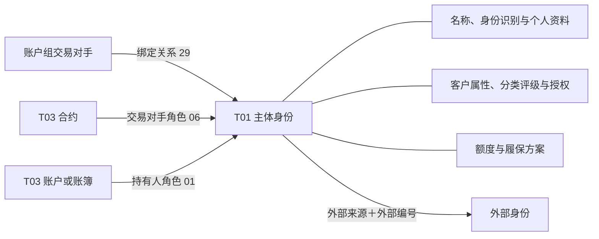

# 00 当事人与交易对手全貌

**T01 从“这个主体是谁”出发，整理它的身份、客户属性、业务授权、主体关系、额度和履保方案；再通过 T03，找到它在具体合约、账户和账簿中承担的角色。**

本篇聚焦当前已盘点的 TIT 来源：8 个贴源对象、14 张 T01 模型表。这是本专题的已知入模范围，不代表全平台 T01 的全部来源与能力。先在这里理解业务全貌，再沿文末入口查看已有资料。

## 1. 先把主体、客户资料和业务角色分开

“当事人”是模型识别主体的公共身份；“交易对手”是 TIT 业务资料中的主体对象；“OTC 衍生品客户”保存这类主体的专门业务资料。它们可能围绕同一个编号展开，并不天然代表三个人或三套互斥名单。

| 层次 | 主要回答什么 | 本专题怎样表达 |
| --- | --- | --- |
| 主体身份 | 这个编号指向谁，叫什么？ | 当事人主表、名称、个人资料、身份识别信息 |
| 客户属性与业务安排 | 它属于什么类型，有哪些业务资料、授权、额度和履保方案？ | 交易对手与 OTC 客户资料、分类、评级、统计信息、额度、履保方案 |
| 主体之间的关系 | 它对应哪个外部编号，与哪个交易对手绑定？ | 主体关系历史、同一当事人关系附加信息 |
| 具体业务中的角色 | 它是哪份合约的对手方，哪个账户或账簿的持有人？ | T03 协议当事人关系；对象主资料另在 T03 |

例如，一个主体既可以是某份期权合约的交易对手，也可以是某个资金账户的持有人。两种身份在具体关系记录上区分，不能仅用主体名称判断它在一份业务中的职责。

### 1.1 主体的范围不止公司和个人

交易对手资料任务 **105379** 对源 `CTPTY_TYPE` 做了更细的表达：

| 源类型 | 交易对手资料 `T01_PTY_CUTP.Cutp_Type_Cd` | 阅读含义 |
| --- | --- | --- |
| `COMPANY` | `1` | 机构 |
| `PRODUCT` | `2` | 产品 |
| `INDIVIDUAL` | `0` | 个人 |
| `MARKET` 及其他值 | 保留源值 | 需结合源定义解释；不能强行归入机构或个人 |

但身份任务 **76984、77078** 对 `T01_PTY.Pty_Cate_Cd` 只分两支：`INDIVIDUAL → 190400`，其他情况为 `290203`。现有字典笔记分别解释为“我司个人关联人”“自营交易对手”。

**当事人类别与交易对手类型是两个分类维度。** 看到 `290203`，还不能判定源主体是公司还是产品；看到 `190400`，也不能脱离本分支映射，把它解释成已经核实的员工或亲属关系。这里的产品型交易对手身份，与 T02 的金融工具或发行产品编号也不能直接等同。

## 2. 资料全景：围绕一个主体，分别了解什么

| 资料组 | 业务问题 | 代表内容 | 查询时保留的维度 |
| --- | --- | --- | --- |
| 身份与名称 | 是谁，怎样称呼，如何识别？ | 源 ID、当事人编号、全称简称、统一社会信用代码、个人资料 | 主体编号、来源；身份识别类型 |
| 客户业务资料 | 作为交易对手或 OTC 客户保存了什么？ | 源主体类型、主协议与补充协议引用、扩展属性 | 主体编号、资料来源及实际已填字段 |
| 分类与评级 | 属于哪种分类，记录了什么等级？ | `APTITUDE` 分类值、`DEALER_LEVEL` 等级 | 分类或评级类型＋值；适用日期 |
| 业务属性与授权 | 归哪个业务部门，允许开展哪些业务？ | 部门、佣金率、允许业务类型 | 信息类型、细项代码及历史区间 |
| 联系人与主体关系 | 法定代表人是谁，对应哪些外部身份或绑定主体？ | 联系人名称、外部来源与编号、交易组绑定 | 联系人类型；关系两端、类型、方向与来源 |
| 额度 | 对哪类业务、哪个指标设置了多少额度？ | 风险限额指标、允许业务类型、额度值 | 主体＋额度指标＋业务类型＋历史区间 |
| 履保方案 | 按哪套安排管理履约保障？ | 方案编号与状态、履保模式、担保品类型、收费和追提保配置 | 方案编号、主体引用、方案状态 |

这些资料并非每个主体都齐全。一个主体存在多项授权、多条关系或多个方案时，应分别读取；直接把各表按主体编号全部展开，会把不同维度的记录组合起来，不能据此统计主体数或汇总金额。

## 3. 来源与加工职责：哪些信息从哪里来

以下贴源表均位于 **`ODATA_N_TIT`**，本篇 T01 模型表均位于 **`PDATA_N`**。来源表“参与加工”可能是主体来源，也可能只为某个分支补充类型或其他属性，不表示它为所有目标字段供值。

| 贴源对象 | 在本专题中的职责 | 主要去向 |
| --- | --- | --- |
| `D_REF_COUNTERPARTY` | 主体及业务属性来源；在扩展、映射等任务中补充主体类型 | 身份、名称、个人、身份识别、交易对手、OTC 客户、评级分类及关系等 |
| `D_REF_COUNTER_PARTY` | 表注释为“交易参数—交易对手”，本表直接包含多种业务参数；已见身份、名称、个人、评级和业务属性分支，映射关系任务也用它补充类型 | 身份与基础属性，以及相关关系分支 |
| `D_REF_CTPTY_EXT_PARAM` | 按 `KEY_CTPTY_ID` 连接主体，提供分类、协议引用、联系人和其他扩展内容 | 交易对手、OTC 客户、评级、分类、统计信息、重要联系人 |
| `D_REF_CTPTY_MAPPING` | 按主体保存外部来源与外部编号 | 当事人关系历史、同一当事人关系附加信息 |
| `D_REF_CTPTY_AUTH_BUSI` | 保存主体允许业务类型 `ALLOWBUSITYPE` | 当事人统计信息历史，信息类型 `59` |
| `D_REF_CTPTY_TRADE_GROUP` | 保存账户组交易对手与所绑定交易对手的关系 | 当事人关系历史，关系类型 `29` |
| `D_RISK_CTPTY_LIMIT_THRESHOLD` | 保存主体、额度指标和业务类型下的限额阈值 | 当事人额度历史 |
| `D_MARGIN_PLAN` | 保存履保方案身份、关联主体及处理配置 | 交易对手履保方案信息 |

入模承担身份编码、字段承接、部分代码转换和历史维护。比如业务授权写入模型，说明源授权信息被承接；它本身不证明交易时已执行权限校验。履保方案配置进入模型，也不等于本任务计算了保证金或执行了追保。

### 3.1 两套主体来源怎样理解

`D_REF_COUNTERPARTY` 与 `D_REF_COUNTER_PARTY` 是不同物理对象，不能因名称相近合并。当前证据也不足以把二者定性为新旧系统、生产测试或互相替代的版本。

本次查到的身份 SQL 有三个需要一起看的事实：

- **76984、77078** 都按 `CONCAT('TIT060-', ID)` 生成当事人编号，相同前缀不区分来源。
- **77078** 明确读取 `D_REF_COUNTERPARTY`，并将该表名写入 `Real_Src_Tbl`；其历史对照及覆盖片段仍限定 `SRC_TBL='ODATA_N_TIT.D_REF_COUNTER_PARTY'`。
- **76984** 的源读取使用 `${src_table}` 参数；当前片段不能独立确认参数运行值。

因此要同时区分**实际读取的表、目标来源分区、真实来源标记**。两份 SQL 共存不证明两个任务当前同时运行；同一个当事人编号出现在不同来源资料里，也不证明可以无条件去重。任务启停、参数值和来源重叠情况仍需专项核对。

两套表的字段组织、状态注释冲突与身份映射，见 [01 主体身份与基础资料](00-20260914-图谱认知/01-tit入模/T01-主体与交易对手/01%20主体身份与基础资料.md)。

## 4. 模型分工：14 张表怎样配合

模型表按资料性质拆分。下面列出全部已盘点目标；“读取维度”用于理解和组织查询，不作为数据库唯一约束声明。

| 模型表 | 保存什么 | 读取维度与具体说明 | 代表任务 |
| --- | --- | --- | --- |
| `T01_PTY` | 公共主体身份 | 当事人编号、名称、类别、删除标志等；创建时间被取作开户日期来源，不能自动等同业务开户事件 | 76984、77078 |
| `T01_PTY_NAME` | 名称资料 | 中文全称、简称及英文简称等；与主体身份关联，不另算一个主体 | 104299、105076 |
| `T01_INDV` | 个人资料 | 个人主体资料分支；已查片段中生日、性别为空，不能因模型有字段就认为源已提供 | 104298、105075 |
| `T01_PTY_IDTY_INFO` | 身份识别信息 | 219164 将 `UNIFIEDSOCIAL_CODE` 写为类型 `24000` 的识别内容；不代表该分支覆盖全部证件 | 219164 |
| `T01_PTY_CUTP` | 交易对手业务属性 | 区分机构、产品、个人等源类型，并承接其他交易对手资料 | 105379、105518 |
| `T01_OTC_DERI_CUST` | OTC 客户专门资料 | 已见主协议、补充协议引用；多个模型预留字段在本分支为空 | 150757 |
| `T01_PTY_RAT` | 评级或等级资料 | 已查分支以 `OTC_CUTP_LVL` 标识评级类型，承接 `DEALER_LEVEL`；不能直接称为外部信用评级 | 104300、105077 |
| `T01_PTY_CLAS_H` | 分类历史 | `APTITUDE` 写分类值，分类类型固定 `41`；具体值的含义须按该类型核对字典 | 105380 |
| `T01_PTY_STATI_INFO_H` | 按信息类型组织的业务属性历史 | 包含部门、佣金率和允许业务类型等，不能仅按表名理解为人数或金额统计 | 114401、114423、173975 |
| `T01_PTY_IMP_LKMAN` | 重要联系人资料 | 已查类型 `01` 分支保存法定代表人名称；不等于已经建立独立自然人主体及关系边 | 150755 |
| `T01_PTY_RELA_H` | 主体关系历史 | 区分外部映射与交易组绑定等关系类型，保留两端编号及方向 | 104301、105079、219175 |
| `T01_SAME_PTY_RELA_ADTNL_INFO` | 同一当事人关系附加资料 | 承接外部编号和 `OUTSIDE_SOURCE`；识别外部身份必须带上来源 | 150759 |
| `T01_PTY_LMT_H` | 额度历史 | 按主体、额度指标、允许业务类型组织，保留历史有效区间 | 229973 |
| `T01_CUTP_PERF_MARG_PLAN_INFO` | 履保方案 | 以方案 ID 保存规则与引用，主体编号是其中的关联信息 | 200060 |

### 4.1 同一张模型表中的不同类型不能混读

`T01_PTY_STATI_INFO_H` 是一个直观例子：

| 信息类型 | 源内容 | 本次入模表达 |
| --- | --- | --- |
| `36` | `DEPARTMENT` | 部门写入 `Stati_Cont_Desc`，是描述信息 |
| `46` | 交易对手佣金率资料 | 业务属性分支，需继续核对具体数值字段与单位 |
| `59` | `ALLOWBUSITYPE` | 允许业务类型写入 `Stati_Subdv_Cd`，其他内容字段为空 |

这些类型的说明来自已查 SQL 注释及取值，不构成完整代码域字典。查允许业务时，应限定类型 `59` 并读取细项代码；只按主体取一条“统计信息”会漏掉或混淆含义。

### 4.2 额度与履保方案各回答什么

**额度回答“哪个主体在哪类业务下，对哪个指标设置了多少阈值”。** 229973 按 `CTPTY_ID + UPPER(LIMIT_INDEX) + APPROVED_TYPE` 分组，按创建时间倒序取一条，再维护模型历史。该分支币种、额度生效日和到期日为空；源阈值的单位要按指标核实，模型历史起止日期也不能代替审批有效期。

**履保方案回答“采用哪套履约保障安排”。** 200060 把 `D_MARGIN_PLAN.ID` 写为方案编号，把 `KEY_CTPTY_ID` 编成主体编号，并承接履保模式、担保品类型、收费模式、自动追保与提保等配置；另有管理人主体、履保协议和大合约引用。方案、协议、账户及每天形成的履保结果是不同对象，需要各自的关联证据。

## 5. 关系怎样连接：先认清两端，再看方向和角色

图用于区分资料归属与业务关系，不声明一对一约束，也不表示每个主体都有全部关联。

| 联系 | 当前证据支持的关联方式 | 应保留的区别 |
| --- | --- | --- |
| 主体与扩展资料 | `D_REF_COUNTERPARTY.ID = D_REF_CTPTY_EXT_PARAM.KEY_CTPTY_ID`；已查分支两侧取同一处理业务日 | 同日匹配仍需核对每侧是否唯一；扩展资料不单独证明另一主体存在 |
| 主体与外部身份 | `KEY_CTPTY_ID → TIT060-编号`，`OUTSIDE_CTPTY_CODE → 外部编号`；附加资料保留 `OUTSIDE_SOURCE` | 外部身份映射不等于股权、母子公司或担保关系 |
| 账户组交易对手与绑定主体 | 219175 将 `ID` 编为关系起点，将 `KEY_CTPTY_ID` 编为终点，关系类型 `29` | 起点字段虽名为 `ID`，该 SQL 还用它关联主体表；不能按字段名把它直接当普通关系流水号 |
| 合约与交易对手 | T03 合约源 `KEY_CTPTY_ID` 加前缀写入 `Pty_Id`，关系类型 `06` | 必须带上合约对象身份及关系历史条件 |
| 账户、账簿与持有人 | 相关源对象的 `KEY_CTPTY_ID` 加前缀写入 `Pty_Id`，关系类型 `01` | 账户持有人、账簿持有人与合约对手方是不同角色 |

T03 资金账户分支还存在角色 `12`，现有专题按 SQL 注释解释为“协议管理人”；它与持有人分支读取同一源 `KEY_CTPTY_ID`，不是另找了一个管理主体。详细码值、来源日期差异与空值处理见 [T03：当事人与角色](../T03-协议账户与合约/04%20当事人与角色.md)。

T03 的这些分支并未统一连接 T01 主表检查主体存在。查阅时要区分“关系保存了这个编号”和“已在对应 T01 来源中找到唯一主体”。

T01 关系还存在两个具体取用差异：外部来源保存在同一当事人附加资料中，关系历史分支未保留该字段；账户组绑定 SQL 用组主体类型填充了两端类别。详细字段、字典与历史口径见 [02 主体关系与外部身份](00-20260914-图谱认知/01-tit入模/T01-主体与交易对手/02%20主体关系与外部身份.md)。

## 6. 用一个主体串起查阅路径

本批 **2026-09-15** 样本中，主体 `10011` 为“中信建投证券股份有限公司”，类型 `COMPANY`；同日外部映射为 `GFOTC / DEV1100100547`。按身份 SQL 应生成模型编号 `TIT060-10011`。目前已核对源主体与外部映射，模型写入及后续 T03 关系尚未用本批结果验证。下面是继续查阅的路径，不表示六步都已完成数据贯通。

| 步骤 | 查什么 | 能得到什么，下一步怎样走 |
| --- | --- | --- |
| 1. 确认身份 | 指定日期和物理来源下的主体记录，再核对 T01 身份与名称 | 确认名称、源类型及模型编号；两套来源分别核对，不能按名称合并 |
| 2. 理解客户资料 | 交易对手资料、OTC 客户资料、扩展参数 | 分清源主体类型和主协议等引用；预留空字段不补造业务事实 |
| 3. 看分类、等级和授权 | 分类类型、评级类型、统计信息类型 `59` | 分别得到分类、等级和允许业务；三者不能相互替代 |
| 4. 看关系 | 外部身份来源与编号、交易组关系的两端 | 明确是跨系统识别还是主体绑定，并保留关系方向 |
| 5. 看业务安排 | 额度各指标和业务类型、关联主体的履保方案 | 分开读取阈值与配置；暂不将它们汇总成一个客户金额 |
| 6. 接到具体业务 | T03 协议当事人关系中该 `Pty_Id` 的记录，按角色区分 | 角色 `06` 找合约，角色 `01` 看账户或账簿，再用对象类型、修饰符和来源定位对应对象 |

查询应先固定所看业务日期，再根据每张表的快照、历史区间规则取数。不要把所有表的“最新一条”拼成同一时点的客户画像。

如果要统计该主体的合约数，应在筛选出的合约身份上计数；多项授权、多条外部映射、多份方案不应参与扩大合约记录。若要解释保证金余额或每日追保结果，则继续进入 T03 对应对象与结果资料，T01 方案配置不能替代这些数值。

### 6.1 四份样本让哪些区别更具体

| 样本中的事实 | 对业务理解的影响 |
| --- | --- |
| 两套主体各 500 条，499 个共同 ID 的九个共同业务字段一致；广州期货交易所在两份样本中分别出现 ID `18188`、`18184` | 两来源的身份内容高度重叠，但不能按名称合并，也不能从有限样本宣布全量可替代 |
| 静态主体中四个账户组的源类型为空、`GROUP_FLAG=Y`，另有一个空类型主体不是账户组 | 空类型需结合对象标识和其他资料解释，不能全部归成无效数据或账户组 |
| 外部映射 500 条，出现 `GFOTC` 与 `XIR` | 外部编号必须带来源；两种来源的业务定义仍需字典核对 |
| 绑定结果 30 条，四个账户组连接 28 个产品、2 个机构成员 | 账户组与成员是不同主体；同组还存在同名不同 ID 的两个机构成员，不能按名称去重 |

四份结果业务日期一致，归档在“关键表信息”；数据时间是次日不同采集时点。详见两篇专题的实例及数据链接。这里的条数只描述导出文件，不推断总体分布；账户组结果未达到 500 条上限，也未据此标为已核验全量。

## 7. 从这里继续读

| 接下来想了解什么 | 已有入口 |
| --- | --- |
| 两套主体来源、编号、名称、个人与身份识别信息 | [01 主体身份与基础资料](00-20260914-图谱认知/01-tit入模/T01-主体与交易对手/01%20主体身份与基础资料.md) |
| 外部身份映射、账户组绑定及关系历史 | [02 主体关系与外部身份](00-20260914-图谱认知/01-tit入模/T01-主体与交易对手/02%20主体关系与外部身份.md) |
| 客户资质、交易商等级、业务授权、协议引用与收费参数 | [03 客户属性与业务资格](00-20260914-图谱认知/01-tit入模/T01-主体与交易对手/03%20客户属性与业务资格.md) |
| 客户授权额度、风险指标阈值及其口径区别 | [04 额度](00-20260914-图谱认知/01-tit入模/T01-主体与交易对手/04%20额度.md) |
| 履保模式、担保与收费配置，以及合约怎样引用方案 | [05 履保方案](00-20260914-图谱认知/01-tit入模/T01-主体与交易对手/05%20履保方案.md) |
| 导出业务样本：本次四份待补，已完成四份附后 | [导出 SQL 汇总](attachments/00%20当事人与交易对手全貌/IMG-00%20当事人与交易对手全貌-20260916140114333.sql) |
| 本次 TIT 8 个来源与 14 张模型表的原始盘点 | [当事人与交易对手：现有来源与任务笔记](当事人与交易对手.md) |
| TIT 总体入模去向 | [02-TIT入模去向](../02-TIT入模去向.md) |
| 合约、账户、账簿及履保相关对象全貌 | [T03：协议账户与合约全貌](../T03-协议账户与合约/00%20协议账户与合约全貌.md) |
| 主体在合约、账户中的具体角色及加工差异 | [T03：当事人与角色](../T03-协议账户与合约/04%20当事人与角色.md) |
| 期权的交易对手、支付主体、资金账户和账簿关系 | [T03：场外期权](../T03-协议账户与合约/02.3%20场外期权.md) |

T01 已建设身份、关系、客户属性、额度、履保方案五篇。身份与关系篇已结合真实源样本；第二批以字段、字典和实际 SQL 展开，客户扩展参数、授权、风险阈值及方案的业务行实例仍待补充。后续再核对模型结果及当事人与合约、账户的实际匹配。

### 证据范围与待补内容

本篇于 **2026-09-16** 结合现有 TIT 入模盘点、本地调度 SQL 快照和 T03 已有专题整理。模型分工表给出任务入口；本地 SQL 的读取时间不等于平台最新发布时间，静态取数逻辑不证明任务当前启用、运行成功或数据已到达。查询入口见 [本地 SQLite 查询导航](../../../local-sqlite-guide.md)。

当前最影响深入使用的三个缺口是：两套主体来源的当前运行职责及全量重叠情况（本批已完成样本对照）；分类、等级、额度指标等源值与字典的完整对应；同日真实主体从源资料经模型贯通到 T03 的匹配情况。本文的业务结构和 SQL 映射可以作为阅读入口，这三项仍需在后续专题中分别补证。
