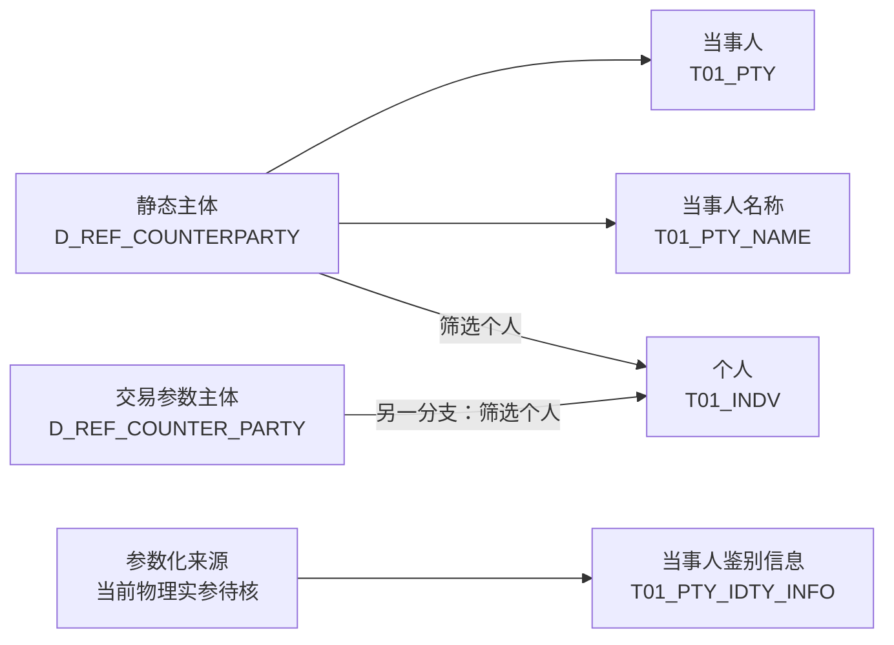

# 01 主体身份与基础资料

**TIT 的交易对手资料统一识别机构、产品、个人、市场对象和账户组。** 本篇说明这些对象的身份、名称及登记识别信息，以及它们进入 T01 后的模型分工和语义变化。

```sql
SELECT
    ID                   AS "源交易对手ID",
    LONG_NAME            AS "交易对手长名",
    SHORT_NAME           AS "交易对手短名",
    CTPTY_TYPE           AS "源交易对手类型",
    CTPTY_LEGAL_ENTITY   AS "主体名称或法律主体描述",
    NAME_ABBREVIATION    AS "交易对手缩写",
    UNIFIEDSOCIAL_CODE   AS "统一社会信用代码或注册码",
    DEPARTMENT           AS "所属部门",
    IS_INNER             AS "是否内部原值",
    GROUP_FLAG           AS "是否账户组原值",
    IS_DELETED           AS "源状态原值_启用删除语义待核",
    CREATED_DATETIME     AS "创建时间",
    UPDATED_DATETIME     AS "修改时间",
    BUSI_DATE            AS "业务日期"
FROM ODATA_N_TIT.D_REF_COUNTERPARTY
WHERE BUSI_DATE = '2026-09-15'
ORDER BY CTPTY_TYPE, ID
LIMIT 500;
```

## 1. 涉及表与资料范围

### 1.1 贴源表

以下贴源均位于 `ODATA_N_TIT`。中文表名采用本地元数据原注释；后文使用表名或业务简称，不重复列库名。

| 英文表名                      | 中文表名           | 本篇涉及的资料与范围                                      |
| ------------------------- | -------------- | ----------------------------------------------- |
| `D_REF_COUNTERPARTY`      | 系统静态数据-交易对手数据表 | **主要来源**：身份、名称、类型、登记识别、所属部门、内部及账户组标识；下文简称“静态主体” |
| `D_REF_COUNTER_PARTY`     | 交易参数-交易对手      | **另一主体来源**：身份与较多业务参数同表保存；下文简称“交易参数主体”           |
| `D_REF_CTPTY_EXT_PARAM`   | 交易对手属性参数表      | **衔接资料**：补充资质、协议、人员等客户属性；完整内容见 03 篇             |
| `D_REF_CTPTY_MAPPING`     | 交易参数-交易对手映射表   | **关系引用**：提供外部来源与外部编号；本篇用于辨认编号体系                 |
| `D_REF_CTPTY_TRADE_GROUP` | 交易对手账户组绑定关系    | **关系引用**：提供组与成员的绑定；本篇用于解释账户组对象                  |

两套主体来源在字段组织和加工分支上有区别，当前未将其定性为新旧替代关系。扩展参数及两张关系表不属于四类身份模型共同必经的中间表。

### 1.2 模型表

以下模型均位于 `PDATA_N`。中文名称按已核实 DDL／元数据列示；“本篇提供内容”限定为当前 TIT 分支。

| 英文表名 | 中文名称 | 本篇提供内容 |
| --- | --- | --- |
| `T01_PTY` | 当事人 | 公共主体身份：编号、名称、类别、源创建日期对应的开户日期、删除标志 |
| `T01_PTY_NAME` | 当事人名称 | 长名、短名、缩写的标准字段表达 |
| `T01_INDV` | 个人 | 源类型为 `INDIVIDUAL` 的个人资料，含姓名及部分默认分类 |
| `T01_PTY_IDTY_INFO` | 当事人鉴别信息 | 登记识别内容与鉴别信息类型 |
| `T01_PTY_CUTP` | 交易对手 | **对照模型**：以交易对手类型补充公共当事人分类；客户属性详见 03 篇 |

### 1.3 主要加工关系

下图展示四类身份模型的代表加工路径。



四类模型围绕同一个主体分别保存公共身份、名称、个人属性和鉴别信息；拆成多表不增加主体数量。

## 2. “交易对手”这张表里，实际装了哪些对象

**交易对手资料的对象范围包含客户及其他业务参与对象。** `CTPTY_TYPE`（交易对手类型）表达对象性质，`GROUP_FLAG`（是否交易对手账户组标识）另行表达组身份。

| 对象 | 源数据表达 | 业务含义与实例 |
| --- | --- | --- |
| 机构 | `CTPTY_TYPE=COMPANY` | 以机构身份登记；如 `10011` 中信建投证券股份有限公司。具体合约中的角色由合约关系表达 |
| 产品 | `CTPTY_TYPE=PRODUCT` | 产品自身具有交易对手身份；如 `10033` 冠丰3号消费优选证券投资基金，与管理机构名称分别保存 |
| 个人 | `CTPTY_TYPE=INDIVIDUAL` | 以个人身份登记，进入个人模型；员工、亲属、专业投资者等身份仍需专门资料 |
| 市场对象 | `CTPTY_TYPE=MARKET` | 交易所等市场对象也在主体资料中识别；如 `10001` 郑州商品交易所 |
| 账户组交易对手 | `GROUP_FLAG=Y` | 组主体与成员各有编号，成员关系另表保存；如 `17731` 玄元账户组，其源类型为空 |

**主体类型与账户组标识是两个维度。** 玄元账户组虽类型为空，但有组标识和成员关系；样本 `11417` 同样类型为空、组标识却为 N，不能采用相同解释。

产品型交易对手与 T02 产品也有不同身份：本篇的产品编号识别“作为主体的产品”，T02 工具编号、发行产品编号分别识别工具与发行资料。名称相同不构成编号对应关系。

## 3. 身份标识、名称与机构描述

### 3.1 四类识别信息

| 信息 | 字段或组合 | 职责与实例 |
| --- | --- | --- |
| TIT 内部身份 | `ID`（交易对手 ID） | TIT 资料与业务引用的主体入口；如中信建投 `10011` |
| 模型当事人身份 | `Pty_Id`（当事人编号） | 已查分支按 `CONCAT('TIT060-', ID)` 编码；如 `TIT060-10011` |
| 外部系统身份 | `OUTSIDE_SOURCE`（外部来源）＋`OUTSIDE_CTPTY_CODE`（外部交易对手编号） | 同一主体在另一套编号体系中的身份；如 `10011 → GFOTC / DEV1100100547` |
| 法定或登记识别内容 | `UNIFIEDSOCIAL_CODE`（统一社会信用代码／注册码） | 保存登记识别字符串，连同鉴别信息类型使用，不替代内部主体 ID |

`TIT060-` 前缀完成 TIT 编号的模型表达，不执行跨系统主体合并，也不区分两套 TIT 主体来源。外部身份对应详见 [02 主体关系与外部身份](02%20主体关系与外部身份.md)。

### 3.2 主体名称、机构描述与成员名称

| 样本主体 | `LONG_NAME`（交易对手长名） | `CTPTY_LEGAL_ENTITY`（源注释：主体名称） | 业务解释 |
| --- | --- | --- | --- |
| 产品 `10033` | 冠丰3号消费优选证券投资基金 | 广东冠丰私募证券投资基金管理有限公司 | 产品对象名称与相关机构描述分别保存 |
| 账户组 `17731` | 玄元账户组 | 玄元私募基金投资管理（广东）有限公司 | 组名称与机构背景分别保存；成员另含“玄元元丰21号私募证券投资基金”等产品 |
| 主体 `11417` | 空 | 广东领新投资有限公司 | 主体描述有值不等于源长名有值，应分别保留 |

机构描述是字符串，以上实例没有提供由该字段生成的管理人主体 ID、关系类型或有效期。**名称、机构描述与成员关系各自表达不同层次的信息。**

### 3.3 名称字段的模型表达

| 源字段 | 名称模型字段 | 语义差异 |
| --- | --- | --- |
| `LONG_NAME`（交易对手长名） | `Full_Name_Ch`（中文全称） | 主身份表同时以该值填写 `Pty_Name`（当事人名称） |
| `SHORT_NAME`（交易对手短名） | `Shor_Name_Ch`（中文简称） | 用于简写展示 |
| `NAME_ABBREVIATION`（交易对手缩写） | `Shor_Name_En`（英文简称） | 源只定义为缩写，目标名称不保证实际内容是英文 |
| 无源取值 | `Full_Name_En`（英文全称）为空 | 当前分支未提供英文全称 |

**名称不承担唯一识别。** 两份主体样本中的“广州期货交易所”分别对应 `18188`、`18184`；“利率债互换测试账户组”也有同名的“上海浦东发展银行股份有限公司”成员。前者尚需同日回查区分取样缺项与身份差异，两类情形均不能按名称直接合并主体。

## 4. 主体类型入模后的语义变化

`Pty_Cate_Cd`（当事人类别代码）提供公共分类；`Cutp_Type_Cd`（交易对手类型代码）在 105379 分支保留更细的对象性质。

| 源类型 | 当事人类别 `Pty_Cate_Cd` | 交易对手类型 `Cutp_Type_Cd` | 模型信息变化 |
| --- | --- | --- | --- |
| `INDIVIDUAL` | `190400`，我司个人关联人 | `0`，个人 | 按源个人类型统一赋类，未再确认具体关联人关系 |
| `COMPANY` | `290203`，自营交易对手 | `1`，机构 | 保留机构类型 |
| `PRODUCT` | `290203`，自营交易对手 | `2`，产品 | 公共类别相同，细分类型仍区分产品与机构 |
| `MARKET` | `290203`，自营交易对手 | 原值 `MARKET` | 公共类别不单独识别市场对象 |
| 空或其他值 | `290203`，自营交易对手 | 按源值传递 | 非个人默认分支不证明具体对象性质 |

因此，`290203` 可能同时覆盖机构、产品、市场对象和账户组。识别业务对象需要保留源类型与组标识，公共分类码本身不能还原这些差异。

| 其他主体属性 | 表达内容 | 与关系的区别 |
| --- | --- | --- |
| `IS_INNER`（是否内部） | 内部标识 | 不直接表达上下级机构关系 |
| `DEPARTMENT`（所属部门） | 主体所属部门 | 同部门不等于同一主体或同一账户组 |
| `GROUP_FLAG`（是否交易对手账户组标识） | 是否组对象 | 具体成员由账户组绑定表表达 |

## 5. 默认分类与身份资料完整度

| 字段或资料 | 当前分支取值 | 解释 |
| --- | --- | --- |
| `Indv_Clas_Cd`（自然人分类代码），CD020 | `99`，未知 | 未提供具体自然人分类 |
| `Occp_Cd`（职业代码），CD023 | `99999`，未知 | 未提供实际职业 |
| `Oact_Method_Cd`（开户方式代码），CD019 | `X`，不适用 | 不表达线上／线下开户渠道 |
| `Idty_Info_Type_Cd`（鉴别信息类型代码），CD006 | `24000`，统一社会信用代码 | 统一采用该类型；源内容仍可能是注册码或空值 |
| 个人专属资料 | 生日、性别、国籍、婚姻、学历、专业投资者标志等为空 | 进入个人模型不等于已形成完整个人档案 |
| 鉴别信息配套资料 | 签发机构、签发日、有效期未提供 | 当前分支未展示格式校验，也未按内容非空过滤 |
