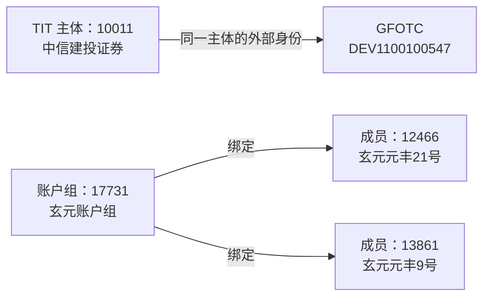

# 02 主体关系与外部身份

**T01 关系资料主要表达两类连接：同一主体在不同系统中的身份对应，以及账户组与成员之间的绑定。** 两者共享关系模型，但两端对象、编号体系和业务含义不同。

```sql
SELECT
    KEY_CTPTY_ID        AS "TIT交易对手ID",
    OUTSIDE_SOURCE      AS "外部身份来源",
    OUTSIDE_CTPTY_CODE  AS "外部交易对手编号",
    CREATED_DATETIME   AS "关系创建时间",
    UPDATED_DATETIME   AS "关系修改时间",
    BUSI_DATE          AS "业务日期"
FROM ODATA_N_TIT.D_REF_CTPTY_MAPPING
WHERE BUSI_DATE = '2026-09-15'
ORDER BY OUTSIDE_SOURCE, KEY_CTPTY_ID, OUTSIDE_CTPTY_CODE
LIMIT 500;

SELECT
    ID                 AS "账户组交易对手ID",
    KEY_CTPTY_ID       AS "绑定的交易对手ID",
    CREATED_DATETIME   AS "绑定创建时间",
    UPDATED_DATETIME   AS "绑定修改时间",
    BUSI_DATE          AS "业务日期"
FROM ODATA_N_TIT.D_REF_CTPTY_TRADE_GROUP
WHERE BUSI_DATE = '2026-09-15'
ORDER BY ID, KEY_CTPTY_ID
LIMIT 500;
```

## 1. 涉及表与资料范围

### 1.1 贴源表

以下贴源均位于 `ODATA_N_TIT`。关系表提供连接记录，主体表补充两端对象的信息。

| 英文表名 | 中文表名 | 本篇涉及的资料 |
| --- | --- | --- |
| `D_REF_CTPTY_MAPPING` | 交易参数-交易对手映射表 | **关系主表**：TIT 主体、外部来源及外部编号 |
| `D_REF_CTPTY_TRADE_GROUP` | 交易对手账户组绑定关系 | **关系主表**：账户组与成员的绑定 |
| `D_REF_COUNTERPARTY` | 系统静态数据-交易对手数据表 | **主体补充**：组与成员信息、外部映射附加资料的主体类别；样本还从此表补名称 |
| `D_REF_COUNTER_PARTY` | 交易参数-交易对手 | **主体补充**：外部映射关系历史分支的 TIT 主体类别 |

### 1.2 模型表

以下模型均位于 `PDATA_N`。后文分别简称“关系历史”“附加信息”。

| 英文表名 | 中文表名 | 本篇的模型分工 |
| --- | --- | --- |
| `T01_PTY_RELA_H` | 当事人关系历史 | 两端编号、端点类别、关系类型；同时承接外部身份映射和账户组绑定 |
| `T01_SAME_PTY_RELA_ADTNL_INFO` | 同一当事人关系附加信息 | 承接外部身份映射，补充外部编号所属的来源 |

外部映射进入两张模型，分别保存公共关系和来源细节；账户组绑定在本篇进入关系历史。

## 2. 外部身份与组成员关系的区别

| 关系 | 两端分别是什么 | 业务含义 |
| --- | --- | --- |
| 外部身份映射 | TIT 主体身份 → 外部来源下的身份 | 同一主体的跨系统编号对应 |
| 账户组绑定 | 账户组主体 → 成员主体 | 组与成员的组织关系，两端各有独立身份 |



图中为 2026-09-15 样本的代表关系，组成员未全量列示。**外部映射表达身份对应，组成员绑定保留不同对象之间的关系；二者不能采用同一套主体合并规则。**

## 3. 外部身份：来源与编号共同识别

### 3.1 一条映射的三个要素

| 源字段 | 含义 | 样本值 |
| --- | --- | --- |
| `KEY_CTPTY_ID`（交易对手 ID） | TIT 内部主体 | `10011`，中信建投证券股份有限公司 |
| `OUTSIDE_SOURCE`（外部来源） | 外部编号所属的来源 | `GFOTC` |
| `OUTSIDE_CTPTY_CODE`（外部交易对手编号） | 主体在该来源下的编号 | `DEV1100100547` |

另一个样本为渣打银行(中国)有限公司 `19006 → XIR / 102293`。**外部身份应保留“来源＋编号”**；字母数字混合编号和纯数字形态编号都作为标识保存。

### 3.2 两张模型各保留什么

| 内容 | 关系历史 | 附加信息 |
| --- | --- | --- |
| TIT 主体编号 | 加 `TIT060-` → `Pty_Id`（当事人编号） | 同样生成 `Pty_Id` |
| 外部编号 | 原值 → `Rela_Pty_Id`（关联当事人编号） | 原值 → `Same_Pty_Id`（关联当事人编号） |
| 外部来源 | 本分支未承接 | → `Pty_Rela_Src`（当事人关系来源） |
| 外部端点类别 | 固定 `210500`，OTC 场外衍生品对公客户 | 同样固定 `210500` |

关系历史保存“谁对应谁”，附加信息补充“外部编号属于哪里”。两表可按本端编号及外部编号对应，但需要保留来源与适用时点；同一对编号有多个外部来源时，应分别保留。

外部端点类别 `210500` 是加工固定赋值，不能据此判定已经核验外部对象性质或完成跨系统客户认证。

## 4. 账户组：组身份、成员身份与绑定方向

### 4.1 组、成员与绑定记录

| 资料 | 源字段与样本 | 职责与模型表达 |
| --- | --- | --- |
| 组主体资料 | 主体表的 `17731` 记录，玄元账户组 | 保存组自己的名称、类型及组标识 |
| 成员主体资料 | 主体表的 `12466`、`13861` 等记录 | 分别保存成员自己的名称、类型及身份 |
| 绑定关系 | 绑定表 `ID`（账户组交易对手 ID）→`KEY_CTPTY_ID`（绑定交易对手 ID） | 组编号加前缀进入 `Pty_Id`（当事人编号）；成员编号加前缀进入 `Rela_Pty_Id`（关联当事人编号） |

玄元账户组的 `GROUP_FLAG`（是否交易对手账户组标识）为 Y，`CTPTY_TYPE`（交易对手类型）为空；两名基金成员的类型为 `PRODUCT`。组标识确定组对象，绑定表列出成员，成员类型来自成员自己的主体资料。

账户组也可以绑定机构。样本“利率债互换测试账户组”`19064` 下，`16328` 与 `19059` 都名为“上海浦东发展银行股份有限公司”，类型为 `COMPANY`；两个编号仍分别保留。该样本用于说明身份与绑定结构，不代表已确认的正式业务配置。

**账户组关系的两端都加 TIT 前缀；外部身份映射只给 TIT 一端加前缀。** 因此，关联当事人编号的含义必须结合关系类型确定。

### 4.2 成员类别的取值差异

当前 219175 用**组主体类型**填写成员类别，而非成员自身类型，疑似取值对象错误。其实际影响取决于两端在“个人／其他”分类上是否不同：

| 情形 | 组类型／成员类型 | 当前成员类别与按成员类型所得结果 |
| --- | --- | --- |
| 已有玄元样本 | 空／`PRODUCT` | 都为 `290203`，结果未体现差异 |
| 假设绑定个人 | 空／`INDIVIDUAL` | 当前为 `290203`；按成员类型应为 `190400` |

第二行仅说明触发条件。现有样本未证实成员类别已错；成员真实对象性质应以其主体资料为准。

## 5. 关系类型与端点类别

| 字段与代码域 | 值 | 业务含义 |
| --- | --- | --- |
| T01 `Pty_Rela_Type_Cd`（当事人关系类型代码），CD178 | `01` | 同一个当事人；本篇用于 TIT 与外部身份对应 |
| 同上 | `29` | 账户组交易对手绑定交易对手 |
| T03 `Agt_Pty_Rela_Type_Cd`（协议当事人关系类型代码），CD050 | `01` | 协议持有人；连接协议对象与主体 |

**关系类型解释“两端为什么相连”，端点类别解释“各端在模型中属于哪类对象”。** 端点类别 CD002 中，`190400` 为我司个人关联人，`290203` 为自营交易对手，`210500` 为 OTC 场外衍生品对公客户。

相同代码值在不同代码域中含义不同：T01 的 `01` 与 T03 的 `01` 分别表达同一主体关系和协议持有关系，不能合并解释。
