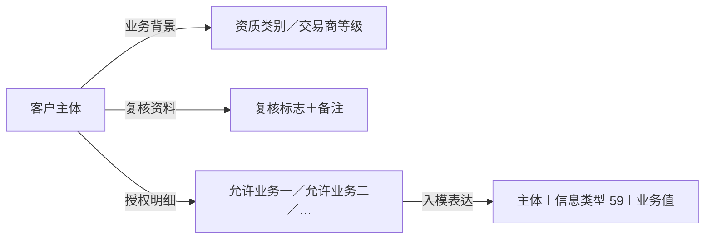

# 03 客户属性与业务资格

**客户业务资料是在主体身份之上，按客户角色组织的资质、交易商等级、业务授权、协议引用、经济条件和人员信息。** 在 TIT 中，这些资料由主体表、扩展参数表和授权明细表共同提供；T01 模型按客户档案、分类、评级、授权和联系人等职责分别承接。

```sql
SELECT
    P.ID AS "交易对手ID", P.LONG_NAME AS "名称",
    P.CTPTY_TYPE AS "主体类型",
    E.APTITUDE AS "资质原码", E.DEALER_LEVEL AS "交易商等级",
    E.CLIENT_QUALIFY_REVIEW AS "资质复核标志",
    E.CLIENT_QUALIFY_REVIEW_DES AS "资质复核备注",
    E.MASTER_AGREEMENT_ID_BOTH AS "主协议编号_双方约定",
    E.SUPPLEMENT_AGREEMENT_ID_BOTH AS "补充协议编号_双方约定",
    E.INTRODUCTION_DEPARTMENT_NO AS "引入部门",
    E.CUSTOMER_MANAGER AS "客户经理", E.OPERATOR AS "经办人",
    E.LEGAL_REPRESENTATIVE AS "法定代表人",
    E.CONTROLLER_NAME AS "实际控制人",
    E.INS_RECORD_CODE AS "证券备案编码",
    P.BUSI_DATE AS "业务日期"
FROM ODATA_N_TIT.D_REF_COUNTERPARTY P
LEFT JOIN ODATA_N_TIT.D_REF_CTPTY_EXT_PARAM E
  ON P.ID = E.KEY_CTPTY_ID AND P.BUSI_DATE = E.BUSI_DATE
WHERE P.BUSI_DATE = '2026-09-15'
ORDER BY P.CTPTY_TYPE, P.ID
LIMIT 500;
```

## 1. 数据来源与模型分工

### 1.1 贴源结构

本篇涉及的贴源均位于 `ODATA_N_TIT`。主体资料确定属性归属，扩展参数集中保存客户条件，业务授权按明细保存允许业务。

| 贴源表 | 核心内容 | 关联与记录组织 |
| --- | --- | --- |
| `D_REF_COUNTERPARTY` | 主体 ID、名称、类型、法律主体描述 | 客户资料的主体入口 |
| `D_REF_CTPTY_EXT_PARAM` | 资质、等级、复核、协议引用、收费计息、额度、相关人员 | `KEY_CTPTY_ID` 指向主体；主线加工按同日 `KEY_CTPTY_ID = D_REF_COUNTERPARTY.ID` 关联 |
| `D_REF_CTPTY_AUTH_BUSI` | 允许业务 `ALLOWBUSITYPE` | `KEY_CTPTY_ID` 指向主体；一个客户可有多项业务授权 |
| `D_REF_COUNTER_PARTY` | 身份与较多交易参数同表保存的另一套主体资料 | 另有等级、属性等入模分支；与静态主体加扩展表的主线并存 |

两套主体来源的区别见 [01 主体身份与基础资料](01%20主体身份与基础资料.md)。客户属性的归属需要保留主体、来源与业务日期；将授权明细与客户档案连接后，多行通常表达多项业务，不能据此增加客户数量。

### 1.2 T01 模型结构

以下模型均位于 `PDATA_N`。TIT 主体编号通过 `TIT060-` 前缀形成模型当事人编号；各表按不同业务维度组织同一主体的资料。

| 模型表 | 本篇的模型职责 | 主要加工入口 |
| --- | --- | --- |
| `T01_PTY_CUTP` 当事人交易对手 | 交易对手类型、法律主体描述、实际控制人、备案编码 | 105379，主体＋扩展参数；另有 105518 参数化分支 |
| `T01_OTC_DERI_CUST` OTC 衍生品客户 | 资质与复核、协议引用、收费计息、客户层额度等集中属性 | 150757，主体＋扩展参数 |
| `T01_PTY_CLAS_H` 当事人分类历史 | 用分类类型限定所保存的资质类别 | 105380，扩展参数 |
| `T01_PTY_RAT` 当事人评级 | 用评级类型限定所保存的交易商等级 | 104300，扩展参数；另有 105077 分支 |
| `T01_PTY_STATI_INFO_H` 当事人统计信息历史 | 按信息类型分别保存授权、部门、佣金率等属性 | 173975、114401、114423，按分支分别读取 |
| `T01_PTY_IMP_LKMAN` 当事人重要联系人 | 按角色保存法定代表人、实际控制人姓名 | 150755，扩展参数 |

**客户档案采用集中字段表达，分类、评级、授权和联系人采用“主体＋类型＋内容”的表达。** 同一源字段进入两种结构，代表同一事实的不同组织方式。例如 `APTITUDE`（资质） 同时进入客户表和分类历史，不构成两次独立的资质认定。

## 2. 客户身份、资质与交易商等级

### 2.1 属性归属与身份标识

**客户属性归属于具体主体。** 产品、管理机构各自具有身份，资质、等级和授权按各自主体保存。交易对手表覆盖的机构、产品、个人、市场对象和账户组，详见 [01 主体对象分类](01%20主体身份与基础资料.md#2-交易对手这张表里实际装了哪些对象)。

| 信息 | 标识内容 | 与其他信息的区别 |
| --- | --- | --- |
| 产品交易对手 ID | 产品作为业务主体的身份 | 产品自身的客户条件以该身份为归属 |
| 管理机构名称或主体引用 | 产品相关的管理机构 | 管理人的资质与授权不自动成为产品的资质与授权 |
| `INS_RECORD_CODE`（证券备案编码） | 源资料中的备案编码，进入 `T01_PTY_CUTP.Cutp_Prd_Id`（交易对手产品编号） | 当前加工未将其转换为 T02 发行产品 ID |

### 2.2 类型、资质、等级的业务分工

| 维度 | 业务含义 | 源字段与模型口径 |
| --- | --- | --- |
| 主体类型 | 客户对象的性质 | `CTPTY_TYPE`（交易对手类型），如机构、产品、个人等 |
| 场外交易对手资质 | 登记的资质类别 | `APTITUDE`（资质）→客户表 `Corp_Qual`；同时写入分类历史 `Pty_Clas_Cd`，分类类型 `Pty_Clas_Type_Cd=41` |
| 交易商等级 | 登记的交易商等级 | `DEALER_LEVEL`（交易商等级）→评级结果 `Rat_Cd`，评级类型 `Rat_Type_Cd=OTC_CUTP_LVL` |

| 字典或样本 | 已确认内容 | 解释边界 |
| --- | --- | --- |
| CD138／`41` | 分类维度为“场外交易对手资质” | `41` 标识分类类型，具体资质值来自 `APTITUDE` |
| CD055 | `CLASS_ONE` 一级交易商；`CLASS_TWO` 二级交易商；`CLASS_OTHERS` 非一二级交易（原标签） | 本分支的“评级”是交易商等级，不是信用评级或风险承受能力测评 |
| 中信建投证券股份有限公司 `10011`，2026-09-15 样本 | `COMPANY / SECURITIES_CO / CLASS_ONE` 分别属于主体类型、资质原码、交易商等级 | `SECURITIES_CO` 的具体码值释义尚未由本地字典确认；这些值没有列出业务授权 |

## 3. 资质复核与业务授权

**资质、复核和授权分别表达类别、复核信息和允许业务范围。** 下图表示同一客户的不同资料维度，不表示审批先后顺序。



| 信息 | 源字段 | 模型表达与业务意义 |
| --- | --- | --- |
| 资质复核标志 | `CLIENT_QUALIFY_REVIEW`（客户资质复核） | `true → 1`、`false → 0`，进入 `Cust_Qual_Revw_Flag`（客户资质复核标志） |
| 资质复核说明 | `CLIENT_QUALIFY_REVIEW_DES`（客户资质备注） | 与标志共同描述复核资料 |
| 业务授权 | `ALLOWBUSITYPE`（允许业务类型） | 进入 `Stati_Subdv_Cd`（统计细项代码），信息类型 `Pty_Stati_Info_Type_Cd=59`，表示交易对手允许业务类型 |

授权加工 173975 按“当事人＋信息类型＋业务值”匹配记录，保留一个客户的多项业务授权。主体编号相同、业务值不同，是两项授权；只保留一条会丢失业务范围。

`T01_PTY_STATI_INFO_H` 按类型保存多种业务属性，其名称中的“统计信息”不限定为统计结果：

| 信息类型 | 业务含义 | 来源分工 |
| --- | --- | --- |
| `59` | 交易对手允许业务类型 | 授权明细表 |
| `36` | 场外衍生品业务条线所属部门 | 对应分支的主体资料 |
| `46` | 交易对手佣金率（港股） | 扩展参数或另一套交易参数主体资料 |
| `75` | 场外衍生品交易对手账户组标志 | 静态主体资料 |

**资格资料与授权明细分别保存；当前入模没有生成统一的准入通过结果。** 交易执行时的资格校验、授权拦截规则不在本段加工中。

## 4. 客户层协议与经济条件

业务授权界定登记的允许业务范围；客户层条件保存相关协议引用、收费、计息和额度参数。两者分别表达业务范围与业务条件，不构成已验证的审批先后顺序。

### 4.1 协议引用与条件适用层次

| 层次 | 保存内容 | 适用解释 |
| --- | --- | --- |
| 客户层协议引用 | `MASTER_AGREEMENT_ID_BOTH`（主协议编号，双方约定）、`SUPPLEMENT_AGREEMENT_ID_BOTH`（补充协议编号，双方约定），进入 `Main_Agt_Id / Supp_Agt_Id`（主／补协议编号） | 提供客户相关协议的编号线索 |
| 客户层经济条件 | 收费、计息、额度等参数 | 描述客户资料中保存的条件 |
| 具体合约 | 单笔交易条款、账簿与资金账户关系 | 描述具体交易采用的安排 |

客户条件是否被具体合约采用、是否有单独约定及其优先顺序，取决于实际消费逻辑；协议引用本身不等于客户与每笔交易的绑定关系。

### 4.2 佣金参数的三个维度

佣金参数按**市场、费用侧别、计费方式**共同定位。港股与美股分别保存参数，对客与对香港侧分别表达，比例费率与每股金额又采用不同计量基础。

| 市场与侧别 | 比例费率字段 | 每股金额字段及源注明币种 |
| --- | --- | --- |
| 港股，对客 | `CTPTY_FEE_RATE` | `HK_PER_SHARE_COMMISSION_2CTPTY`，HKD |
| 港股，对香港 | `HK_FEE_RATE_HK` | `HK_PER_SHARE_COMMISSION_2GM`，HKD |
| 美股，对客 | `US_CTPTY_FEE_RATE` | `US_PER_SHARE_COMMISSION_2CTPTY`，USD |
| 美股，对香港 | `HK_FEE_RATE_US` | `US_PER_SHARE_COMMISSION_2GM`，USD |

港股与美股分别使用 `HK_TRS_COMMISSION_TYPE`（港股收佣模式）、`US_TRS_COMMISSION_TYPE`（美股收佣模式）。美股对客参数为 `US_CTPTY_FEE_RATE`（对客佣金费率，美股）或 `US_PER_SHARE_COMMISSION_2CTPTY`（美股每股佣金，对客，USD）；`HK_FEE_RATE_US`（对香港佣金费率，美股）属于另一侧费用。

| 参数性质 | 计量或适用基础 | 当前证据 |
| --- | --- | --- |
| 比例费率 | 适用计费基数及费率尺度 | 直接承接，未展示百分数缩放 |
| 每股金额 | 适用数量及币种 | 源字段明确区分港股 HKD、美股 USD |
| 开仓／平仓费率 | 对应市场与交易环节 | 境内 A 股、港股通分别保存相关参数 |
| `TAX_RATIO`（分红税率） | 分红处理 | 与佣金、开平仓费用分列 |

实际账单还需明确模式选参、最低收费、舍入等执行规则；当前入模保存参数，不计算收费金额。

### 4.3 计息条件的组成

| 组成部分 | 源字段 | 表达内容 |
| --- | --- | --- |
| 固定利率 | `FIXED_RATE` | 固定利率参数 |
| 浮动参考 | `CROSS_FLOATING_RATE_TARGET_HK / US` | 港股／美股跨境浮动利率标的 |
| 利差 | `SPREAD / SPREAD_US` | 港股／美股利差参数 |
| 利率上限 | `FLOATING_RATE_CAP` | 浮动利率上限 |
| 计息方式与期间 | `DAY_COUNT / INTEREST_INTERVAL` | 计息方式、计息起止口径 |

**利率条件与期间口径共同构成计息参数。** 实际利息还需适用业务、计息本金及计算规则；本段加工未给出固定利率、参考标的、利差和上限的选择与组合算法。

### 4.4 授权、额度与履保的分工

| 资料 | 主要表达 | 本篇衔接位置 |
| --- | --- | --- |
| 业务授权 | 客户登记的允许业务范围 | `ALLOWBUSITYPE`，按业务明细保存 |
| 客户层额度 | 客户资料中的名义本金上限、授权额度及有效期 | `NOTIONAL_LIMIT / GRANT_BALANCE / GRANT_BALANCE_EXPIRE_DATE` |
| 风险指标阈值 | 按主体、业务和指标组织的限制或配置值 | 独立风险阈值来源，详见 [04 额度](04%20额度.md) |
| 履保方案 | 履保口径、担保方式及追提保安排 | 独立方案对象，具体业务通过相应关系选择，详见 [05 履保方案](05%20履保方案.md) |

这些资料分别回答范围、数值约束和履约保障安排。授权原码 `ALLOWBUSITYPE`（允许业务类型） 与风险阈值中的 `APPROVED_TYPE`（源注释为审批类型，入模用作允许业务类型） 尚未建立已核实的代码对应；客户层额度与风险阈值也没有在已查加工中统一校准，不能直接拼成一条完整的业务准入规则。

## 5. 服务归属与客户相关人员

相关人员资料分为服务经办信息与客户背景信息。二者同由扩展参数提供，但业务角色及模型表达不同。

| 角色 | 源字段 | 模型落点与含义 |
| --- | --- | --- |
| 引入部门 | `INTRODUCTION_DEPARTMENT_NO` | `Intro_Inr_Org_Id`，客户引入归属 |
| 客户经理 | `CUSTOMER_MANAGER` | `Cust_Mngr_User_Id`，客户经理引用 |
| 经办人 | `OPERATOR` | `Oper_User_Id`，经办人员引用 |
| 法定代表人 | `LEGAL_REPRESENTATIVE` | 重要联系人模型，角色 `01`，保存姓名 |
| 实际控制人 | `CONTROLLER_NAME` | 重要联系人模型，角色 `10`；同时写入交易对手表 `Cutp_Actl_Ctrl` |

服务经办人员按引用保存，法定代表人和实际控制人按角色保存姓名。联系人角色 `01 / 10` 来自 CD028，姓名相同也分别表达两种身份。

实际控制人姓名在两张模型中为同源信息。当前没有独立自然人编号、持股比例或控制路径；主体关系的已确认表达见 [02 主体关系与外部身份](02%20主体关系与外部身份.md)。

## 6. 加工口径与语义差异

以下差异直接影响模型内容的解释。

| 事项 | 已核实加工口径 | 对模型语义的影响 |
| --- | --- | --- |
| 客户模型来源标签 | 150757 的标签为 `D_REF_COUNTER_PARTY`，实际读取 `D_REF_COUNTERPARTY` 与扩展表 | 物理来源按实际 SQL 确认，标签不等于实际读表 |
| 协议字段完整度 | 承接主补协议编号；主补协议签订日、履保协议编号及签署日、审核状态在该分支为空 | 客户模型只提供部分协议资料 |
| 收佣模式转换 | 港／美股模式进入 `Hks_Cms_Mode_Cd / Us_Stk_Cms_Mode_Cd`；转码未命中时保留源值 | 模式列可能保留源码，需结合转换结果及代码域解释 |
| 汇率类型 | `EXCHANGE_RATE_TYPE → Rate_Type_Cd`；源定义为“汇率类型”，目标 SQL 注释为“利率类型代码” | 保留源语义，具体枚举及消费待核 |
| 香港费率调整 | `HK_FIXED_RATE → Hk_Cutp_Fix_Yield`；源定义为“香港费率调整（港股）”，目标注释为“香港交易对手固定收益率” | 不据目标名称解释为客户投资收益 |
| 类型化属性来源 | 114401：主体提供部门 `36`、账户组标志 `75`，扩展参数提供港股佣金率 `46`；114423：`D_REF_COUNTER_PARTY` 提供部门与港股佣金率 | 同一属性模型需要区分来源分支与信息类型 |
| 已查消费范围 | 销售汇总 123781 读取客户模型时限定 OIS 来源 | 该消费证据不覆盖本篇 TIT 客户参数的具体合约应用 |

