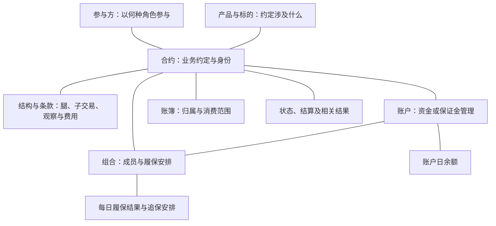

# 00 协议账户与合约全貌

> 本篇是业务全景与阅读导航，依据 2026-09-15 已整理的 Excel 和分析底稿；未在本篇重新核验 SQL、DDL 或运行数据。

## 1. 范围与阅读路径

**T03 用公共身份和关系组织账户、账簿与合约，再以专用模型保存条款、余额、履保及结算等信息。** 本次 Excel 覆盖 TIT 主体及辅助入模相关的 **52 张模型表、93 个来源分区条目、156 个入模调度**，不代表全系统 T03 的完整目录。

本篇先讲对象与职责；[00.1 公共协议模型](00.1%20公共协议模型.md) 解释七张公共模型表如何配合。具体业务按下面六组阅读，各子篇列出源字段、代码含义与取数逻辑。

| 阅读组 | 主要回答什么 | 子篇导航 |
| --- | --- | --- |
| [01 账户与账簿](01%20账户与账簿.md) | 资金、保证金和业务归属分别由什么对象管理？ | [资金账户](01.1%20资金账户.md) · [保证金账户](01.2%20保证金账户.md) · [账簿](01.3%20账簿.md) |
| [02 合约主数据与条款](02%20合约主数据与条款.md) | 是哪类合约，约定了哪些条款？ | [普通互换](02.1%20普通互换.md) · [极速互换](02.2%20极速互换.md) · [场外期权](02.3%20场外期权.md) · [外汇远期](02.4%20外汇远期.md) |
| [03 对象之间的关系](03%20对象之间的关系.md) | 合约、账户和账簿怎样关联？ | [合约→资金账户](03.1%20合约→资金账户.md) · [合约→合约](03.2%20合约→合约.md) · [合约→账簿](03.3%20合约→账簿.md) · [账簿映射](03.4%20账簿映射.md) |
| [04 当事人与角色](04%20当事人与角色.md) | 谁持有、管理账户，谁是合约交易对手？ | 持有人、管理人、交易对手的关系与取数 |
| [05 合约与金融工具的关系](05%20合约与金融工具的关系.md) | 合约对应哪个工具编号，怎样衔接 T02？ | 交易表工具键、关系类型与主数据导航 |
| [06 合约分类与状态](06%20合约分类与状态.md) | 按什么维度分类，当前处于什么状态？ | [业务分类](06.1%20业务分类.md) · [合约状态](06.2%20合约状态.md) |

代码查询入口：[附录A 标准模型字典](附录A%20标准模型字典.md)、[附录B TITANS源字典](附录B%20TITANS源字典.md)。

本轮目录对应已展开的账户、合约与公共关系资料；下面的全貌仍保留组合履保、专用条款、余额及结算等覆盖，六组章节不代表 T03 的全部内容。

## 2. 对象地图：每个对象承担什么职责

| 对象或信息组 | 核心问题 | 与相邻对象的区别 | 本次来源中的表现 |
| --- | --- | --- | --- |
| 协议与合约 | 约定了什么，哪笔业务适用这些约定？ | 法律文件、业务合约记录、模型协议身份需分别理解，不能自动按一对一处理 | 通用协议身份，互换、期权、外汇远期主资料，合同附件 |
| 参与方 | 谁以什么角色参与？ | 交易对手、账户持有人、账簿参与方不是同一种角色 | 按来源和关系类型表达协议与参与方关系 |
| 产品与标的 | 业务涉及什么产品或资产？ | 产品身份、市场行情和某笔合约的具体约定不同 | 合约与产品关系、腿标的、期权结构和观察确认值 |
| 账户 | 资金或保证金在哪个业务账户下管理？ | 账户身份、账户用途与某日余额回答不同问题 | 保证金账户、资金账户、账户扩展、日余额及账户清单 |
| 组合 | 哪些合约、账户一起管理履约保障？ | 组合身份、成员关系、履保方案和每日结果是独立信息 | 履保组合、成员关系、扩展资料、每日结果和追保安排 |
| 账簿 | 业务归属到哪里，如何进入不同消费范围？ | 账簿不等于资金账户；归簿规则不等于规则执行结果 | 名称、部门、业务开关、账簿映射和交易归簿条件 |
| 条款与参数 | 按什么规则观察、计息、触发、计算或支付？ | 存储规则不等于执行计算；参数与结果不同 | 合约腿、障碍、观察安排、费用比例、精度引用、履保阈值 |
| 状态与历史 | 对象在什么时间处于什么状态？ | 源端状态不自动等于报送有效状态，状态不能脱离时间解释 | 合约状态历史、关系和属性历史、具体主资料状态 |
| 金额与结果 | 某时点或某次业务形成了什么数值？ | 余额、本金、保证金、应收应付、实际支付各有口径 | 源日余额、履保结果、结算金额、压力测试明细等 |

“履约保障”关注合约履行所需的保障安排；本次资料具体表现为保证金参数、组合关系、余额、追保与可提取等信息。不能仅看到“组合”，就把它理解成证券持仓组合。

### 2.1 对象怎样联系

下图是概念导航；连线表示需要理解的联系，不表示已经验证的数据库外键或固定的一对多关系。

图中包含组成关系、归属与角色关系，以及随时间形成的结果。三者的记录粒度不同，实际关联须到具体专题核对。

## 3. 公共主干与专用内容怎样配合

账户、账簿和合约共享协议模型的身份及关系字段，各自仍承担资金管理、业务归属、交易约定等不同职责。公共主干保存身份、对象关系、参与方、产品关系、分类、状态和附加信息；互换腿、期权观察安排等内容由专用模型保存。七表分工和实例见[公共协议模型](00.1%20%E5%85%AC%E5%85%B1%E5%8D%8F%E8%AE%AE%E6%A8%A1%E5%9E%8B.md)。

主干之外，账簿名称由 `t03_agt_name_h` 表达，组合身份及成员分别由 `t03_agt_grp`、`t03_agt_agt_grp_rela_h` 表达。以下继续看这些业务内容怎样展开。

## 4. 三类合约怎样展开

互换、期权、外汇远期共享合约身份与公共关系，但具体结构不同。先理解结构，再看它被拆成哪些表。

| 业务   | 主要信息层次                            | 代表模型（均位于 `pdata_n`）                                                                       | 容易误读的地方                               |
| ---- | --------------------------------- | ----------------------------------------------------------------------------------------- | ------------------------------------- |
| 互换   | 合约 → 腿 → 持仓，另有关联的对冲产品与借券资料        | `t03_otc_swap_comp_info`、`t03_otc_swap_comp_leg_info`、`t03_otc_swap_comp_hold_info`       | 合约、腿、持仓不是同一粒度；普通互换、快速互换、快商通确认不能混为一套记录 |
| 期权   | 合约 → 结构要素；按结构展开子交易、障碍、分档价格、观察日和结果 | `t03_otc_opt_comp_info`、`t03_otc_opt_comp_stru_elmn_info`、`t03_otc_opt_comp_sub_trd_info` | 并非每笔期权都有全部细表内容；子交易数、观察日数不等于合约数        |
| 外汇远期 | 合约主资料 → 双币种及双方支付结构                | `t03_otc_fx_fwd_comp_info`、`t03_otc_fx_fwd_comp_stru_elmn_info`                           | 双币种金额和不同用途汇率需分别解释，不能压成一个本金和一个汇率       |

期权细表主要沿**合约／子交易层级、条款类型、顺序与日期、配置／结果**展开。例如，`t03_otc_opt_comp_conf_pric` 承接合约、标的、观察日下的确认值；`t03_otc_opt_comp_obsv_date_coup_info` 的敲入、敲出、Lizard 分支字段覆盖不同；`t03_otc_opt_comp_obsv_scop_info` 同时涉及合同安排与每日累计结果。读取时应保留各自粒度和来源，不能直接互补空值。

具体合约资料见：[普通互换](02.1%20%E6%99%AE%E9%80%9A%E4%BA%92%E6%8D%A2.md)、[极速互换](02.2%20%E6%9E%81%E9%80%9F%E4%BA%92%E6%8D%A2.md)、[场外期权](02.3%20%E5%9C%BA%E5%A4%96%E6%9C%9F%E6%9D%83.md)、[外汇远期](02.4%20%E5%A4%96%E6%B1%87%E8%BF%9C%E6%9C%9F.md)。

## 5. 账户、组合、账簿：三个管理维度

### 5.1 账户身份与账户余额分开

账户号、开户名称、币种、用途、启用状态属于账户资料；可用、冻结等余额属于特定日期的金额信息。本次 `t03_tit_ast_acct_adtnl_info` 不存日余额；`t03_ast_crrc_acct_bal` 承接源日余额，入模没有从账户流水重新轧算。

源 `BALANCE` 写入 `Begn_Bal` 是已有分析记录的字段映射，不能只凭目标字段名就断言符合下游所需的“期初余额”口径，还需核对源业务日期、币种及金额定义。QFII 对冲账户清单则是名单，不是资产余额。

### 5.2 组合身份、成员、参数、结果与追保安排分开

| 信息组 | 本次内容 | 职责边界 |
| --- | --- | --- |
| 组合身份 | 组合 ID、创建日期 | 本次主模型映射未补齐源组合名和状态 |
| 组合成员 | 合约或账户与组合关系 | 关系本身不计算组合风险 |
| 履保参数 | 初始、预警、追保、提取、强平等阈值 | 静态配置与每日参数分区独立 |
| 每日结果 | 动态本金、履保比例、应追保、可提取、余额及敞口 | 承接源端结果，不能认定入模承担履保计算 |
| 追保安排 | 追保金额、确认状态、延迟天数、支付日等 | 承接安排，不在此重新计算追保额；安排不等于到账 |

本次 `t03_otc_cutp_marg_acct_perf_guar_rslt` 虽然表名含账户，源映射主要以组合 ID 标识，账户及对手字段可为空。这是不能凭表名判断粒度的直接例子。

### 5.3 账簿：归属与处理配置

账簿保存名称、desk、部门、公司、有效期及业务开关；账簿映射另保存源目标账簿、盈亏方向和筛选条件。配置存在只说明处理规则，执行范围和结果要看消费者。详见[账簿](01.3%20%E8%B4%A6%E7%B0%BF.md)与[账簿映射](03.4%20%E8%B4%A6%E7%B0%BF%E6%98%A0%E5%B0%84.md)。

## 6. 来源与加工职责

合约条款和履保参数表达约定；观察确认值、履保和结算金额表达源端结果；支付安排与实际支付又是不同事实。T03 自身包含部分动态结果，支付计划及实际支付另在 T05，不能按主题名称简单划分静态／动态。

入模可能承接结果、补身份或展开关系。谁提供业务数值、谁只参与匹配，应分别说明：

| 模型（位于 `pdata_n`） | 主体来源 | TIT 的作用 |
| --- | --- | --- |
| `t03_deri_comp_sett_info` | CSS 结算流水提供结算价、应收应付和费用等 | 普通互换及快商通确认资料按合同号补协议身份 |
| `t03_agt_div_rati` | OIS 引荐合同及分配比例 | 匹配协议身份；另外补充客户经理标识 |

以上两类属于 TIT 辅助入模：结算金额和分成比例的产生职责分别在 CSS、OIS。

阅读时抓住**对象粒度、身份、来源、时间、字段含义、加工职责和消费用途**。主干的身份与历史关联规则集中见[公共协议模型](00.1%20%E5%85%AC%E5%85%B1%E5%8D%8F%E8%AE%AE%E6%A8%A1%E5%9E%8B.md)；专用模型还需留意：

- 普通互换、快速互换、快商通确认虽进入同一互换主模型，字段覆盖不同；快商通确认使用 `20206-KST` 修饰符，与 `20206` 分开。
- 资金余额有分支读取最近 15 天源业务日并按源业务日写分区，调度日不等于业务日。
- 一个来源有消费不代表其他来源同样被消费，跨来源补值或合并需要依据。

## 7. 主题覆盖与证据导航

主要来源：

- [T03—T06 TIT 入模与主题消费 Excel](../../../../outputs/01a09fc1-t03-t06/T03-T06-TIT入模与主题消费.xlsx)：主交付，包含表注释、来源、分区、加工和消费说明。
- [分析底稿 workbook-data.json](../../../../outputs/01a09fc1-t03-t06/workbook-data.json)：本章所用 `main` 条目的分类、业务解释、模型和职责来源，可按 T03 条目编号定位。

下表沿用 Excel 当前分类，作为导航，不当作正式主题子类定义：

| Excel 分类 | 模型表数 | 分区条目数 | 学习重点 | 条目定位 |
| --- | ---: | ---: | --- | --- |
| 协议主干 | 7 | 31 | 身份、关系、分类、状态、附加属性 | T03-005—006、T03-011—039 |
| 账户与余额 | 3 | 4 | 账户资料、名单与日余额 | T03-009、T03-040—041、T03-093 |
| 账簿与归属 | 5 | 5 | 名称、归属、开关和映射规则 | T03-010、T03-049—052 |
| 组合与履保 | 8 | 13 | 身份、成员、参数、结果和追保 | T03-001—004、T03-008、T03-044—048、T03-053—054、T03-057 |
| 互换 | 5 | 9 | 合约、腿、持仓、对冲与借券 | T03-056、T03-058、T03-085—091 |
| 期权 | 17 | 24 | 合约、子交易、条款、观察与结果 | T03-061—084 |
| 外汇远期 | 2 | 2 | 主资料与双币种结构 | T03-059—060 |
| 合约参数 | 2 | 2 | 精度引用与合同附件；此分类不囊括全部条款参数 | T03-043、T03-055 |
| 结算与分成 | 3 | 3 | 费用、结算结果及来源职责 | T03-007、T03-042、T03-092 |
| 合计 | 52 | 93 | 本次 TIT 来源相关覆盖 | 不代表全系统 T03 |

按“业务问题 → 对象组 → 主表条目 → 来源分区与入模说明 → 消费明细 → 必要时核查 SQL”阅读，技术表名、表注释和调度定位共同服务于业务理解。

消费部分保留三个限定：

1. 当前范围包括直接消费及已核实的 14 张 T98 中间表的下一跳，不是无限递归的完整终端链路。这是整份 T03—T06 分析的延伸范围，不是 T03 独占的中间表数量。
2. 热度是某模型分区条目已确认消费的不同目标表数，跨任务和路径去重；不是任务数、运行次数，不能逐行相加得到全局目标表数。
3. “未闭合目标数”表示尚未确认的消费线索，不等于任务失败或没有消费；辅助输出和其他未计入原因须逐项看。

## 8. 当前边界

对象深读仍有几类缺口：代表业务中对象的实际关联及基数、金额币种与方向、部分码值含义、下游筛选用途，以及 TIT 范围外的主题覆盖。概念图、静态加工说明均不能代替数据唯一性、生产运行或业务完成的验证。
